[toc]

# lecture 0: Knowing Computer

## 1. Language of Computer: Binary

> * 我们学习数学时，用的是十进制，比如123，用十进制可以表示为$1*100+2*10+3*1$。
>
> * ==计算机用的是二进制语言==，即0和1，是最简单和纯粹的是否指令，比如开灯和关灯。101，可以表示为$4*1+ 2*0 + 1*1$，即为十进制中的5，其位数是$2^0$, $2^1$,$2^2$,...。


1. 重要的概念：

   1. 位：bit，表示每一个0或1，比如10000000则有eight bits。
   2. 字节：byte，8个bits为一个字节。
   3. 晶体管：phrase transistor，电脑晶体管里有很多bit的开关，开代表1，关代表0。

2. ==英文字母和单词如何表示呢？==

   1. 因为计算机只能识别0或1，所以字母的表示会有一套规则将其转换为数字进行输入，比如65代表A，用01000001表示。

   2. 这一套被世界通用的编码准则就叫ASCII，即American Standard code for Information Interchange。

   3. ASCII编码表用8个bit即1个byte进行编码，包括一些常用的标点符号和26个英文字母大小写， http://asciichart.com/

      

3. ==符号、部分表情和其他语言的字母怎么表示？==
  
   1. 符号和其他语言遵循另一套编码准则叫Unicode。因为ASCII只使用8个bit表示字母，也就是最多只能有$2^8=256$种0-1结果，因此远远不够用于表示所有的字母。Unicode使用8、16、24、32bits去表示，有更多的组合可能性。
2. 比如，“哭笑不得”的符号表情用数字128514表示。
  
4. ==图像、视频怎么表示？==
  
   1. 编码准则：RGB，比如(72, 73, 33)表示黄色，每一个数字用一个byte表示。
   2. 视频就是一系列照片的集合，像素不断地变化，因此形成了视频。

## 2. Black Box for Computer: Algorithms

1. 算法是计算机工作的原理，为任何一系列具体的计算步骤，包含了一系列定义清晰的指令，让计算机按照该指令进行工作。==算法要考虑两个方面：准确性(correctness)和设计性(well-designed)==，高效的算法需要高质量的代码(quality of code)。

   

2. 比如：我们要在一本通讯录里找到mike smith的电话并打给他，则其伪代码(pseudocode,即用日常非编程语言表达）可以表述为：

   

3. 算法需要考虑所有可能出现的情形(senarios)，并设定解决方案，如果没有，就可能会出现bug。

4. Scratch是麻省理工大学开发的面向程序设计语言初学者的伪代码平台，意在训练初学者的编程思维。https://scratch.mit.edu/

5. 一个语言的学习：函数、条件、布尔表达、循环、变量、线程、事件、参数等等(functions、conditions、boolean expressions、loops、variables、threads、events、argument)

   1. 布尔问题(boolean expression)，即答案是true or false。
   2. 循环代码(loops)：循环使用代码，而不需要重写代码。

   

   3. 函数(function)：输入参数，并设定特定的函数，输出可被存储和复用的变量。

   

## 3. Hardware of Computer

1. RAM：当我们在执行算法的时候，使用电脑的随机存取存储器，即==主存(random access memory, RAM)，是与CPU直接交换数据的内部存储器==。它可以随时读写（刷新时除外），而且速度很快，通常作为操作系统或其他正在运行中的程序的临时资料存储介质。

   1. 主存越高，即bits越多，电脑运行速度和可运行负载就越高。

   

   1. 有限的bits带来一个问题：imprecision。它只能估计计算结果，而不能保证100%的准确。

      1. 如：float
      2. 如：现在我们用32bits去计算日期，当到了2038年，32bits就无法准确计算日期了。

      

2. CPU：中央处理器(central processing unit, CPU)是电脑的主要设备之一，功能主要是==解释计算机指令及处理计算机软件中的数据==。

   1. CPU的性能和速度==取决于时钟频率==(一般以赫兹或千兆赫兹计算，即hz与Ghz)和每周期可处理的指令(IPC)，两者合并起来就是每秒可处理的指令(IPS)。

   

# Lecture 1: Learning C language

## 1. How to Learn language

1. 学习一门语言需要注意三个方面：
   1. 正确性(correctness)：代码能否实现你的目的
   2. 设计周到的(well-designed)：即代码质量，代码是否是精简不冗余的， 是否高效
   3. 风格良好的(well-styled)：即美学，标点符号、拼写是否具有高可读性(readability)。

2. 在线IDE：https://ide.cs50.io/
3. 计算机如何将编译型语言转换成二进制语言呢？==编译器(compiler)==，如Clang。每一次文件被修改后，都需要重新编译后才能被计算机执行。

## 2. Basic Knowledge of C

C语言的文件后缀==.c==，C语言的特点：

​	1. 语言较老，需要特别精确的指令，比如设定变量必须设定变量名称；构建函数需要指定参数类型，如没有，要写void；用;表示一个句子的完结等。

1. 新建变量：

   1. 变量类型 + 变量名   ;

      

   2. ==const== int total=3;   constant表示变量值永远不变。

2. 打印变量：printf(' '); %s",表示输入一个变量

   

   

3. 导入函数包：#include<  >

   

4. 编译和运行(命令行)：

   1. make+文件名：自动使用编译器编译；

      

   2. clang -o + 输出文件名 + C语言文件：”-o“表示output

      

   3. clang -o + 输出文件名 + C语言文件 + -l + library：”-l”表示link to specific library

      

   4. ./ + 文件名：运行本folder的文件

5. 设置打开文件自运行：int main(void){}

   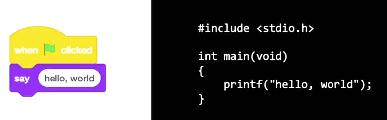

6. 添加注释：// 

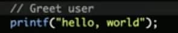

7. 数据类型转换：eg：(float)x

8. 条件判断句型：

   1. if(){}

   

   

   

   2. switch()

   

   3. ()? :

   

10. 数学符号：或：||，等于：==

    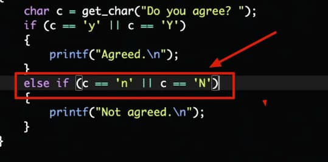

11. 循环loops：

    1. ==while() {}==

    

     

    2. for (原始设定; 判断条件; 计算){}

    

    

    3. do{}while()：和while loop不同，她先执行一次do，在盘点boolean expression是否为真。

       

## 3. Tools to debug

> 需要debug的有：
>
> 编译、代码风格、输出准确性、代码运行、内存
>
> compile、style、output accuracy、running、memory

1. help50 + make + 文件名：CS50课程专用，文件编译出错，会给出明确的错误解释和修改指导

   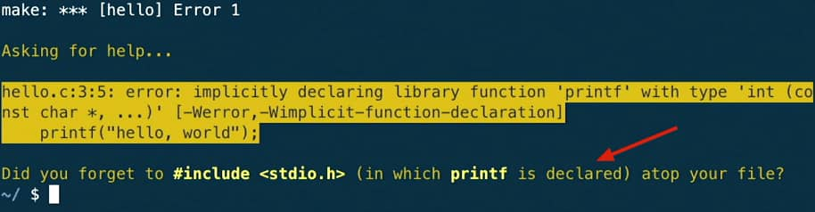

2. style50 + 文件名.c：CS50课程专用的，识别代码书写是否规范易懂，给出修改建议（比如换行、缩进、添加注释等）

3. check50 + 文件名：CS50课程专用的，检查代码的准确性，即代码运行结果是否与目的一致

   

4. printf()：打印过程，查看出bug的地方

5. debug50：CS50课程专用的debugger，设置breakpoint，一步一 步执行代码，查看中间生成的变量和记忆，找到出问题的地方。

   1. step over：让代码一步一步执行

   2. step into：dump into the functions，查看函数定义是否出错

   3. step out

   4. rubber duck debugging：小黄鸭调试法dbd，即操作人耐心地向小黄鸭解释每一行程序的作用，以此来激发灵感与发现矛盾，让自己发声((vocalize what you think is logical)，可以帮助更快找到不合理的地方(will the illogical very often jump out at you instead)

      

      

6. valgrid：检查内存(memory)的错误，如是否call free，是否touch memory you shouldn't touch。

   ```c
   valgrind ./memory
   ```

   

## 4. Basic Knowledge of Linux Command Line

> 虽然非专业人事可以用图形用户界面(graphical user interface, GUI)用按键、菜单、窗口等图形对象向计算机发出指令。程序员需要熟悉简单的linux语言来直接发出指令。

1. 浏览目录的文件名列表：ls

2. 删除指定文件：rm + 文件名

   

3. 重命名文件或移动文件：

   1. 重命名：mv + 原文件名 + 新文件名(记得加后缀)，即先cp后rm原来的文件。

   2. 移动文件：mv + 文件名 + 文件夹名

   3. mv + 文件名 + ..   (移动到上一级folder)

      ==一个.表示当前folder，两个.表示上一级folder==

4. 新建一个文件夹：mkdir + 文件夹名

5. 打开指定文件夹：

   1. cd + 文件夹：change directory

   2. cd + .. ：返回上一级folder

   3. pwd：present working directory，显示当前路径

   4. cd：返回根目录

      

      

6. 删除文件或文件夹(no undo, no recover)：

   1. rmdir + 文件夹名/ rm-r

   2. rm + 文件名/ rm-f

      

      

7. 拷贝文件或文件夹：

   1. 拷贝file：cp + 原文件名 + 新文件名
   2. 拷贝folder及其全部files：cp-r + 原文件夹名 + 新文件夹名

   

8. 小技巧：

   1. 用上箭头和下箭头可以引用执行过的代码
   2. ctrl +C：退出正在运行的代码或循环

9. 查看程序退出状态：exit status，用echo$?可以查看。通过返回的数字，可以有效识别程序出错类型(return number)。==注：在函数中返回相应数字以识别不同的运行错误是个好习惯！==

   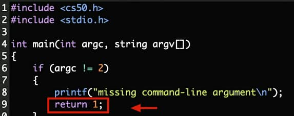

   

10. 查看文件：cat + 文件名

## 5. Data Types and Operators

1. 常见的数据类型有：

   

   1. char(%c)：存储单个字符，ASCII的8bits可以表示26个英文字母。

      

   2. float(%.10f)：float有精确性的问题。因为浮点值总是占用32bits，所以它没办法精确到小数点后很多位（如小数点后100位）。

      

   3. double：解决了float的精确性问题，浮点值占用64个字符。如果需要小数点后精确的结果，则选择double。

      

   4. ==integer(%i)：只用了32bits所以不能表示太大的数字==。

      

   5. unsigned int：牺牲了负数部分，将全部32bits用于正整数

      

   6. long integer(%li)：更大的整数表示

   7. string(%s)：存储一系列字母，including words，sentences or paragraphs。string在C语言中不属于内置数据类型。

      

   8. bool：布尔值在C语言中不属于内置数据类型，要使用该类型需导入外库。bool存储两个值：true and false。

   9. void：空白，表示nothing

      

2. C语言作为较老的语言，需要精准的代码，即如果要创造某变量，需要指定变量的类型。

   

   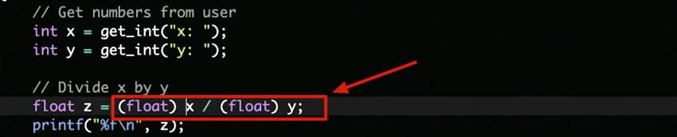

3. 常用的算术符号：

   1. ==常出bug==：多个整数运算，结果还是整数，如果要存储为浮点型，需要进行类型转换。而运算中只要包含一个浮点型，输出就是浮点型。

   

   

   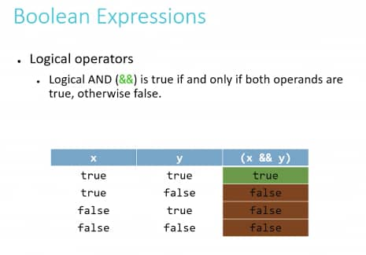

   

   

   

# Lecture 2: Array

## 1. What‘s Compiling

1. 我们将源代码编译成机器语言的过程包括：==预处理(preprocessing)、编译(compiling)、汇编(assembling)、连接(linking)==。

   ==source code —> assembly code —>machine code==

   1. 预处理：识别文件中包含的库，即#开头的代码，并写入library中全部的函数原型(不仅仅是被使用的)。

      

   2. 编译：==将C源代码编译成另一种代码：assembly code(汇编语言)==。汇编语言是任何一种用于电子计算机、微处理器、微控制器，或其他可编程器件的低级语言。在不同的设备中，汇编语言对应着不同的机器语言指令集，是computer-friendly language。

      

   3. 汇编：将汇编语言转换成机器语言(0-1)。

   4. 连接：将所有的library函数、文件的机器语言连接在一起，用以展示我们的程序。

      

      

## 2. Data Structure: Array

1. 数组(array)：在C和很多其他语言中，数组是连续背对背存储在内存中的一系列相同类型的元素(a sequence of elements stored in memory back to back)。==敲重点：==

   1. ==电脑内存中的连续空间(contiguous space in memory)==，

   2. ==相同数据类型(same data type)，如bool、string、float、int、double等==

   3. ==以0开始索引(can be assessed directly by indexes)==

   4. ==数组可以有很多维度，如$bool battleship[10][10]$==

      

2. 在C中，array有以下特点：

   1. ==需要同时定义Array的类型和长度==，即无法定义没有长度的Array。如建立含2个字符串的array：

   

   2. ==C对array的索引非常宽容==，即使你的数组长度只为3，你也能打印出Array[400]。这部分存储不属于该Array，却被打印出来了，会导致出现bug。

   3. ==C不能将数组本身看成一个变量进行运算或条件判断==，如array1 = array2,  string == 'Ron'。我们将数组的一个元素作为变量进行赋值和运算。

      

      

   4. ==C中函数引用数组是直接引用==pass by reference，而不是复制数值pass by value。

      

3. 声明数组：array declaration，形式：type name[size]

   1. 如果直接对array进行赋值，可以不需要填入size。即：

      ```c
      int array[] = {1,2,3,4,5,6};
      ```

      

   

4. string：字符串是典型的array，即an array of chars，可通过索引可以指定字符。 string使用null byte(即\0，00000000)来结尾，因此计算机可以自动识别它的长度。

   

   

   1. 字符长度函数：strlen(s)——思考如何写出该函数

   

   2. uppercase函数：利用内置函数(building blocks)和ASCII编码，当然已经有很多现成库提供相关函数，如ctype.h的toupper()。

   ```c
   #include <stdio.h>
   #include <cs50.h>
   #include <string.h>
   
   int main(void){
     string s = get_string("Before: ");
     prinf("After: ");
     for (int i =0, n = strlen(s); i < n; i++){
       if (s[i] >="a" && s[i] <= "z"){
         printf("%c", s[i] - 32);
       }
       else{
         prinf("%c", s[i]);
       }
     }
   }
   ```

## 3. Principles of Cryptography

1. 密码学利用key(加密规则)进行加密，接收方再利用key进行decrypt。密码学在实际中应用广泛，运营方会用复杂的算法cipher，保护用户隐私，如邮件、信息、商业信息等。Input Key示例：

    1. 首先利用ASCII编码表，可以把“I love you"转换成数字" 73 76 79 86 69 89 79 85"。
    2. 数字全部加1，变成"74 77 80 87 70 90 91 86"
    3. 重新编码为字符：“J M P W F Z P V”

   

## 4. Importance of Functions

1. 定义：函数是将0+个input转换成1+个output的黑盒子。几乎所有的语言都会构建functions，有时候也叫procedures、methods、subroutines。Why use functions?

   1. Organization：使代码更有条理性
   2. simplification：简化代码
   3. reusability：可反复使用

   

2. 声明函数：function declaration，告诉计算机这是函数。形式：==return-type name(argument-list)==

   1. ==void 表示空白，不设定参数或没有返回值==

      

      

   2. 因为编译器只能从头开始，因此如果要将函数定义过程放在文件最后，需要在一开始先引用函数，不然会编译出错。

   

   

   

3. 重要函数：int main函数，程序打开自运行

   1. mian函数为什么是int？因为main函数是指程序自动运行，而程序员一般会使用数字来表示程序出错类型，如：

      1. 0表示nothing go wrong
      2. 5表示have network issues

   2. 无参数：int main(void){}

   3. 命令行参数：command-line argument，替换void，输入an array of strings；argc表示argument count，参数的计数，即我们命令行输入了几个字符串。

      

      

   ```c
   #include <studio.h>
   #include <cs50.h>
   
   int main(int argc, string argv[]) 
   {
     if(argc == 2)
     {
       printf{"hello, %s\n", argv[1]};
     }
     else
     {
       printf("hello, world\n");
     }
   }
   ```

## 5. Variable and Scope

1. 变量范围规定了变量可以在哪里使用，分成==全局变量和局部变量(global variable and local variable)==。局部变量只能被其构建的函数所使用，而全局变量在函数之外定义，可以被所有函数使用。

   

2. 两种变量的最大区别是：

   1. 全局变量被函数使用后会随之改变。
   2. 局部变量只传了数值(pass by value)，而不会被函数所改变，除非我们改写它overwrite it.

   

# Lecture 3: Algorithms

 ## 1. Running Time of Algorithms

1. 定义：时间复杂度(time complexity)定性描述算法的运行时间，即输入值无穷大时，算法需要的步骤级别(how many steps it need)，只考虑最大项(dominant factor)。

2. 类别：

   1. 最大值(upperbound of the running time)：用大写字母$O$表示，指算法最多需要花费的时间，常见有$O(n)$，$O(1)$，$O(log n)$，$O(n^2)$，$O(nlogn)$。
      1. $O(n)$：如一页一页翻找电话簿姓名。即使每次翻2页，复杂度也是n，因为，随着n越来越大，只有主导因素或最大项n重要(only the dominant factor matters)。
      2. $O(log n)$：二分法查找电话簿
      3. $O(1)$：不管n多大，算法都需要执行恒定数量的步骤(constant steps)。

   2. 最小值(lowerbound of the running time)：用大写字母$\Omega$表示，指算法最少需要花费的时间，常见有$\Omega(n)$，$\Omega(1)$，$\Omega(log n)$，$\Omega(n^2)$，$\Omega(nlogn)$。
      1. $\Omega(1)$：如翻找电话簿，最幸运的情况是我们一翻就找到了。
   3. 如果算法的时间复杂度最大值和最小值相同，即$O$和$\Omega$相同，则我们记为$\Theta$，如$\Theta(n^2)$，$\Theta(nlogn)$，$\Theta(n)$，$\Theta(logn)$，$\Theta(1)$。

## 2. Rename and Create Data Structure

1. 如何给已存在的数据结构重命名呢？

   ```c
   // typedef <old name> <new name>
   typedef uint8_t BYTE;
   typedef unsigned char BYTE;
   typedef char* string;
   ```

2. array只能接受同一类型的数据，如果我们想要封装不同类型的数据，如何自定义相应的数据结构呢？示例：构建一个叫person的数据结构

   1. 定义结构(defining custom data types)：typedef struct{} person
   2. 变量声明(variable declaration)：person people[size]
   3. 赋值：people[index].name

   ```c
   #include <cs50.h>
   #include <stdio.h>
   #include <string.h>
   
   //构建新的数据结构
   typedef struct
   {
       string name;
       string number;
   }
   person;
   
   //变量声明和赋值
   int main(void)
   {
       person people[2];
   
       people[0].name = "Brian";
       people[0].number = "+1-617-495-1000";
   
       people[1].name = "David";
       people[1].number = "+1-949-468-2750";
   
       for (int i = 0; i < 2; i++)
       {
           if (strcmp(people[i].name, "David") == 0)
           {
               printf("Found %s\n", people[i].number);
               return 0;
           }
       }
       printf("Not found\n");
       return 1;
   }
   ```

## 3. Basic Algorithm Learning

1. 搜索算法(searching)：如何在一组array里找到数字0？

   1. 线性查找(linear search)：$O(n)$，$\Omega(1)$，即从头开始一步一步找，直到找到。

   ```c
   #include <cs50.h>
   #include <stdio.h>
   #include <string.h>
   
   int main(void)
   {
       string names[] = {"Bill", "Charlie", "Fred", "George", "Ginny", "Percy", "Ron"};
   
       for (int i = 0; i < 7; i++)
       {
           if (strcmp(names[i], "Ron") == 0)
           {
               printf("Found\n");
               return 0;
           }
       }
       printf("Not found\n");
       return 1;
   }
   ```

   2. 二分法查找(binary search)：$O(logn)$，$\Omega(1)$，前提是数字进行了排序(numbers should be sorted first)。

      

2. 排序算法(sorting)：这里按从小到大排

   1. 选择排序(selection sort)：$O(n^2)$，$\Omega(n^2)$，即$\Theta(n^2)$。首先从头至尾找到最小的数字，并将其放在第1个；不断循环直到排序完成，实际步数为$n+(n-1)+(n-2)+...+1 = \frac{n^2+n}{2}$。

      

      

   2. 气泡排序(bubble sort)：$O(n^2)$，$\Omega(n)$。从头至尾比较相邻的2个数字，如果左边的数字较大，则互换顺序，一步一步地将最大的数字放到最后；不断循环直到不需要再互换(repeat until swap counter is 0)。实际最大步数为$(n-1) \cdot (n-1)= n^2-2n+1$；实际最小步数为$n-1$(只需要比较1次)。

      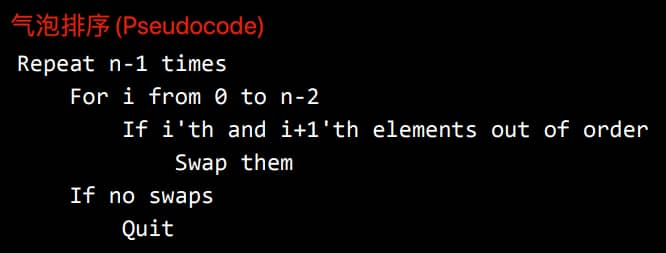

      

   3. 归并排序(merge sort)：$O(nlogn)$，$\Omega(nlogn)$，即$\Theta(nlogn)$。利用递归思想，将数据持续一分为二，直至只有1个数据，步骤为$logn$；然后每1步骤，对比所有数字并合并，步骤为$n$。

      

      

   4. 算法比较：虽然归并排序的最大时间复杂度更低，但我们需要pay the price：==它需要更多的存储空间来运行算法==(Memory problem)。简而言之，我们需要2个数组来完成排序(use new segments for our sub-arrays)。

      

3. 在选择算法的时候我们需要有所取舍(trade-off)，为了达到更低的时间复杂度，可能的取舍有：

   1. 我们需要花费更多时间编写更为复杂的代码
   2. 算法运行需要更多的储存空间

4. 重要算法技术：==递归(recursion)，简单来说，递归就是函数调用自身的能力(recursion, quite simply, is the ability for a function to call itself)==。递归可以用简洁的代码取代函数中的循环，使我们的算法看起来很elegant。

   

   1. 递归是一个强大的工具，但很容易出错 。

      1. 我们需要保证函数的输入在不断变化(input keep changing)，这样递归才有意义。
      2. 我们要保证函数有判断条件，不会被无限调用，否则会出现栈空间溢出而导致程序异常的问题。

   2. 当定义递归函数时，需要定义两种情况。示例：阶乘算法$n!$：

      

      

      1. 基本条件(base case)：触发该条件将终止递归过程，可以设置多个。如阶乘函数当n=1时，停止。
      2. 递归条件(recursive case)：如何递归，可以设置多个。如阶乘函数n*fact(n-1)$。
      3. (如果判断条件只有一行代码，可以将方括号省略)

      

      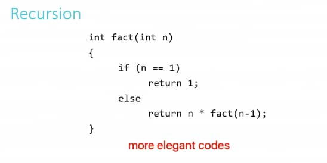

   3. 2个常见的多条件递归示例：

      

      1. 斐波那契数列：第三个数是前两个数之和

         

      2. 考拉兹猜想：指对于每一个正整数，如果它是奇数，则对它乘3再加1，如果它是偶数，则对它除以2，如此循环，最终都能够得到1。

         

         

         

      

# Lecture 4: Memory

## 1. Introduction of Hexadecimal

1. 十六进制：”A、B、C、D、E、F“分别表示10、11、12、13、14、15。示例：

   

   1. 举例：十六进制FF表示为十进制$16 \cdot 15+1 \cdot 15 = 255$，表示为二进制$11111111$。

      

   2. 为了和十进制区分，十六进制前会添加==0x==做识别，如$0\text{x}48 = 16 \cdot 4 + 1 \cdot 8 = 72$。

      

2. 为什么程序员喜欢用十六进制呢？

   1. ==因为它允许表示16个可能的数值，即相当于4 bits。==所以程序员想要以4 bits为单位进行计算机科学，则十六进制非常方便。

      

   2. 举例：机器语言转换成十六进制，分成4bits一组，然后转换成对应的十六进制符号。

      

## 2. Pointer and String

> * 数据是存放在内存单元中的，一般把内存中的一个字节称为一个内存单元。为了更方便地访问这些内存单元，可预先给内存中的所有内存单元进行地址编号，根据地址编号，可准确找到其对应的内存单元。
>
> * 每一个地址编号均对应一个内存单元，因此可以形象地说一个地址编号就point一个内存单元。
> * 地址编码用十六进制表示。

1. ==C语言中表示地址编号的数据类型为pointer(指针)==，4or8 bytes，可转换为其他数据类型。此外，Pointee表示内存单元。

   

   1. 指针变量声明：==type *name==，不管什么数据类型的指针都是一个代表内存地址的长的十六进制数。

      ```c
      int    *ip;    /* 一个整型的指针 */
      double *dp;    /* 一个 double 型的指针 */
      float  *fp;    /* 一个浮点型的指针 */
      char   *ch;    /* 一个字符型的指针 */
      int    *ip1, *ip2, *ip3;  /* 多个指针 */
      ```

   2. NULL指针：表示空指针，无地址，经常用于创建一个待使用的指针或判断条件。

      

   3. 为指针分配内存并赋值

      ```c
      int *pointer  /* 设定一个整数的pointer */
      pointer = malloc(4) /* 为pointer分配内存 */
      *x = 42 # go to pointee /* 赋值 */
      free(pointer)  /* 释放内存 */
      ```

2. string：==一种array，而array是pointer，因此string也是pointer。==string实际是电脑内存中某个字符的抽象地址：string中第一个字符的地址(the address of just the first character)。知道了第一个，其他的也就知道了，因为它们stay back to back。

   1. 这也是为什么在C中，string表示成==char *，即字符的地址==。

      ```c
      char *s = "HI!";
      // 将char *重新命名为string
      typedef char *string;
      // typedef表示给我一个自定义的数据类型
      ```

   2. printf("%p\n", s)可以得到第一个字符在内存中的地址(the address in memory of the first character of the string)。

   

   3. 复制字符串：如果直接用"="赋值，那么t和s是相同的pointer，当修改t所对应的字符时，s也会被改变。

      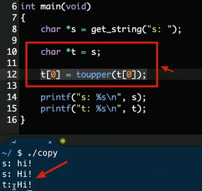

      ```c
      #include <cs50.h>
      #include <ctype.h>
      #include <stdio.h>
      #include <stdlib.h>
      #include <string.h>
      
      int main(void)
      {
          char *s = get_string("s: ");
      
          char *t = malloc(strlen(s) + 1);
        //if内存不足
          if (t == NULL)
          {
              return 1;
          }
      
          for (int i = 0, n = strlen(s); i < n + 1; i++)
          {
              t[i] = s[i];
          }
        //if输入不为空
          if (strlen(t) > 0)
          {
              t[0] = toupper(t[0]);
          }
      
          printf("s: %s\n", s);
          printf("t: %s\n", t);
        //释放内存
          free(t);
      }
      ```

      ```c
      //现成的函数
      #include <string.h>
      strcpy(t,s)
      ```

   4. 比较字符串：既然字符串是第一个字符的pointer，那么如何比较两个字符呢？

      

2. Pointer Arithmetic：

   1. 因为字符串s是第一个字符的pointer，因此s+1就是第二个字符的pointer。这也是数组索引的底层，计算机帮我们进行了pointer的运算。

      ```c
      #include <stdio.h>
      
      int main(void)
      {
      char *s = "HI!";
      //这两个表达是一样的
      printf("%c\n",*(s+1));
      printf("%c\n",s[1]);
      }
      ```

      

   2. Segmentation fault：表示代码错误，触及了我们不应该触及的一段内存(it tends to mean that you touched a segment of memory)。

      

##  3. Functions of Pointer

1. Pointer的主要用处：

   1. 当调用函数时，我们不使用变量的实际值，而是pass data by value but not itself。使用pointer的话，我们可以直接pass the actural variable itself to the function。

      

   2. 电脑上的所有FILE都存储在磁盘驱动器(disk drive)，如机械硬盘(hard disk drive, HDD)或固态硬盘(solid-state drive, SSD)。我们要使用文件时，需要用pointer将需要的部分复制到RAM中。

      

   3. 使用pointer可以访问动态分配的内存(dynamically allocated memory, memory that is allocated as your program is running, 即heap)，使用mlloc()函数会返回pointer指定数量的内存。当然，比起静态分配，动态分配的内存并不会自动返回给系统，因此每次分配完都需要free()，否则会导致memory leak。

      

      

      

2. C中使用pointer访问memory的相关操作：

   1. &：引用变量的存储位置(reference, what memory this variable is stored in)，结果用十六进制表示。

      

      

      

   2. *：逆向引用特定存储位置的文件(dereference, go to a memory address and look inside)

      

      

   3. free(t)：free the allocated memory，释放之前分配的内存，并不是说清除内存，而是leave it alone，这样电脑可以reuse it。因此，==每次用malloc后都要记得free==，防止电脑可用内存耗光。

   4. malloc(int)：memory allocation，即需要内存分配几个byte。

      ```c
      #include <stdlib.h>
      #include <cs50.h>
      #include <string.h>
      
      char *s = get_string("s:");
      //字符串最后是/0
      char *t = malloc(strlen(s)+1);
      int  *ip = malloc(sizeof(int));
      ```

      
   
   5. realloc()：需要两个参数，已有指针和内存size，即为已存在的指针重新分配不同的内存。==分配成功后原指针会被回收，不需要再进行free==。
   
      * 如果是扩大内存操作会把原指针指向的的数据复制到新地址；
      * 如果是缩小内存操作，原始据会被复制并截取新长度。
   
      ```c
      #include <stdlib.h>
      
      int *list = malloc(3 * sizeof(int));
      int *newlist = realloc(list, 4 * sizeof(int));
      ```

## 4. Basic Knowledge of Memory

> Memory指RAM，是计算机运行时的随机存取区域。

1. 在内存没被使用之前，就是一团mess，计算机可能在那存了一些之前的变量或记忆，这些被称为==garbage value==。

   

2. 内存的分区：计算机的存储不是完全随机的，不同的区域会用于存储不同类型的记忆。

   

   1. machine code：存储已编译的二进制代码

   2. global variable：函数之外的全局变量

   3. heap：分配内存，malloc()

   4. stack：调用函数(call function)，也就是内存可以不断改写的动态区域(dynamic place where memory keeps getting used and reused)。我们可能同时调用多个函数，但只有栈顶的一个函数在活跃(active frame on top of the frame)，活跃完的函数会被move away or destroy。

      

      

3. 内存问题：==缓存溢出和堆栈溢出(heap overflow & stack overflow)==
   1. stack overflow：指调用太多函数，使用了stack区域太多内存，最终内存不足并溢出到了heap区域。例：递归函数很容易导致该问题。

      

   2. buffer overflow：指当我们分配一个内存块或创建一个数组，我们使用了超出该内存块或数组的区域。

## 5. Operation of FILE

1. 我们使用pointer在C中打开存储在disk drive中的文件，并进行操作。==所有有关文件输入和输出操作（file(I/O)，file input/output）的函数都存在stdio.h中==。

   

   1. 打开文件：fopen，会返回FILE类型的pointer。函数第一个参数是文件名，第二个参数是打开模式(r for read, w for write, a for append)

      

      ```c
      FILE *fp = fopen("phonebook.csv", "a");
      ```

   2. 打印文件：fprintf

   3. 获取单个字符：fgetc(file pointer)，当文件以"r"形式打开时，获取pointer指向的下一个字符。

      

      

   4. 写入或增加单个字符：fputc(file pointer)，当文件以"w"或"a"形式打开时，写入pointer指向的下一个字符。

      

      

      ```c
      fputc('A',fp);
      ```

   5. 读取指定数量的字节：fread，文件以"r"形式打开。

      

      ```c
      //读取10个整数
      int arr[10];
      fread(arr, sizeof(int),10,fp);
      
      //读取一个字母
      char c;
      fread(&c, sizeof(char),1,fp);
      ```

   6. 写入指定数量的字节：fwrite，文件以"w"或"a"形式打开。

      

      ```c
      //写入10个整数
      int arr[10];
      fwrite(arr, sizeof(int),10,fp);
      ```

   7. 关闭文件：fclose(file pointer)

      

      

2. 举例：打开一个文件并识别是否为jpeg，用文件的前3个byte识别，如果分别为0xff、0xd8、0xff，则为jpeg。

   ```c
   #include <stdint.h>
   #include <stdio.h>
   
   //创建一个字节的数据类型，uint8_t表示一个byte
   typedef uint8_t BYTE;
   
   int main(int argc, char *argv[])
   {
       // Check usage
       if (argc != 2)
       {
           return 1;
       }
   
       // Open file
       FILE *file = fopen(argv[1], "r");
       if (!file)
       {
           return 1;
       }
   
       // Read first three bytes
       BYTE bytes[3];
       fread(bytes, sizeof(BYTE), 3, file);
   
       // Check first three bytes
       if (bytes[0] == 0xff && bytes[1] == 0xd8 && bytes[2] == 0xff)
       {
           printf("Maybe\n");
       }
       else
       {
           printf("No\n");
       }
   
       // Close file
       fclose(file);
   }
   ```

# Lecture 5: Data Structure

1. array如何插入新元素呢？实际上，我们没办法给原array插入元素，因为：

   1. 创建数组的时候，我们已经为它分配好了特定的内存，每个元素的位置stay back to back。

   2. 数组前后内存可能已经被计算机用于存储其他数据，所以没办法直接再加上对应的byte。

      

2. 实际操作中，我们如何给array插入新元素呢？

   1. 新建array，并将原array中的元素copy过来，时间复杂度为$O(n)$，$\Omega(1)-空数组$。

   2. 我们可以使用realloc函数分配更大的空间。

      

      ```c
      #include <stdio.h>
      #include <stdlib.h>
      
      int main(void)
      { int *list = malloc(3 * sizeof(int));
          if (list == NULL)
          {
              return 1;
          }
      
          list[0] = 1;
          list[1] = 2;
          list[2] = 3;
       
       		int *tmp = realloc(list, 4 * sizeof(int));
       		if (tmp == NULL)
          {
              free(list);
              return 1;
          }
       		tmp[3] = 4;
          list = tmp;
       		free(list)
      ```

## 1. Linked list

> 显然数组stay back to back的形式使插入效率很低，特别是大数组。因此，我们==可以使用pointer创建更动态的数据结构：链表(linked list)==。

1. 数据结构的C语言：

   ```c
   typedef struct {} stru_name;  // 创建自定义数据结构体
   Person.name // 访问结构的属性
   pointer -> number  // 用指针访问指向的结构属性
   ```

2. 链表的结构和创建：

   1. node：==1个value+1个pointer构成1个node==。链表最后1个node的pointer是NUll(空指针)。链表就是由多个node组成。

      

   2. 创建node数据结构：

      ```c
      typedef struct node 
      // 在前面声明node，以便在函数中引用它自己。
      {
        int number;
        struct node *next; // 类型为node指针，next为属性名
      }
      ```

3. 链表的trade-off：

   1. 优点：我们在最前插入元素只需要$\Theta(1)$，时间复杂度降低。
   2. 缺点：
      1. 我们需要两倍的内存来存1个node。
      2. 没办法使用二分搜索法(binary search)；因为我们只能跟随pointer从头开始不断向下访问, 而不能直接跑到中间位置.
      3. 搜索时间长，因为node可能在内存中的任何地方。我们只能一次跟随一个pointer访问, 为$O(n)$

4. 如何创建和插入链表？

   1. ==先创建一个空列表(empty list)，然后挨个创建node==。

      ```c
      #include <stdio.h>
      #include <stdlib.h>
      
      // 创建node结构类型
      typedef struct node
      {
          int number;
          struct node *next;
      }
      node;
      
      int main(void)
      {
        
          // 空列表
          node *list = NULL; //建了一个node类型的指针
      
          // 创建第一个node
          node *n = malloc(sizeof(node));
          if (n == NULL)
          {
              return 1;
          }
      
          // 设定node的value，pointer先设为NULL
          n->number = 1;   //相当于n.number
          n->next = NULL;
      
          // 将n赋给list，创建了1个node的链表！
          list = n
      
          // 创建第二个node
          n = malloc(sizeof(node)); //给指针重新分配内存
          if (n == NULL)
          {
              free(list);
              return 1;
          }
      
          // 设定node的value，pointer先设为NULL
          n->number = 2;
          n->next = NULL;
      
          // 将第1个node的pointer设定为n
          list->next = n;
      
          // 创建第3个node
          n = malloc(sizeof(node));
          if (n == NULL)
          {
              // Free 所有的指针分配的内存
              free(list->next);
              free(list);
              return 1;
          }
          n->number = 3;
          n->next = NULL;
      
          // 更新第二个node的pointer
          list->next->next = n;
      
          // 循环整个过程
          for (node *tmp = list; tmp != NULL; tmp = tmp->next)
          {
              printf("%i\n", tmp->number);
          }
      
          // Free掉全部内存，用两个指针来循环free
          while (list != NULL)
          {
              node *tmp = list->next; // 先存下一个node的指针
              free(list);  // free上一个指针
              list = tmp;  // 重置list的指针
          }
      }
      ```

   2. 插入node：==新建node，先设定node的指针，然后修改前一元素的pointer==

      ```c
      n->next = list;
      list = n;
      ```

      

## 2. Binary Search Trees

1. 二叉搜索树：1个node连接2个其他的node，左边node的数较小，右边node的数较大。

   

2. 创建二叉搜索树的node类型：

   ```c
   typedef struct node
   {
       int number;
       struct node *left;
       struct node *right;
   }
   node;
   ```

2. 利用递归的思想搜索：search smaller and smaller subtrees

   ```c
   // tree is a pointer to a node that is the root of the tree we're searching in.
   // number is the value we're trying to find in the tree.
   bool search(node *tree, int number)
   {
       // First, we make sure that the tree isn't NULL
       if (tree == NULL)
       {
           return false;
       }
       // If we're looking for a number that's less than the tree's number,search the left side
       else if (number < tree->number)
       {
           return search(tree->left, number);
       }
       // Otherwise, search the right side
       else if (number > tree->number)
       {
           return search(tree->right, number);
       }
       // Finally, we've found the number we're looking for, so we can return true.
       else if (number == tree->number)
       {
           return true;
       }
   }
   ```

3. 二叉搜索树的优缺点:

   1. 插入新元素需要先搜索它应插入的位置, 时间复杂度为$O(logn)$。

   2. 在设计和使用搜索树时,我们需要确保树的平衡, 否则搜索树就会失去它原有的优势。

      

## 3. Hash Table and Tries

1. 哈希表本质上是一种结合了数组性质的链表, hash function实际上对数据进行分类. 让搜索更方便。

2. 假设我们有很多名字，我们将它们分类为一个具有26个位置的数组，每个字母对应一个bucket，如A对应1，然后将相同首字母的名字组成链表：

   1. 最坏的情况下，所有名称都可能以相同的字母开头，hash table就变得和单个链表差不多。

   2. 我们可以查看前两个字母，并分配26*26的buckets。通过使用了更多的内存，搜索时间变短。

   3. 也就是说：==哈希表的最坏情况运行时间为$O(n)$==，因为随着n变大，即使有成百上千个buckets，每个bucket也具有n个值的数量级。不过实际上，由于将值分为多个存储区，运行时间快很多。

      

   4. 一个好的哈希函数应该遵循：more like an art not science

      

3. trie: 是一种特殊的树, 每个node是一个array。利用trie查找电话簿，只需要$O(1)$。但是它的trade-off是：

   1. 会浪费很多内存，因为array的很多元素和pointer不需要用到。

   

## 4. abstract data structure

1. 抽象数据结构：abstract data structure, ADT, 定义了一系列的操作和这些操作的作用，但我们却并不指定这些操作过程如何具体实施(即不编写具体的代码)，如queue、stack
2. 常见的抽象数据结构：
   1. Queue: 排队，重要特性-FIFO first in first out
      1. enqueue 入队
      2. dequeue 出队
   2. stacks: 重要特性-LIFO last in first out
      1. push 放入堆栈中
      2. pop 从堆栈中删除
   3. dictionary: 重要特性-将键与值关联associate keys with values，可以用哈希表或数组实现。

## 5. Data Structure Summary

1. Array：不够灵活，查找和排序方便

   

2. linked list：插入方便，但排序和查找难

   

3. harsh tables：插入方便，但不能排序，耗内存

   

4. Tries：查找方便，但耗内存

   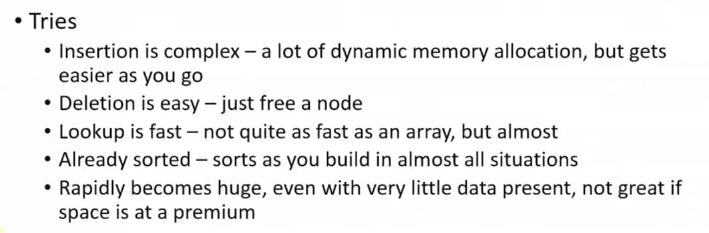

# Lecture 6: Python

> Python作为高级语言和C相比，有以下特点：
>
> 1. 书写更方便，更readable
> 2. 程序运行时间更长，因为高级语言用的是general-purpose solution，电脑需要figure out your purpose；并使用interpreter来translate each line respectively。
> 3. python数据类型不含char，也不能使用pointer(Java也是)，有==Bool、float、int、str、range、list、tuple、dict、set(no duplicates)==
> 4. Python是面向对象的编程语言
> 5. Python document：https://docs.python.org/3.7/search.html

1. python 和 C的对比：

   1. ==少了分号和中括号==
   2. ==多了冒号和缩进，缩进非常重要==
3. ==不需要声明变量类型==
   4. ==不需要使用pointer==（python已经帮我们做了）
   5. ==不需要考虑变量类型的字节数==（如int，python能表示任何数）
   
   ```python
   from cs50 import get_string
   
   answer = get_string("What's your name?")
   print("hello, " + answer)
   print(f"hello, {answer}") # f告诉电脑{}里是一个formatted string，而不是直接打印

   counter = 0
   ```
   
   ```c
   #include <cs50.h>
   
   char *answer = get_string("What's your name?");
   printf("hello, %s\n", answer);
   
   int counter = 0
   ```

## 1. Basic Syntax of Python

1. 判断: if

   1. 和c相比，elif = else if

   ```python
   if x < y:
     print("x is less than y")
   elif x > y:
     print("x is greater than y")
   else:
     print("x is equal to y")
     
   True if x = 3 elif False
   ```

   ```c
   if (x < y)
   {
     printf("x is less than y\n");
   }
   else if(x > y)
   {
     printf("x is greater than y\n");
   }
   else
   {
     printf("x is equal to y\n")
   }
   ```

2. 循环：while、for

   1. 和C相比，True = true，False = false
   2. python 不能用i++

   ```python
   while True:
     print("hello, world")
     n = get_int("positive integer: ")
     if n >0:
       break
   
   i = 0
   while i < 3:
     print("hello, world")
     i += 1
   
   ```
# for循环在python里面非常的灵活
   for i in range(3):
     print("hello, world")
     

   for pie in pizzas:
     print(pizzas[pie])

   for pie, price in pizzas.items():
     print("A whole {} pizza costs ${}".format(pie, price))
   ```
   
   ```c
   while (true)
   {
     printf("hello, world\n");
   }
   
   int i = 0;
   while (i < 3)
   {
     printf("hello, world\n");
     i++;
   }
   
   for (int i = 0; i <3; i++)
   {
     printf("hello, world\n");
   }
   ```

3. Python强大的==可选参数==：

   1. print函数 和 range函数

   ```python
   for i in range(4):
     print("?", end = "") #end默认为/n
     print()
   
   for i in range(1, 101, 2):
     print(i)
   ```

4. Python的格式化打印：

   ```python
   scores = [72,73,33]
   print("Average:" + str(sum(scores)/len(scores)))
   print(f"Average:{sum(scores)/len(scores)}")
   print("Average:{}".format(sum(scores)/len(scores)))
   ```

5. Python不需要用到pointer：如何实现swap

   ```python
   x = 1
   y = 2
   
   print(f"x is {x}, y is {y}")
   x, y = y, x #swap(x,y)
   print(f"x is {x}, y is {y}")
   ```

6. 伴随：with语句

   ```python
   import csv
   from cs50 import get_string
   
   with open("phonebook.csv", "a") as file:
     name = get_string("Name: ")
     number = get_string("Number: ")
     writer = csv.writer(file)
     writer.writerow([name, number]) 
   # 运用with语句，执行完文件会自动关闭
   ```

7. Lists：不像C，python的array即list，没有fixed in size，它们可以根据需要不断增长，我们可以很容易地插入和删除元素。

   ```python
   nums = []
   
   nums = [x for x in range(10)]
   
   nums.append(10)
   
   nums.insert(4,5) # 在第4个位置插入5
   ```

8. objects：即定义类

   ```python
   class Student():
     def __init___(self, name, id):  # 初始化函数，即constructor
       self.name = name   # 设置属性properties
       self.id = id
     def changeID(self, id): # 设置方法methods
       self.id = id
     def print(self):
       print("{}-{}".format(self.name, self.id))
       
   # 创建一个object
   Jane = Student("Jane", 10)
   Jane.print()
   Jane.changeID(11)
   ```

   

##  2. Using Dict to Organize Data

1. 利用字典，我们来统计最受欢迎的电视剧。

   1. 【Lambda 参数名称：返回值】是一个匿名函数anonymous function。从字面上说，就是告诉Python：给我一个函数。

   ```python
   import csv
   
   titles = {}
   
   with open("Favorite TV Shows - Form Responses 1.csv", "r") as file:
       reader = csv.DictReader(file)
   
       for row in reader:
           title = row["title"].strip().upper() #去掉空白和大小写
           if title not in titles:
               titles[title] = 0
           titles[title] += 1
   
   for title in sorted(titles, key=lambda title: titles[title], reverse=True): # sorted函数默认按字典的键排序
       print(title, titles[title])
   ```

   

# Lecture 7: Data and SQL

> 1. Structured Query Language：我们的数据用编程存成了二进制文件，并用SQL语言来==创建、阅读、更新和删除数据(create/insert, read-select, update, delete, 简称crud)==。
> 2. 文件后缀.db
> 3. 课程所用语法为SQLite

## 1. Simple Syntax of SQL

1. 创建表格

   ```sql
   CREATE TABLE table_name(column_name type, ...);
   ```

2. 查找数据

   1. `AVG`、`COUNT`、`DISTINCT`、`LOWER`、`MAX`、`MIN`、`UPPER`、`TRIM`
   2. `WHERE`、`LIKE`、`ORDER BY`、`LIMIT`、`GROUP BY`

   ```sql
   SELECT columns FROM table_name;
   
   SELECT DISTINCT title FROM shows;
   
   SELECT title FROM shows WHERE title LIKE "%office%";
   
   
   ```

3. 插入新数据

   ```sql
   INSERT INTO table_name(column,...) VALUES(value,...);
   ```

4. 更新数据

   ```sql
   UPDATE table_name SET update_thing WHERE  ;
   ```

5. 删除数据

   ```sql
   DELETE FROM table_name WHERE ;
   ```

6. 联表查找

   ```sql
   SELECT title FROM people
   JOIN stars ON people.id = stars.person_id
   JOIN shows ON stars.show_id = shows.id
   WHERE name = "Steve Carell";
   ```

7. 创建索引：提高搜索效率，B-tree

   

   ```sql
   CREATE INDEX person_index ON stars(person_id);
   ```

## 2. Combine Python and SQL


1. 在这里我们用cs50的library来在python中使用SQL。

   ```python
   import csv
   
   from cs50 import SQL
   
   open("shows.db", "w").close()
   db = SQL("sqlite:///shows.db")
   
   db.execute("CREATE TABLE shows (id INTEGER, title TEXT, PRIMARY KEY(id))")
   db.execute("CREATE TABLE genres (show_id INTEGER, genre TEXT, FOREIGN KEY(show_id) REFERENCES shows(id))")
   
   with open("Favorite TV Shows - Form Responses 1.csv", "r") as file:
       reader = csv.DictReader(file)
       for row in reader:
           title = row["title"].strip().upper()
   
           id = db.execute("INSERT INTO shows (title) VALUES(?)", title)
   
           for genre in row["genres"].split(", "):
               db.execute("INSERT INTO genres (show_id, genre) VALUES(?, ?)", id, genre)
   ```

2. 在其他语言中使用SQL语言，需要警惕SQL injection attack。


3. 此外，还要注意multithread的race conditions。比如在twitter里同时有两个人对post点赞，如果同时往数据库取数并更新，则会导致数据错误。解决问题的方法是transaction，一个交易过程还未完成，不能进行新的交易，all done or all fail

   ```python
   db.execute("BEGIN TRANSACTION")
   rows = db.execute("SELECT likes FROM posts WHERE id = ?", id);
   likes = rows[0]["likes"]
   db.execute("UPDATE posts SET likes = ? WHERE id = ?", likes + 1, id);
   db.execute("COMMIT")
   ```

   

# Lecture 8: Web Programming

> 1. Internet是什么？通俗来说，就是==get data from point A to point B through paths like cables, wireless, satellite etc in packets.==
> 2. Web是在Internet上运行的一个应用，使我们可以获取网页。其他类似的应用有：Zoom等提供视频会议，email提供邮件服务。==web design需要学习的语言有HTML、CSS、JavaScript==。
> 3. html文件后缀：.html


## 1. TCP/IP, DNS

1. 类比邮件系统，在信封上写postcode和receiver address是约定俗成的传统。在因特网里，为保证信息能被routers识别并传递，我们也制定了一些protocols，即网络通信协议TCP/IP。

2. **routers**：路由器，具有CPU和内存的专门用于传递数据的计算机，传递方式有cables、wireless、satellite等。

3. **Protocol**：计算机通信的标准约定(standard convention)，比如计算机需要告诉routers要往哪个方向传递信息。

4. **Packets**：在现实世界中，我们可能会在信封上写一个地址，以便向某人发送一封信，并附上我们自己的地址以回信。计算机通信中，带有发件人和收件人地址的消息，称为数据包(Packets)。

5. **IP**：Internet protocol--网际协议，根据地理位置制定了每个server唯一的IP address，相当于信封上的地址。根据网际协议，路由器识别IP之后会了解往哪个方向传递信息，此外信息会被分成大小类似的small packets。

   1. IP一般是32-bits并用4-bits的十进制表示：w.x.y.z $\in[0,255]$，如123.45.67.89

   2. 近些年由于设备和人口的增长，32位的IPv4（网际协议第4版）已经无法满足一机一址的需求，现在开始慢慢采用128位的IPv6（网际协议第6版）。

      

   3. Routers内存中有一个IP地址表，该表将IP地址映射到其他路由器，因此它们知道将数据包转发到何处。

   4. **DHCP**：**D**ynamic **H**ost **C**onfiguration **P**rotocol，动态主机设置协议的服务器会自动为附近的设备自动分配IP地址给用户。

6. **DNS**：Domain Name System，域名系统，由互联网服务提供商(ISP, Internet Service Provider)提供，将数字的IP地址转换成English-like and human-readable的域名。如：google.com

   1. 当我们在网址栏输入DNS时，电脑会迅速找到对应的IP address，然后发送给附近的router。
   2. .com：被称为顶级域名(TLP, Top-level Domain)，表示网站的类型，比如.edu为教育类网站。

7. **TCP**：Transmission Control Protocol--传输控制协议，允许一个identical server同时提供multiple services，相当于一个邮差可以同时处理很多信件。

   1. **PORT**：端口号，表示特定的服务类型，如80表示网页访问(http)，443表示安全访问网页(https)。
   2. **Resending Packets**：如果Packets因某种原因丢失并且没有被接收，TCP还提供了一种重新发送数据包的机制。

8. **Net neutrality**：网络中立性，指的是这些公用路由器平等对待数据包，而不允许对某些公司或某些类型的数据包进行优先级排序。
   1. 较大的数据会被IP分拆成大小相似的small packets分别传输，这样互联网上的路由器可以更公平、更轻松地发送每个人的packets。
   2. 当有multiple packets for a single response时，TCP还将标记每个数据包的先后顺序，如“ 2/1”或“ 2/2”，以便根据需要组合或重新发送。

## 2. HTTP, URL, STATUS CODE

1. **HTTP**：HyperText Transfer Protocol，超文本传输协议，专门用于Web browsers and Web Servers ==get, request and respond to the information==。即基于TCP/IP packets，规定了信的内容怎么写。

   1. GET：HTTP中常用命令，允许浏览器向服务器请求文件或页面，allows a browser to ask for a page or file。
   2. POST：允许浏览器将数据加密发送到服务器。它将隐藏一些敏感信息，如信用卡密码等。从本质上讲，它将信的内容隐藏在更深的密码中，没有将其放入URL栏中，但仍将其私下发送给server。
   3. PUT：将动作发给指定的API，应用程序接口。

2. **HTTPS**：http的安全版本(secure version)，即用了特定的加密技术，除了发送者和接受者，没有任何人能破译信的内容。

3. **URL**：Uniform Resource Locator--统一资源定位符。如https://www.google.com

   1. www：world wide web，是主机名(hostname)，惯例上表明我们正在使用万维网。但实际上，它不是必需的，现在很多网站都没有包含它。

   2. /：后面跟的是server将响应的请求文件，如index.html。

   3. curl：我们可以使用命令行来连接URL。

      ```html
      curl -I http://safetyschool.org
      HTTP/1.1 301 Moved Permanently
      Server: Sun-ONE-Web-Server/6.1
      Date: Wed, 26 Oct 2020 18:17:05 GMT
      Content-length: 122
      Content-type: text/html
      Location: http://www.yale.edu
      Connection: close
      ```

4. **Status code**：表示http的响应代码。比如：

   1. 404：表示Not Found。

   2. 304：表示未修改，允许浏览器使用某些资源（例如图像）的缓存或本地副本，而不是让服务器再次发送packets。

      

      

5. HTTP请求和回复：

   

   1. An HTTP request will start with:

      1. GET：表示请求文件
      2. HTTP/1.1：表示协议版本，是使用最广泛的。
      3. Host：表示请求的服务器

      ```html
      GET /search?q=cats HTTP/1.1
      Host: www.google.com
      ...
      ```

   2. A response will start with:

      1. 200 ok：status code，表示请求有效。
      2. Content-Type：表示响应的类型，如text、image

      ```html
      HTTP/1.1 200 OK
      Content-Type: text/html
      ...
      ```

      

## 3. Basic Syntax of HTML

1. **HTML**：超文本标记语言(HyperText Markup Language)不是一种编程语言，no loops and no conditions，而只是文本。它用于格式化网页，并告诉Browser如何使用tags和attributes来显示web pages。

   1. **<!DOCTYPE>**：位于文档的最前面，不是tag，而是告知web browser页面用了哪种html版本。eg：html5版本写成<!DOCTYPE html>。

   2. **tags**：<title>   ，表示内容标签，需要有开始标签和结束标签，构成document tree里的长方形nodes。

   3. **attributes**：<html lang = "en">中的lang表示语言属性为英语。要引用时需要加`#`。

      ```html
      <!DOCTYPE html>
      
      <html lang="en">
        <!-- 浏览器的标签或窗口标题内容 -->
          <head> // 
              <title>
                  hello, title
              </title>
          </head>
        <!-- 页面本身展示内容 -->
          <body> // 
              hello, body
          </body>
      </html>
      ```

      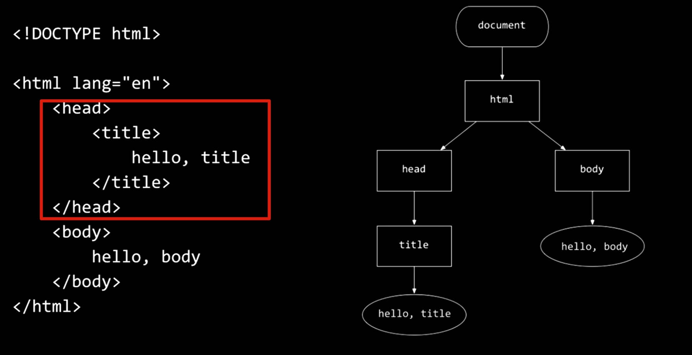

2. HTML基本语法：

   1. 分段：`<p>`

   2. 标题：`<h1>`一级标题，`<h2>`二级标题

      ```html
      <!DOCTYPE html>
      <!-- Demonstrates paragraphs -->
       
      <html lang="en">
          <head>
              <title>paragraphs</title>
          </head>
          <body>
            	<h1>One</h1>
              <p>
                  Lorem ipsum dolor sit amet, consectetur adipiscing elit. Vivamus convallis scelerisque quam, vel hendrerit lectus viverra eu. 
              </p>
            	<h2>Two</h2>
              <p>
                  Mauris ut dui in eros semper hendrerit. Morbi vel elit mi. Sed sit amet ex non quam dignissim dignissim et vel arcu. Pellentesque eget elementum orci. Morbi ac cursus ex. 
              </p>
          </body>
      </html>
      ```

   3. 创建无序列表：`<ul>`, 单个列表`<li>`

   4. 创建有序列表：`<ol>`

   5. 创建表格：`<table>`, 行`<tr>`, 单个单元格`<td>`

      ```html
      <!DOCTYPE html>
       
      <html lang="en">
          <head>
              <title>list</title>
          </head>
          <body>
              <ul>
                  <li>foo</li>
                  <li>bar</li>
              </ul>
              <ol>
                  <li>foo</li>
                  <li>bar</li>
              </ol>
            	<table>
                  <tr>
                      <td>1</td>
                  </tr>
                  <tr>
                      <td>4</td>
                  </tr>
              </table>
          </body>
      </html>
      ```

   6. 插入图片：``

      1. alt ：alternative，它规定了在图像无法显示时的替代文本。
      2. src：图片来源

   7. 插入超链接：` <a href="image.html">Harvard</a>`

      1. href：hyper reference，规定了我们将去向哪里
      2. Harvard：链接显示的文字。当文字和href不符时，可能会出现网络钓鱼现象(phishing)，即诱骗用户访问某些网站。

   8. 创建表单：`<form>`

      ```html
      <!DOCTYPE html>
      
      <!--创建一个从google获取数据的表单-->
      <html lang="en">
          <head>
              <title>search</title>
          </head>
          <body>
            	<!--URL：google，方法：get-->
              <form action="https://www.google.com/search" method="get">
                	<!--第一个输入栏，search?q= -->
                  <input name="q" type="search">
                	<!--第二个输入栏，一点击就提交请求>
                  <input type="submit" value="Search">
              </form>
          </body>
      </html>
      ```

   9. HTML entity：HTML实体，该实体是一个数字代码，用于标识通常不在键盘上，但可能仍要显示的符号。如&#169表示©。

1. 
2. "phishing" refers to trying to trick humans, as Santiago says, via social engineering into doing something that they didn't actually intend.

4. #

5. A dot before a word means the class centered, the class large or medium or small.

6. form

7. 

   

   

## 4. Basic Syntax of CSS

1. 层叠样式表（英语：Cascading Style Sheets，缩写：CSS）是一种==用来为结构化文档（如HTML文档或XML应用）添加properties/ key-value pairs（eg：color: red）的语言（不是编程语言），使网页具有aesthetics and stylization==。

2. css 使用selector来和html协作：

   1. type selector：指定tags并进行样式标记

   2. class selector：用`. + class_name` 创建特定样式以被html引用

   3. pseudoselector：选择tag特定的状态，如`a:hover`表示当鼠标停留在a这个tag上时

   4. ID selector：tag上添加id属性，选择特定的id`#harvard`

      ```html
      <!DOCTYPE html>
      
      <html lang="en">
          <head>
              <style>
                  #harvard
                  {
                      color: #ff0000;
                  }
                  #yale
                  {
                      color: #0000ff;
                  }
                  a
                  {
                      text-decoration: none;
                  }
                  a:hover
                  {
                      text-decoration: underline;
                  }
              </style>
              <title>link</title>
          </head>
          <body>
              Visit <a href="https://www.harvard.edu/" id="harvard" >Harvard</a> or <a href="https://www.yale.edu/" id="yale" >Yale</a>.
          </body>
      </html>
      ```

3. 我们有多种方法来结合CSS和html：

   1. 直接在tag里添加`<style>`，然后用`;`隔开 CSS的key-value properties。这样子没有用到selector，非常地低效。

      ```html
      <!DOCTYPE html>
      
      <html lang="en">
          <head>
              <title>css</title>
          </head>
          <body style="text-align: center;">
              <header style="font-size: large;">
                  John Harvard
              </header>
              <main style="font-size: medium;">
                  Welcome to my home page!
              </main>
              <footer style="font-size: small;">
                  Copyright &#169; John Harvard
              </footer>
          </body>
      </html>
      ```

   2. 写在`<head>`里的`<style>`，用css的type selector来给html的每个tag赋予样式。

      ```html
      <!DOCTYPE html>
      
      <html lang="en">
          <head>
              <style>
                  header
                  {
                      font-size: large;
                      text-align: center;
                  }
              </style>
              <title>css</title>
          </head>
          <body>
              <header>
                  John Harvard
              </header>
          </body>
      </html>
      ```

   3. 写在`<head>`里的`<style>`，用css的class selector来创建样式给html反复引用。

      ```html
      <!DOCTYPE html>
      
      <html lang="en">
          <head>
              <style>
                  .centered
                  {
                      text-align: center;
                  }
                  .large
                  {
                      font-size: large;
                  }
              </style>
              <title>css</title>
          </head>
          <body>
              <header class="centered large">
                  John Harvard
              </header>
          </body>
      </html>
      ```

   4. 书写单独的.css文件，然后link to html。这样有利于多人协作。

      1. `rel` 表示“关系 (relationship) ”，它是`<link>`中一个关键的属性，表示`<link>`项的链接与包含它的文档之间的关系，“`stylesheet`”表示样式表。

      ```html
      <!DOCTYPE html>
      
      <html lang="en">
          <head>
              <link href="styles.css" rel="stylesheet">
              <title>css</title>
          </head>
          <body>
              <header class="centered large">
                  John Harvard
              </header>
              <main class="centered medium">
                  Welcome to my home page!
              </main>
              <footer class="centered small">
                  Copyright &#169; John Harvard
              </footer>
          </body>
      </html>
      ```

## 5. Basic Syntax of JavaScript

1. html和CSS只是静态地展示网页，为了能在用户的浏览器上产生交互，实时改变html展示，我们使用一门新的编程语言——JavaScript。JS的语法优点像C，但没有memory management, no pointers，也不需要声明变量类型。

2. JS简单的语法：

   1. 声明新变量

      ```javascript
      let counter = 0;
      counter = counter + 1;
      counter += 1;
      counter++;
      ```

   2. 条件判断：if(){}

      ```javascript
      # if 判断
      if (x<y)
      {}
      else if (x>y)
      {}
      else
      {}
      ```

   3. 循环：while、for

      ```javascript
      while (true)
      {}
      for (let i = 0; i<3; i++)
      {}
      ```

   4. 定义函数：

      ```javascript
      function greet()
      {
        alert('hello, body'); # alert表示弹出警告窗
      }
      ```

   5. 格式化文本

      ```javascript
      hello, ${input.value}
      ```

3. 如何在html中使用Javascript？

   1. 写在`<script>`里，并在tag中引用

      1. `onsubmit`：表示当表单提交时执行JS

      2. `return false`：阻止表单实际提交到任何地方

      3. `document`：表示整个HTML文档，是全局对象，有属性和方法。

         

         

      4. `queryselector`：在HTML文档中选择nodes。ps：tag直接写名称，attribute前面要加`#`。

      5. `autocomplete`：自动填充

      6. `autofocus`：自动集中在方框，等待输入

      7. `placeholder`：占位符

         ```html
         <!DOCTYPE html>
         
         <html lang="en">
           <head>
           <!--js一般使用单引号-->
         		<script>
         			function greet()
         			{
         				let name = document.querySelector('#name').value;
         				alert('hello, body');
         			}
         		</script>
         		<title>hello</title>
         	</head>
         	<body>
         		<form onsubmit="greet(); return false;">
         			<input autocomplete="off" autofocus id="name" placeholder="Name" type="text">
         			<input type="submit">
         		</form>
         	</body>
         </html>
         ```

   2. JS可以listen网页上发生的event，并作出响应。

      1. `function()`：匿名函数anonymous functions，相当于python的lambda

      2. `DOMContentLoaded`：首先listen浏览器从上到下读取整个的HTML文件，这样才将知道表单的存在。

      3. `addEventListener`：listen特定的事件，比如submit、keyup、click、mouseover etc.

         ```html
         <script>
         
             document.addEventListener('DOMContentLoaded', function() {
                 document.querySelector('form').addEventListener('submit', function() {
                     let name = document.querySelector('#name').value;
                     alert('hello, ' + name);
                 });
             });
         
         </script>
         ```

         ```html
         <!--当点击相应的按钮时，改变背景颜色-->
         <!DOCTYPE html>
         
         <html lang="en">
             <head>
                 <title>background</title>
             </head>
             <body>
                 <button id="red">R</button>
                 <button id="green">G</button>
                 <button id="blue">B</button>
               
               <!--js位于HTML文件的末尾，因此不需要listen to DOMContentLoaded事件，因为浏览器已经读取了其余的DOM。 -->
                 <script>
         
                     let body = document.querySelector('body');
                     document.querySelector('#red').onclick = function() {
                         body.style.backgroundColor = 'red';
                     };
                     document.querySelector('#green').onclick = function() {
                         body.style.backgroundColor = 'green';
                     };
                     document.querySelector('#blue').onclick = function() {
                         body.style.backgroundColor = 'blue';
                     };
         
                 </script>
             </body>
         </html>
         ```

         

      

# Security-Password

> 1. 这是一堂有关信息安全的介绍课，讨论的是how to keep your computers and phones secure via password。
> 2. ==信息没有绝对的安全==，只能通过增加别人盗取信息的时间、金钱等成本来keep others away frot our resources。

1. 密码可以增加信息的安全性，但也会面临强力破解（brute-force attacks）的风险。
   1. brute-force attacks指的是adversaries不知道关于密码的任何信息，通过不断地随机尝试hack into the system。

2. 为应对强力破解，可以有以下defenses：
   1. 设置长且复杂的密码，这样密码的可能排列方式就很多，比如4-character password的可能结果就有$94*94*94*94$种。
   2. 像iPhone或给google一样，输入密码错误次数达5次，就必须等待一段时间之后才能再输入，增加adversaries的时间成本。
   3. 实行two-factor/two-step authentication，既要求用户输入密码，又要求用户输入其他信息，如email verified code、biometrics(eg: fingerprints、facescanning)。

3. 但是，凡事都有trade-offs，这些保护机制也会带来问题：
   1. 用户很难记住那么多网站的复杂密码
   2. 有一些网站提供密码服务，如1password.com，但也存在风险。
4. 此外，信息流安全也备受关注，因此出现了end-to-end encryption。
   1. end-to-end encryption：即除了user和receiver，其他服务方无法获知信息的内容。Zoom最近就推出了这项服务。


# LECTURE 9: Flask

> 1. Flask library提供了一个方便程序员进行网页编程的框架，其代码库除了包含一些便捷的==函数==，如解析请求；还附带了有关应如何使用它的==约定==，要求程序的代码以某种方式进行组织。
> 2. python语言中类似的库还有Django；PHP语言中类似的库有Symfony、laravel等。

1. 一个最简单的flask网页应用需包括以下文件：
   1. application.py：python文件，即server。
   2. requirements.txt：列举在程序中要使用的库名
   3. templates文件夹：html文件，即每个页面的展示。
   4. static文件夹：静态数据，如jepgs、pings、css、JS、gifs。
2. Flask是前人不断实践总结出来的框架，可以帮助programmers organize files and steps。
3. flask design pattern包括三个方面：MVC
   1. Controller：控制器，即编写代码并控制网络应用的地方，即.py文件
   2. View：用户界面，如用户将看到并与之交互的HTML和CSS
   3. Model：数据模型，web application数据所使用的技术、服务和软件，如csv、SQL关系型数据库。


4. 运行flask应用：

   

## 1. Controller and View

1. 处理http的get请求：简单的hello

   1. 静态展示：

      

      

      ```python
      # application.py
      from flask import Flask, render_template, request
      
      app = Flask(__name__)
      
      @app.route("/")
      def index():
          return render_template("index.html", name=request.args.get("name", "world"))
      ```

      ```html
      <!--index.html-->
      <!DOCTYPE html>
      
      <html lang="en">
          <head>
              <title>hello</title>
          </head>
          <body>
              hello, {{ name }}
          </body>
      </html>
      ```

      1. `Flask()`：初始化flask application

      2. `render_template`：找到相应的HTML文件并返回

      3. `request.args`：获取http的GET请求，解析URL，`world`表示没有获取到相应信息的alternative。

      4. `@app.route('/')`：捕获到路由URL里的第一个`/`，就调用下述函数。URL从左到右第一个“/”为止一般是首页，因此第一个路由是处理首页。

      5. `__name__`：表示当前文件的名称，指application.py

      6. `@`：python decorator，用一个函数装饰另一个函数，如@fA def fB() 即为 fB = fA(fB)。

         

      7. `{{ }}`：JinJa2模板语言，里面可填入变量

   2. 使用表格形式：

      

      

      ```python
      # application.py
      from flask import Flask, render_template, request
      
      app = Flask(__name__)
      
      @app.route("/")
      def index():
          return render_template("index.html", name=request.args.get("name", "world"))
        
      @app.route("/greet")
      def greet():
          return render_template("greet.html", name=request.args.get("name", "world"))
      ```

      ```html
      <!--greet.html-->
      <!DOCTYPE html>
      
      <html lang="en">
          <head>
              <title>hello</title>
          </head>
          <body>
              <form action="/greet" method="get">
                  <input name="name" type="text">
                  <input type="submit">
              </form>
          </body>
      </html>
      ```

2. 处理http的POST请求：

   ```python
   @app.route("/greet", methods=["POST"])
   def greet():
       return render_template("greet.html", name=request.form.get("name", "world"))
   ```

   1. `@app.route('\greet', method = ['POST'])`：method默认为GET，我们也可以同时使用`method = ['GET', 'POST']`。
   2. `request.form`：获取http的POST请求

3. 设置layout的HTML文件：实际上我们发现html文件的头尾部分都是重复的，因此可以设置一个layout。

   ```html
   <!--layout.html-->
   <!DOCTYPE html>
   
   <html lang="en">
       <head>
           <title>hello</title>
       </head>
       <body>
           
       </body>
   </html>
   ```

   ```html
   <!--使用layout后的index.html-->
   
   
   
   
       hello, {{ name }}
   
   
   ```

   1. 这里的layout文件用到的模板语言是JinJa2。模板语言就是在一个静态HTML加入一些类似变量的标签如`{{name}}`、`{}`，然后当Jinja2解释器在渲染这个HTML时候会动态将变量填入内容，并生成一个最终HTML。==很多Python框架，都默认使用Jinja2来作为模版引擎。==

      

4. 做一个学生选体育课的网页：

   1. application.py

      ```python
      from flask import Flask, render_template, request
      
      app = Flask(__name__)
      
      SPORTS = [
          "Dodgeball",
          "Flag Football",
          "Soccer",
          "Volleyball",
          "Ultimate Frisbee"
      ]
      
      @app.route("/")
      def index():
          return render_template("index.html", sports=SPORTS)
      
      @app.route("/register", methods=["POST"])
      def register():
          if not request.form.get("name") or request.form.get("sport") not in SPORTS:
              return render_template("failure.html")
          return render_template("success.html")
      ```

   2. index.html

      ```html
      
      
      
          <h1>Register</h1>
          <form action="/register" method="post">
            <input autocomplete="off" autofocus name="name" placeholder="Name" type="text">
          	<select name="sport">
                <option disabled selected value="">Sport</option>
                
                	<option value="{{ sport }}">{{ sport }}</option>
                
      			</select>
            <input type="submit" value="Register">
          </form>
      
      ```

   3. layout.html：设置html的模板

      1. `<meta>`：向页面添加元数据。这里我们为viewport元数据添加了一个content属性，目的是让浏览器自动根据设备缩放页面大小和字体。

      ```html
      <!DOCTYPE html>
      
      <html lang="en">
          <head>
              <meta name="viewport" content="initial-scale=1, width=device-width">
              <title>froshims</title>
          </head>
          <body>
              
          </body>
      </html>
      ```

## 2. Combined with Model

1. 做一个学生选体育课的网页：使用sqlite数据库

   1. application.py：连接数据库

      

      ```python
      from cs50 import SQL
      from flask import Flask, redirect, render_template, request
      
      app = Flask(__name__)
      
      SPORTS = [
          "Dodgeball",
          "Flag Football",
          "Soccer",
          "Volleyball",
          "Ultimate Frisbee"
      ]
      
      db = SQL("sqlite:///froshims.db")
      
      @app.route("/")
      def index():
          return render_template("index.html", sports=SPORTS)
      
      @app.route("/register", methods=["POST"])
      def register():
      
          name = request.form.get("name")
          if not name:
              return render_template("error.html", message="Missing name")
          sport = request.form.get("sport")
          if not sport:
              return render_template("error.html", message="Missing sport")
          if sport not in SPORTS:
              return render_template("error.html", message="Invalid sport")
      
          db.execute("INSERT INTO registrants (name, sport) VALUES(?, ?)", name, sport)
      
          return redirect("/registrants")
      
      
      @app.route("/registrants")
      def registrants():
          registrants = db.execute("SELECT * FROM registrants")
          return render_template("registrants.html", registrants=registrants)
      ```

   2. index.html

      ```html
      
      
      
          <h1>Register</h1>
          <form action="/register" method="post">
              <input autocomplete="off" autofocus name="name" placeholder="Name" type="text">
              
                  <input name="sport" type="radio" value="{{ sport }}"> {{ sport }}
              
              <input type="submit" value="Register">
          </form>
      
      ```

   4. registrants.html

      ```html
      <tbody>
          
              <tr>
                  <td>{{ registrant.name }}</td>
                  <td>{{ registrant.sport }}</td>
                  <td>
                      <form action="/deregister" method="post">
                          <input name="id" type="hidden" value="{{ registrant.id }}">
                          <input type="submit" value="Deregister">
                      </form>
                  </td>
              </tr>
          
      </tbody>
      ```

   5. error.html

      ```html
      
      
      
          {{ message }}
      
      ```

2. 发送注册邮件到邮箱：`flask_mail`

   1. Application.py

      ```python
      import os
      import re
      
      from flask import Flask, render_template, request
      from flask_mail import Mail, Message
      
      app = Flask(__name__)
      app.config["MAIL_DEFAULT_SENDER"] = os.getenv("MAIL_DEFAULT_SENDER")
      app.config["MAIL_PASSWORD"] = os.getenv("MAIL_PASSWORD")
      app.config["MAIL_PORT"] = 587
      app.config["MAIL_SERVER"] = "smtp.gmail.com"
      app.config["MAIL_USE_TLS"] = True
      app.config["MAIL_USERNAME"] = os.getenv("MAIL_USERNAME")
      mail = Mail(app)
      
      ···
      
      @app.route("/register", methods=["POST"])
      def register():
      
          email = request.form.get("email")
          if not email:
              return render_template("error.html", message="Missing email")
          sport = request.form.get("sport")
          if not sport:
              return render_template("error.html", message="Missing sport")
          if sport not in SPORTS:
              return render_template("error.html", message="Invalid sport")
      
          message = Message("You are registered!", recipients=[email])
          mail.send(message)
      
          return render_template("success.html")
      ```

## 3. Session and Cookies

1. Session：服务器如何记住有关每个用户的信息，从而启用诸如允许用户保持登录状态的功能。比如输过一次谷歌邮箱的地址和密码后，浏览器就记住了这些信息，之后我们就能自动登录邮箱了。

2. cookies：来自服务器的少量数据，浏览器会为我们保存这些数据，帮助服务器记住我们曾经去过那里。在许多情况下，cookies是一串专属于我们的大随机数或字符串，作为唯一标识符被服务器识别。因此，他们可以跟踪我们的行为 tracking cookies。

   1. 我们第一次登录某网站时，网站会set cookie在浏览器上，call session to a specific value。

      

   2. 当我们再次登录时，浏览器会把cookie发送给server，这样既让我们省去了再次登录的麻烦，也方便server track cookies。

      

   3. google、facebook等会共享cookies，因此广告商会misuse它们。有时当我们浏览完google，会惊讶发现facebook向我们展示刚搜索过的商品。

4. 如何编写cookie程序？可以使用 `flask_session`库

   

   1. Index.html

      ```
      
      
      
      
          
              You are logged in as {{ session.name }}. <a href="/logout">Log out</a>.
          
              You are not logged in. <a href="/login">Log in</a>.
          
      
      
      ```

   2. login.html

      ```
      
      
      
      
          <form action="/login" method="post">
              <input autocomplete="off" autofocus name="name" placeholder="Name" type="text">
              <input type="submit" value="Log In">
          </form>
      
      
      ```

   3. application.py

      ```python
      from flask import Flask, redirect, render_template, request, session
      from flask_session import Session
      
      app = Flask(__name__)
      app.config["SESSION_PERMANENT"] = False
      app.config["SESSION_TYPE"] = "filesystem"
      Session(app)
      
      
      @app.route("/")
      def index():
          if not session.get("name"):
              return redirect("/login")
          return render_template("index.html")
      
      
      @app.route("/login", methods=["GET", "POST"])
      def login():
          if request.method == "POST":
              session["name"] = request.form.get("name")
              return redirect("/")
          return render_template("login.html")
      
      
      @app.route("/logout")
      def logout():
          session["name"] = None
          return redirect("/")
      ```

   3. Requirement.txt

      ```
      flask
      flask_session
      ```

## 3. Combine front end & backend

1.  json， JavaScript Object Notation，是一种轻量级的数据交换格式，在语法上与创建JavaScript对象的代码相同。由于这种相似性，JavaScript程序可以轻松地将JSON数据转换为JavaScript对象。但要注意的是：JavaScript是一种语言， 而json只是一种文本格式。

   

2. AJAX：允许JavaScript在页面加载后发出其他HTTP请求，以获取更多数据。如果再次打开“网络”选项卡，我们确实可以看到我们按下的每个键都发出了另一个请求，并带有响应。我们可以使用jQuery库来调用这个功能。

   1. AJAX允许我们refresh part of the page，而不是whole page，因此数据传输更少，网络响应更快。

   

3. 设计一个购物车：

   1. Index.html

   ```html
   <!DOCTYPE html>
   
   <html lang="en">
       <head>
           <meta name="viewport" content="initial-scale=1, width=device-width">
           <title>shows</title>
       </head>
       <body>
   
           <input autocomplete="off" autofocus placeholder="Query" type="search">
   
           <ul></ul>
         <!--导入jQuery库-->
   
           <script crossorigin="anonymous" integrity="sha256-9/aliU8dGd2tb6OSsuzixeV4y/faTqgFtohetphbbj0=" src="https://code.jquery.com/jquery-3.5.1.min.js"></script>
           <script>
   
               let input = document.querySelector('input');
               input.addEventListener('keyup', function() {
                   $.get('/search?q=' + input.value, function(shows) {
                     let html = '';
                     for (let id in shows)
                     {
                         let title = shows[id].title;
                         html += '<li>' + title + '</li>';
                     }
   
                     document.querySelector('ul').innerHTML = html;
                   });
               });
   
           </script>
   
       </body>
   </html>
   ```

   2. application.py

   ```python
   from cs50 import SQL
   from flask import Flask, redirect, render_template, request, session
   from flask_session import Session
   
   # Configure app
   app = Flask(__name__)
   
   # Connect to database
   db = SQL("sqlite:///store.db")
   
   # Configure sessions
   app.config["SESSION_PERMANENT"] = False
   app.config["SESSION_TYPE"] = "filesystem"
   Session(app)
   
   
   @app.route("/")
   def index():
       books = db.execute("SELECT * FROM books")
       return render_template("books.html", books=books)
   
   
   @app.route("/cart", methods=["GET", "POST"])
   def cart():
   
       # Ensure cart exists
       if "cart" not in session:
           session["cart"] = []
   
       # POST
       if request.method == "POST":
           id = request.form.get("id")
           if id:
               session["cart"].append(id)
           return redirect("/cart")
   
       # GET
       books = db.execute("SELECT * FROM books WHERE id IN (?)", session["cart"])
       return render_template("cart.html", books=books)
   ```

# Appendix

1. Brian的主页：https://brianyu.me/

2. Doug的主页：https://douglloyd.com/
3. abstraction and precision：我们将抽象的东西具象化，给计算机precise的指令

4. 一些可以学习的网站
   * [https://www.reddit.com/r/learnprogramming/](https://www.reddit.com/r/learnprogramming/)
   * https://www.reddit.com/r/programming/
   * https://stackoverflow.com/
   * https://serverfault.com/
   * https://techcrunch.com/
   * https://news.ycombinator.com/