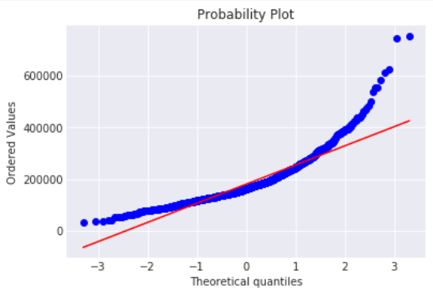
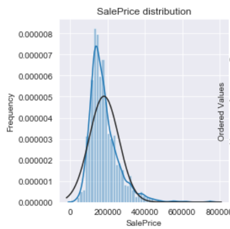

> 在进行数据预处理之前，充分认识数据是非常有必要的。
> 充分认识数据可以提供数据总体情况的有价值洞察，有助于识别噪声和离群点，以便进行数据清理。

# 1. 数据对象与属性类型

> * 数据集由对象组成，对象用属性进行描述，用来描述一个给定对象的一组属性叫属性向量（或特征向量）。例如，班级成绩单中，对象是学生，对象属性是学生每一科的成绩，甲同学全部科的成绩就是一个属性向量。
> * 属性（attribute）= 特征（feature）= 变量（variable）
> * 属性的类型有：标称、二元、序数、数值。

## 1.1.标称属性/分类属性

> 标称属性（nominal attribute）又叫分类属性（categorical attribute），属性值不具备有意义的顺序，只是用于枚举（enumeration）。例如，“国家”属性中，有“中国”、“加拿大”等值。

* 因为标称属性没有有意义的序，即使我们指定数字0代表“中国”，数字1代表“加拿大”，我们也不能进行任何数学运算。
* 因此，标称属性没有均值、中位数，只有众数（mode），即最常出现的数。

## 1.2.二元属性

> 二元属性（binary attribute）是一种特殊的标称属性，描述了两种状态，只用0或1表示，又称布尔属性（bool attribute）。例如，对于属性“是否吸烟”，1表示True（吸烟），0表示False（不吸烟）。

* 二元属性按照两种状态的出现概率比分为对称的和非对称的。如果两种状态出现概率相似，则哪个结果用1编码都可以，例如，属性“性别”；如果两种状态权重不同，则一般倾向于用1表示概率更低的状态，例如，属性“肿瘤是否良性”，因为恶性肿瘤的概率较低，因此用1表示“否”。

## 1.3.序数属性

> 序数属性（ordinal attribute）的值具有有意义的顺序或排名（ranking），但是值之间的差是未知的。例如，属性“衣服码数”的值有小码、中码和大码。

* 序数属性的中心趋势可以用它的众数和中位数表示，但无法定义均值。
* 需注意的是，上文提到的标称、二元、序数属性都是定性的，即它们描述对象的特征而不给出实际大小或数量。

## 1.4.数值属性

> 数值属性（numeric attribute）是定量的，即它是可度量的量，用整数或实数值表示。

## 1.5.离散属性和连续属性

> 机器学习领域通常把属性分成离散的和连续的。
> 一般地，数值属性 = 连续属性。

# 2.数据的描述统计

> * 中心趋势：均值、中位数、众数和中列数
> * 数据散布：极差、四分位数、四分位数极差、五数概括、盒图、方差和标准差
> * 描述图形：分位数图。直方图、散点图

## 2.1.中心趋势度量

**均值**

* 均值适用于数值属性，但它对极端值非常敏感。为了低消少数极端值的影响，我们可以使用截尾均值（trimmed mean）,抛弃高低极端值。
  **中位数**
* 中位数可以用于数值属性和序数属性，能很好判断数据的倾斜度。
  **众数**
* 众数适用于所有属性。
* 具有一个众数的数据集合被称为单峰的（unimodal），具有两个或多个众数的数据则认为是多峰的（multimodal）。
  **中列数**
* 中列数是数据最大值和最小值的平均值。
* 不过，使用中列数评估数据的中心趋势较为少见。

## 2.2.数据散布度量

**极差**

* 最大值与最小值的差
  **四分位数、百分位数**
* 中位数、四分位数、百分位数是使用最广泛的分位数
  **四分位数极差**
* 四分位数极差(IQR)=Q3-Q1，一般用于识别可疑的离群点。
* 识别可以离群点的规则是：>Q3+1.5IQR或<Q1-1.5IQR
  **方差和标准差**
* 低标准差意味着数据趋向于均值，而高标准差表示数据散布在一个大的值域中。

# 3.数据可视化

## 3.1.分位数图、qq图

* 分位数图（quantile plot）是一种观察单变量数据分布的简单有效方法，绘出了数据从小到大的变化曲线并标出四分位位置。
* 实际应用中经常使用的是qq图（quantile-quantile plot）。qq图用于判断两个数据的分布是否一致，若散点位于y=x直线附近，说明两者分布一致。
* 在机器学习中，qq图经常用于判断训练集和测试集是否同一分布（普通qq图）；以及将数据和正态分布进行比较，判断是否符合正态分布（正态qq 图）。

```
#画出正态qq图
fig = plt.figure()
res = stats.probplot(x, plot=plt)
plt.show()
```



## 3.2.直方图、盒须图

**盒须图（boxplot）**

* 盒须图体现了五数概括：min、Q1、Q2、Q3、max。
* 小提琴图是更进一步的盒须图，可视化数据集群。

**直方图（histogram）**

* 现在被广泛使用的直方图一般结合核密度图（kde）进行展示。

```
sns.distplot(df_train['SalePrice'] , fit=norm)
plt.show
```



## 3.3.散点图、散点矩阵、平行坐标

**散点图**

* 散点图是观察双变量数据的有用方法，用于观察点簇和离群点，或判断两个数据之间的联系。
* 散点图可用于发现属性的相关性：a）正相关，b）负相关。
  **散点矩阵**
* 散点矩阵是散点图的有用补充，可以展示nxn维的可视化。
* 但是，散点矩阵无法处理过多的维度。过多的维度使画面拥挤，难以挖掘属性间的关系。
  **平行坐标**
* 平行坐标可以处理更高的维度，但它的局限性在于它不能有效展示样本数较多的数据集。

# 4.度量数据的相似性与相异性

自身分布分析

## 1.1.正态性分析

* 直方图和核密度估计图（
  histogram、kernel density estimation/kde）
* 变异系数、标准差和方差（
  Coefficient of Variation/CV、standard derivation/std、Variance）
* 绝对中位差（Median Absolute Deviation/MAD）：MAD=median(∣X_i−median(X)∣)
  * 绝对中位差是一种统计离差的测量。MAD是一种鲁棒统计量，比标准差更能适应数据集中的异常值。对于标准差，使用的是数据到均值的距离平方，所以大的偏差权重更大，异常值对结果也会产生重要影响。对于MAD，少量的异常值不会影响最终的结果。
  * 由于MAD是一个比样本方差或者标准差更鲁棒的度量，它对于不存在均值或者方差的分布效果更好，比如柯西分布。
* 偏度和峰度（skewness、kurtosis）