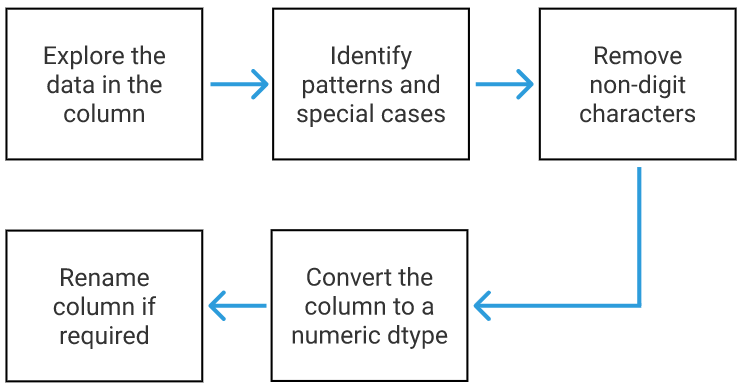
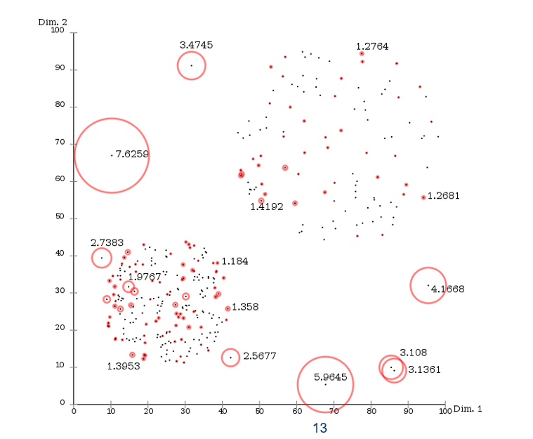
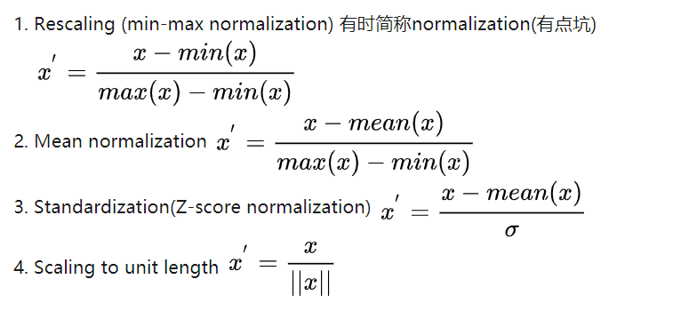
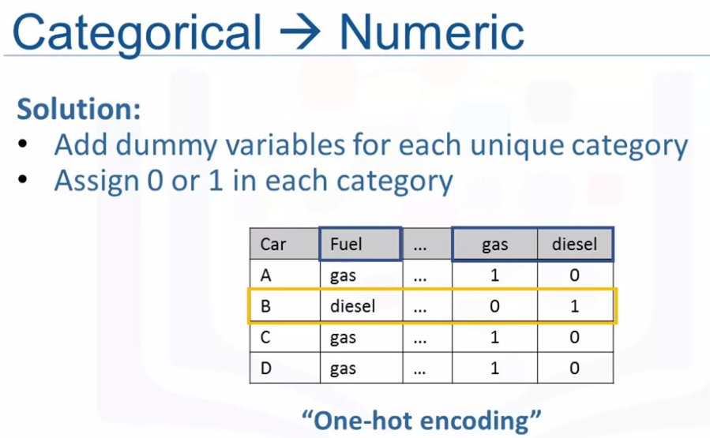

> 实际工作中我们拿到的数据都是脏数据，需要格式化数据、补充缺失值、清除噪音、处理数据一致性、清理冗余数据、转换数据类型等。

# 1.数据格式化(data formatting)

> 我们一开始拿到的数据都会是非常脏的数据，比如列标签书写千奇百怪、数据类型牛头不对马嘴等。为提高后续数据处理的效率，我们应先给脏数据洗个澡。

## 1.1.列标签处理

* 根据我们的书写习惯，我们可以将列标签更改为易于我们书写和调用的格式。

```
# 利用字符串函数修改列名 
def new_string(old_string): 
    new_string = old_string.strip()  # 去掉前后空格
    new_string = new_string.replace('Operating System', 'os') # 替换部分较长的单词
    new_string = new_string.replace(' ', '_') # 替换单词中间空格
    new_string = new_string.replace('(', '') # 删除左括号
    new_string = new_string.replace(')', '') # 删除右括号
    new_string = new_string.lower()  # 将单词全部小写
    return new_string 

new_columns = [] 
for column in df.columns: #利用for循环进行替换
    new_column = new_string(column)   
    new_columns.append(new_column) 
 df.columns = new_columns
```

## 1.2.数据类型处理

* 我们可以通过df.info()和df.head()查看数据类型和数据形式，再考虑如何将数据更改为合适的格式。

1. 文本转数字：当我们转换文本（object）为数字类型（int/float），我们可以遵循这个工作流程:
   

```
# 1.首先查看全部元素
print(df["screen_size"].unique())

# 2.识别元素的组成如：数字+"
# 3.移除非数字部分
df["screen_size"] = df["screen_size"].str.replace('"','')

# 4.转换数据类型
df["screen_size"] = df["screen_size"].astype(float)

# 5.重命名列标签
df.rename({"screen_size": "screen_size_inches"}, axis=1, inplace=True)

print(df["screen_size_inches"].dtype)
print(df["screen_size_inches"].unique())
```

1. 有时数据由文本和数字构成的，这时就需要将它们拆分开，如“windows 10”。

```
# 利用文本分离函数分离文本和数字
df["system_type"] = df["system"].str.split().str[0]
df["system_number"] = df["system"].str.split().str[1]
```

3.时间数据转换

```
df['due_date'] = pd.to_datetime(df['due_date'])
df['effective_date'] = pd.to_datetime(df['effective_date'])
```

## 1.3.数据元素处理

* 脏数据还可能存在的问题是：同一值有不同的元素表示，如“mac OS”和"MAC OS"。此外，我们也可能希望将数据的单位做转换，如将单位mpg转换成更常见的L/100km。
* 首先通过Series.unique()和Series.value_counts()查看元素。

1. 对于元素的整体处理，通过Series.map()可以更改列中指定的值。

```
# 元素的映射处理
mapping_dict = {
    'Android': 'Android',
    'Chrome OS': 'Chrome OS',
    'Linux': 'Linux',
    'Mac OS': 'macOS',
    'No OS': 'No OS',
    'Windows': 'Windows',
    'macOS': 'macOS'
}

df['os']=df['os'].map(mapping_dict)
df['os'].value_counts()
```

1. 对于元素的单位转换，通过简单的函数即可。

```
# 元素的函数处理
df['city_mpg'] = 235/df['city_mpg']
df.rename(columns = {'city_mpg': 'city-L/100km'}, inplace = True)
```

# 2.缺失值处理(missing data)

## 2.1.数据缺失原因

* 设备故障（equipment malfunction）
* 数据未提供（data not provided）
* 数据不可用（data not applicable）

## 2.2.数据缺失类型

* 完全随机缺失（completely at random）
* 有条件地随机缺失（conditionally at random）
* 有原因地缺失（not missing at random）

## 2.3.如何处理缺失值

> It's more art than science.

1. 当缺失率很低且样本量足够大时，可以移除带有缺失值的样本或属性。 这一方法通常用于机器学习中，使用df.dropna()方法：

```
# 查看是否有缺失值
print(df.isnull().sum()

# 移除含缺失值的行
df_no_null_rows = df.dropna(axis=0)

# 移除含缺失值的列
df_no_null_cols = df.dropna(axis=1)
# 移除含缺失值的行
df_no_null_cols = df.dropna(axis=0)
```

1. 人工填充缺失值，如重新收集数据、或通过其他属性进行推理填空，但这种方法很耗时耗力。

```
# 查看数据缺失情况
print(df["os_version"].value_counts(dropna=False))
print(df.loc[df["os_version"].isnull(),"os"])

# 根据推断可以准确填充部分缺失值
df.loc[df["os"] == "macOS", "os_version"] = "X"

df.loc[df["os"] == "No OS", "os_version"] = "Version Unknown"
```

1. 用最有可能的值自动填充缺失值，如中位数、均值、众数、常数等。

```
# eg: 直接使用众数填充空值
df["os"].replace(np.nan, df["os"].mode())
```

1. 忽视缺失值并让它老实呆着

# 3.离群点处理(outliers)

**Anomaly vs. Outlier（异常点vs离群点**

* 两者有概念上的区别，离群点不一定是异常点。

**离群点检测方法**

* 常见离群点检测方法有：协方差估计、随机森林、局部离群因子。

## 3.1.局部离群因子（LOF）

* LOF是基于k最近邻算法的离群检测方法，通过捕获对象的相对密度，判断对象是否离群。
* LOF越高，局部离群点的局部密度就越低。
  

# 4.重复数据处理（duplicate data）

```
#删除重复数据
df.drop_duplicates(inplace=True)
```

# 5.特征缩放(feature scaling)

> 特征缩放用来规范化数据(data normalization)，主要有以下4种方法，分别是
> Rescaling(min-max)，Mean normalization，
> Z-score和Scaling to unit length。
> 

## 5.1.Rescaling

$$X_{scaling} = (X-min)/(max-min)$$

## 5.2.Mean normalization

$$X_{scaling} = (X-mean)/(max-min)$$

## 5.3.Z-score

* 将数据正态化并缩放到[-3,3]之间。

  $$X_{scaling} = (X-mean)/\sigma$$

## 5.4.Scaling to unit length

* 利用欧几里得距离进行缩放

  $$X_{scaling} = \frac{X}{||X||}$$

------

* 使用sklearn可以进行上述的特征缩放方法：

```
# 1、Z-score standardization
from sklearn.preprocessing import StandardScaler

SCALE = StandardScaler()
X_SCALE = SCALE.fit_transform(X)

# 2、min-max
from sklearn.preprocessing import MinMaxScaler

SCALE = MinMaxScaler()
X_SCALE = SCALE.fit_transform(X)
```

# 6.特征工程

## 6.1.数据分桶(feature binning)

> 数据分桶将数值型特征转换成分类特征，对一系列数值进行分桶，有时该方法可以提高预测模型的准确性。

```
# 制作三分桶
bins = np.linspace(min(df['price']), max(df['price']),4) # 其实就是4分位数

# 为各个桶命名
group_names = ['Low','Medium', 'high']

# 进行分桶
df['price-binned'] = pd.cut(df['price'], bins, labels = group_names, include_lowest = True)
```

## 6.2.分类变量转换(onehot encoding)

* 大部分统计模型没办法直接分析object/string，因此要将分类变量转换成哑变量(dummy variables)。
  

```
# 利用pandas进行转换
fuel_dummy = pd.get_dummies(df['fuel'])

df.drop('fuel', axis =1, inplace = True)

pd.concat([df, dummy], axis = 1)

# 利用sklearn进行转换
from sklearn.
```
