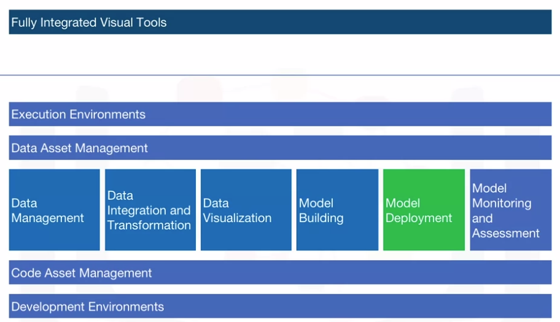
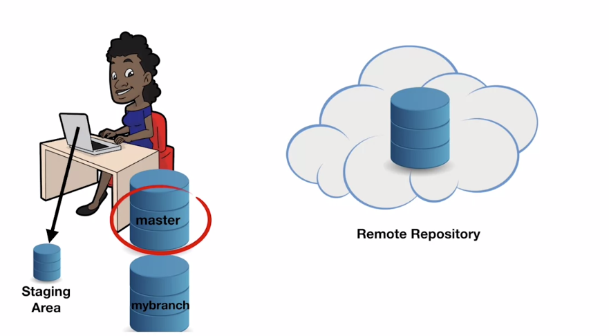
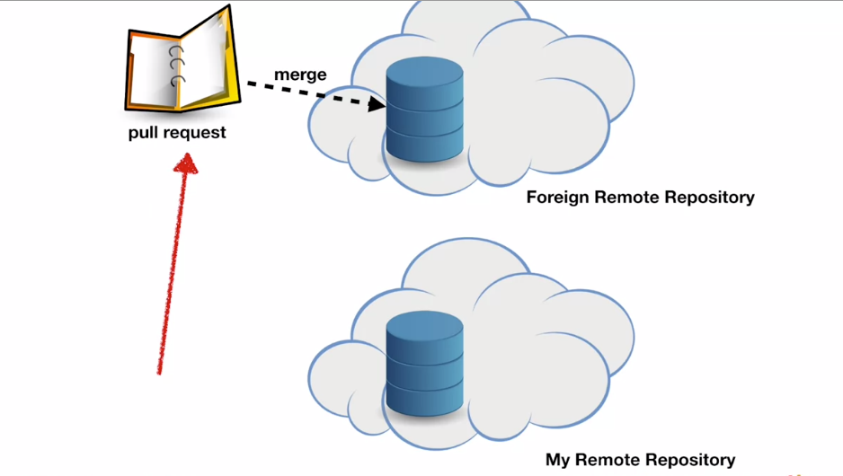
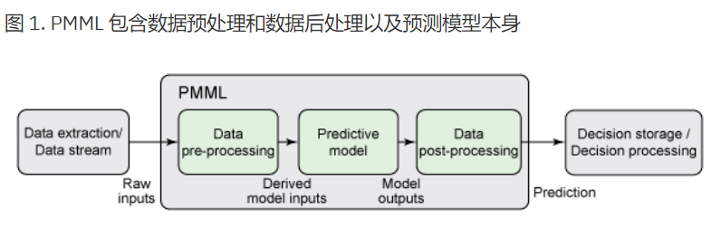
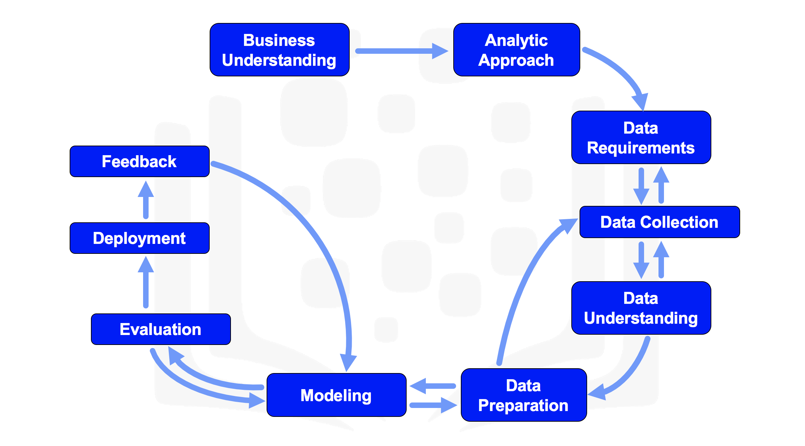
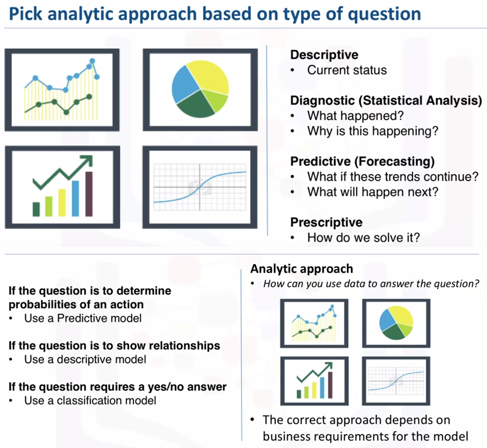
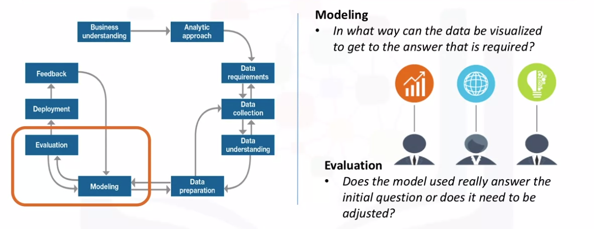
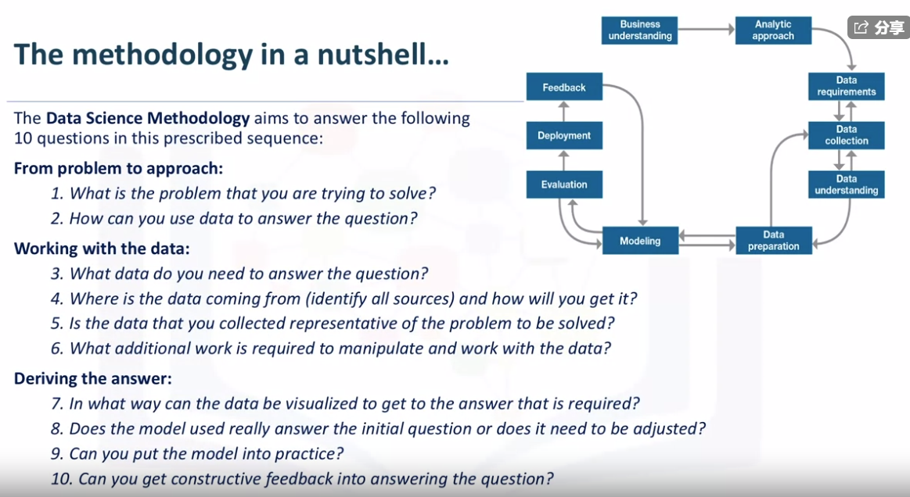
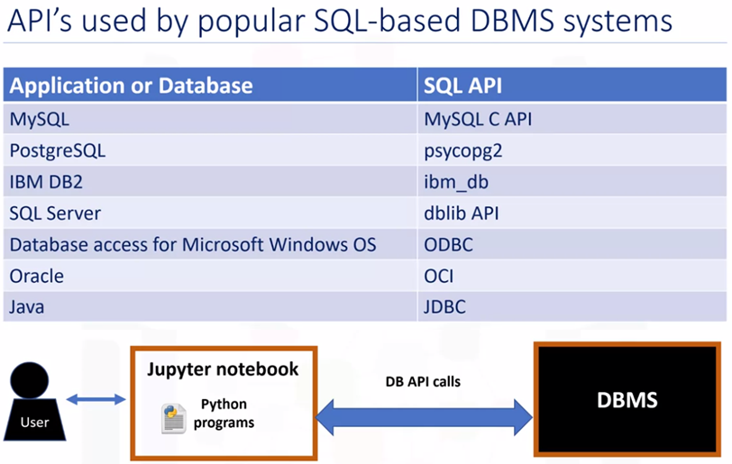

# git & github

1. [how to create repository](https://github.com/IBM/skillsnetwork/blob/master/tools/GITHUB - Part 1.pdf])
2. [how to create branch](https://github.com/IBM/skillsnetwork/blob/master/tools/GITHUB - Part 2.pdf)
   
3. [How to fork a repository and pull request](https://github.com/IBM/skillsnetwork/blob/master/tools/GITHUB - Part 3.pdf)
   

# 模型部署

> 将训练完成并验证有效的模型部署到执行环境/应用程序中。

* PMML：predictive model markup language，PMML 允许在不同的应用程序之间轻松共享预测分析模型。因此，您可以在一个系统中定型一个模型，在 PMML 中对其进行表达，然后将其移动到另一个系统中，并在该系统中使用上述模型预测机器失效的可能性等。
  
  * PMML 支持从应用程序 A 到 B 再到 C 轻松共享预测解决方案，并在建模阶段结束后立即将模型应用于实践中。例如，您可能在 IBM SPSS Statistics 中建立了一个模型，然后在ADAPA（Zementis 预测决策平台）中进行部署，从而立即从云计算中获益。
  * PMML的导出：可以通过多种统计工具轻松导出 PMML。例如，在 IBM SPSS Statisticsis 中，您可以在选择好所有合适模型参数后选择将模型导出为 XML 文件（PMML 是基于 XML 的），从而导出 PMML 模型。
* PFA：Portable format for analytics。作为一个新兴的通用标准，相比PMML，它是一个不描述模型和特征而直接给程序评分的json小文件。
* ONNX：open neural network exchange。一个专门针对神经网络模型（当然也支持传统模型）的公开标准。

# 数据科学方法论



## 1.从问题到方法

### 1.1.业务理解（business understanding）

* 数据科学方法论始于一个清楚定义的问题或目的，以及按照优先级确定相应的指标（goal and objectives），因为它决定了解决问题的分析方法以及数据的收集。
* 目的取决于询问对象，比如企业负责人问你：“如何减少某项活动的开支？”，那么要确定是他想要提高活动的效能还是增加企业的盈利能力。目的一旦明确，那么就要和所有的利益相关者按优先级确定相应的各项指标。
  

### 1.2.分析方法（analytic approach）

* 分析方法的选择取决于定义的目的和目标，包括对现状的描述性分析（descriptive）和诊断性分析（diagnostic）、对未来的预测性分析（predictive）、说明性分析（prescriptive）。
  

## 2.从需求到收集（From Requirements to Collection）

### 2.1.数据需求（data requirement）

* 如果把数据分析比喻成一道菜，那么分析方法相当于烹饪方式，而数据就相当于原材料。没有合适的原材料，就无法得到合心意的菜肴。
* 数据收集前需要确定需求列表：数据内容、形式和来源。

### 2.2.数据收集（data collection）

* 在数据收集过程，会发现有些需求无法满足，有些数据无法收集。这时需要不断的调整需求，对于无法收集的数据，延迟收集决策，直至判断数据是否必须。

## 3.从理解到准备（From Understanding to Preparation）

### 3.1.数据理解（data understanding）

* 数据理解主要处理以下问题：“收集的数据是否代表了要解决的问题？”，以及数据的质量如何。
* 数据理解贯穿了数据集构建的整个过程，在构建过程不断调整数据集。

### 3.2.数据准备（data preparation）

* 亦叫做数据清洗，是最耗时费力的环节，有时会占整个数据分析过程的70%以上。
* 特征工程也是数据准备的一个阶段，指使用领域知识创造新的特征，在机器学习中广泛使用。

## 4.从建模到评估（From Modeling to Evaluation）

### 4.1.建模（modeling）

* 建模在于回答两个问题：“建模的目的是什么？”，“这个过程有什么特点？”。



### 4.2.模型评估（model evaluation）

* 在优化和部署模型之前，通对模型性能进行评估是非常重要的。
* 模型评估主要包括两个方面：模型指标评估、统计显著性评估。
  

## 5.从部署到反馈（From Deployment to Feedback）

### 5.1.部署（deployment）

* 为了保险起见，可以先将评估好的模型部署到一个有限的用户组或测试环境，来测试模型结果的鲁棒性。

### 5.2.反馈（feekback）

* 部署后的反馈可以帮助我们改善模型，评估其性能和影响。
  
  

# Python连接数据库

## 1.DB-API简介



* 每个应用或数据库都有自己的接口程序，比如JAVA使用JDBC标准访问数据库，而Python为规范数据库的对接，使用DB-API作为对所有数据库接口程序的对接标准。
* DB-API 为不同的数据库提供了一致的访问接口标准，因此，学会了DB-API的通用函数，我们也就能用类似的方法访问不同的数据库了。
* **不同的数据库需要载入不同的DB-API模块，例如你要访问MySQL数据库，则需要import MySQLdb**。
* DB-API包括两个方面：
  1. 连接对象（connection object）：创建数据库连接和管理事务。
  2. 游标对象（cursor object）：游标允许用户执行数据库命令和得到查询结果。
* connect方法常用参数:
  1. host: 数据库主机名.默认是用本地主机
  2. user: 数据库登陆名.默认是当前用户
  3. passwd: 数据库登陆的秘密.默认为空
  4. db: 要使用的数据库名.没有默认值
  5. port: MySQL服务使用的TCP端口.默认是3306
  6. charset: 数据库编码

```
# 连接对象的方法有：
connect()     # 创建数据库连接
close()         # 关闭数据库连接
commit()      # 提交当前事务
rollback()     # 取消当前事务
cursor()       # 创建并返回一个游标或类游标的对象

# 游标对象的属性和重要方法有：

arraysize        # 用 fechmany()方法一次取出的记录, 默认 1
connectionn  # 创建此游标对象的连接(可选)
description    # 返回游标活动状态
lastrowid       # 返回最后更新行的 id (可选)
rowcount       # 最后一次 execute() 操作返回或影响的行数

execute()       # 执行查询命令
fetch()          # 执行抓取命令
callproc()      # 执行存储命令（若数据库支持的话）
```

|                方法                |                         说明                          |
| :--------------------------------: | :---------------------------------------------------: |
|       callproc(func[,args])        |                   调用一个存储过程                    |
|         execute(op[,args])         |               执行一个数据库查询或命令                |
|        executemany(op,args)        |            类似 execute() 和 map() 的结合             |
|             fetchone()             |                  得到结果集的下一行                   |
| fetchmany([size=cursor.arraysize]) |            得到结果集的下几行 (几 = size)             |
|             fetchall()             |               返回结果集中剩下的所有行                |
|              messages              |         游标执行后数据库返回的信息列表(可选)          |
|             **iter**()             |         创建一个迭代对象 (可选; 参阅 next())          |
|               next()               |      使用迭代对象得到结果集的下一行(可选; 类似 )      |
|             fetchone()             |                    参阅 **iter**()                    |
|             nextset()              |            移到下一个结果集 (如果支持的话)            |
|             rownumber              | 当前结果集中游标的索引 (以行为单位, 从 0 开始) (可选) |
|       setinput- sizes(sizes)       |      设置输入最大值 (必须有, 但具体实现是可选的)      |
|    setoutput- size(size[,col])     |   设置大列的缓冲区大写(必须有, 但具体实现是可选的)    |
|              close()               |                     关闭游标对象                      |

## 2. 简单的DB-API例子

```
# 置入对应的接口库
from dbmodule import connect

# 创建连接对象
Connection = connect('数据库名', '用户名', '密码')

# 创建游标对象
Cursor = connection.cursor()

# 执行查询命令
Cursor.execute('select * from mytable")
Results = Cursor.fetchall()

# 释放资源
Cursor.close()
Connection.close()
```

## 3. 连接到IBM DB2数据库

1. 连接数据库

```
# 导入DB-API
import ibm_db

# 设置数据源的相关信息
dsn_hostname = "dashdb-txn-sbox-yp-dal09-10.services.dal.bluemix.net" # 主机名
dsn_u# 用户名
dsn_pwd = "ddwl1s8w5283w^12" # 密码

dsn_driver = "{IBM DB2 ODBC DRIVER}"
dsn_database = "BLUDB"  #数据库名
dsn_port = "50000"   # 端口号
dsn_protocol = "TCPIP"    #协议

dsn = (
    "DRIVER={0};"
    "DATABASE={1};"
    "HOSTNAME={2};"
    "PORT={3};"
    "PROTOCOL={4};"
    "UID={5};"
    "PWD={6};").format(dsn_driver, dsn_database, dsn_hostname, dsn_port, dsn_protocol, dsn_uid, dsn_pwd)
    
 # 创建连接
 try:
    conn = ibm_db.connect(dsn, "", "")
    print ("Connected to database: ", dsn_database, "as user: ", dsn_uid, "on host: ", dsn_hostname)

except:
    print ("Unable to connect: ", ibm_db.conn_errormsg() )
    
# 检索数据库服务器元数据
server = ibm_db.server_info(conn)
print ("DBMS_NAME: ", server.DBMS_NAME)
print ("DBMS_VER:  ", server.DBMS_VER)
print ("DB_NAME:   ", server.DB_NAME)

# 检索数据库客户端元数据
client = ibm_db.client_info(conn)

print ("DRIVER_NAME:          ", client.DRIVER_NAME) 
print ("DRIVER_VER:           ", client.DRIVER_VER)
print ("DATA_SOURCE_NAME:     ", client.DATA_SOURCE_NAME)
print ("DRIVER_ODBC_VER:      ", client.DRIVER_ODBC_VER)
print ("ODBC_VER:             ", client.ODBC_VER)
print ("ODBC_SQL_CONFORMANCE: ", client.ODBC_SQL_CONFORMANCE)
print ("APPL_CODEPAGE:        ", client.APPL_CODEPAGE)
print ("CONN_CODEPAGE:        ", client.CONN_CODEPAGE)

# 关闭连接
ibm_db.close(conn)
```

2.查询数据

```
electQuery = "select * from INSTRUCTOR"
selectStmt = ibm_db.exec_immediate(conn, selectQuery)
```

1. 使用pandas导入数据

```
#使用ibm_db_dbi进行封装
import pandas
import ibm_db_dbi

pconn = ibm_db_dbi.Connection(conn)

selectQuery = "select * from INSTRUCTOR"
df = pandas.read_sql(selectQuery, pconn)
df.head()
```

4.使用%sql和%%sql魔法函数处理数据

```
# 载入sql魔法函数
%reload_ext sql

# 连接数据库
%sql ibm_db_sa://my-username:my-password@dashdb-txn-sbox-yp-dal09-03.services.dal.bluemix.net:50000/BLUDB

# 查询数据并存为python变量
test_score_distribution = %sql SELECT test_score as "Test Score", count(*) as "Frequency" from INTERNATIONAL_STUDENT_TEST_SCORES GROUP BY test_score;

# 将变量转为数据框
import pandas as pd
dframe = test_score_distribution.DataFrame()
```

* 使用%%sql可以将这个单元格视为sql语句

```
%%sql

CREATE TABLE INTERNATIONAL_STUDENT_TEST_SCORES (
	country VARCHAR(50),
	first_name VARCHAR(50),
	last_name VARCHAR(50),
	test_score INT
```