> 数据可视化遵循三个原则即可：
>
> * LESS IS MORE EFFECTIVE
> * LESS IS MORE ATTRACTIVE
> * LESS IS MORE IMPACTIVE

# 导入库

```
# 导入matplotlib
import matplotlib as mpl # 导入库
import matplotlib.pyplot as plt # 导入脚本层
%matplotlib inline # 画布一旦生成不能被改变
%matplotlib notebook # 可以在现有画布上增加图形或组件

# 导入seaborn
import seaborn as sns
```

## 1.常用函数及组件

### 1)plot function

* plot function能够绘制大部分传统的图形，如histogram、scatter、line、bar等，是一个简便的万能函数，通过kind参数可以指定图形类型。
* 这个函数也被内嵌在pandas中，在pandas中可以直接调用。
  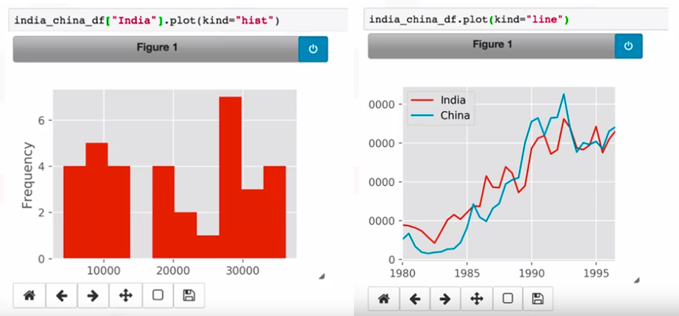

### 2)组件函数

```
# 1.画布函数
plt.figure(figsize=(10,8))

# 2.图例函数
plt.legend()

# 3.注释函数
plt.annotate()

# 4.x轴、y轴和标题
plt.title() / plt.xlabel() / plt.ylabel()
ax.set(xlabel='Year', ylabel='Total Immigration',title = 'Total Immigration to Canada from 1980 - 2013')

# 5.字体大小、图形风格
sns.set(font_scale=1.5,style = 'ticks')

# 6.文字标签
plt.text(a-0.27,b+0.2,'%.2f'%b,ha = 'center',va = 'bottom',fontsize=14)
```

## 2.基本图形

### 1)Area Plot

1. 堆叠面积图：面积图默认堆叠

```
# 利用艺术层Axes
x = df_top5.plot(kind='area', alpha=0.35, figsize=(20, 10))

ax.set_title('Immigration Trend of Top 5 Countries') # set_title
ax.set_ylabel('Number of Immigrants') # set_ylabel
ax.set_xlabel('Years') # set_xlabel

# 利用脚本层plt
df_top5.plot(kind='area', alpha=0.35, figsize=(20, 10)) 
             
plt.title('Immigration Trend of Top 5 Countries')
plt.ylabel('Number of Immigrants')
plt.xlabel('Years')

plt.show()
```

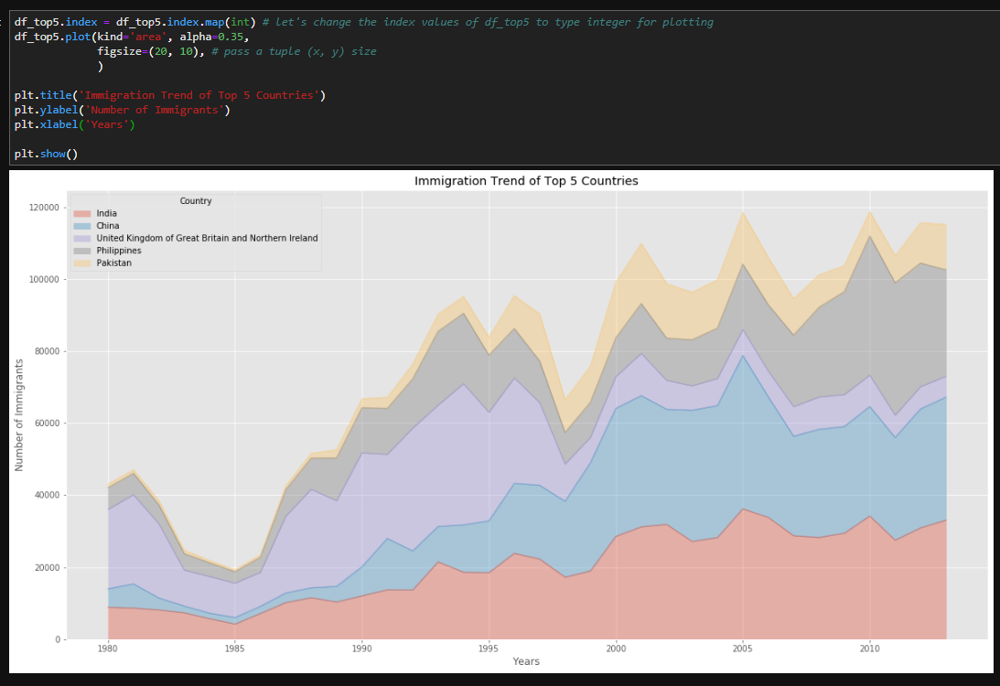

1. 不堆叠面积图：需要设置透明度

```
# 不堆叠面积图
df_top5.plot(kind='area', 
             alpha=0.25, # 透明度设置
             stacked=False, # 不堆叠
             figsize=(20, 10))
```

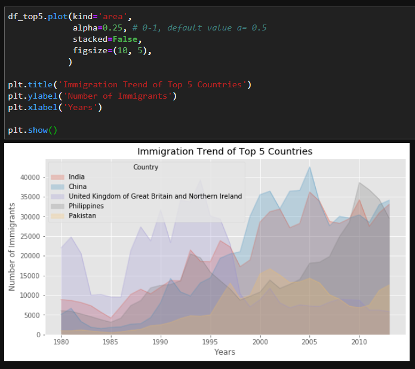

### 2)Histogram

1. 单变量直方图：直方图表示的是该变量的区间分布。

```
# np.histogram将数据默认分成10个桶（即十分位）
# count表示每一桶包含的元素个数
count, bin_edges = np.histogram(df_can['2013'])

# 单变量直方图，也可以写成df_can['2013'].plot.hist()
df_can['2013'].plot(kind='hist', figsize=(8, 5), xticks=bin_edges, color='pink')

plt.title('Histogram of Immigration from 195 countries in 2013') 
plt.ylabel('Number of Countries') 
plt.xlabel('Number of Immigrants')

plt.show()
```

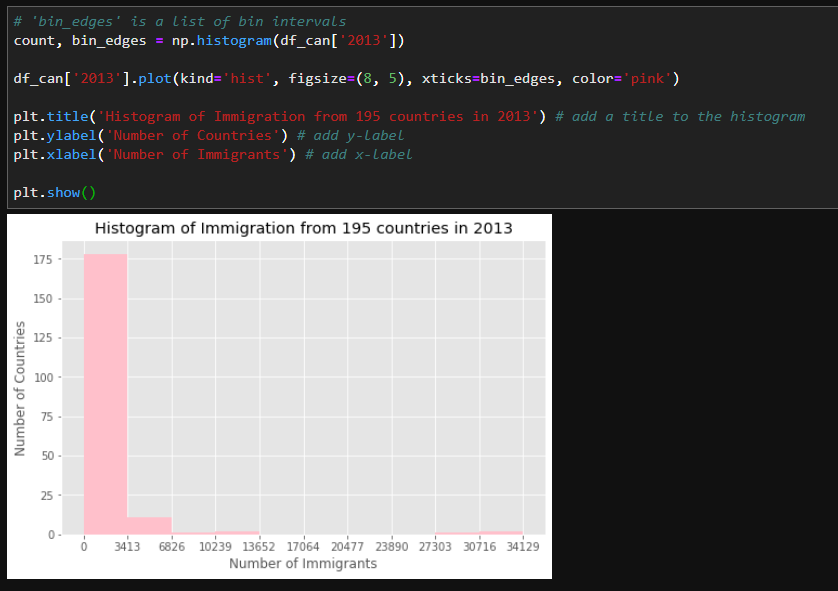

1. 不堆叠直方图：直方图表示的是变量的区间分布，不堆叠直方图的变量在同一区间会相互重合，需要设置一下透明度。

```
# np.histogram将数据分成15个桶（即十五分位）
count, bin_edges = np.histogram(df_t, 15)

# 不堆叠直方图，也可以写成df_t.plot.hist()
df_t.plot(kind ='hist', 
            figsize=(10, 6),
            bins=15, # 设置桶数
            alpha=0.6, # 设置透明度
            xticks=bin_edges, # 设置x轴刻度
            color=['coral', 'darkslateblue', 'mediumseagreen']) 

plt.title('Histogram of Immigration from Denmark, Norway, and Sweden from 1980 - 2013')
plt.ylabel('Number of Years')
plt.xlabel('Number of Immigrants')

plt.show()
```

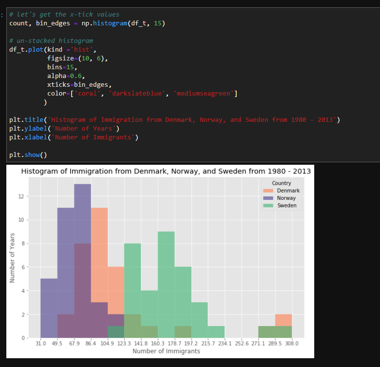

1. 堆叠直方图：直方图向上累加，适合查看总体累加效果，但不容易展示单个变量分布。

```
# np.histogram将数据分成15个桶
count, bin_edges = np.histogram(df_t, 15)
xmin = bin_edges[0] - 10   # 为美观，左边增加10的空白区
xmax = bin_edges[-1] + 10  # 为美观，右边增加10的空白区

# 堆叠直方图
df_t.plot(kind='hist',
            figsize=(10, 6), 
            bins=15,
            xticks=bin_edges,
            color=['coral', 'darkslateblue', 'mediumseagreen'],
            stacked=True,
            xlim=(xmin, xmax)) # 设置x轴的区间

plt.title('Histogram of Immigration from Denmark, Norway, and Sweden from 1980 - 2013')
plt.ylabel('Number of Years')
plt.xlabel('Number of Immigrants') 

plt.show()
```

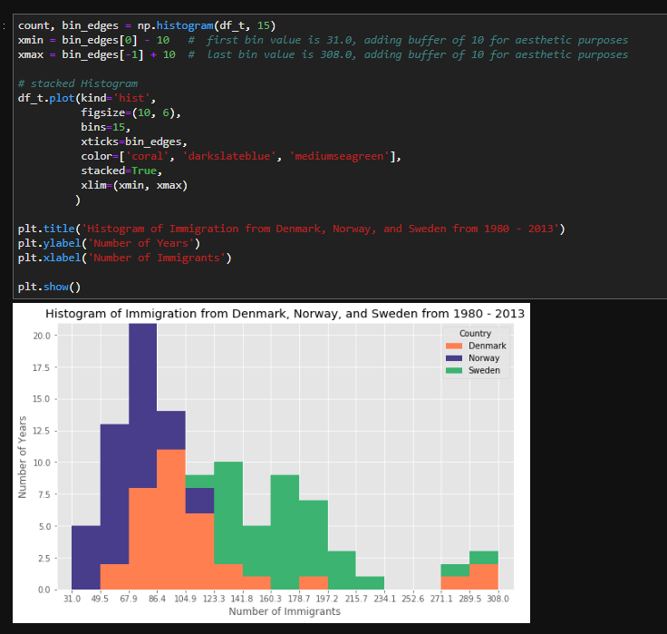

### 3)Box Plot

1. 箱线图相关参数：
   1. kind = 'box'
   2. vert = True, 设置箱线图水平或竖直，默认竖直。

```
# 竖直箱线图
df_japan.plot(kind='box', figsize=(8, 6))

plt.title('Box plot of Japanese Immigrants from 1980 - 2013')
plt.ylabel('Number of Immigrants')

plt.show()

# 水平箱线图
df_CI.plot(kind='box', figsize=(10, 7), color='blue', vert=False)

plt.title('Box plots of Immigrants from China and India (1980 - 2013)')
plt.xlabel('Number of Immigrants')

plt.show()
```

### 4)Bar Chart

1. 竖直条形图：kind = 'bar'，竖直柱状图经常用于分析时间序列数据。缺点是条形底部缺少文字标记的空间。

```
df_iceland.plot(kind='bar', figsize=(10, 6))

plt.xlabel('Year') 
plt.ylabel('Number of immigrants') 
plt.title('Icelandic immigrants to Canada from 1980 to 2013') 

plt.show()
```

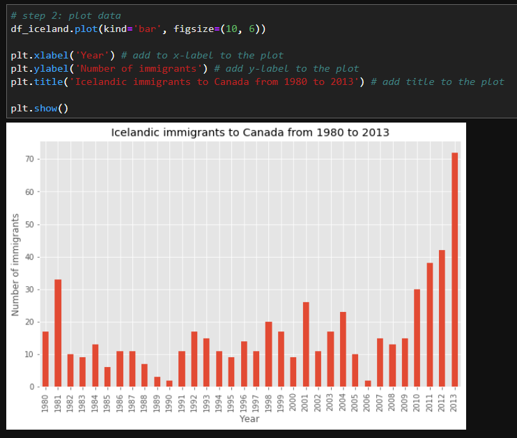

1. 水平条形图：kind = 'barh'，水平条形图可以很好地解决竖直条形图的缺点，x轴有更多空间可以进行文字标记。

```
df_iceland.plot(kind='barh', figsize=(10, 6))

plt.xlabel('Year') 
plt.ylabel('Number of immigrants') 
plt.title('Icelandic immigrants to Canada from 1980 to 2013') 

plt.show()
```

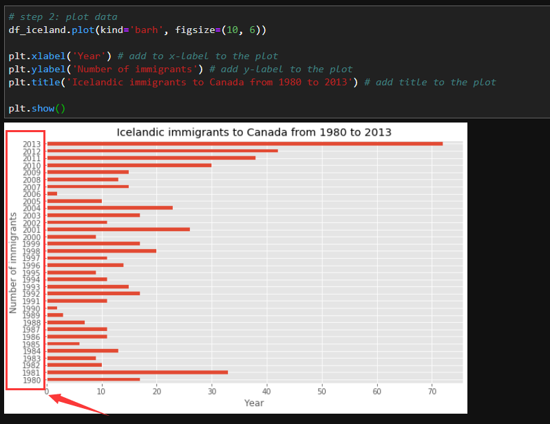

1. 带注释的条形图：利用annotate函数为条形图增加注释

```
df_iceland.plot(kind='bar', figsize=(10, 6), rot=90) 

plt.xlabel('Year')
plt.ylabel('Number of Immigrants')
plt.title('Icelandic Immigrants to Canada from 1980 to 2013')

# 箭头注释
plt.annotate(s='', # 无文字
             xy=(32, 70), # 箭头终点坐标
             xytext=(28, 20), # 箭头起点坐标
             xycoords='data', # 注释使用的坐标系统         arrowprops=dict(arrowstyle='->', connectionstyle='arc3', color='blue', lw=2) # 设置箭头属性
            )

# 文字注释
plt.annotate(s='2008 - 2011 Financial Crisis', # 文字注释
             xy=(28, 30), # 文字开始坐标
             rotation=72.5, # 文字旋转角度
             va='bottom', # 坐标垂直底部
             ha='left',  # 坐标对齐左边
            )

plt.show()
```

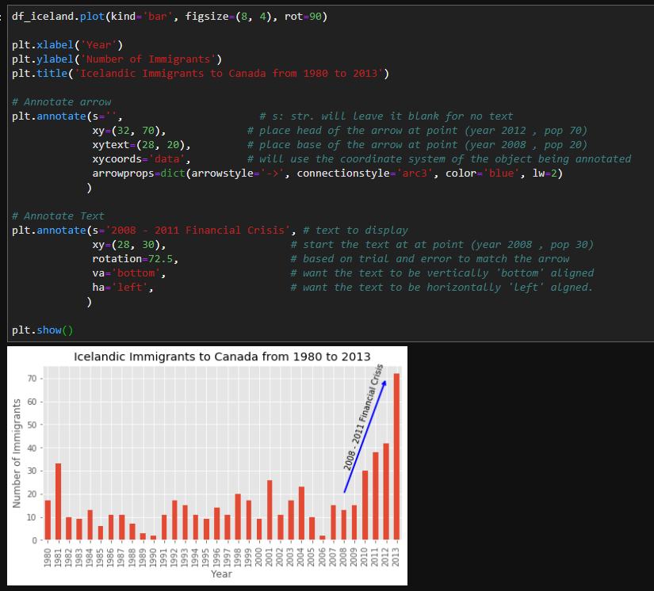

1. 带标签的条形图

```
# 画出柱状图
fig = df.plot(kind = 'bar',
            width = 0.8,
            color = ['#5cb85c','#5bc0de','#d9534f'],
            fontsize = 14,
            figsize =(20,8))

# 增加标题和图例
plt.title('Percentage of Respondents\' Interest in Data Science Areas',fontsize = 16, y = 1.12)
plt.legend(fontsize = 14,loc='best')

# 去掉边缘
plt.yticks([])
fig.spines['top'].set_visible(False)
fig.spines['right'].set_visible(False)
fig.spines['left'].set_visible(False)

# 添加文字
x=np.arange(len(df.index))
yv=np.array(list(df['Very interested']))
ys=np.array(list(df['Somewhat interested']))
yn=np.array(list(df['Not interested']))

for a,b in zip(x,yv): ##控制标签位置
    plt.text(a-0.27,b+0.2,'%.2f'%b,ha = 'center',va = 'bottom',fontsize=14)
for a,b in zip(x,ys):
    plt.text(a,b+0.2,'%.2f'%b,ha = 'center',va = 'bottom',fontsize=14)
for a,b in zip(x,yn):
    plt.text(a+0.27,b+0.2,'%.2f'%b,ha = 'center',va = 'bottom',fontsize=14)

plt.show()
```

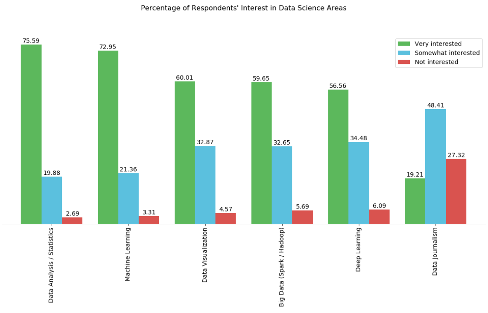

### 5)Scatter Plot

1. 散点图相关参数：
   1. kind = 'scatter'
   2. x = 'year', y = 'total'，输入x和y参数

```
df_tot.plot(kind='scatter', x='year', y='total', figsize=(10, 6), color='darkblue')

plt.title('Total Immigration to Canada from 1980 - 2013')
plt.xlabel('Year')
plt.ylabel('Number of Immigrants')

plt.show()
```

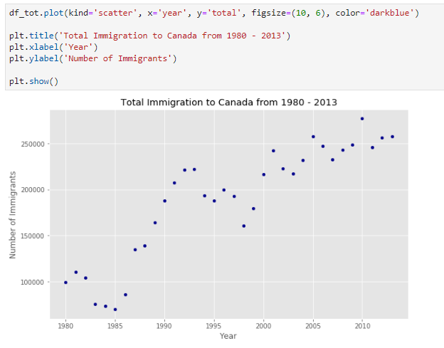

1. 带回归线的散点图：
   1. np.polyfit(x, y, deg=1)，求出x和y的拟合参数*a*和*a*。

```
df_tot.plot(kind='scatter', x='year', y='total', figsize=(10, 6), color='darkblue')

plt.title('Total Immigration to Canada from 1980 - 2013')
plt.xlabel('Year')
plt.ylabel('Number of Immigrants')

# 绘制回归线
x = df_tot['year'] 
y = df_tot['total'] 
fit = np.polyfit(x, y, deg=1)

plt.plot(x, fit[0] * x + fit[1], color='red') 
plt.annotate('y={0:.0f} x + {1:.0f}'.format(fit[0], fit[1]), xy=(2000, 150000)) # 字符串格式化

plt.show()
```

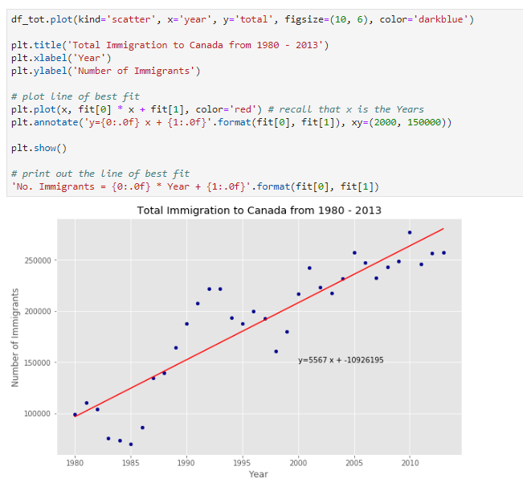

### 6)Regression Plot

1. 比起之前用np.polyfit()先计算回归参数再绘制回归线，我们可以直接运用seaborn的regplot函数简单地绘制出回归图。相关参数有：
   1. x、y：x轴和y轴的变量
   2. data：所使用的的数据集
   3. color：颜色，seaborn的色彩搭配很不错，可以不设置
   4. marker：散点类型，例如'o','+'。
   5. 

```
import seaborn as sns
# 创建画布
plt.figure(figsize=(8, 6))

# 设置字体大小和图形风格
sns.set(font_scale=1.5,style = 'ticks')

# 绘制回归图
ax = sns.regplot(x='year', 
                      y='total', 
                      data=df_tot, 
                      color='green', 
                      marker='+', 
                      scatter_kws={'s': 200})

# 设置x轴、y轴和标题
ax.set(xlabel='Year', ylabel='Total Immigration',title = 'Total Immigration to Canada from 1980 - 2013')

plt.show()
```

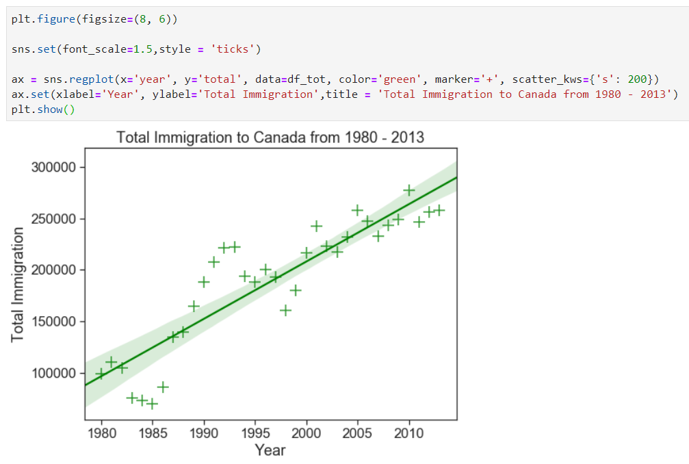

## 3.专业图形

### 1)Pie Chart

1. 饼图相关参数：
   1. kind = 'pie'
   2. autopct = '%1.1f%%', 扇形区域百分比显示格式
   3. pctdistance=1.12，autopct离圆心的距离比例
   4. startangle = 90, 围绕x轴旋转的角度
   5. shadow = True, 扇形是否有阴影（3D效果）
   6. explode = [0.1, 0, 0, 0, 0.1, 0.1]，通过设置扇形的加大倍数强调某个扇形。
   7. labels = None，扇形外标签显示设置
   8. plt.axis('equal'), 设置扇形坐标相同，保证扇形组成一个圆
2. 饼图绘制代码

```
colors_list = ['gold', 'yellowgreen', 'lightcoral', 'lightskyblue', 'lightgreen', 'pink']
explode_list = [0.1, 0, 0, 0, 0.1, 0.1] 

df_continents['Total'].plot(kind='pie',
                                  figsize=(15, 6),
                                  autopct='%1.1f%%', 
                                  pctdistance=1.12, 
                                  startangle=90,    
                                  shadow=True,       
                                  labels=None, # 标签设置为无
                                  colors=colors_list,  
                                  explode=explode_list)

plt.title('Immigration to Canada by Continent [1980 - 2013]', y=1.12) 
plt.axis('equal') # 设置坐标轴一致
plt.legend(labels=df_continents.index, loc='upper left') # 添加图例

plt.show()
```

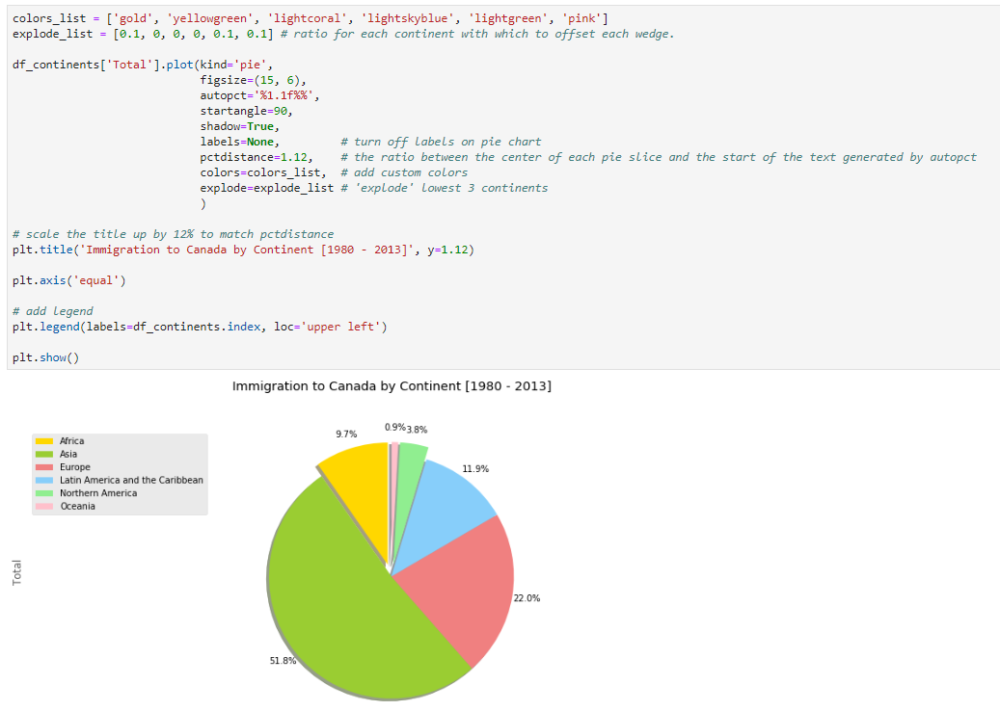

### 2)Bubble Plot

1. 气泡图是散点图的变体，显示三维数据(x, y, z)，气泡的大小由第三个变量z决定，也称为权重。
2. 气泡图相关参数：
   1. s：即z，表示气泡的大小
   2. alpha：透明度，气泡图不透明会很丑hhh

```
# 变量1的图形绘制
ax0 = df_can_t.plot(kind='scatter',
                          x='Year',
                          y='Brazil',
                          figsize=(14, 8),
                          alpha=0.5, 
                          color='green',
                          s=norm_brazil * 2000 + 10,  # 权重设置
                          xlim=(1975, 2015) # x轴范围)

# 变量2的图形绘制
ax1 = df_can_t.plot(kind='scatter',
                          x='Year',
                          y='Argentina',
                          alpha=0.5,
                          color="blue",
                          s=norm_argentina * 2000 + 10,
                          ax = ax0 # 绘制到同一图形里)

ax0.set_ylabel('Number of Immigrants')
ax0.set_title('Immigration from Brazil and Argentina from 1980 - 2013')
ax0.legend(['Brazil', 'Argentina'], loc='upper left', fontsize='x-large')
```

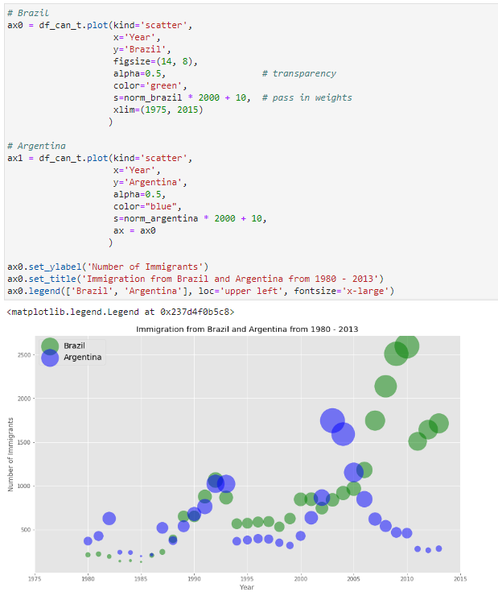

### 3)Subplots

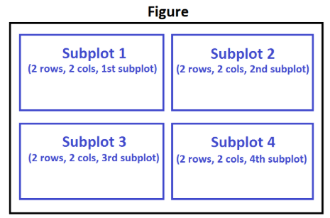

1. 多子图运用的艺术层（artist layer）相关参数：
   1. fig = plt.figure()，创建画布，以便建立子图
   2. ax = fig.add_subplot(nrows, ncols, plot_number)，创建子图，设置子图位置
   3. df.plot(ax = ax0)，绘制图形到指定的子图中
2. 子图绘制代码：

```
fig = plt.figure() # 创建画布

ax0 = fig.add_subplot(1, 2, 1) # 创建子图0
ax1 = fig.add_subplot(1, 2, 2) # 创建子图1

# 子图0：箱线图
df_CI.plot(kind='box', color='blue', vert=False, figsize=(20, 6), ax=ax0) # 添加ax参数
ax0.set_title('Box Plots of Immigrants from China and India (1980 - 2013)')
ax0.set_xlabel('Number of Immigrants')
ax0.set_ylabel('Countries')

# 子图1：折线图
df_CI.plot(kind='line', figsize=(20, 6), ax=ax1) 
ax1.set_title ('Line Plots of Immigrants from China and India (1980 - 2013)')
ax1.set_ylabel('Number of Immigrants')
ax1.set_xlabel('Years')

plt.show()
```

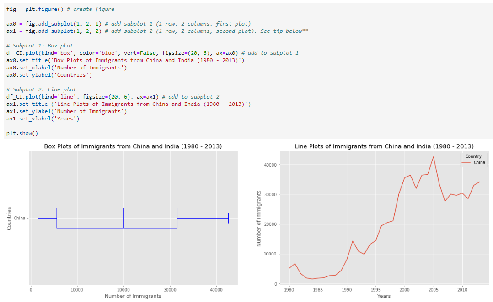

### 4)Waffle Chart

1. 华夫饼图是一个非常有趣的可视化图表，通常用于展示目标进程或各类别占比。不过目前Python没有现成的华夫饼图包，需要我们从头开始定义。
   1. categories：类别
   2. values：每个类别对应的值
   3. height：华夫饼图高度
   4. width：华夫饼图宽度
   5. colormap：颜色范围，例如plt.cm.coolwarm
   6. value_sign：默认为空字符串

```
# 定义华夫饼函数
def create_waffle_chart(categories, values, height, width, colormap, value_sign=''):

    # 计算全部值的和，以及各类别占比
    total_values = sum(values)
    category_proportions = [(float(value) / total_values) for value in values]

    # 计算全部华夫饼面积
    total_num_tiles = width * height 
    print ('Total number of tiles is', total_num_tiles)
    
    # 计算每个类别的华夫饼面积
    tiles_per_category = [round(proportion * total_num_tiles) for proportion in category_proportions]

    # 打印每个类别的华夫饼面积
    for i, tiles in enumerate(tiles_per_category):
        print (df_dsn.index.values[i] + ': ' + str(tiles))
    
    # 初始化华夫饼图
    waffle_chart = np.zeros((height, width))
    category_index = 0
    tile_index = 0

    # 用数字填充华夫饼图（0,1,...）
    for col in range(width):
        for row in range(height):
            tile_index += 1
            # 一个类别填充完毕，则填充下一个
            if tile_index > sum(tiles_per_category[0:category_index]):
                category_index += 1 
                waffle_chart[row, col] = category_index
    
    # 新建画布
    fig = plt.figure()

    # 使用matshow函数展示华夫饼图
    colormap = plt.cm.coolwarm
    plt.matshow(waffle_chart, cmap=colormap)
    plt.colorbar()

    # 切割华夫饼
    ax = plt.gca() 

    # 设置x轴和y轴刻度
    ax.set_xticks(np.arange(-.5, (width), 1), minor=True)
    ax.set_yticks(np.arange(-.5, (height), 1), minor=True)
    
    # 添加网格线
    ax.grid(which='minor', color='w', linestyle='-', linewidth=2)

    plt.xticks([])
    plt.yticks([])

    # 计算单个类别的累计和，以匹配图表和图例之间的配色方案
    values_cumsum = np.cumsum(values)
    total_values = values_cumsum[len(values_cumsum) - 1]

    # 创建图例
    legend_handles = []
    for i, category in enumerate(categories):
        if value_sign == '%':
            label_str = category + ' (' + str(values[i]) + value_sign + ')'
        else:
            label_str = category + ' (' + value_sign + str(values[i]) + ')'
            
        color_val = colormap(float(values_cumsum[i])/total_values)
        legend_handles.append(mpatches.Patch(color=color_val, label=label_str))

    # 将图例添加到图中
    plt.legend(handles=legend_handles,
                  loc='lower center', 
                  ncol=len(categories),
                  bbox_to_anchor=(0., -0.2, 0.95, .1))
```

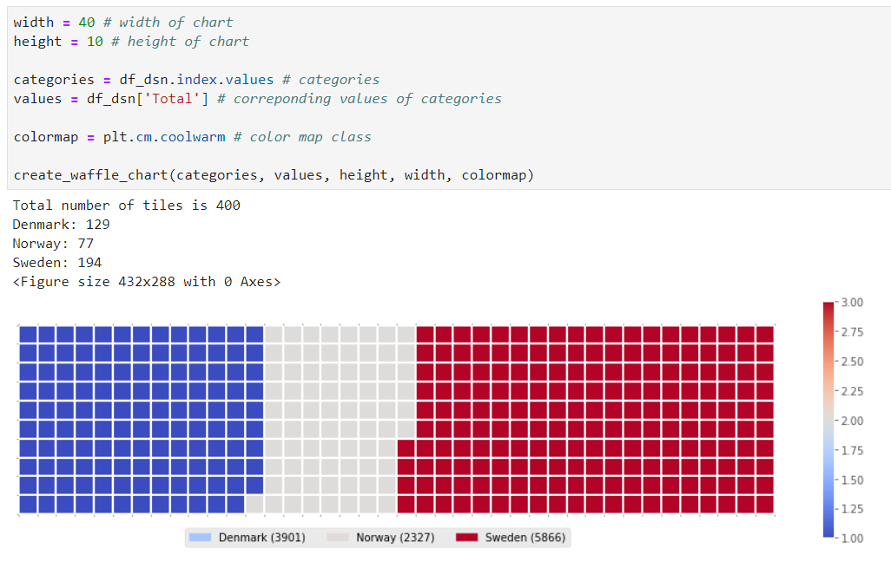
\2. 有一个正在构建的库叫pywaffle，也可以调用使用，github地址为：[pywaffle](https://github.com/gyli/PyWaffle)

```
from pywaffle import Waffle

data = {'Democratic': 48, 'Republican': 46, 'Libertarian': 3}
fig = plt.figure(
    FigureClass=Waffle, 
    rows=5, 
    values=data, 
    legend={'loc': 'upper left', 'bbox_to_anchor': (1.1, 1)})
plt.show()
```

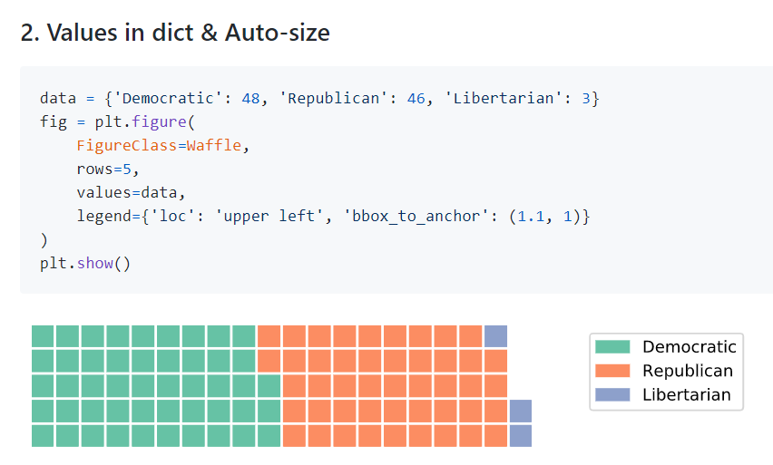

### 5)Word Cloud

1. 词云是分析文本数据常用的可视化展示，首先需要安装相关的包：
   * from wordcloud import WordCloud, STOPWORDS

```
# 剔除停止词
stopwords = set(STOPWORDS)
stopwords.add('said') # 手动增加部分停止词

# 出现频率前2000的单词云函数构建
alice_wc = WordCloud(background_color='white',
                              max_words=2000,
                              stopwords=stopwords)

# 生成单词云
alice_wc.generate(alice_novel) 

# 创建画布
fig = plt.figure(figsize = (14,18))

# 展示图形
plt.imshow(alice_wc, interpolation='bilinear')
plt.axis('off') # 不展示轴
plt.show()
```

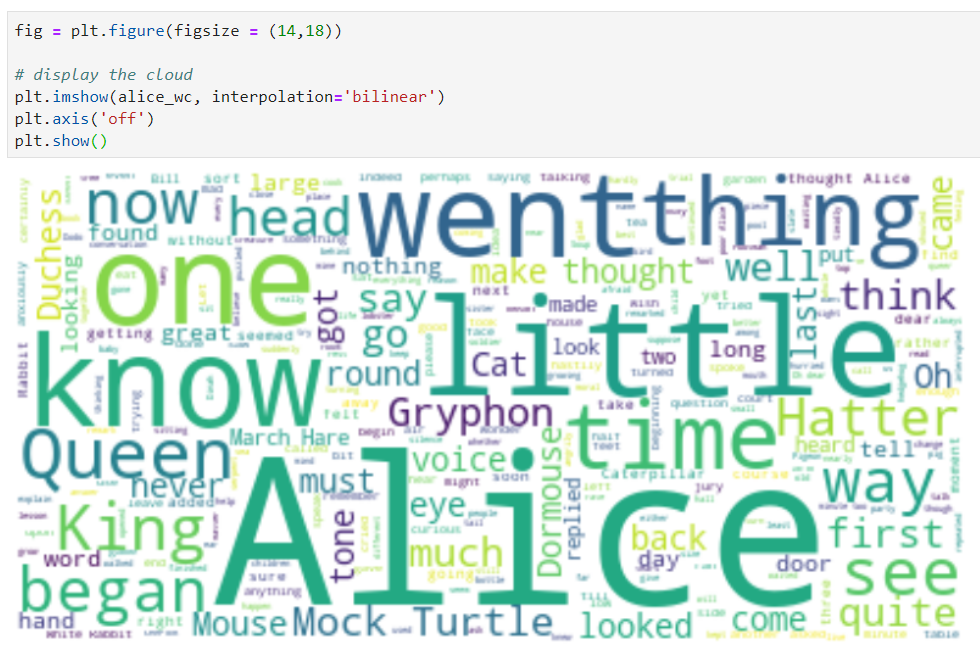

## 4.地图图形

> 画地图可以使用folium画图包，通过folium.Map()进行画图。
>
> * import folium

### 1)展示地图

1. location：输入经度和纬度
2. zoom_start：设置缩放级别，缩放级别越高，地图越被放大到中心。
3. tiles：设置地图类型：
   1. tiles='Stamen Toner'：黑白地图
   2. tiles='Stamen Terrain'：道路地形图
   3. tiles='Mapbox Bright'：国家名称全写

```
world_map = folium.Map(location=[56.130, -106.35], zoom_start=4, tiles='Stamen Toner')

world_map
```

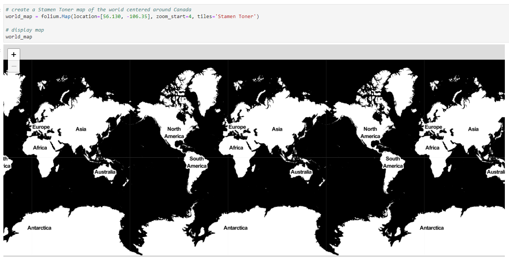

### 2)带标记的地图

1. folium.map.FeatureGroup()：创建标记
2. incidents.add_child()：增加标记

```
# 创建地图
sanfran_map = folium.Map(location=[latitude, longitude], zoom_start=12)

# 创建标记对象
incidents = folium.map.FeatureGroup()

# 添加标记
for lat, lng, in zip(df_incidents.Y, df_incidents.X):
    incidents.add_child(folium.features.CircleMarker([lat, lng],
                                                                  radius=5, # 标记大小
                                                                  color='yellow',
                                                                  fill=True,
                                                                  fill_color='blue',
                                                                  fill_opacity=0.6))

# 增加标记的弹出文本
latitudes = list(df_incidents.Y)
longitudes = list(df_incidents.X)
labels = list(df_incidents.Category)

for lat, lng, label in zip(latitudes, longitudes, labels):
    folium.Marker([lat, lng], popup=label).add_to(sanfran_map)    
    
# 将标记添加到地图中
sanfran_map.add_child(incidents)
```

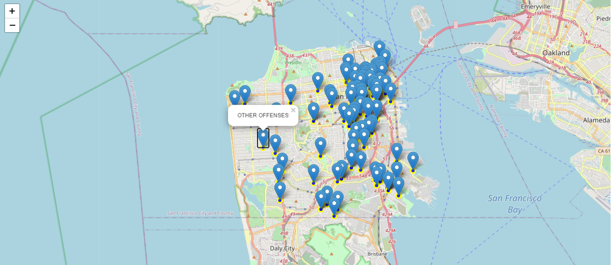