> 视频地址：https://next.xuetangx.com/course/THU08091000980/1510699

# 1. 数据科学初窥

## 1.1.相关定义

1.**数据定义**：对客观事物的一种抽象表示，从中提取到用于判断和决策的信息。
2.**数据类型**：连续型、离散型、符号型、文本型，符号型和文本型必须数值化才能被计算机识别处理。
3.**数据科学定义**：不是一门独立的学科，和统计学、信号采集与处理、数据库系统、高性能计算、计算机网络以及社会科学等众多领域有千丝万缕的联系。
4.**数据科学构成**：算法是核心，但也必须关注数据从何而来、如何做数据预处理、数据背后的物理含义、如何解释数据分析的结果、在实际应用中可能产生的社会问题等。
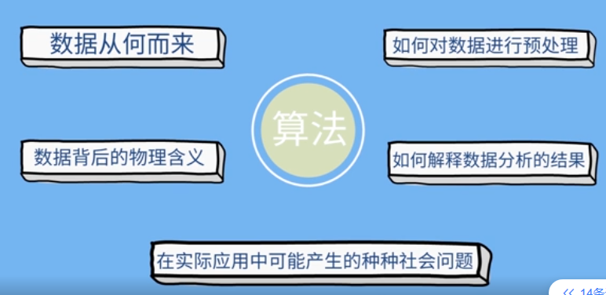
5.**大数据分析 VS 传统数据分析**：

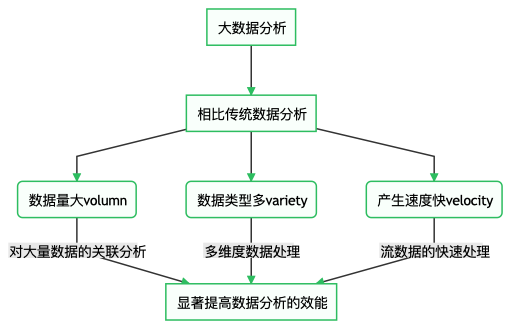

## 1.2.大数据思维

1.数据就是高价值的生产资料，能直接带来收益。
2.从采样分类到全样本个性化分析（eg：用户个性化推荐）
3.从模型驱动到数据驱动（eg：深度学习图像识别）

## 1.3.数据科学应用

* 聚类：无监督学习
* 分类：带标签的监督学习
* 关联分析：分析特征的关联性，如哪些商品经常被同时购买。
* 推荐系统：精准广告投放系统等。
  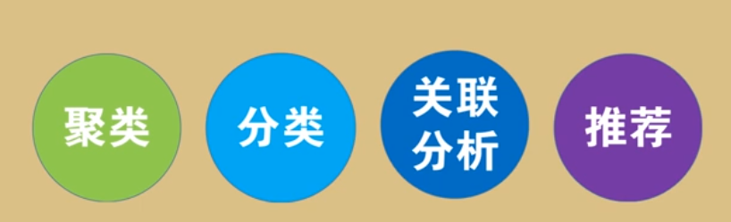

# 2.数据采集

> 硬件实现是数据采集的关键技术，随着硬件的发展，能进一步促进大数据的发展。

## 2.1.数据采集来源

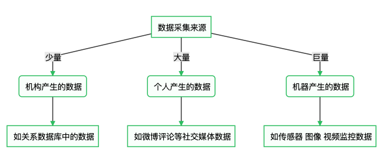

## 2.2.数据采集步骤

* 一个典型的用于数据采集的硬件产品通常包括以下重要模块：**传感器、信号处理、无线通信、电源管理**。

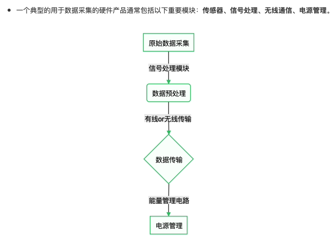

### 1）信号处理（数据预处理）

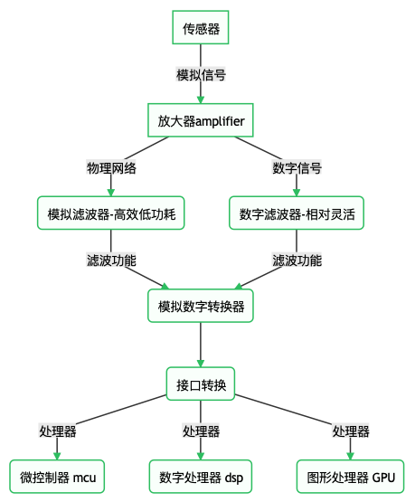

* 处理器的电路实现方式：FPGA（可擦写）和ASIC（不可更改）

### 2）数据传输

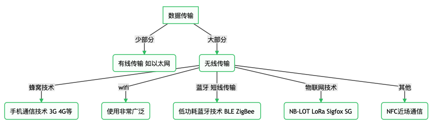

### 3）能量管理

* 实际应用中，需要考虑各种能量管理技术，以降低数据采集的能耗。

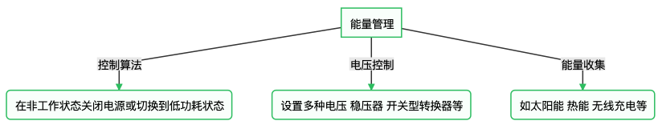

# 3.数据可视化（按图索骥）

> 数据可视化是利用图表、图像或动画的形式进行**有效信息传递**的技术，最终目的是帮助人们更好理解数据中蕴含的信息，也就是看图说话、按图索骥。

* 数据可视化是一个交叉学科，涵盖计算机科学、认知心理学、美学、艺术设计等学科，涉及数据处理、算法设计、软件开发、人机交互等知识。

1.flow map & hierarchical clustering（流向图&分级群聚）
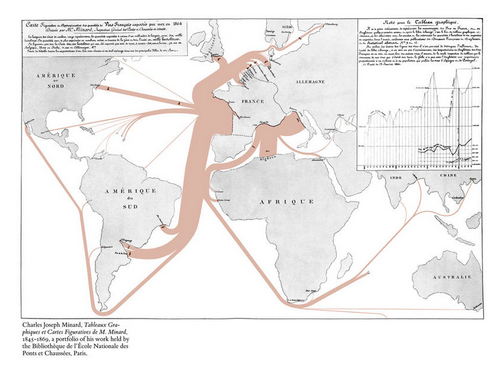

2.heat map（热力图）
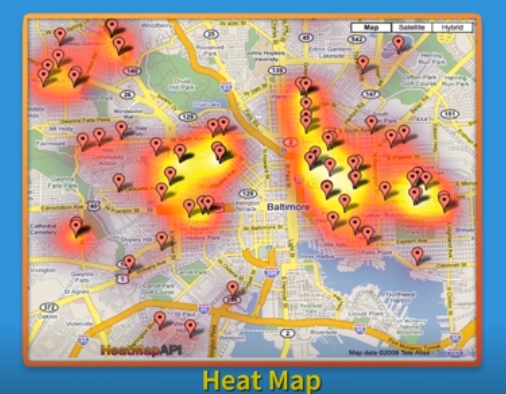

3.mosaic plot（马赛克图）
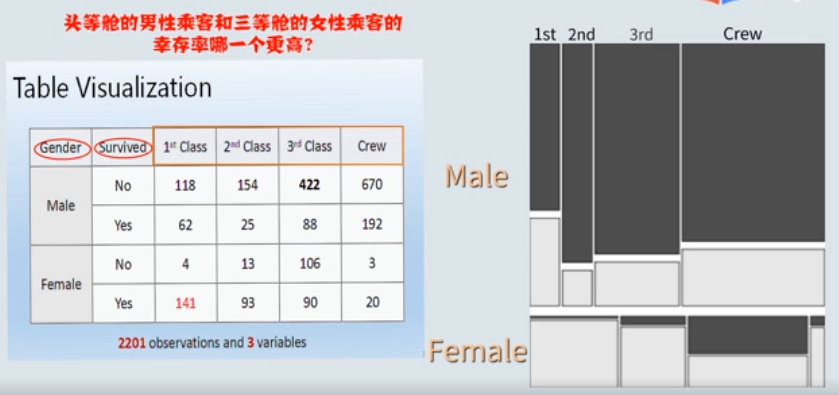

* 用于高维数据可视化的图表有雷达图、平行坐标图、带特征的散点图等。

# 4.高性能计算（大数据所驱）

> 算法构建最先考虑的是逻辑的准确性，以输出正确结果为核心标准。随着大数据时代的到来，算法的计算效率也越来越被重视。

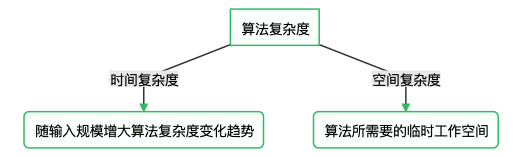

* 相较于串行处理数据，并行处理能有效提高计算机的计算效率。

## 4.1.并行处理（Parallel）

* 相关名词：cuda并行开发环境、GPU众核处理器、通信开销。

### 1）并行速度

* 并行程序需考虑通信开销，通信开销会制约算法的计算速度。
* 将原始问题拆分的粒度越细，越有助于提升并行潜力和加速比，但是线程或进程之间通信开销随之增大，所以需要找到一个合适的平衡点。

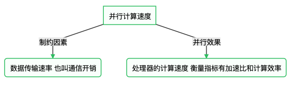

### 2）并行设计

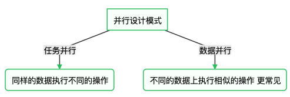

### 3）并行计算

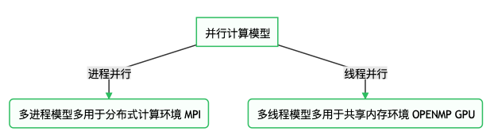

### 4）CPU和GPU

* CPU：CPU负责整个程序的调度、输入输出和串行部分的执行。
* GPU：并行函数的执行