[toc]

# Conda Installtion & Programming basis 

1. Anaconda是一个可以在单机上创建和管理很多虚拟环境(virtual environment)的工具，其集合了很多数据科学和机器学习的安装包如pandas、numpy、sklearn等，可以简单通过conda install package-name进行安装。

   ```python
   # 安装包
   conda install pandas
   
   # 创建环境
   conda create --name ev1
   
   # 激活环境
   conda activate ev1
   
   # 退出环境
   conda deactivate
   
   # 删除环境
   conda env remove -n ev1
   ```

   1. 为环境下载特定的包：可以在anaconda navigator里操作，也可以用命令行激活环境进行conda install/pip install

   2. 为pycharm配置conda环境：快捷键【command + ，】打开preferrences为指定project添加python interpreter。

      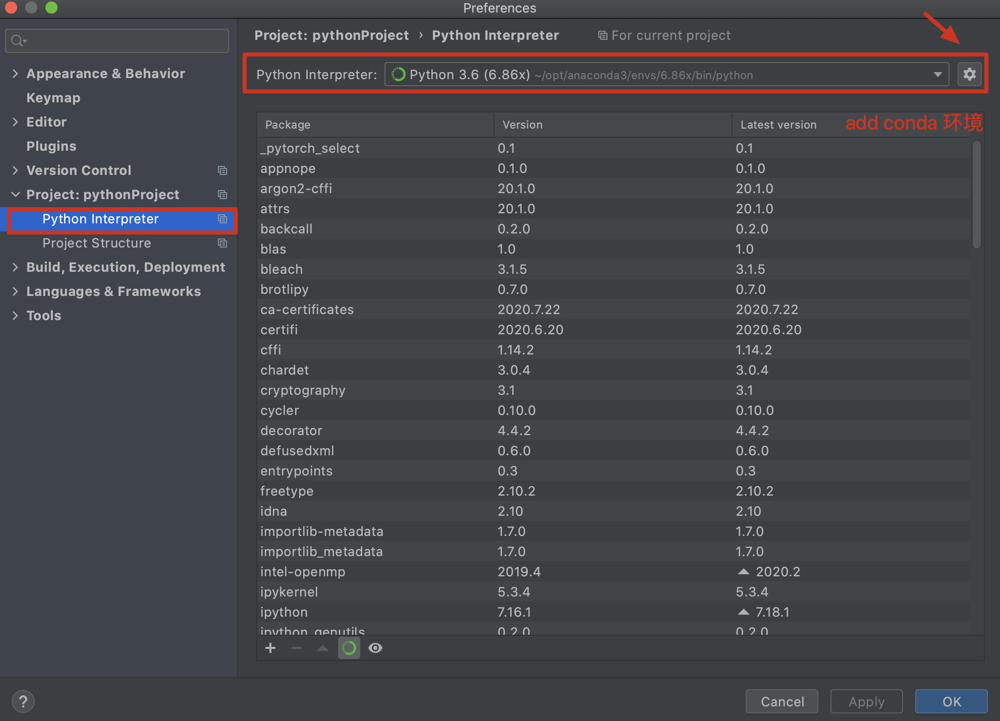

2. numpy的简单介绍：

   ```python
   # 创建随机数组
   np.random.random((2,4))
   np.zeros((2,4))
   np.ones((2,4))
   
   # 创建等差一维数组
   np.linspace(1,10,11)
   np.arange(1,10,0.5)
   
   # 矩阵变换与运算
   x.T # 转置矩阵
   np.linalg.inv(x) # 逆矩阵
   np.matmul(x,y) / x@y # 矩阵乘法
   x*y # 矩阵元素乘法
   np.exp(x) # e指数乘法
   np.sin(x)/np.cos(x)/np.tanh(x) # 弦函数
   
   # 向量最大值/最小值、模计算
   x.max()
   x.min()
   np.linalg.norm(x)
   
   # 向量化函数
   def function(x, y):
       if x <= y:
           f = x*y
       else:
           f = x/y
       return f
   f = np.vectorize(function，otypes = [float])
   f(x,y) # x和y为向量
   ```

3. Python Debug：

   1. PDB安装包：利用pdb使用命令行进行操作 https://realpython.com/python-debugging-pdb/

   ```python
   # 创建特定的断点处
   import pdb; pdb.set_trace() # 传统写法
   breakpoint() # 推荐写法
   python3 -m pdb my_program_name.py arg1 arg2 # 命令行写法
   
   # p命令/pp命令打印变量
   p variables
   
   # q命令退出debug
   ## ll命令列出代码/函数来源
   
   # step相关的命令
   n  # 即step over
   s  # 即step into
   c  # 继续执行直到下一个断点
   
   # 设置断点条件
   b(reak) [ ([filename:]lineno | function) [, condition] ]
   
   # a命令打印当前的参数列表
   ```

   2. 利用pycharm进行debug：
      1. step over：执行下一步
      2. step into：进入定义的外部函数文件中执行每一步
      3. step into mycode：进入本脚本定义的函数代码执行每一步
      4. step out：跳出函数

   

3. python的可变参数设置：

   1. 当定义函数时，Python的默认参数将被评估一次，而不是在每次调用函数时被评估。这意味着，如果使用的可变默认参数发生了突变，那么调用的是突变的对象。因此，为了保证每次调用函数的参数，可以将其设置为none。
   2. lambda函数建立了x的函数，但是是在调用时才抓取相应的参数值。比如：for i in range(3):metrics.append(lambda x: x + i)，最终调用函数for metric in metrics: matric(2)只会抓取到i=2，输出结果4。因此，为解决这个问题，可以直接将i绑定到函数里。
   3. 参考资料：https://docs.python-guide.org/writing/gotchas/

   ```python
   def get_sum_metrics(predictions, metrics=None): # 输入参数
      if metrics is None:
          metrics = []
       for i in range(3):
           metrics.append(lambda x, y=i: x + y) # 传入x和i作为lambda函数变量，保证获取相应的i
   
       sum_metrics = 0
       for metric in metrics:
           sum_metrics += metric(predictions)
   
       return sum_metrics
   ```

# Unit 1: Linear Classifiers and Generalizations

## 1. Introduction to Machine Learning

1. 机器学习的定义：ML as a displine aims to design, understand and apply computer programs that ==learn from experience(i.e., data)== for the purpose of ==modeling, prediction, or control==.

2. 我们可以利用预测做很多事。例如：预测未来的结果(天气预报、市场走向等)、预测我们可能不知道的属性(图像识别、语言识别翻译)。

3. 机器学习的种类有很多：监督学习、无监督学习、半监督学习、主动学习、转换学习、强化学习等。

   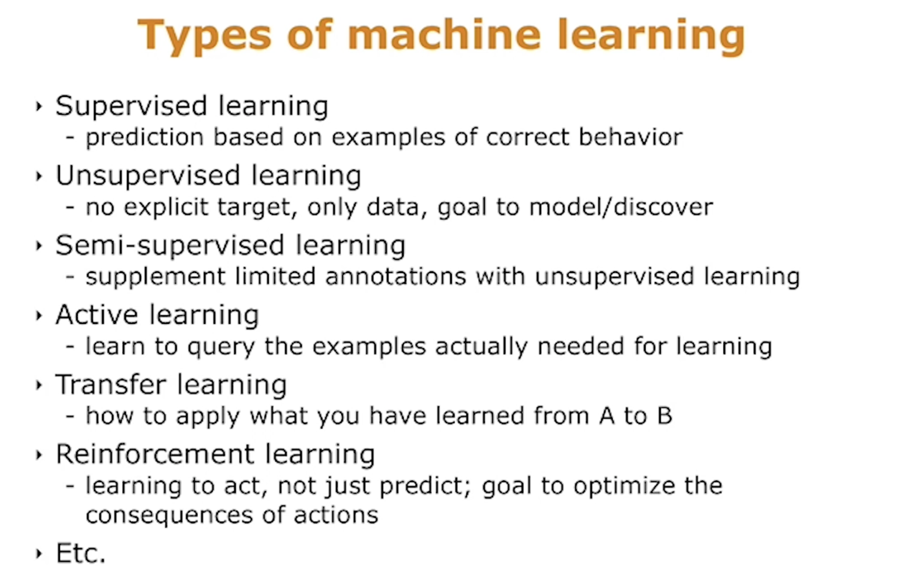

4. 监督学习的种类：分类器、回归、结构化预测(用语言描述图片内容等)。

   

## 2. Linear Classifier and Perceptron

1. 关于线性分类的一些基础概念：
   1. 特点向量(feature vector, $x \in  \mathbb{R^d}$)和标签(labels)
   2. 训练集(training set, $S_n$)和测试集
   3. 分类器：classifier, a map from x to y, $h(x \in \mathbb{R^d}) \rightarrow y$
   4. 训练误差：training error，$\epsilon_n(h)=\frac{1}{n}\sum_{i=1}^n [[h(x^i) ≠ y^i]]$（h(x)等于y则[[A]]为0，否则为1 )，测试误差类似定义。
   5. 分类器集：set of classifiers, means the choices we have or the set of hypotheses, $h \in H$
   6. 决策边界(decision boundary)：将$x \in \mathbb{R^d}$的空间按照分类器进行分割，是一个hyperplane。

2. 超平面(hyperplane)的数学基础知识：

   1. 定义：超平面是指在n维空间中，余维度为1的子空间，即==超平面是n维空间中的n-1维的子空间==。特别地，2维空间的超平面就是一条线(line)；3维空间的超平面则是一个平面(plane)。

   2. 公式：假设存在n维空间，则位于其超平面的数据点$(x \in \mathbb{R^n})$满足该条件$\theta_0 + \theta_1 x_1+ \theta_2 x_2 + \theta_3 x_3...+ \theta_n x_n=0$。

      1. $\theta_0$是某个常数，当$\theta_0 = 0$时，超平面经过原点。
      2. 当两个超平面除了$\theta_0$之外，其余参数均相等，则两个超平面相互平行。

   3. 法向量(normal vector)：$\vec{\theta}= \{\theta_1,\theta_2,\theta_3,...\theta_n\}$是==垂直于超平面的法向量==。法向量决定了超平面的方向。

      1. 任何与法向量点积为0的向量亦平行于该超平面(parallel vector)。
      2. 法向量等于两个不同方向的平行向量的叉积，$\vec{\theta} = \vec{a} * \vec{b}$。

      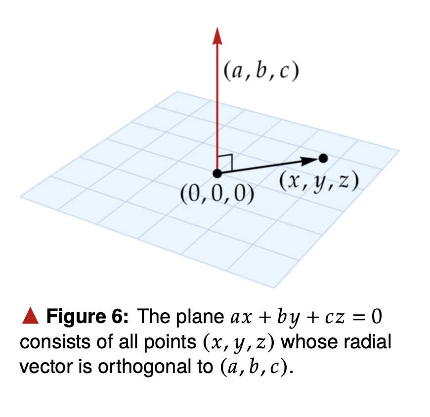

   4. 点到超平面的距离s：

      1. 点到超平面的垂直距离s可以认为是==点$x_0$与超平面上任意一点$x_1$构成的向量与标准化法向量$\frac{\vec{\theta}}{||\vec{\theta}||}$的点积==，即该向量在标准化向量上的映射。
      2. s为正，则该点位于超平面的正面；s为负，则位于另一面。

      $$
      s = \vec{x_0x_1} \cdot \frac{\vec{\theta}}{||\vec{\theta}||} =\frac{(\vec{\theta} \cdot x_0 + \theta_0)}{||\vec{\theta}||}
      $$

      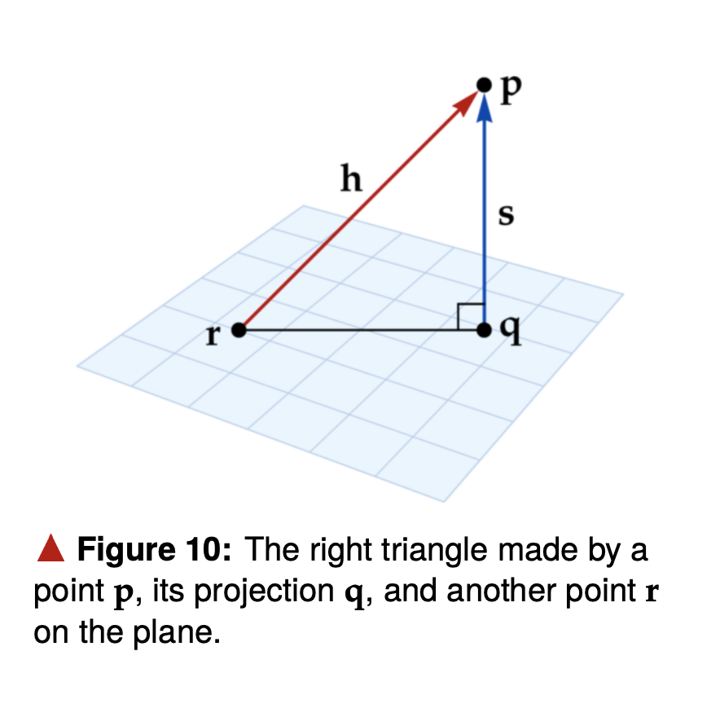

   5. 点到超平面的映射(Orthogonal Projection)：点$x_0$到超平面的映射等于$\vec{x_0x_1}- s \cdot \frac{\vec{\theta}}{||\vec{\theta}||}$，化简之后可以得到：
      $$
      x_0^{projection} = x_0 - \frac{\theta \cdot (\theta \cdot x_0+\theta_0)}{||\vec{\theta}||^2}
      $$

   6. 超平面之间的夹角：==超平面的夹角等于法向量的夹角==。
      $$
      \alpha = cos^{-1}(\frac{\vec{\theta_1} \cdot \vec{\theta_2}}{||\vec{\theta_1}|| \cdot ||\vec{\theta_2}||})
      $$

3. 线性分离(linear separation)的定义：当存在参数向量$\vec{\hat{\theta}}$和偏移参数$\hat{\theta_0}$使得$y^{(i)}(\vec{\hat{\theta}} \cdot x^{(i)} + \hat{\theta_0}) >0$（指二分类，$y^{(i)}=-1或+1$），即训练集所有的数据都分类正确，则我们认为训练集是线性分离的。

   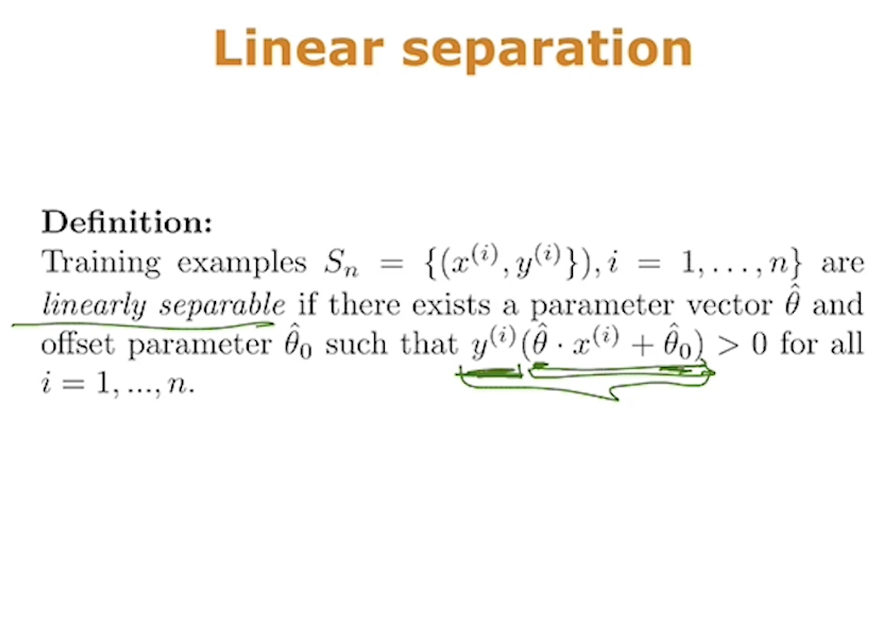

   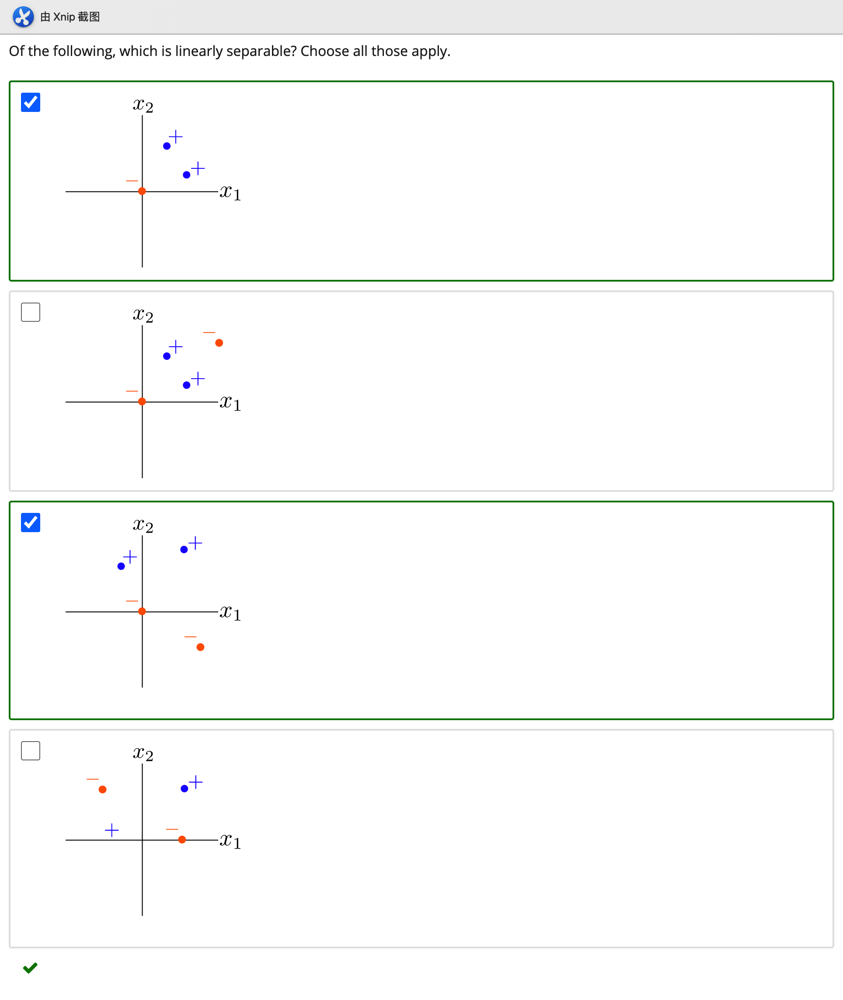

4. 感知机算法(perceptron algorithm)：

   1. 训练集误差：
      $$
      \epsilon_n(h) = \frac{1}{n}\sum_{i=1}^n[[h(x^{(i)}≠y^{(i)})]] \\= \frac{1}{n}\sum_{i=1}^n [[y^{(i)}(\vec{\hat{\theta}} \cdot x^{(i)} + \hat{\theta_0})≤ 0]]
      $$

   2. 算法步骤：

      1. 输入训练集和迭代次数(input)：训练集$，\{(x^{(i)},y^{(i)}), i = 1,2,3...n\}$算法迭代的次数$T$。

      2. 初始化分类器集：$\vec{\theta} = \vec{0}; \theta_0 = 0$

      3. 循环更新参数直到找到最佳参数：
         $$
         for \quad t = 1,...,T :\\
         \quad for \quad i = 1,...,n :\\
         \qquad if \quad y^{(i)}(\vec{\hat{\theta}} \cdot x^{(i)} + \hat{\theta_0})≤ 0, then:\\
         update \quad \theta^{(i)} = \theta^{(i)} +  y^{(i)} x^{(i)}\\
         update \quad \theta_0 = \theta_0 +  y^{(i)}\\
         return \quad \vec{\hat{\theta}}, \hat{\theta_0}
         $$

      * ==更新后的参数能更好地进行预测，减小训练集误差==：
        $$
        y^{(i)}\cdot[(\theta^{(i)} +  y^{(i)} x^{(i)}) \cdot x^{(i)} + (\theta_0 +  y^{(i)})] \\
        = y^{(i)}\cdot(\theta^{(i)}x^{(i)} + \theta_0) + {(y^{(i)})}^2 \cdot(||x^{(i)}||^2 + 1) \\
        ≥ y^{(i)}\cdot(\theta^{(i)}x^{(i)} + \theta_0)
        $$

   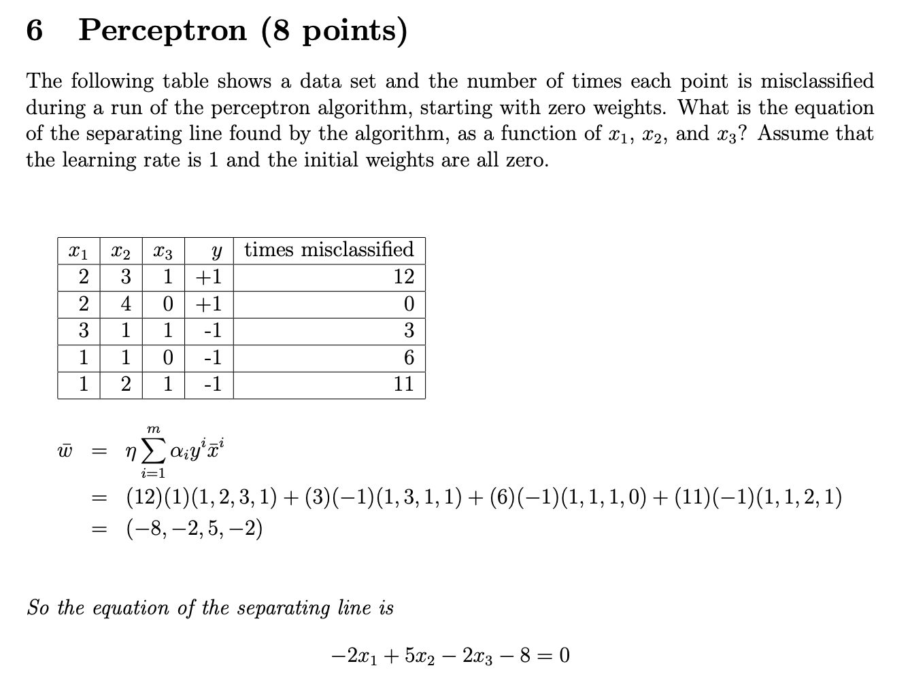

5. 被动进取感知机算法(Passive-Aggressive (PA) Perceptron algorithm)：

   http://web.mit.edu/6.S097/www/resources/L01.pdf

## 3. Hinge loss, Margin boundaries and Regularization

1. 大边界分类器(large margin classifier)：在使用分类器进行分类时，假设分类器①和分类器②都能对训练集进行准确地分类，我们会更倾向于选择离数据点较远的分类器①，因为它更稳健(more robust)。

   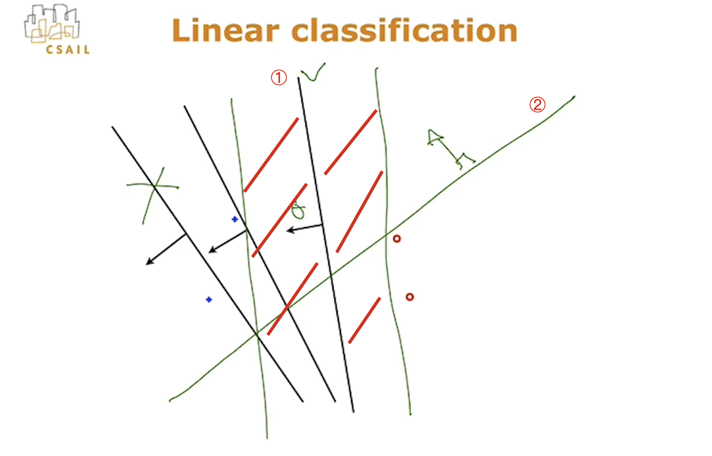

2. 边际边界(Margin boundary)：为了得到大边界分类器，我们对决策边界(decision boundary)的两边延伸相等的距离，得到正的边际边界(i.e. $\theta x + \theta_0=1$)和负的边际边界(i.e. $\theta x + \theta_0=-1$)。

   1. 边际边界到决策边界的正负号距离(signed distance)：如果数据分类正确，则距离为正；分类错误则距离为负。
      $$
      d = \frac{y^{(i)}(\theta \cdot x^{(i)} + \theta_0)}{||\theta||} \qquad y^{(i)}=+1或-1
      $$

   2. 也就是说：通过公式$y^{(i)}(\theta \cdot x^{(i)} + \theta_0)$可以是否分类正确。==当$y^{(i)}(\theta \cdot x^{(i)} + \theta_0)$≤0，说明分类错误(misclassified)；当$y^{(i)}(\theta \cdot x^{(i)} + \theta_0)$>0，说明分类正确==。
   3. 从距离公式可知，==$\theta$不仅仅决定着决策边界的方向，它的大小也控制着边际边界。$\theta$变大，边际边界变小==。
   4. 我们优化(optimization)的目标是最大化边际边界$\frac{1}{||\theta||}$。

   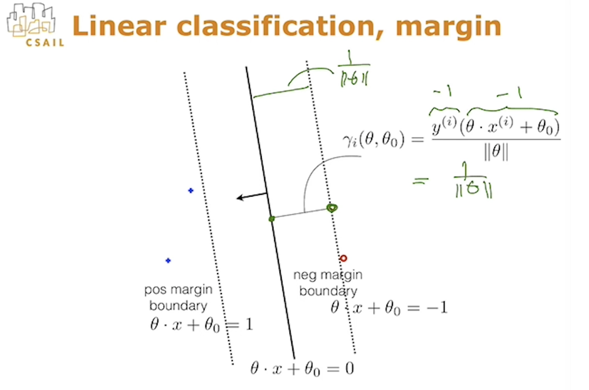

3. 铰链损失(hinge loss)：

   1. 用于训练分类器的损失函数，用于==测量分类器是否正确按照边际边界进行分类(注意：不是决策边界)==。当数据点位于边际边界内或分类不正确，计算铰链损失，也就是说，铰链损失通过分类是否正确、数据点是否位于边际边界外两个标准"惩罚"数据。
   2. 因此，铰链损失被用于“最大间隔分类”，尤其适用于支持向量机(SVMs)。

   $$
   Loss_h(y^{(i)}(\theta \cdot x^{(i)}+\theta_0))= \\Loss_h(z) = 
   \left\{\begin{array}{lr}0， if \, z ≥1，即正确分类且不在边际边界内\\1-z， if \, z <1，即分类不正确或在决策边界上\end{array}\right.
   $$

   

4. 正则化(regularization)：最大化间隔，即$max \frac{1}{||\theta||}$，即最小化$\theta$，其正则化参数记为$\lambda(>0)$，用于权衡正则化和铰链损失。$\lambda$越大，说明我们更看重大间距，但可能损失较大；$\lambda$越小，说明我们更看重分类器的准确性，但可能边际边界和决策边界非常接近。
   $$
   L_2= \frac{\lambda}{2}|| \theta||^2
   $$
   
5. 目标优化函数(objective function)：由平均铰链损失和正则化部分组成，旨在平衡两者的关系，既找到能正确分类的分类器，又能使间隔最大化。通过==最小化目标函数，我们可以得到最合适的参数==。
   $$
   J(\theta, \theta_0) = \frac{1}{n}\sum_{i=1}^{n} Loss_h(y^{(i)}(\theta \cdot x^{(i)}+\theta_0)) + \frac{\lambda}{2}|| \theta||^2\\
   将\lambda移到损失函数中：\\
   \frac{1}{\lambda}J(\theta, \theta_0) = \frac{1}{\lambda n}\sum_{i=1}^{n} Loss_h(y^{(i)}(\theta \cdot x^{(i)}+\theta_0)) + \frac{1}{2}|| \theta||^2\\
   = c\sum_{i=1}^{n} Loss_h(y^{(i)}(\theta \cdot x^{(i)}+\theta_0)) + \frac{1}{2}|| \theta||^2
   $$
   

   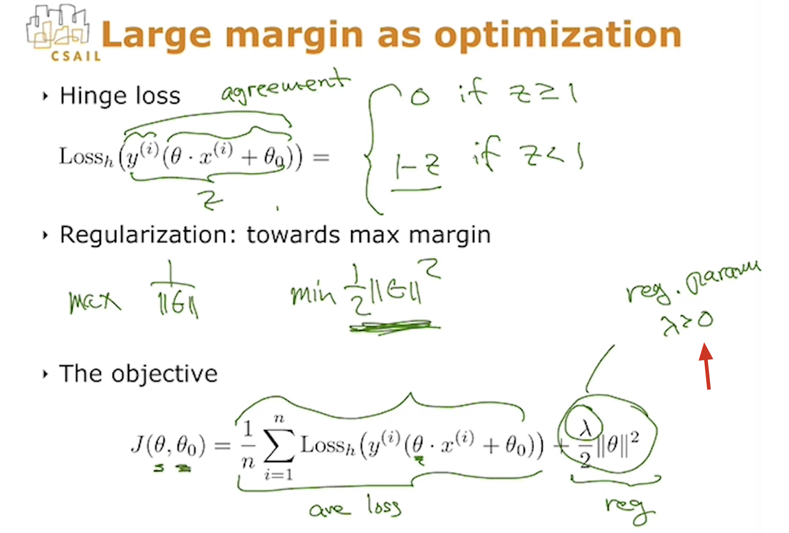

## 4. Generalization and Optimization

1. 接下来我们的目的是对目标函数进行优化，这里介绍的优化算法有：梯度下降(gradient descent)、随机梯度下降(stochastic gradient descent)、二次规划(quadratic programming, QP)。

2. 梯度下降：

   1. 初始化$\theta$
   2. 对目标函数进行求导得到$\theta$的斜率，接着对$\theta$进行更新，直到$\theta$不再改变：

   $$
   \theta \leftarrow \theta - \eta \frac{\partial J(\theta , \theta _0)}{\partial \theta }\\
   \eta称为步长或学习率(stepsize/learning rate)
   $$

   

   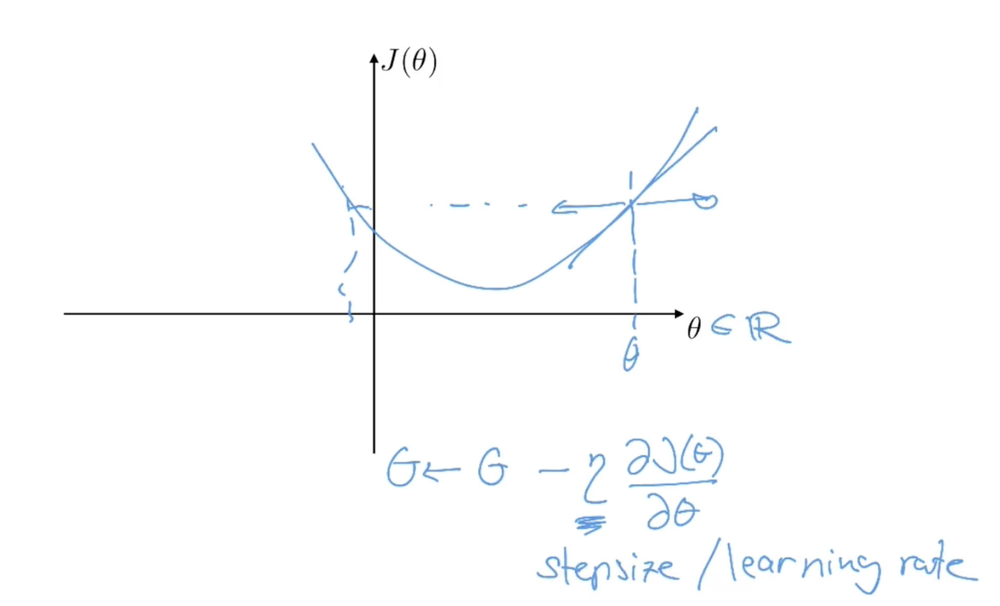

3. 随机梯度下降：我们本来的目标优化函数是计算平均损失和正则化项之和，但实际操作中，如果每优化一次$\theta$，我们就得遍历计算全部数据，会非常耗费时间，特别是当数据量较大时。

   1. 随机梯度下降是指==每次从数据集中随机抽取一个数据计算目标优化函数，并求导得到$\theta$的优化方向==，增加计算效率。

   2. 随机梯度下降的缺点在于：由于它是随机单样本的梯度，它的方向不会是百分百准确的，它可能没办法直接走向最优点，而是曲曲折折地前进。
      $$
      randomly \, select \, i \in \big \{ 1,...,n \big \}, update \, \theta:\\
      \theta \leftarrow \theta - \eta \nabla _{\theta } \big [\text {Loss}_ h(y^{(i)}(\theta \cdot x^{(i)} + \theta _0) ) + \frac{\lambda }{2}\mid \mid \theta \mid \mid ^2 \big ]\\
      其中:\\
      \nabla _{\theta } \big [\text {Loss}_ h(y^{(i)}(\theta \cdot x^{(i)} + \theta _0) ) = \left\{\begin{array}{lr}0， if \, loss=0\\-y^{(i)}x^{(i)}， if \, loss>0\end{array}\right.
      $$
      

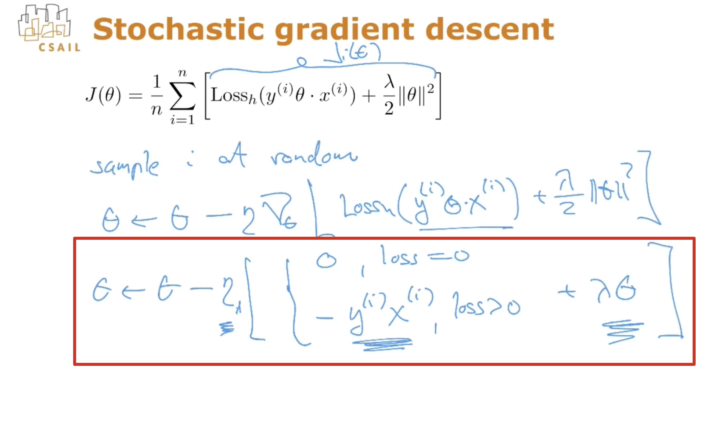

4. 比起感知机算法，hinge loss代表的SVM算法的区别有：
   1. 梯度下降算法为避免越过最优点，使用下降的学习率(decreasing learning rate)。
   2. 即使我们对数据进行了正确分类，我们还是会继续更新$\theta$，因为正则化部分一直在更新，我们要找到最大间隔的分类器( maximize the margin)。

5. 二次规划：除了对铰链损失和正则化部分进行同时约束权衡外，==在可实现的情况下，SVM算法也可以在保证分类准确或规定损失值的前提下最大化间距==。

   1. 举例：hinge loss=0

   $$
   find \quad \theta, \theta_0 \quad that:\\
   minimize \quad \frac{1}{2}||\theta||^2 \quad subject \,to\\
   y^{(i)}(\theta \cdot x^{(i)} + \theta_0) ≥1, i=1,...,n
   $$

   

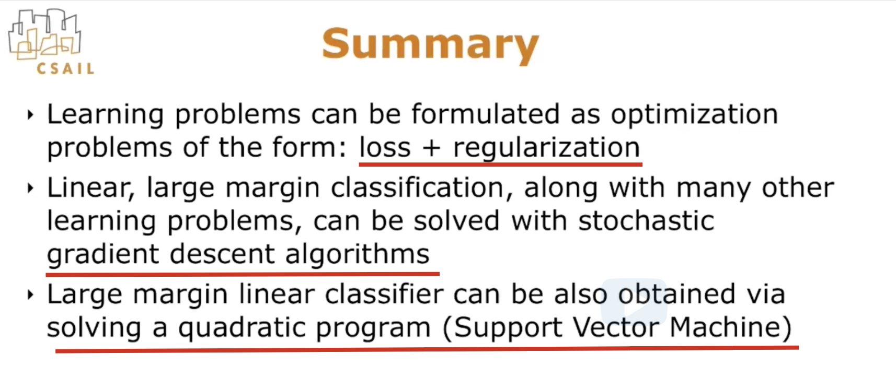

