> * 课程内容包括：概率相关概念和模型，基础统计推断知识，数学工具及现实中的应用例子。
> * 学习概率论的原因：世界充满随机性(randomness)，了解世界的不确定性（uncertainty)，以便在数据分析减少不确定性。

1. 课程设置：

   1. Unit 1-5: basic probability/continuous and discrete random variables
   2. Unit 6: futher topics
   3.  Unit 7: statistical inference: bayesian inference
   4. Unit 8: limit theorems and statistics
   5. Unit 9: random arrival processes
   6. Unit 10: Markov chains

   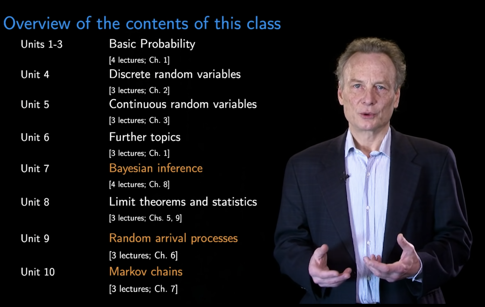

[toc]

# Unit1: Probability models and axioms

> 概率模型的基本结构及概率公理(axioms)。

1. 一个概率模型是对随机现象或随机试验的描述，可分为两步：

   1. 所有可能结果的集合(describe all possible outcomes)，即样本空间(sample space)。

   2. 描述每个结果的可能性(describe beliefs about likelihood of outcomes)，即概率定律(probability laws)。

## 1. Sample space & prob laws

### 1.1. Sample space

1. 样本空间即为所有可能结果的集合(set of possible outcomes, denote by $\Omega$)，它可以是离散的、有限的，也可以是连续的、无限的。

2. 样本空间的属性：
   1. mutually exclusive：结果之间相互排斥，即在每次实验最后只能发生一个结果，而其他的结果不可能发生。
   2. collectively exhaustive：样本空间穷举了所有可能的结果。不管实验结果如何，都只能指向样本空间里的一个结果。
   3. at the “right” granularity：样本空间只给出我们感兴趣的结果而不包含无关的变量。比如我们对抛一次硬币的结果感兴趣，则正确的样本空间为{head, tail}，而不是{head and rains, head and no rains, tail and rains, tail and no rains}，因为是否下雨并不是我们感兴趣的。样本空间的粒度取决于我们感兴趣的问题。

3. 样本空间的例子：

   1. 离散型：

   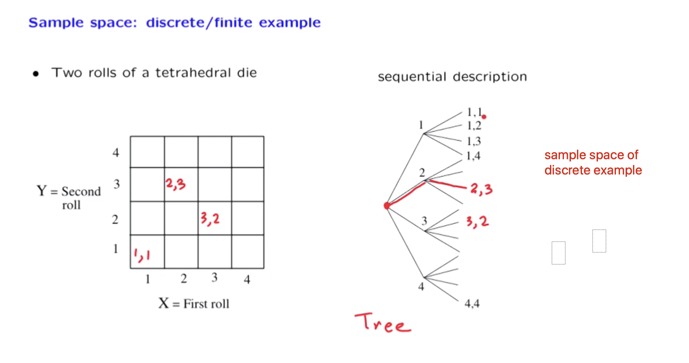

   2. 连续型：

   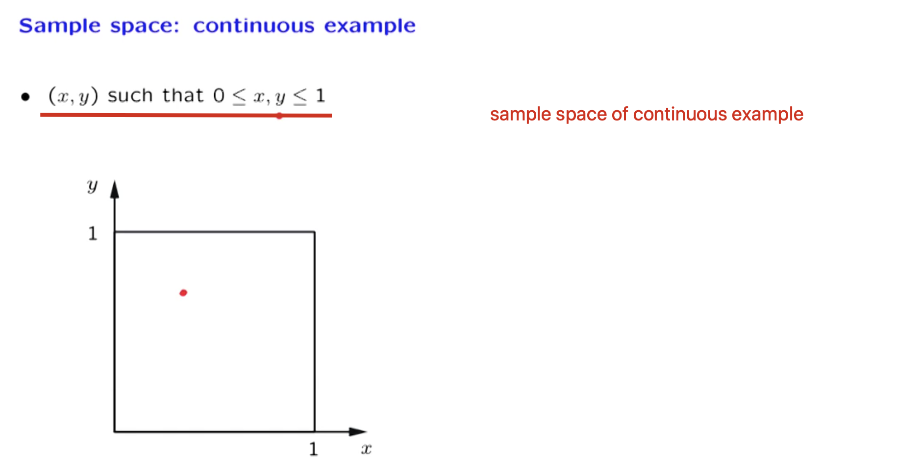

### 1.2. Probability axioms

1. 对于连续型变量，精确到一点的概率为0。因此我们一般描述的是一个区间/子集(subset)的概率。我们称样本空间的一个子集为事件(event)。

2. 概率公理：

   1. nonnagativity：非负性，$P(A)≥0$
   2. normalization：归一化，样本空间里的一个结果必然发生，因此整个样本空间的概率为1，$P(\Omega) = 1$
   3. additivity：可加性，如果事件A和事件B的交集为空集，则$P(A \cup B) = P(A)+P(B)$
   4. infinite additivity：无限可加性/可数可加性(countable additivity)，假设A1、A2、... An是一系列无限(sequence of disjoint)的不相交事件(可数的或区域的，countable/area)，则$P(A1 \cup A2 \cup A3 \cup ...) = P(A1)+P(A2)+P(A3)+...$

   

3. 概率公理延伸的其他属性：

   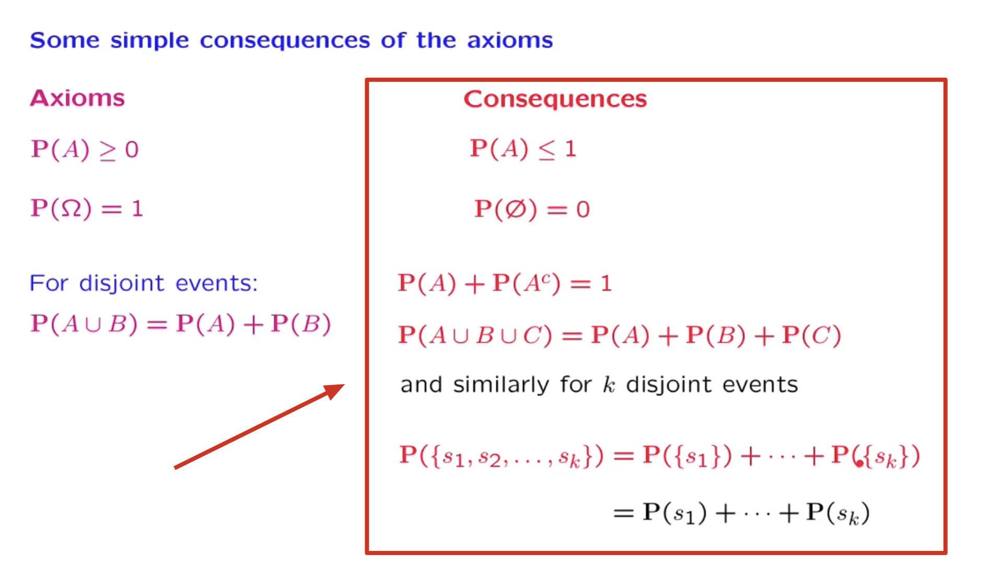

   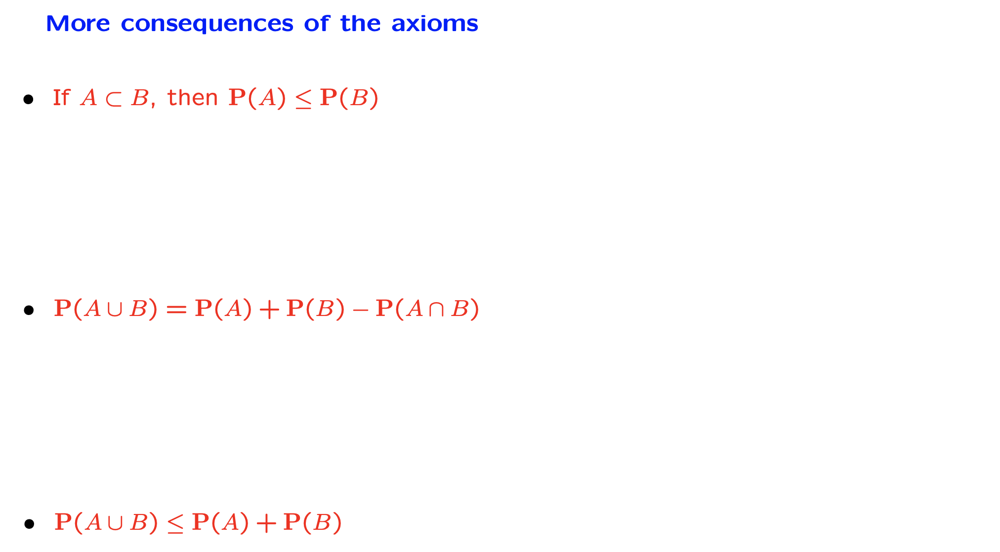

## 2. examples & definition

### 2.1. discrete & infinite example

1. 离散均匀定律(discrete uniform law)：假设样本空间有n个概率相等的元素，则每个元素的概率为$\frac{1}{n}$，包含k个元素的事件A的概率为$P(A) = \frac{k}{n}$，如掷骰子。

2. 举个离散但无限的样本空间的例子(discrete but infinite sample space):

   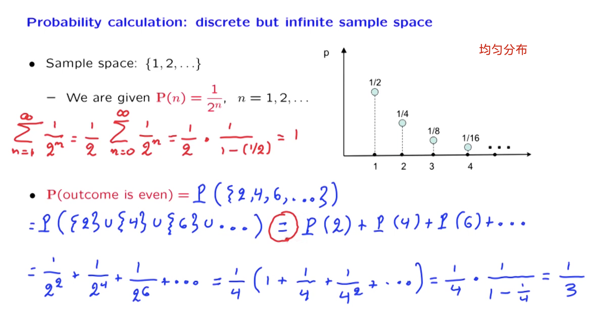

***

* 几何级数(geometric series)的求和公式：
  $$
  \sum_{0}^{n}a x^{n-1} = a\frac{x^n-1}{x-1} \quad x≠1
  $$
  

* 特别地，当$|x|<1$时，我们可以得到无限项的和：

$lim_{n \rightarrow \infty} x^n=0$,此时：$\sum_{n=0}^{\infty} a x^{n-1} = \frac{a}{1-x}$

* 举例：
  $$
  \sum_{n=0}^{\infty} \frac{1}{2^{n}} = \frac{1}{1-\frac{1}{2}} = 2
  $$
  

***

3. 关于可数可加性的公理：

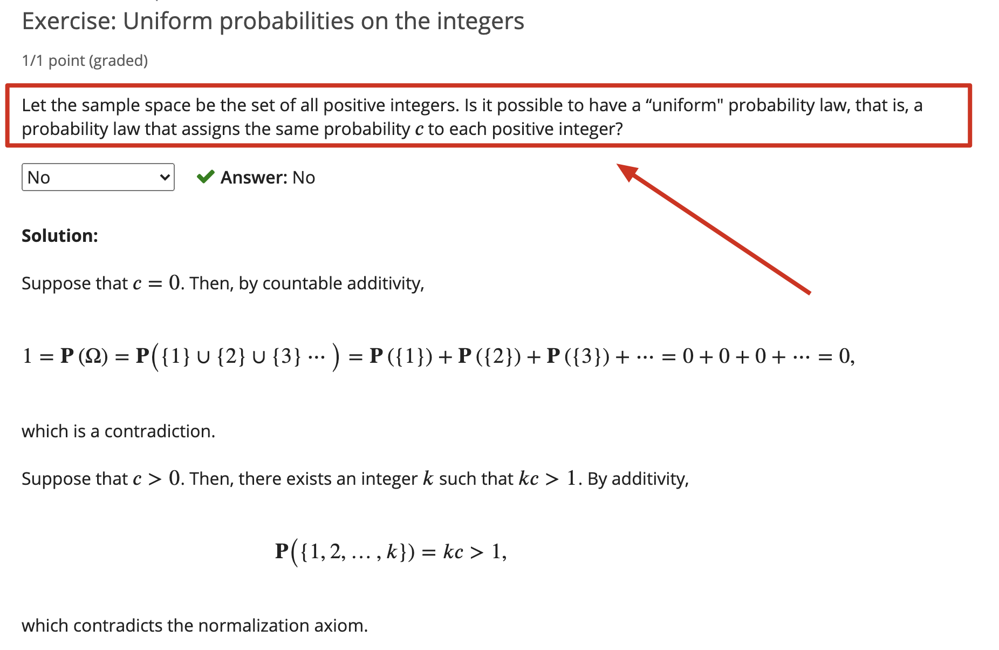

### 2.2. role of probability

1. 概率经常可以被解释为：
   1. 信仰的描述(description of beliefs)
   2. 博彩偏好(betting preferences)

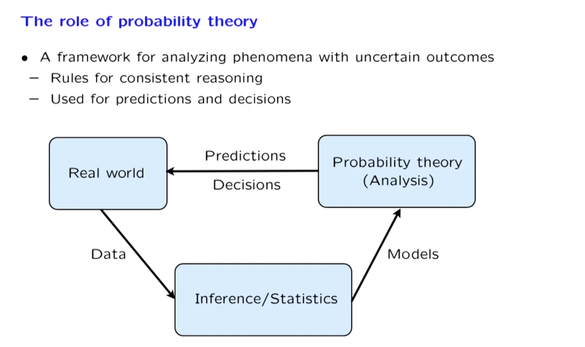

## 3. Mathematical background

### 3.1. sets & De Morgan's laws

1. 集合(set)：不同元素的组合(a collection of distinct elements)。集合可分成有限集合和无限集合。如果x属于集合S，则我们写为：$x \in S$。

   1. 有限集合：$S = \{a,b,c,d\}$
   2. 无限集合：$S = \{x \in R: cos(x) > \frac{1}{2}\}$

   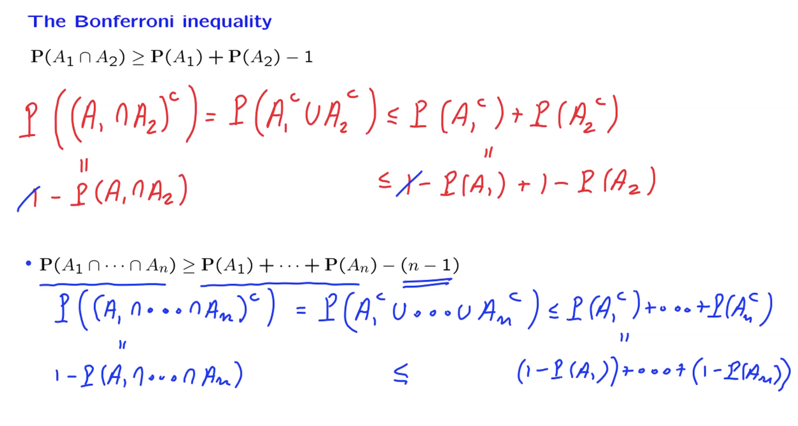

2. 德摩根定律(De Morgan's laws)：

$$(\cup_n S_n)^c = \cap_n S_n^c$$

$$(\cap_n S_n)^c = \cup_n S_n^c$$

### 3.2. sequences and their limits

1. 序列(sequence)：指一系列属于某一集合的$a_i$，其中$i \in N=\{1,2,3,...\}$。

2. 序列可能收敛至无穷，或者收敛至某个实数。

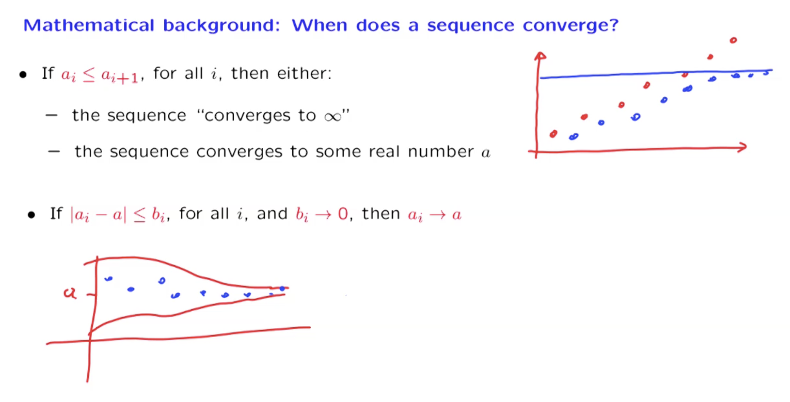

### 3.3. countable & uncountable sets

1. 集合是可数的是指：集合里每个元素可以有一个对应的正整数，如整数集合、正整数集合、0-1之间的有理数集合(整数和分数)。

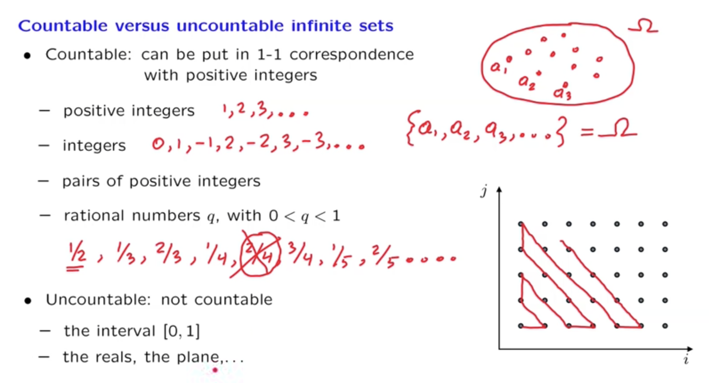

# Unit 2: Conditioning and independence

1. 条件化(conditioning)会根据部分信息更新概率，是一种非常有用的工具，可以使我们“划分并解决”复杂的问题。

2. 独立性(independent)用于对不相关(non-interactive)的概率现象进行建模，在构建基础复杂模型中发挥着重要作用。

## 1. Conditional Probabilities

1. 条件概率是指根据其他有关概率实验结果的信息修订我们的概率(Conditional probabilities are probabilities associated with a revised model that takes into account some additional information about the outcome of a probabilistic experiment.)。

2. 条件概率定义：P(A|B)，基于B发生，A发生的概率(probability of A, given that B occurred)

$$
P(A|B) = \frac{P(AB)}{P(B)} \qquad P(B)>0
$$

3. 条件概率的三大定理(three theorems)：

   1. 乘法法则(multiplication rule):

   $$
   P(AB) = P(B)P(A|B) = P(A)P(B|A)
   $$

   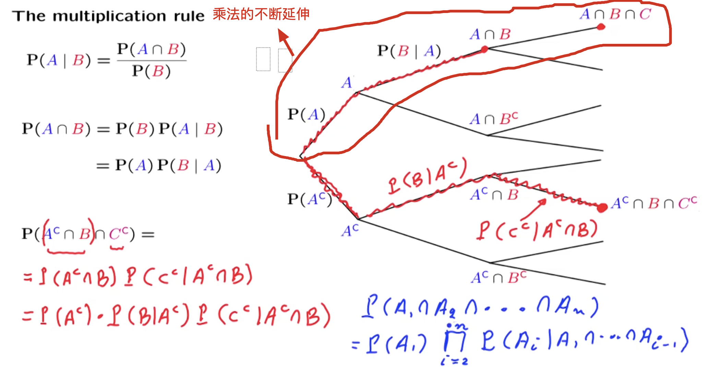2. 总概率定理(total probability theorem)：
   $$
   P(B) = P(B \cap A)+P(B \cap A^C) \\= P(A)P(B|A)+ P(A^C)P(B|A^C)
   $$
   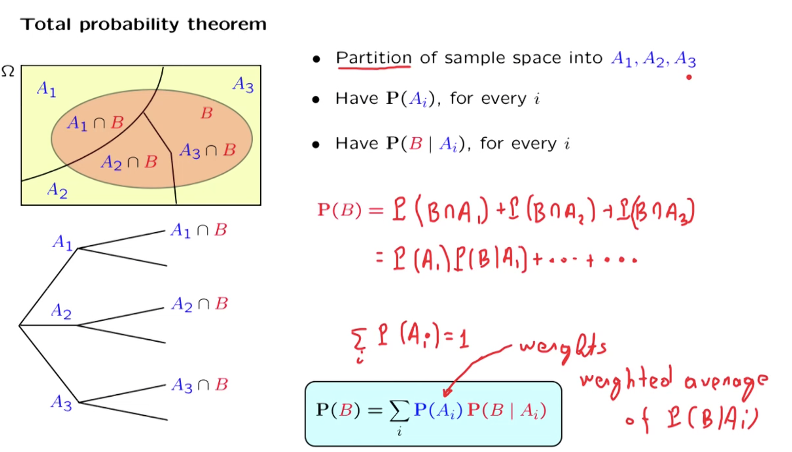

   3. 贝叶斯定理(Bayes' rule)：
      $$
      P(A_i|B) = \frac{P(A_i)P(B|A_i)}{\sum P(A_i) P(B|A_I)}
      $$

   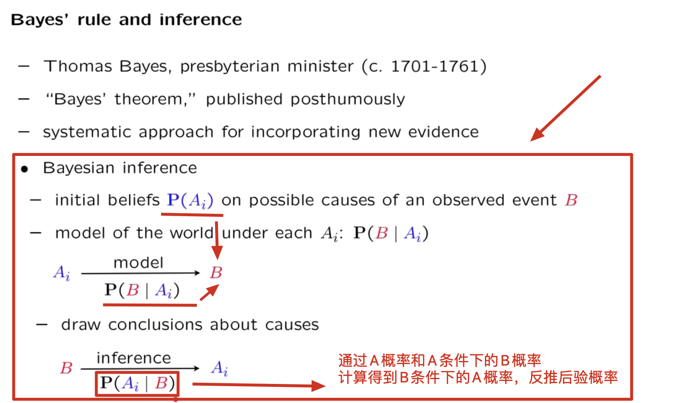

## 2. Independence

1. 当P(B|A) = P(B)时，即A的发生不影响B的发生(provide no information about B)，则认为A和B相互独立。

   1. 如果A和B相互独立，则①A和B的补集相互独立；②A的补集和B相互独立；③A的补集和B的补集相互独立。
   2. A和B相互独立的判断公式：

   $$
   P(A \cap B) = P(A)(B|A) = P(A) \cdot P(B)
   $$

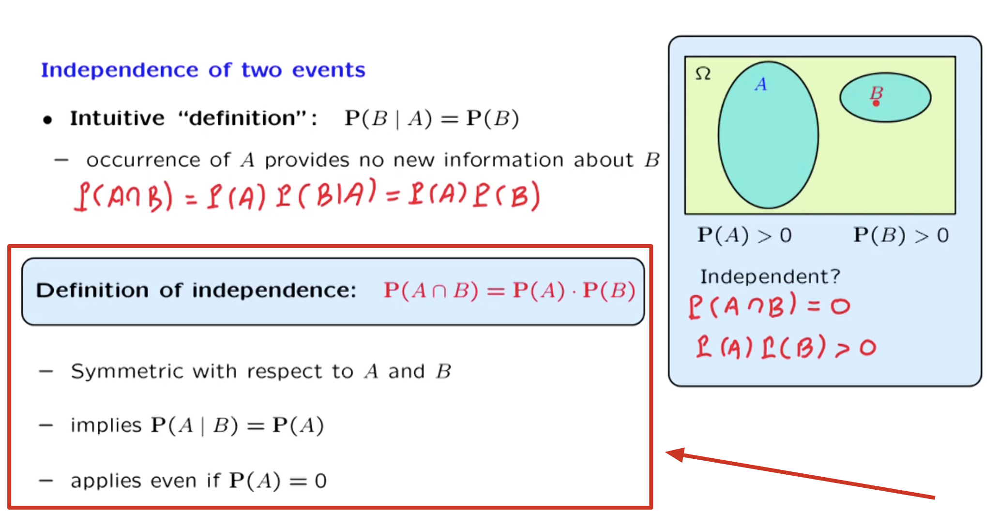

### 2.1. Conditional independence

1. 条件独立是指在给定条件C下，事件A和事件B条件独立。

   1. A和B相互独立并不意味着A和B在C条件下也条件独立。
   2. 判断条件独立的公式：

   $$
   P(A \cap B |C) = P(A|C) \cdot P(B|C)
   $$

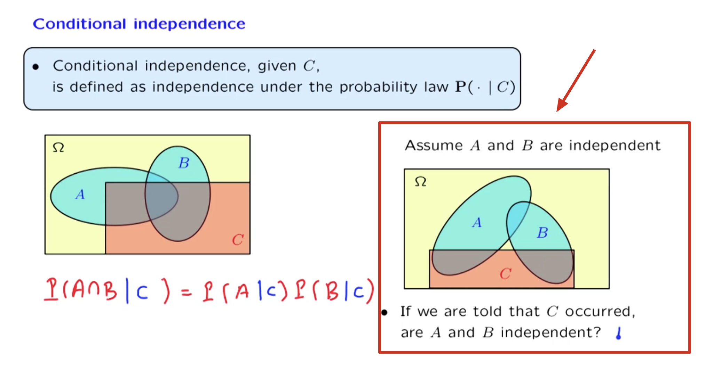

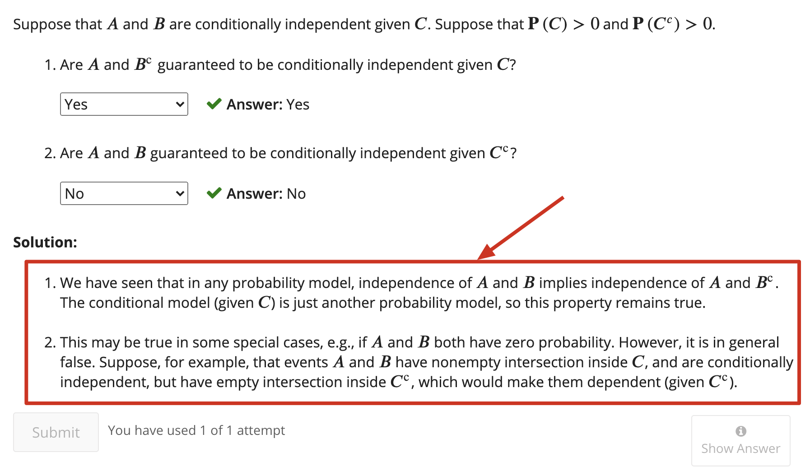

### 2.2. Independence of a collection of events

1. 从两个事件的相互独立类推，我们可以得到判断一系列事件独立性的公式：

$$
P(A_1 \cap A_2 \cap A_3 ... \cap A_m) = P(A_1) \cdot P(A_2) \cdot P(A_3) ... \cdot P(A_m)
$$

2. 成对独立(pairwise independence)的判断公式(假设仅有3个事件)：
   $$
   P(A_1 \cap A_2) =P(A_1) \cdot P(A_2)\\
   
   P(A_1 \cap A_3) =P(A_1) \cdot P(A_3)\\
   
   P(A_2 \cap A_3) =P(A_2) \cdot P(A_3)
   $$

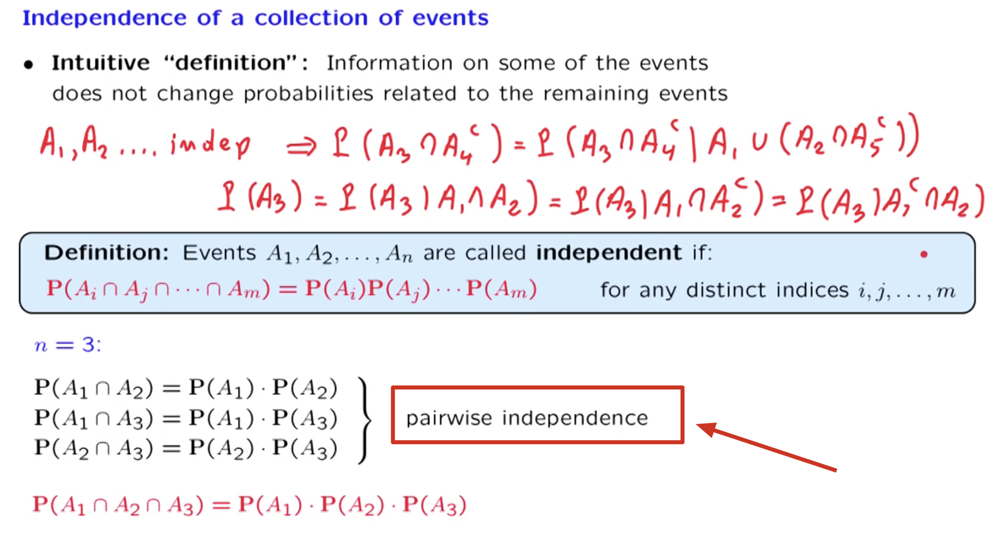

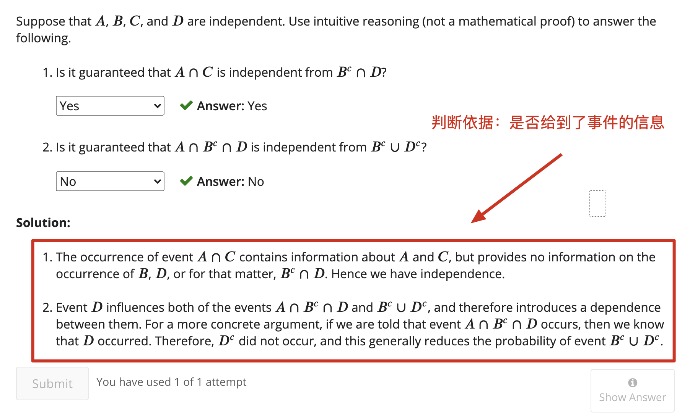

3. 著名的三道门问题(Monty Hall problem)说明了条件概率的重要性：

   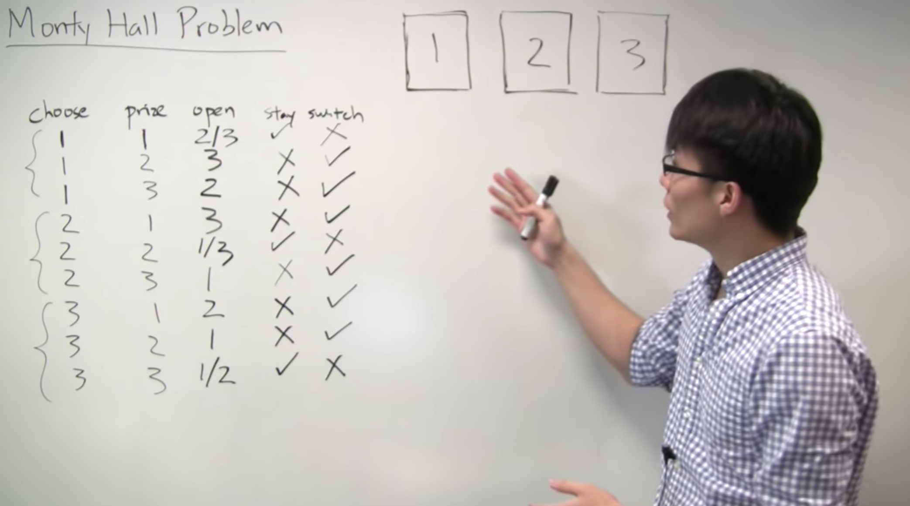

4. 解决条件概率和独立性的问题可以通过**韦恩图和树状图**简化问题，提高解题清晰度。

# Unit3: Counting

## 1. The counting principle

1. 假设我们完成某个事情需要$r$个步骤，每个步骤有$n_i$的选择，则根据基础计数原则(basic counting principle)，我们可以得到总的选择为：
   $$
   n_{总}=n_1·n_2·n_3...n_r
   $$

### 1.1. Permutation, subset& combination

1. 根据这一原则，我们可以逐一解决排列(permutation)、组合(combination)、子集(subset)、分区(partition)等问题。
   1. ==排列问题==：是指对n个元素的排列方法，则：

   $$
   n_{permutation}= n \cdot (n-1) \cdot (n-2)...1=n!
   $$

   2. ==子集问题==：假设计算{1...n}的子集数量，则每个元素都有2个选择(放进子集or不放进子集)，则子集的数量共有：

   $$
   n_{subset}=2 \cdot 2 \cdot 2 ... 2 = 2^n
   $$

   3. ==组合问题==：指从n个元素中取出k个(无排列)，则：
      $$
      n_{combination}=\binom{n}{k}=C_n^k=\frac{n!}{(n-k)!k!}
      $$
      

      1. $\sum^n_{k=0}\binom{n}{k}$相当于计算{1....k}的子集数量，则：$\sum^n_{k=0}\binom{n}{k} = 2^k$

      2. 特殊的：$0!=0$

2. 解决计数问题，根据基本计数原则进行分步骤计算每一步骤的可能性，而不同的步骤有不一样的计算难易度。比如n个人里组成k个人($k \in [0,n]$)的主席团，并选择1名主席，求主席团可能的组合数量。如果按照该步骤，我们需要做大量累加工作，则我们可以从另一个角度出发：

   1. 步骤①：选出一名主席，有$n$种选择；
   2. 步骤②：选择其他主席团成员，即包含主席在内的所有可能子集，有$2^{n-1}$种。
   3. 步骤③：$n_{总}=n \cdot 2^{n-1}$

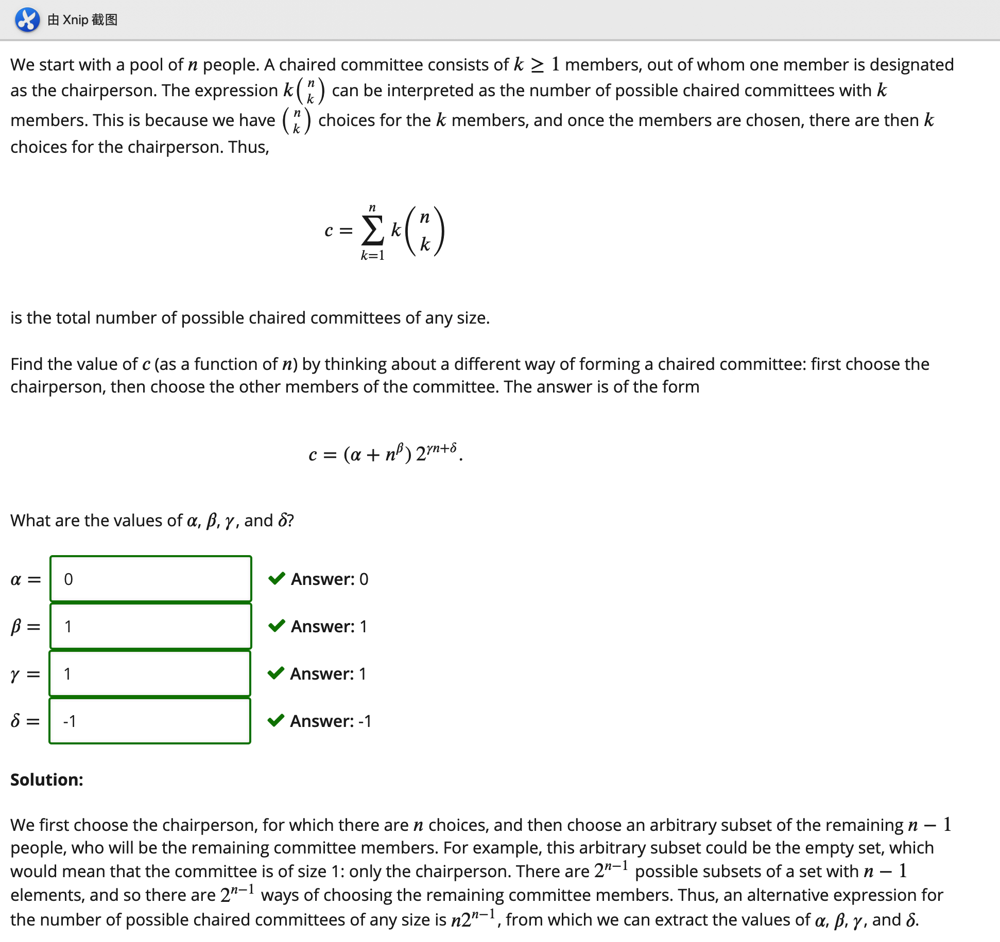

### 1.2. Partition & binomial probabilities

1. ==分区问题==：指将n个元素进行分割，则：

   1. 假设我们有n个元素，将其分成2个分区，分别有k个和n-k个元素，可组成的分区数量有：
      $$
      n_{partition} = \frac{n!}{(n-k)!k!} \text{(binomial coefficient)}
      $$

   2. 假设我们有n个元素，我们将其分成r个分区，各分区分别有$n_1,n_2,...n_r$个元素，可组成的分区数量有：

   $$
   n_{partition} = \frac{n!}{n_1! n_2!...n_r!} \text{(multinomial  coefficient)}
   $$

2. ==二项概率==：假设投掷一枚硬币，正面向上的概率为p，则投掷n次，共有k次正面向上的概率为：

$$
P(x=k)=\binom{n}{k}p^k(1-p)^{n-k} \text{(binomial probability)}
$$

3. ==多项概率==：假设有一个装有r种颜色球的盒子，每种颜色球的概率分别为$p_1, p_2, p_3,...p_n$。从盒子里取出n颗球，其中每种颜色各取出$n_1, n_2, n_3...n_r$个球($n_1+n_2+n_3...+n_r=n$)，其概率为：
   $$
   P(n2,n2,...n3)=\frac{n!}{n_1!n_2!n_3!...n_r!}p_1^{n_1}p_2^{n_2}p_3^{n_3}...p_r^{n_r}\\
   \text{(multinomial probility)}
   $$
   

# Unit 4: Discrete random variables

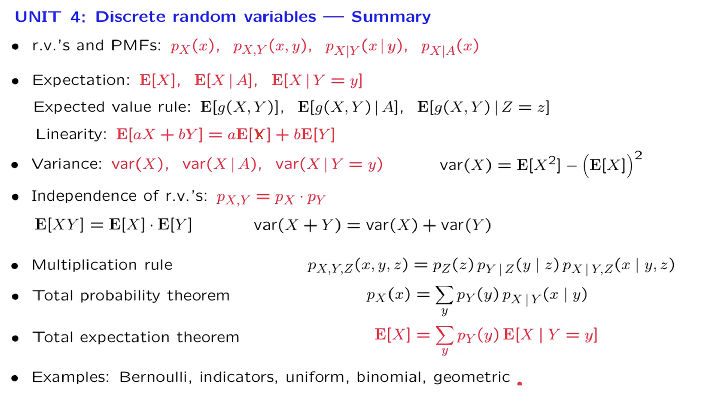

## 1. Probability mass functions and expectations

1. 本章介绍随机变量的概念和定义、概率质量函数、经典离散变量概率模型、期望及其属性。

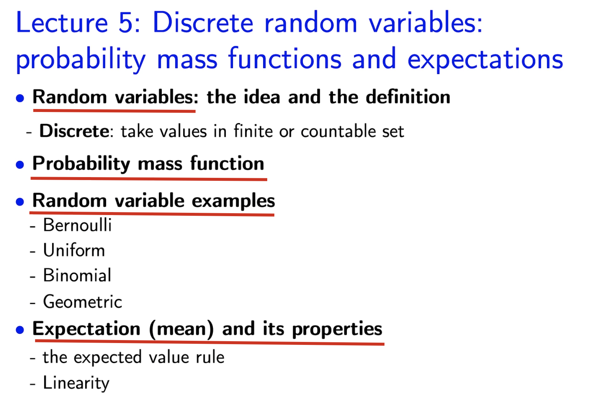

### 1.1. Random Variables

1. 随机变量(r.v.)的数学含义为：样本空间$\Omega$的实值函数(a function from the sample space $\Omega$ to the real number)。比如以一个班级为样本空间，从中随机抽出a、b、c，则abc的身高就是一个随机变量。注意：==随机变量必须由实际数值(numerical value)构成==。符号表示：
   1. 随机变量(random variable)：$X$
   2. 随机变量的实际数值(numerical value)：$x$

2. 需要注意的是：
   1. 一个样本空间根据不同的实值函数可以产生多个随机变量，如一个班级身高、体重等。
   2. 一个或多个随机变量的函数也是随机变量，如$X+2$，既可以将2看成一个简单的随机变量，也可以看成X的一个加法函数。
   3. 我们称只有一个实值的随机变量为确定性随机变量(deterministic random variable)，它没有任何随机性，如$X = \{1\}$。

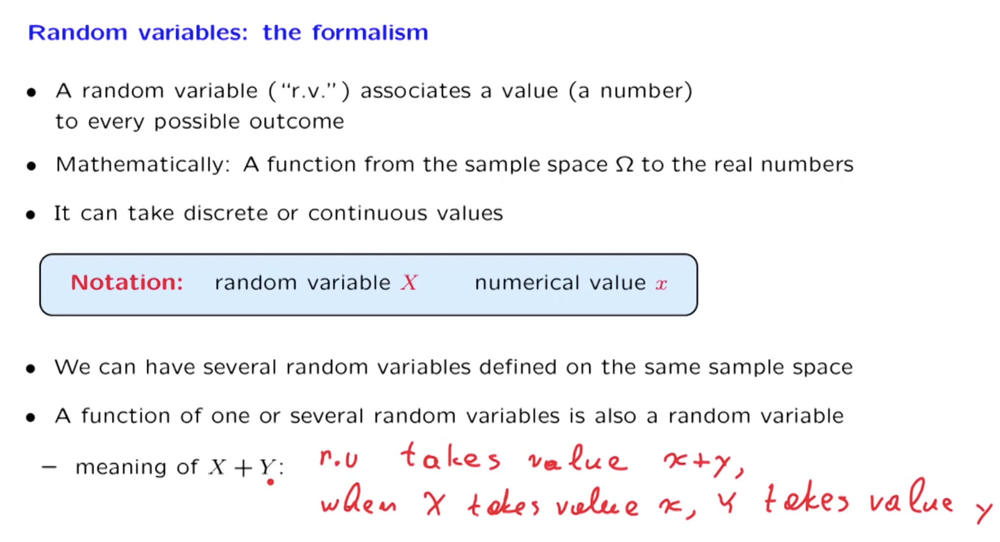

### 1.2. Probability mass functions

1. 我们用==概率密度函数来描述随机变量实值的可能性，简称PMF，PMF给出了不同实值的出现概率==(gives the probability of the different possible numerical values)。

   1. 离散型随机变量的PMF有时也叫做概率定律(probability law)或概率分布(probability distribution)。
   2. 需要记住的是：PMF也是一个函数，如$p_X()$。在括号里放入一个实值如$p_X(y)$则输出一个函数结果，也就是实值(number)；但如果括号里放入一个随机变量如$p_X(Y)$，则是一个新的r.v.(r.v.的函数也是r.v.)，这时主观上理解就是，用r.v. $X$的PMF来计算r.v. $Y$，得到一个新的r.v.。

2. PMF的符号表示：

   1. 一个实值$x$的出现概率：

   $$
   p_X(x) = P(X=x) = P(\{w \in \Omega \,s.t.X(w)=x\})\\
   注：w表示样本空间里的一个样本。
   $$

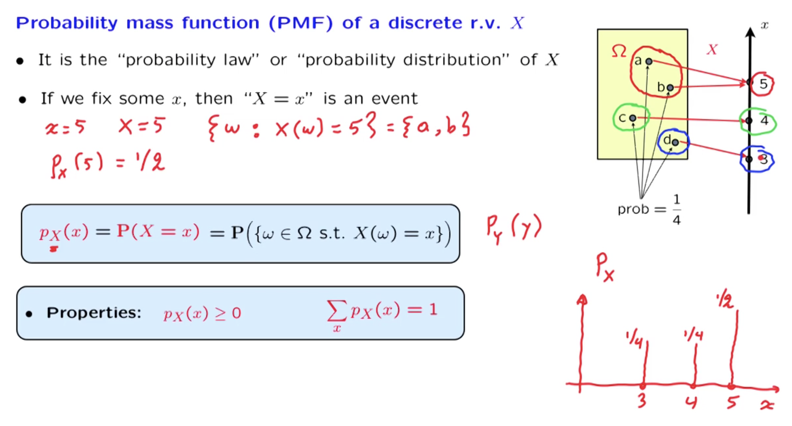

### 1.3. Classic Discrete variable

1. 伯努利随机变量和指标变量：

   1. 伯努利(Bernoulli)：是最简单的随机变量，指有两种可能实值(1或0)的一次结果，为1的概率p，为0概率为1-p。如一枚硬币投掷一次，正面或反面的r.v.。
   2. 指标(Indicator)：由伯努利可以延伸到事件的指标r.v.，即通过该指标判断事件是否发生，用$I$表示。例：对于事件A，$I_A = 1$表示事件发生；$I_A=0$表示事件未发生。

2. 离散均匀随机变量(discrete uniform r.v.)：

   1. 定义：在区间[a,b]内的任意一个整数都有相同的概率，即其样本空间为$\Omega = \{a,a+1,...,b\}$，r.v.为$X(w) = w$。
   2. PMF：所有的实值出现可能性都为$P=\frac{1}{b-a+1}$。

   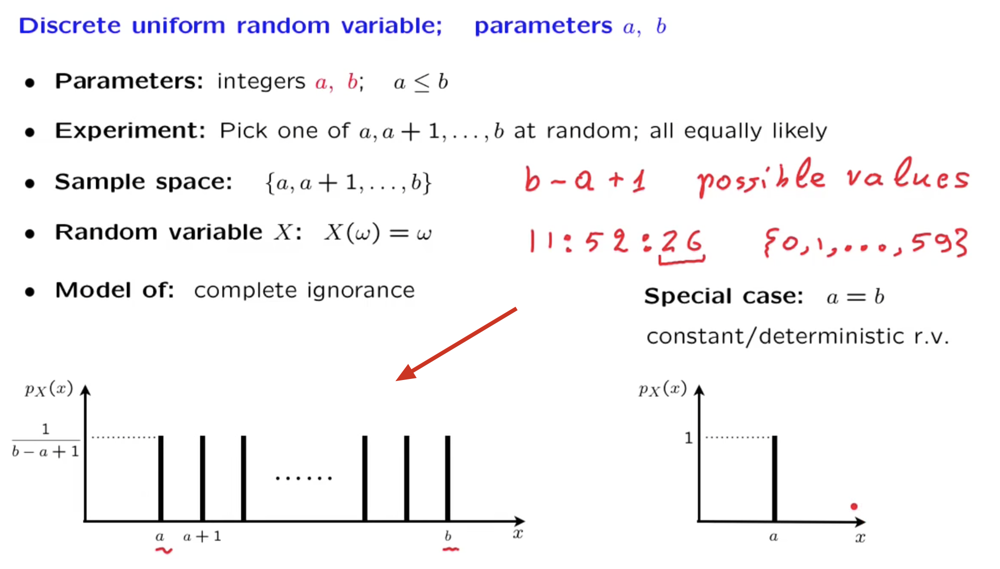

3. 二项随机变量(Binomial r.v.)：

   1. 定义：多次实验中成功的次数满足二项分布，如：一枚硬币投掷n次，正面向上的r.v.。

   2. PMF：n次实验中k次成功的概率
      $$
      p_X(k)=\binom{n}{k}p^k(1-p)^{n-k} \quad k = \{0,1,...,n\}
      $$

   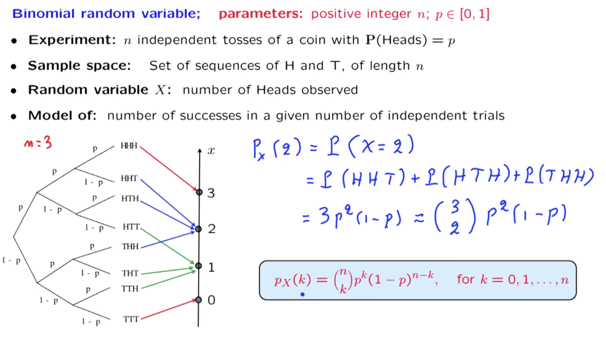

4. 几何随机变量(Geometric r.v.)：

   1. 定义：直到第一次成功时实验的次数满足几何分布，为无限离散型r.v.(infinite)。如：一枚硬币投掷，第k次出现正面的r.v.。

   2. PMF：直到第k次才成功的概率(k是无限的)
      $$
      p_X(k) = P(X=k)= (1-P)^{k-1}P \quad k=\{1,2,3...\}
      $$

   3. Trick：如果要计算大于第k次才成功的概率，则可以通过其对立事件获得，举例：
      $$
      P(X≥10)= P(前9次都是失败的) = (1-p)^9
      $$

   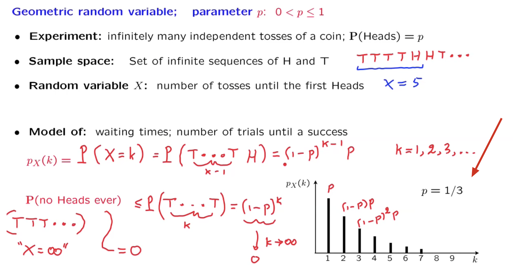

### 1.4. Expectation and Its Properties

1. 均值(expected value/expectation/mean)定义：==你期望看到的大量独立重复实验的平均值==(the average that you expect to see in a large number of independent repetitions of the experiment)。

   1. 均值与PMF：r.v.的所有可能取值及其概率

   $$
   E(X)= \sum_x xp_X(x)
   $$

   2. 均值与实值：r.v.所有实值的平均值
      $$
      E(X)=\frac{1}{n}\sum x_i
      $$
      

2. 关于均值需要明确的是：

   1. 均值不一定会在实验中出现，只是我们大量重复后的平均值。比如伯努利实验的均值为p，但实际上结果只可能是0或1。
   2. 当我们计算离散但无限的r.v.时(如：uniform r.v.)，期望也变成了一个无限的计算，此时为了让期望很好地被定义为某个数值(to be well-defined and finite)，我们需要假设绝对值$x$的期望绝对收敛：

   $$
   \sum_x|x|p_X(x) < \infty
   $$

3. 计算经典离散型r.v.的期望：
   1. 伯努利：$E(Bernoulli) = p$
   2. 离散均匀：$E(Uniform) = \frac{b+a}{2}$

   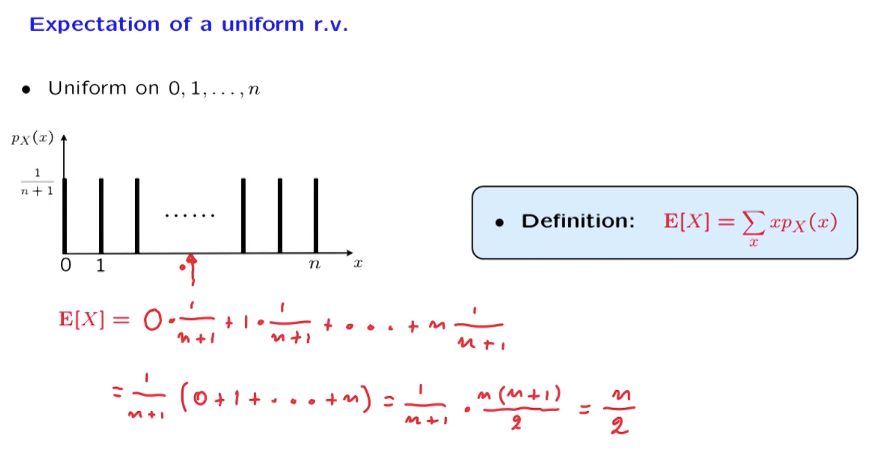

   3. 二项分布：多个独立伯努利实验均值相加可得，$E(binomial) = np$
   
   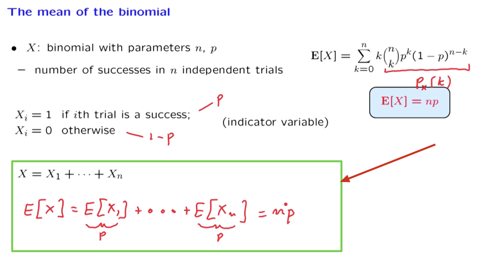
   
   4. 几何分布：利用几何分布的无记忆性可以推导出其期望。$E(Geometric) = \frac{1}{p}$
   
4. 期望的相关属性和法则：

   1. 基本属性(elementary properties)：
      1. if $X≥0$，then $E(X)≥0$
      2. If  $a≤X≤b$，then $a≤E(X)≤b$
      3. If c is a constant, $E(c)=c$
   2. 函数法则(expected value rule)：

   $$
   假设Y=g(X)，则：\\
   E(Y) = E[g(X)]=\sum_x g(X)p_X(x)
   $$

   ​		1. 举例：$E(X^2) = \sum_x x^2 p_X(x)$

   ​		2. 注意：$E[g(X)]≠ g[E(X)]$

   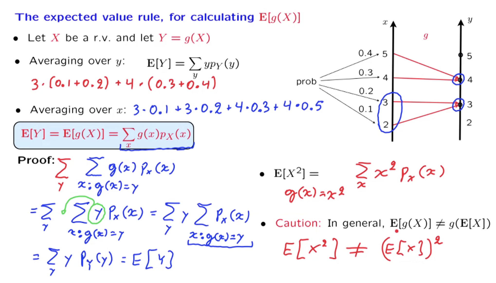

   3. 期望的线性(linearity)：
      $$
      E(aX+b) = aE(X)+b\\
      E(X+Y) = E(X) + E(Y)\\
      E(X_1+X_2+...+X_n) = E(X_1)+E(X_2)...+E(X_n)
      $$

## 2. Variance; Conditioning on an event; Multiple r.v.'s

本章我们介绍方差、条件概率、联合概率以及推导二项分布的期望值。

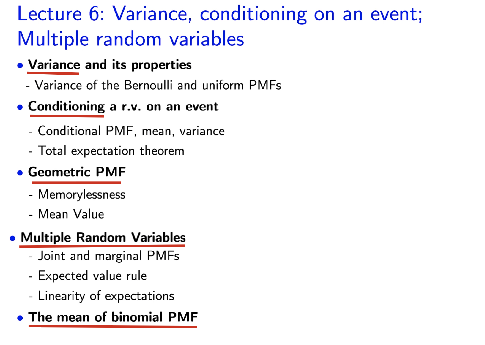

### 2.1. Variance

1. 定义：描述数据的散布程度(a measure of the spread of a PMF)。

   1. 公式1：
      $$
      Var(X) = E[(X-\mu)^2]=\sum_x(x-\mu)^2p_X(x)
      $$

   2. 公式2：
      $$
      Var(X) = E(X^2)-[E(X)]^2
      $$

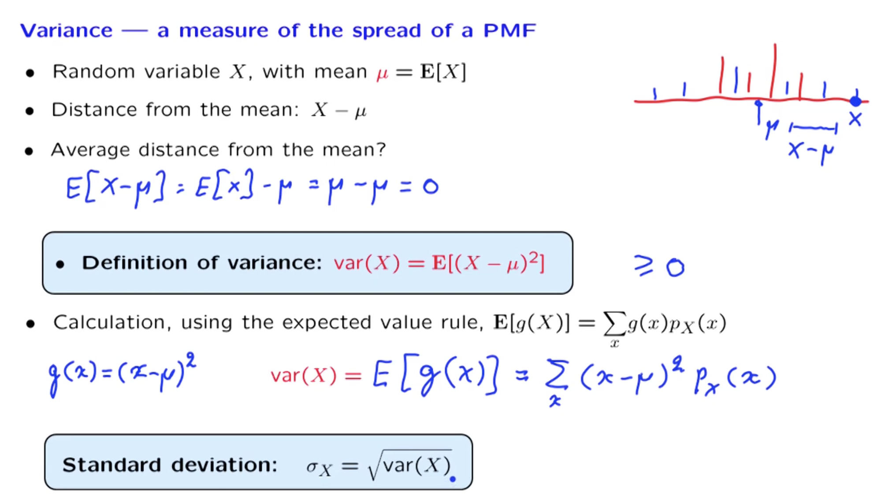

2. 属性：$Var(aX+b) = a^2 Var(X)$

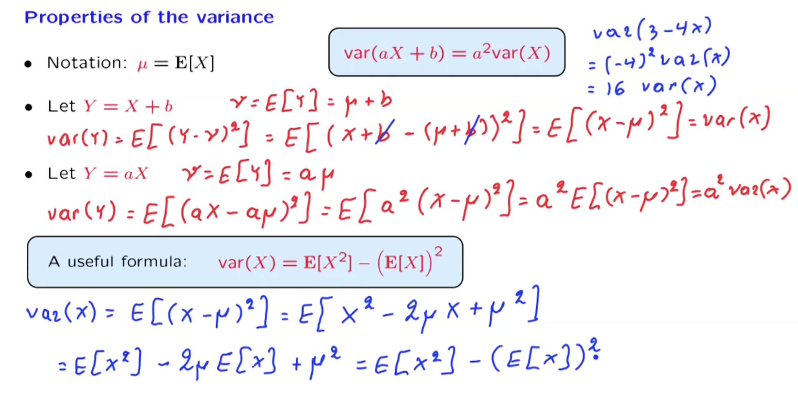

3. 计算经典离散型r.v.的方差：

   1. 伯努利：$V(Bernoulli) = p(1-p)$

      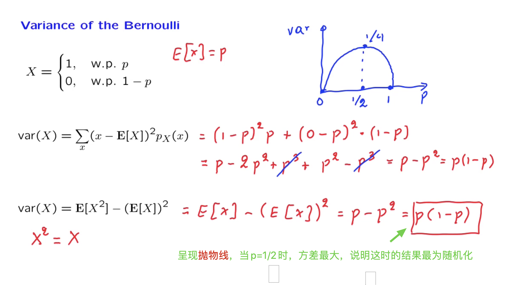

   2. 离散均匀：$V(Uniform)= \frac{1}{12}(b-a)(b-a+2)$

      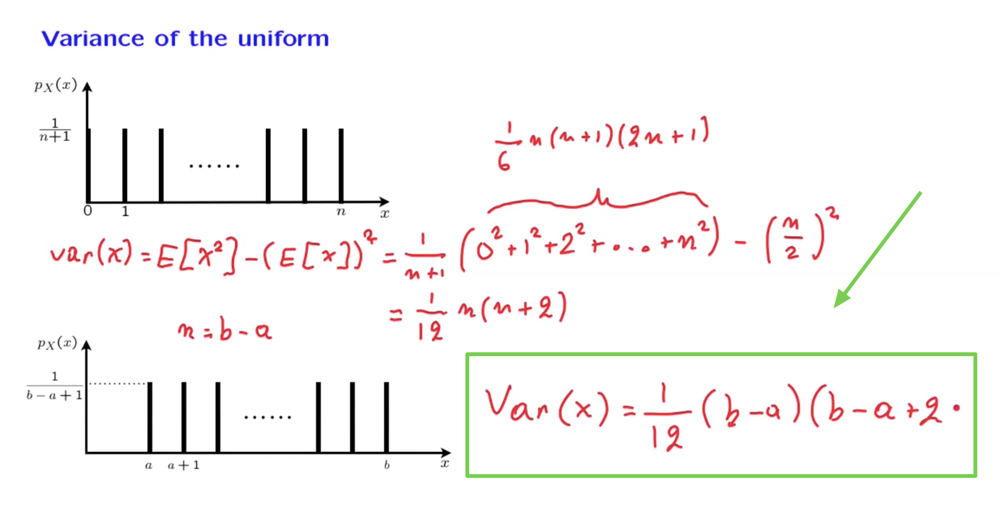

   3. 几何分布：$V(Geometric) = \frac{1-p}{p^2}$

      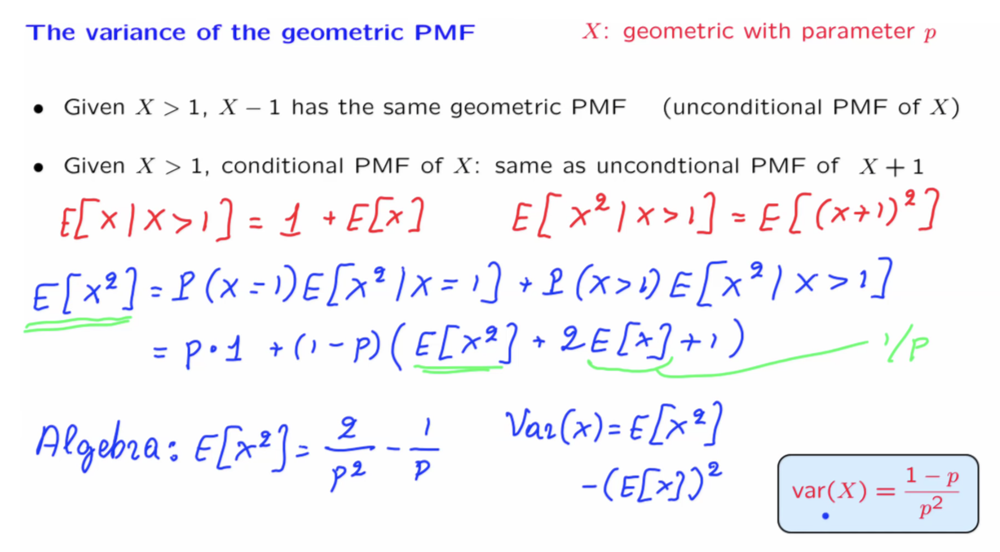

### 2.2. Multiple R.V. and Joint PMFs

1. Multiple r.v.包含多个变量(这里列出两个变量的公式，其余以此类推)：

   1. 他们的分布称之为联合分布(Joint PMF)，满足：

   $$
   p_{X,Y}(x,y) = P(X=x \,and \, Y=y)\\
   \sum_x \sum_y p_{X,Y}(x,y) = 1
   $$

   2. 单个变量的分布称之为边际分布(marginal PMF)，满足：
      $$
      p_X(x)= \sum_y p_{X,Y}(x,y)\\
      p_Y(y)= \sum_x p_{X,Y}(x,y)
      $$
      

   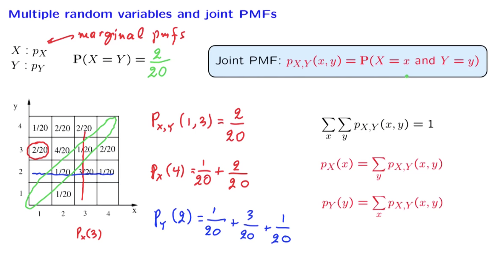

2. Function of Multiple r.v.：根据期望函数法则和联合分布，可知当$Z = g(X,Y)$时，则：
   $$
   p_Z(z) = P(g(X,Y)=z)=\sum_{(x,y):g(x,y)=z}p_{X,Y}(x,y)\\
   E[g(X,Y)] = \sum_x \sum_y g(x,y) \cdot p_{X,Y}(x,y)
   $$
   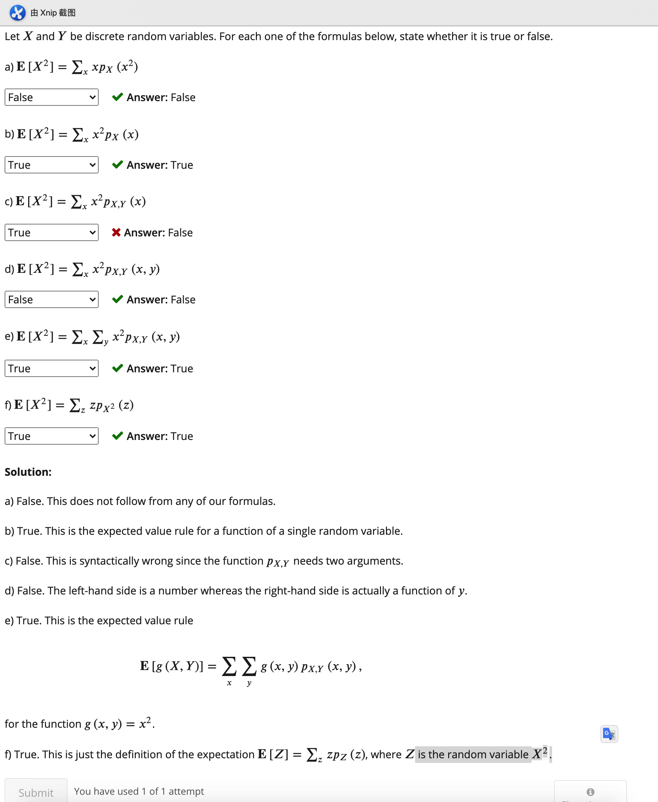

## 3.  Conditional PMFs and Independence of r.v.

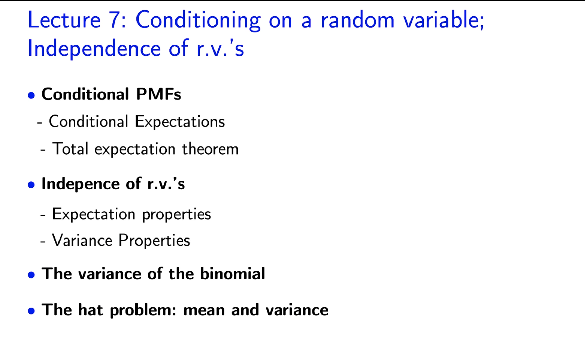

### 3.1. Definition of Conditional PMFs

1. 有条件的PMF和全集下的PMF是类似的，是基于某事发生的前提下更新了目标事件的PMF，但其概率和期望的计算是一样的。

   

2. 基于r.v. Y等于y的条件下，X条件PMF的概率计算公式有：

   1. 基础计算：
      $$
      p_{X|Y}(x|y) = P(X=x | Y=y)=\frac{P(X=x,Y=y)}{P(Y=y)}\\
      =\frac{p_{X,Y}(x,y)}{p_Y(y)} \quad \text{(y必须满足$p_Y(y)>0$)}\\
      $$

   2. 总概率定理：

$$
\sum_xp_{X|Y}(x|y) = 1 \quad \text{(y是Y的一个特定取值)}\\
p_X(x) = \sum_y p_Y(y)\cdot p_{X|Y}(x|y)
$$

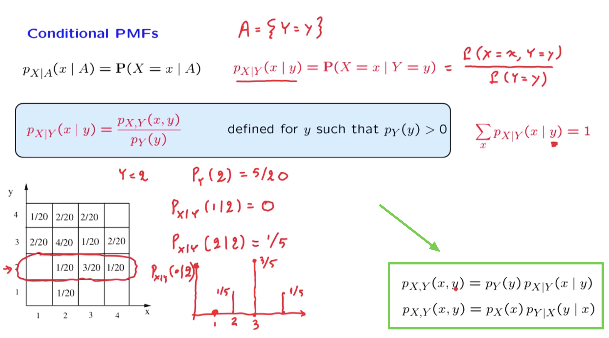		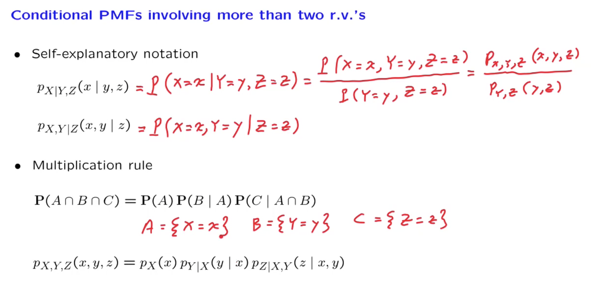

### 3.2. Conditional Expectation

1. 条件PMF均值的相关计算公式：

   1. 基础计算：

   $$
   E[X|Y=y] = \sum_x xp_{X|Y}(x|y)
   $$

   2. 函数法则(expected value rule)：
      $$
      E[g(X)|Y=y] = \sum_x g(x)p_{X|Y}(x|y)
      $$

   3. 总期望定理(Total expectation theorem):
      $$
      E(X)= P(A_1)E[X|A_1]+...+P(A_n)E[X|A_n]\\
      =\sum_yP_Y(y)E[X|Y=y]
      $$
      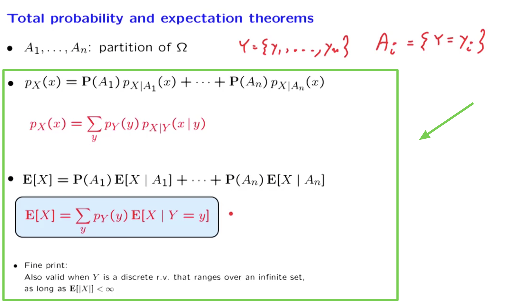

2. 几何r.v.的无记忆性和期望推导(memorylessness and expectation)：
   1. 无记忆性：即过去的结果不会影响将来的事件，如：前一次抛硬币的结果不会影响本次的结果。用条件PMF解释的话，指在抛硬币中，基于第一次是背面的事件，在抛到正面前的剩余次数还是为几何r.v.，该条件并未能更新我们第k次抛到正面的概率。

   

   2. 期望计算：

   

   

### 3.3. Independence of R.V.

1. 若两个r.v.相互独立，则他们满足：
   $$
   P_{X,Y}(x,y) = p_X(x)p_Y(y) \quad \text{(for all x,y)}\\
   ---\\
   P_{X|Y}(x|y) = P_X(x) \quad \text{(for all y)}
   $$
   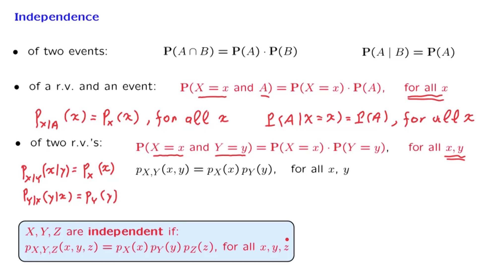

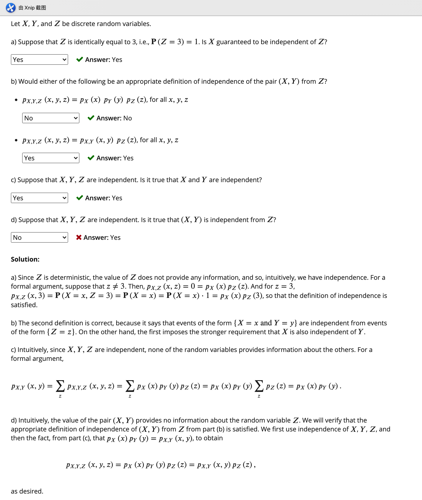

2. 如果r.v.相互独立，则期望满足：
   $$
   E[XY]= E[X] \cdot E[Y]\\
   g(X)和h(Y)也相互独立，则：\\
   E[g(X)h(Y)]= E[g(X)] \cdot E[h(Y)]
   $$
   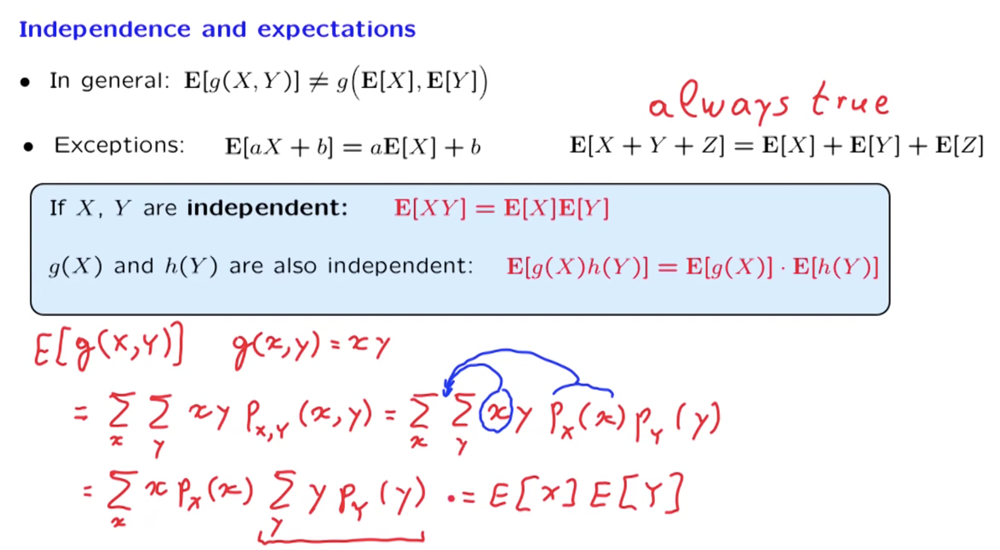

3. 如果r.v.相互独立，则方差满足(但反过来，方差满足以下条件，r.v.不一定相互独立)：
   $$
   Var(X+Y) = Var(X)+Var(Y) \quad \text{(X,Y必须相互独立)}
   $$
   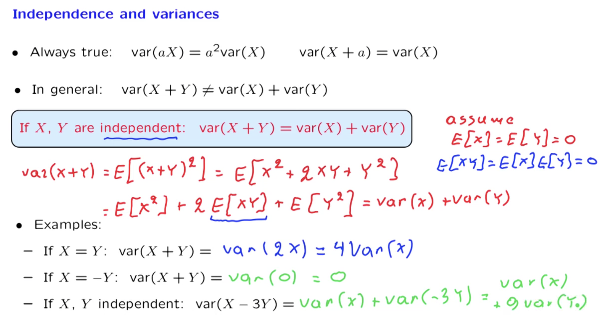

   1.  根据这一属性，我们可以推导出来二项分布的方差：$Var(binomial) = np(1-p)$

      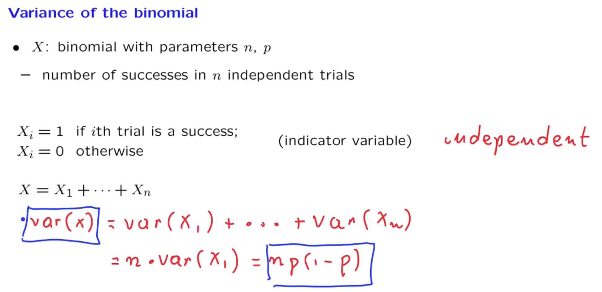

### 3.4. Important Inference

1. 利用尾部概率和(sum of tail probabilities)计算期望：假设X是一个非负整数r.v.，则：
   $$
   E[X] = \sum_{k=1}^{\infty}k \cdot p_x(k) = \sum_{k=1}^{\infty} P(X≥k)
   $$
   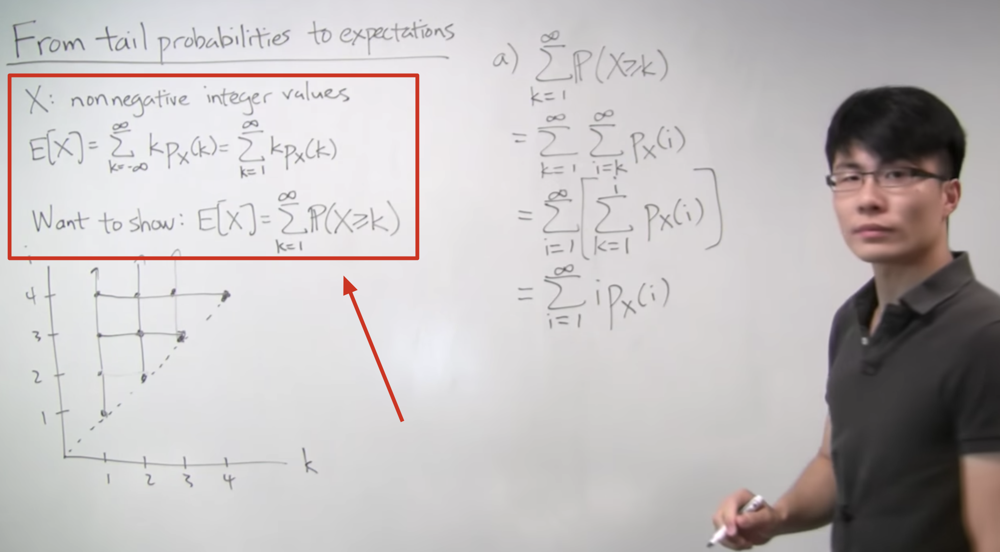

2. K次几何实验的期望计算(又称优惠券收集问题)：假设优惠券有A、B、C、D、E、F共6种优惠券，为收集全部种类的优惠券，你的期望购买次数为多少呢？
   $$
   T_1表示获得第一张券，以此类推：\\
   E[T] = E[T_1]+E[T_2]+...+E[T_n]\\
   =\frac{1}{p_1}+\frac{1}{p_2}+...+\frac{1}{p_n}=\frac{n}{n} + \frac{n}{n-1} +...+\frac{n}{1}\\
   =n \cdot (1+\frac{1}{2}+...\frac{1}{n}) = n \cdot ln(n) + \gamma \cdot n +0.5+ O(1/n)\\
   ≈ n \cdot ln(n)
   $$
   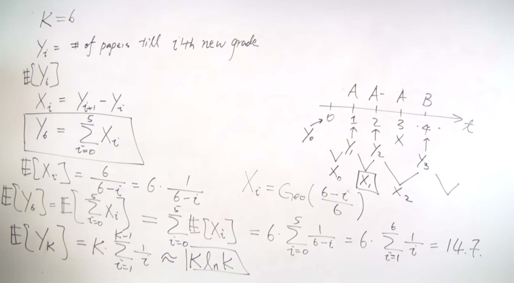

3. 指标变量求解反转数量(number of inversion)：假设有n个人选择n个座位，座位号码为随机变量$X_n$。如果i<j，而第i个人的座位号码$X_i$大于第j个人的座位号码$X_j$，则我们认为发生了反转，如何求反转的期望次数$E[N]$呢？

   1. 设定指标变量:

   $$
   I_{i,j}=\left\{
   \begin{aligned}
   1 & & X_i>X_j\\
   0 & & otherwise 
   \end{aligned}
   \right.
   $$

   2. 期望次数可表示为：
      $$
      E[N] = E[\sum_{i<j}I_{i,j}] = \sum_{i<j}E[I_{i,j}]
      $$

   3. 因为$X_i>X_j$和$X_i＜X_j$的发生概率是一致的，因此：
      $$
      E[I_{i,j}] = 1/2 \cdot 1 + 1/2 \cdot 0 = 1/2
      $$

   4. 因此，可得出期望次数为：
      $$
      E[N] = \sum_{i<j}E[I_{i,j}] = \frac{n(n-1)}{2} \cdot \frac{1}{2} = \frac{n(n-1)}{4}
      $$

4. 指标变量求解共同存活组数量(the number of joint alive)：假设有2m个人，分成m个组，一段时间后每个人存活的概率为p(存活概率相互独立)。用随机变量A表示存活的人数，随机变量S表示存活的组数，求任意存活人数下S的期望值$E[S|A=a]$。

   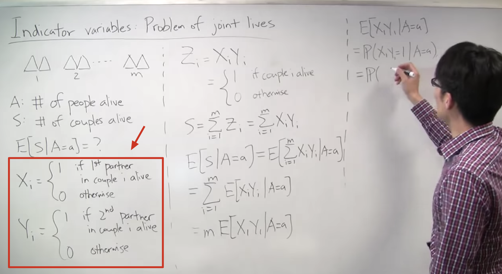

   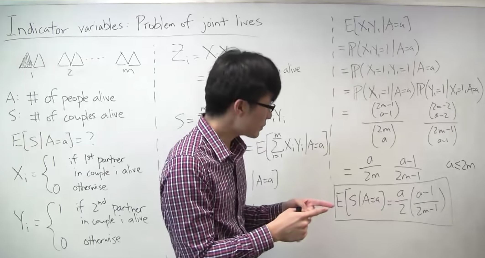

# Unit 5: Continuous Random Variables

1. 这个单元，我们将学习连续型随机变量和其概率密度函数，以及期望、方差、累积分布函数等属性。这些和离散型随机变量是类似的，但计算上存在一些小差别。

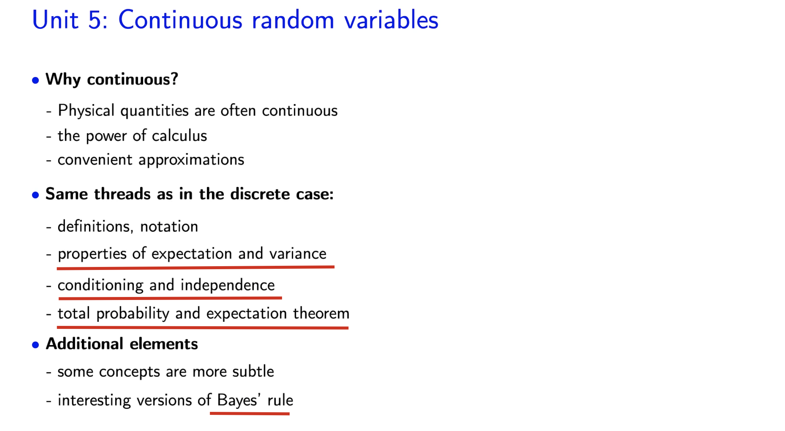

## 1. PDFs, CDF,Expectation, Variance and Classic Continuous r.v.

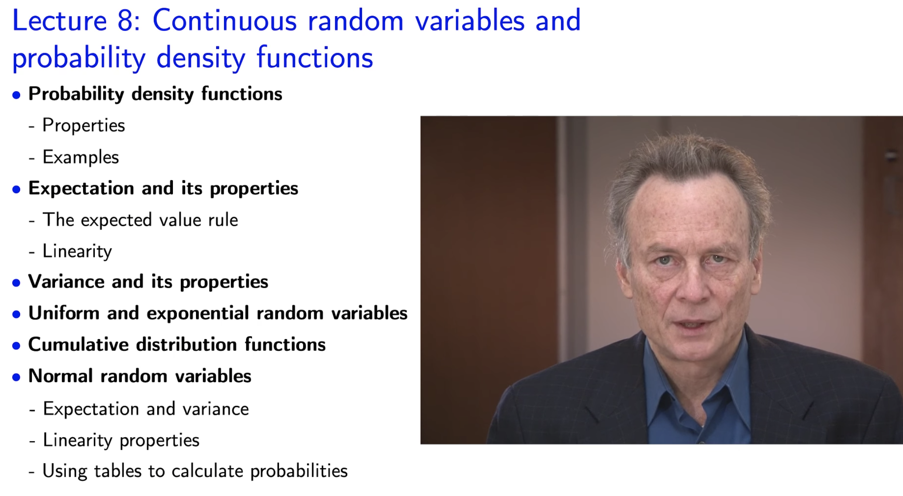

### 1.1. Probability Density Function

1.  概念：连续型随机变量的取值是实值范围(real line or interval of the real line)，其描述概率分布的函数称为概率密度函数，即PDF，符号记为$f_X(x)$。

   1. 注意：==概率密度函数≠概率==，而是在该x点，每单元长度的概率密度(probability per unit length)。即连续型r.v.的概率计算为：
      $$
      假设a≤x≤a+\delta且\delta →0，则\\
      P(a≤x≤a+\delta) = f_X(x) \cdot \delta
      $$

   2. 注意：并不是说一个连续型样本空间的函数映射就是连续型r.v.。连续型r.v.还必须要有能描述它的PDF。

   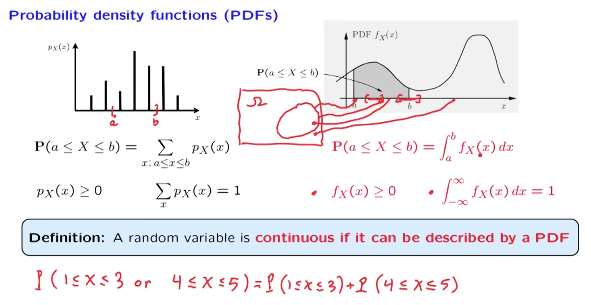

2. PDF的基本属性：

   1. $\int_{-\infty}^{+\infty}f_X(x)dx = 1$
   2. $f_X(x)≥0$，但不一定小于1
   3. $P(X=a)=0$
   4. $P(a≤x≤b) = P(a<x<b)$

   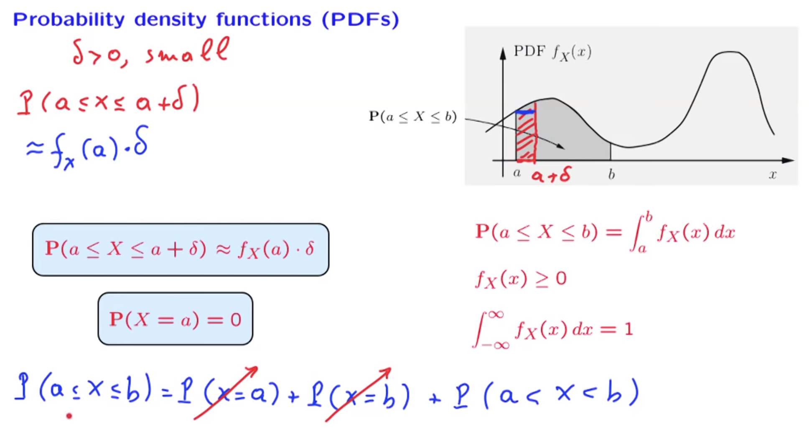

### 1.2. Expectation and Variance

1. 期望：和离散型r.v.类似，只是用了积分形式。
   $$
   E(X) = \int_{-\infty}^{+\infty}x\cdot f_X(x)dx
   $$

   1. 期望被很好地定义需满足(well defined mathematically)：$\int_{-\infty}^{+\infty}|x|\cdot f_X(x)dx <\infty$，我们一般假设满足这个条件。

   2. 期望值位于概率分布的中心，即$\int_{-\infty}^{\mu}x\cdot f_X(x)dx=\frac{1}{2}$，在图形中可以模糊地判断。

      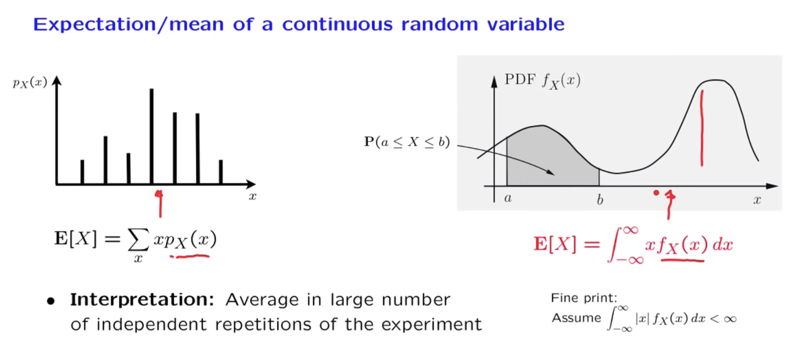

   3. 期望的属性：和离散型r.v.一致

      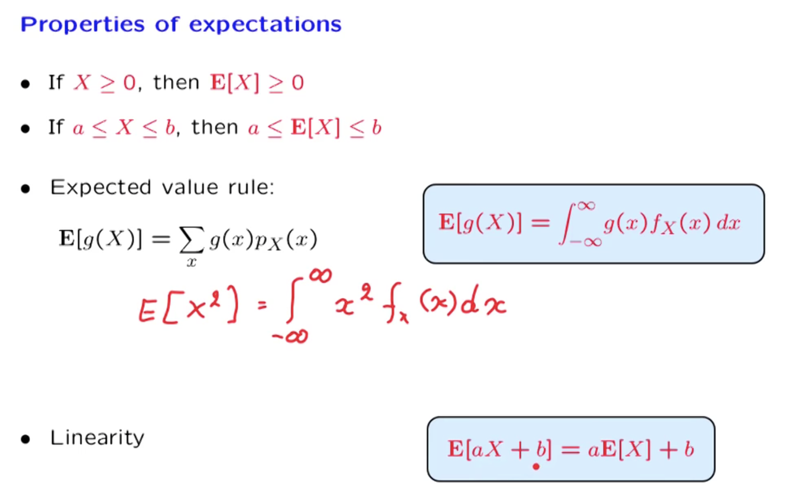

4. 方差：
   $$
   Var(X) = E[(X-\mu)^2] = \int_{-\infty}^{+\infty}(x-\mu)^2 \cdot f_X(x)dx
   $$
   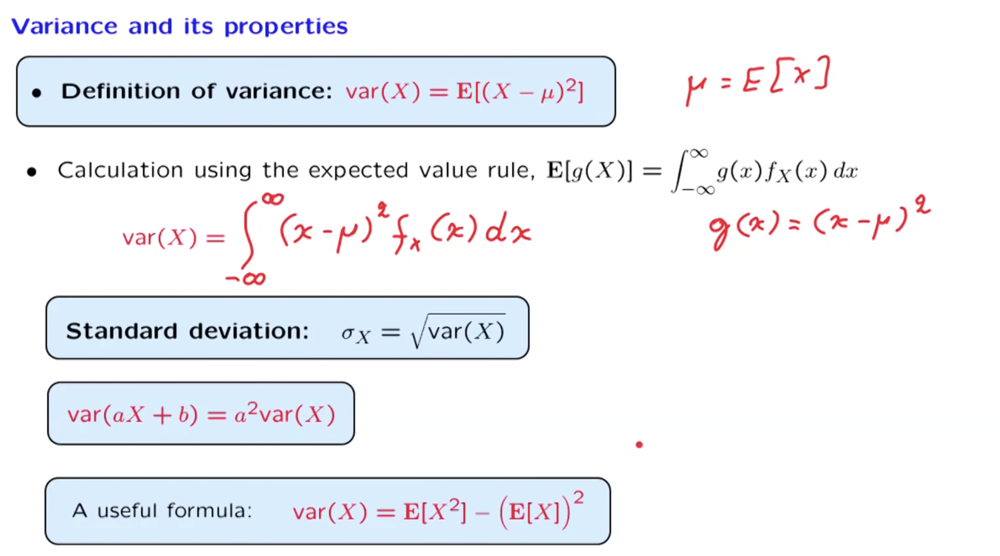

### 1.3. Classic Continuous PDF

1. 连续型均匀和分段常数(Uniform and piecewise constant PDFs)：

   1. 连续型均匀：
      1. PDF：$f_X(x)=\frac{1}{b-a}$
      2. 期望：$E(X) = \frac{a+b}{2}$
      3. 方差：$Var(X) = \frac{(b-a)^2}{12}$
   2. 分段常数：每一段的PDF是相同的

   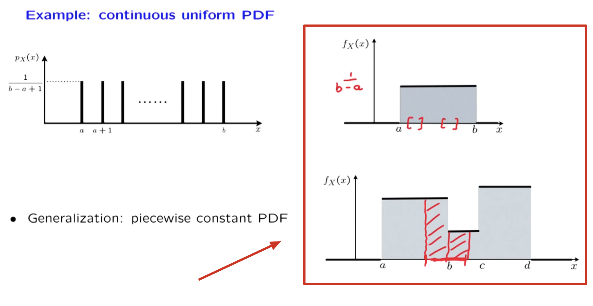

2. 指数连续型r.v.(exponential random variables)：描述了直到事情发生前需要等待的时间。对应的离散型r.v.是几何分布(描述了直到某事成功前需要尝试的次数)。举例：顾客到达的时间、机器故障的时间、灯泡坏掉的时间。

   1. PDF：$f_X(x) = \lambda e^{-\lambda x} \quad (x≥0)$，它是从$(0,\lambda)$开始递减的曲线，和几何r.v.(离散型)相似。当x=a时，$P(x≥a) = e^{-\lambda a}$。

   2. 期望：$E(X) = \frac{1}{\lambda}$

   3. 方差：$Var(X) = \frac{1}{\lambda^2}$

      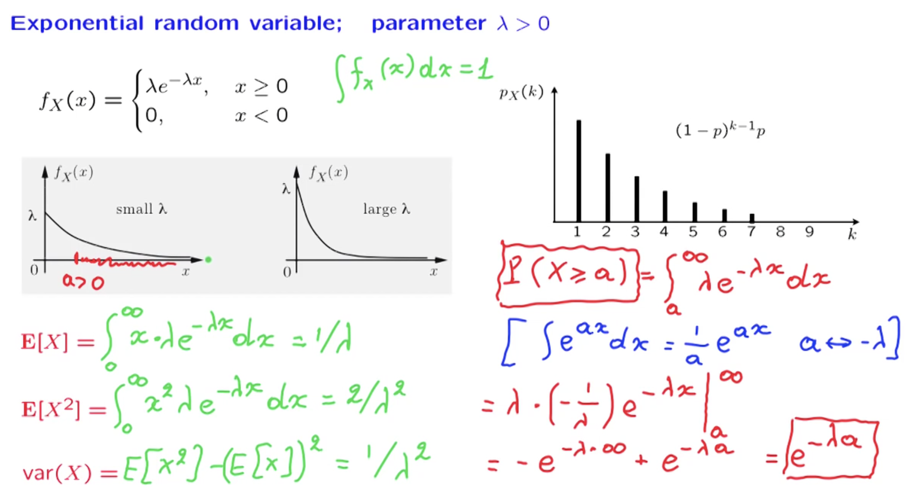

   4. 特点：无记忆性，即基于已经过去的时间，事情发生需要等待的时间的概率分布保持不变。比如一个用了t个小时的灯泡，一个没用过的灯泡，它们能持续发亮x时间的概率是一样的，并不会说旧灯泡的概率就更低。类比几何分布，可以认为，每过$\lambda$的时间长度，成功的概率为$\lambda \delta \quad (\delta→0)$。

      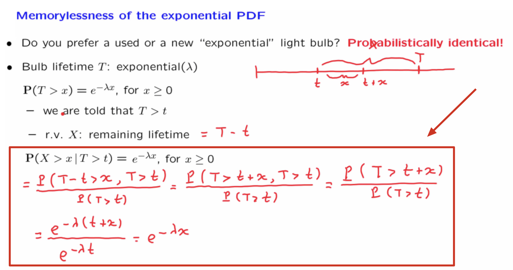

3. 正态r.v.(normal/Gaussian random variables)：作为概率学中最重要的r.v.，基于中心极限定理(central limit theorem)，它是最常见的随机模型(model for randomness)。

   1. 标准正态分布PDF：$N(0,1) \sim f_X(x)= \frac{1}{\sqrt{2 \pi}}e^{-x^2/2}$，也用$\phi$表示。
   2. 一般正态分布PDF：$N(\mu,\sigma^2) \sim f_X(x)= \frac{1}{\sigma \sqrt{2 \pi}}e^{-(x-\mu)^2/2 \sigma^2}$，$\sigma ≠0$
   3. 一般正态分布标准化：$\phi = \frac{X- \mu}{\sigma} \sim N(0,1)$，即$X = \phi \cdot \sigma +\mu$
   4. 期望：$E(X) = \mu$
   5. 方差：$Var(X) = \sigma^2$
   6. 计算正态分布的概率：使用标准正态分布CDF表。

   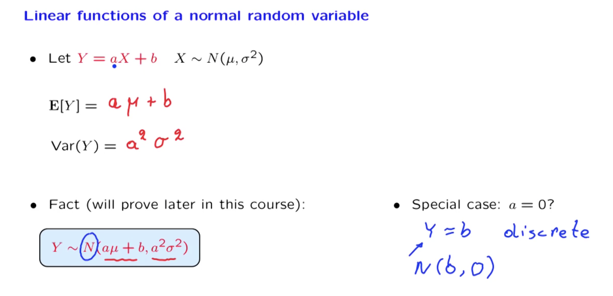

   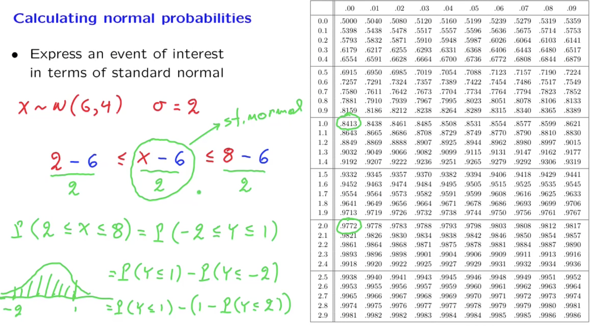

### 1.4. Cumulative Distribution Functions

1. 定义：CDF是另一种描述概率分布的方式，既可用于描述连续型，也可描述离散型变量，表示为$F_X(x)=P(X≤x)$。

   1. 连续型：$F_X(x) = \int_{-\infty}^xf_X(x)dx$
   2. 离散型：$F_X(x)$
   3. 与PDF的关系：$\frac{dF_X(x)}{dx}=f_X(x)$，该点要可导。

   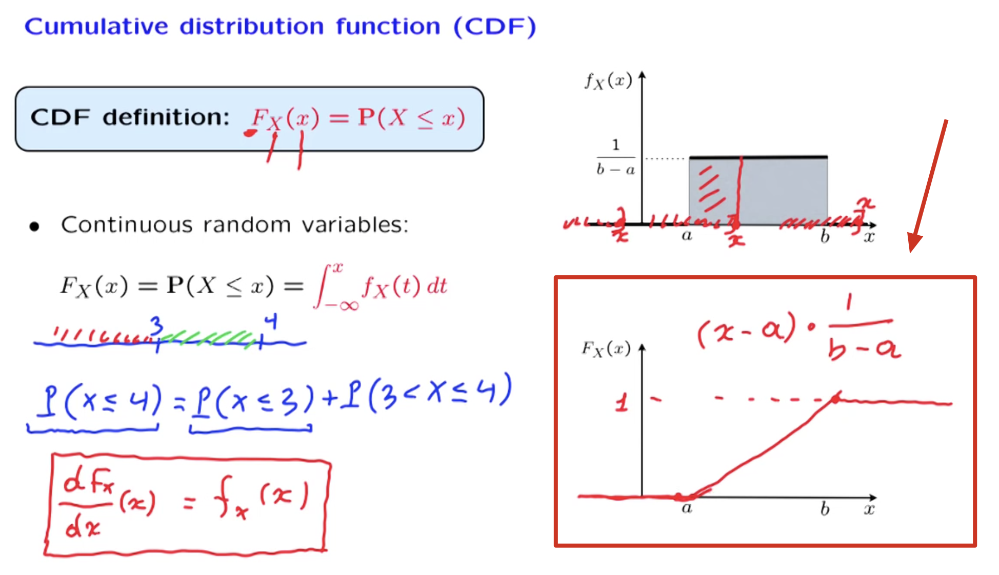

2. 属性：

   1. 递增，non-decreasing
   2. x趋向正无穷，CDF趋向于1；x趋向负无穷，CDF趋向于0

   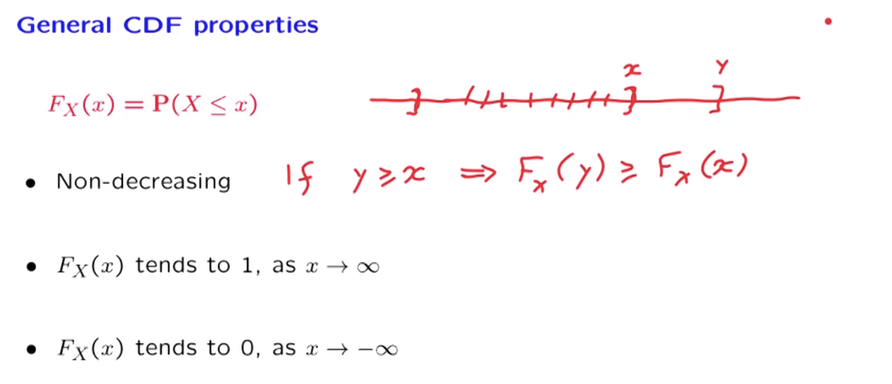

## 2. Conditioning on an event, Multiple r.v.'s and Joint PDFs

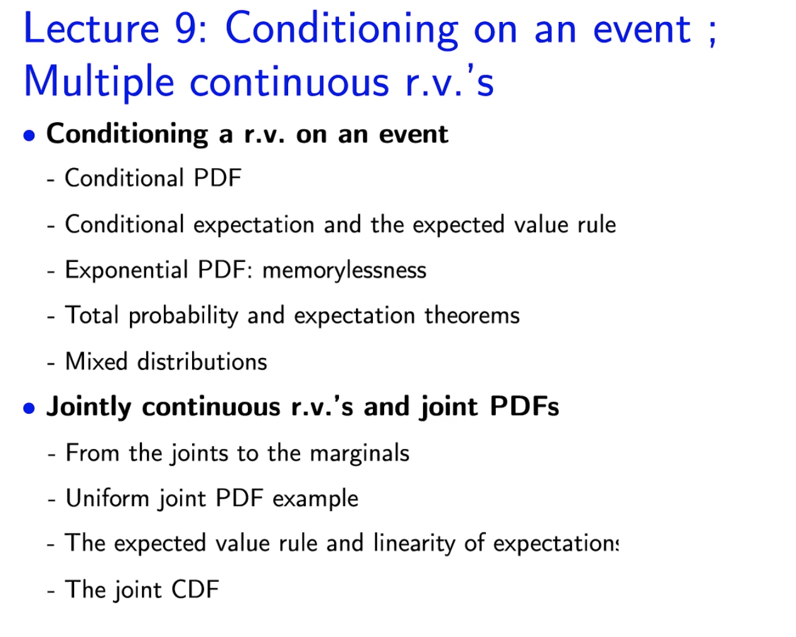

### 2.1. Conditional PDFs

1. 定义：条件PDF和条件PMF是类似的，都是基于一个事件更新概率。我们可以先计算满足事件A的X范围，并计算$P(X \in A)$，从而可以得到条件PDF。
   $$
   举例：基于X\in A的条件PDF:\\
   f_{X|x \in A}(x) \cdot \delta= P(x ≤X ≤x+\delta|x \in A) = \frac{P(x ≤X ≤x+\delta, x \in A)}{P(A)}\\
   因此：\\
   f_{X|x \in A}(x)= \left\{
   \begin{aligned}
   0 & & X \notin A\\
   \frac{f_X(x)}{P(A)} & & X \in A 
   \end{aligned}
   \right.
   $$
   

   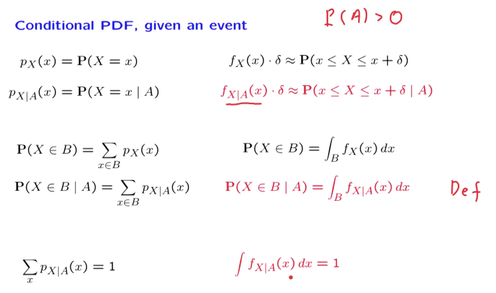

2. 条件期望：条件期望也是类似。

   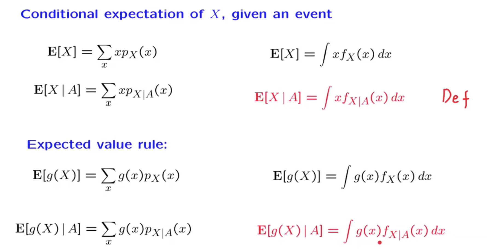

3. 总概率和期望定理：

   1. 总概率定理：
      $$
      f_X(x) = P(A_1)f_{X|A_1}(x) + P(A_2)f_{X|A_2}(x)+...+P(A_n)f_{X|A_n}(x)\\
      ---\\
      F_X(x) = P(A_1)F_{X|A_1}(x) + P(A_2)F_{X|A_2}(x)+...+P(A_n)F_{X|A_n}(x)
      $$

   2. 总期望定理：
      $$
      E[X] = P(A_1) \cdot E[X|A1] + P(A_2) \cdot E[X|A_2]+...+ P(A_n) \cdot E[X|A_n]
      $$
      

### 2.2. Mix R.V.

1. 除了离散型r.v.和连续型r.v.，还存在混合型r.v.，既有PMF，又有PDF。这时，使用CDF来描述变量就更为简便。
   $$
   对于混合型r.v.：\\
   X= \left\{
   \begin{aligned}
   Y & & P(Y)=p\\
   Z & & P(Z)=1-p
   \end{aligned}
   \right.\\
   其CDF可以表示为：\\
   F_X(x) = P(Y)F_{X|Y}(x) + P(Z)F_{X|Z}(x)
   $$
   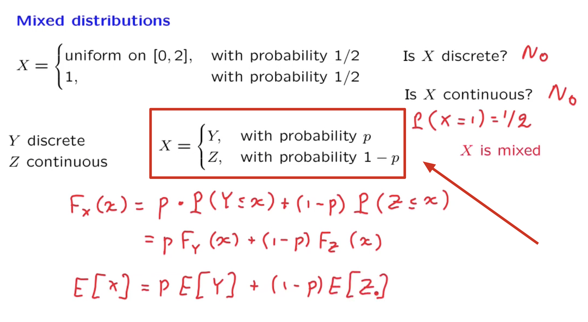

### 2.3. Joint PDFs

1. 定义：连续型多变量的联合PDF和离散型类似，描述了变量间的关系，但理解上更抽象化。我们可以认为：==如果两个变量能被一个联合PDF描述，则认为他们是联合连续的(Two random variables are jointly continuous if they can be discribed by a joint PDF)==。而两个变量能被一个联合PDF描述，要求两个变量的概率在两个维度伸展。
   $$
   P((X,Y) \in B) = {\int \int}_{(x,y \in B)}f_{X,Y}(x,y)dxdy= P(a≤X≤b, c≤Y≤d)\\
   ---\\
    = \int_c^d \int_c^b f_{X,Y}(x,y)dxdy
   $$

   1. 属性：$f_{X,Y}(x,y)≥0$，$\int_{-\infty}^{+\infty}\int_{-\infty}^{+\infty} f_{X,Y}(x,y)dxdy = 1$
   2. 注意：与PDF一样，联合PDF提供的是每单位面积的概率密度，而非概率。
   3. 假设area(B)=0，则$P((X,Y) \in B)=0$，也就是说，联合分布是对X和Y的双重积分，需要满足2个维度的积分，只积分一个维度的话，P=0 (Probability is not allowed to be concentrated on a one-dimensional set)。举例：$X=Y$，则所有的点都将落在y-x=0的直线上，而直线构不成面积B，因此，X和Y无法联合连续(X and Y are not jointly continuous)。

   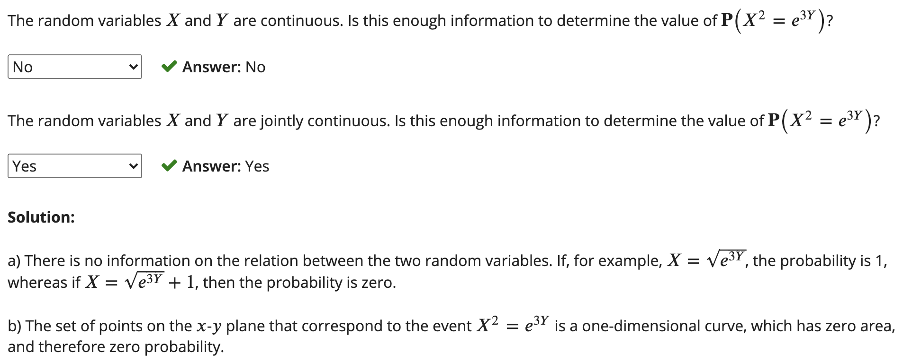

2. 双重积分的条件解读：假设要计算$0<y<x<1$的概率，已知X和Y满足联合PDF$f_{X,Y}(x,y)$，则计算可以有两种方式：
   1. 基于$y \in [0,1]$，x的取值范围是[1,y]，则：$P(0<y<x<1) = \int _0^1 \int _ y^1 f_{X,Y}(x,y)\, dx\, dy$
   2. 基于$x \in [0,1]$，y的取值范围是[0,x]，则：$P(0<y<x<1) = \int _0^1 \int _0^ x f_{X,Y}(x,y)\, dy\, dx$

