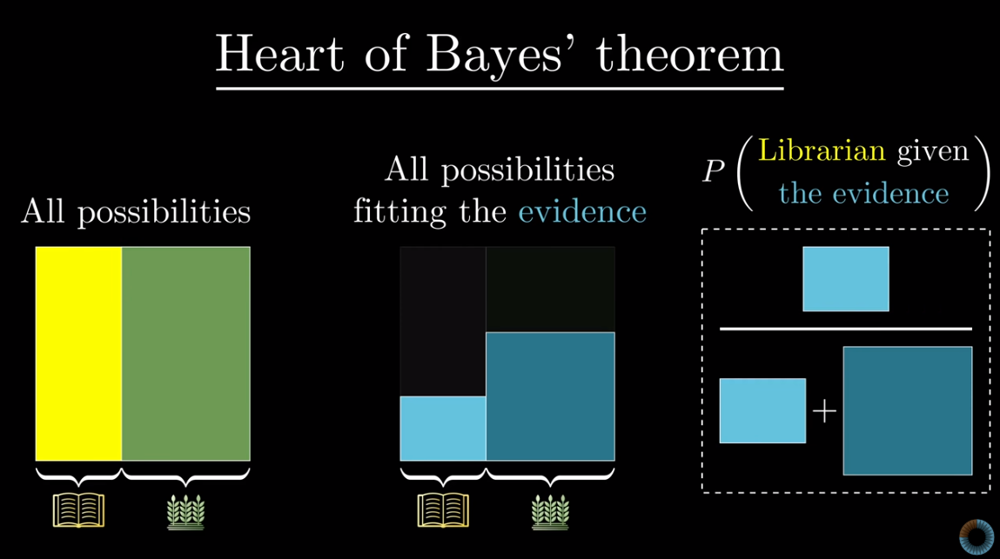
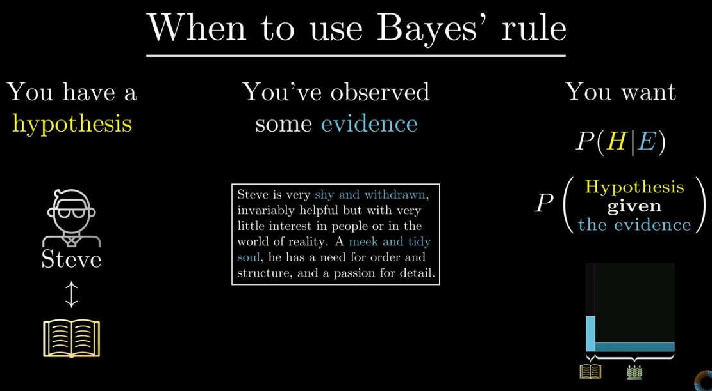
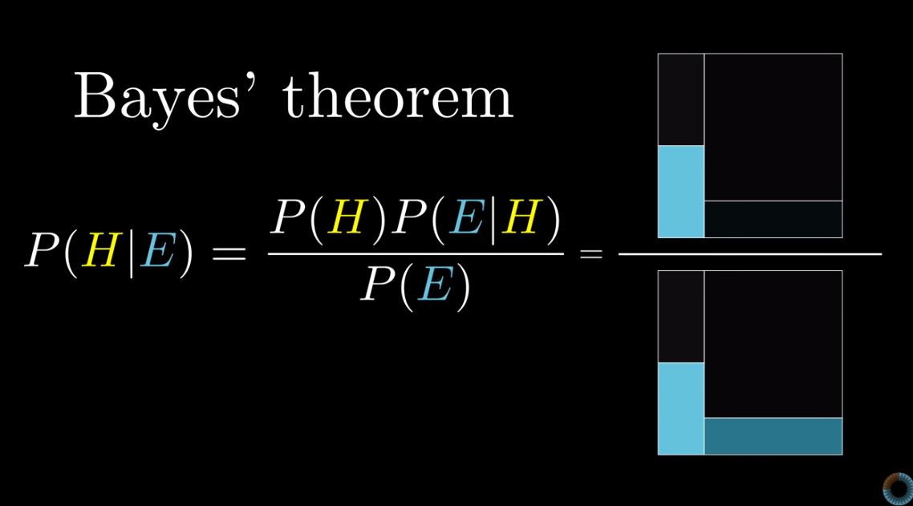
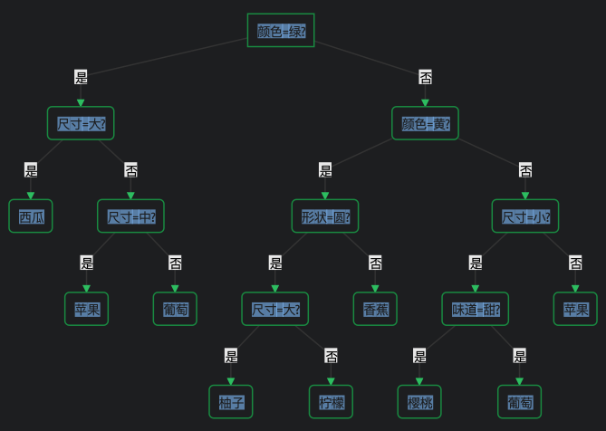

# 1.贝叶斯定理（bayes theorem）





# 2.朴素贝叶斯定理

> 朴素贝叶斯定理假设属性之间条件独立，即$p(a_1,a_2 | w_i) = p(a_1| w_i) * p(a_2 | w_i)$。

# 3.决策树模型

> * 决策树算法利用非度量（nunmetric）的方式进行一系列的查询问答来判断和分类，被广泛用于分类和回归模型，三种最常用的实现算法是CART(classification and regression tree)、ID3(interactive dichotomizer-3)、C4.5。
> * 对于同一个数据集，特征和节点可以有多种组合方式，实际上可以生成很多决策树。我们运用决策树算法是希望从中找出最合适的树，因此算法的核心是如何在节点上放入合适的特征。

**决策树构成**

* 决策树由三部分构成：根节点（root）、节点（node）、叶子（leaves）
  **root**
* 决策树的根部，即上图中的第一层“颜色”。
  **node**
* 决策树的节点。
  **leaves**
* 决策树的叶子，即最终的分类，如西瓜、苹果等。

## 1)算法优缺点

**优点**

* 可表示性强：决策树可以提取规则/决策依据，类似人类逻辑化的决策，易于向其他人展示和说明模型的决策过程。
* 分类速度快：决策树只需要一系列的简单查询，无需计算和度量，当问题比较简单且训练样本比较少时，非常有效。

**缺点**

* 对于同一个数据集，可以生成很多类型的决策树。虽然已经有很多先进的算法和测量指标，但如何找到全局最优的树依旧令人困惑。
* 通常来讲，我们遵循奥卡姆剃刀原则，倾向于选择更简单紧凑的树，即最少的节点和最少的叶子。

> 奥卡姆定理："如无必要，勿增实体"。

## 2)算法核心问题

### 2.1)分支数量和叶节点标记

* 分支数量是指从一个节点分出去的分支数目，也称为节点的分支系数或分支率（branching ratio）。
* 根据分支数量的不同，可以把树分成二叉树（分支数量恒等于2）和多叉树（分支数量部分大于2）
* 关于叶节点标记，理想情况下，最终树的每一个叶子都只包含单一的样本，那么该类别的标记就是叶节点标记；但是，多数情况下，叶子一般都有多个类型的样本，这时就是少数服从多数，用数量最多的样本类别来标记。

### 2.2)节点选取和不纯度

> * 在构建模型时，我们希望节点数据尽可能地“纯”，这样就可以停止分叉。因此，我们定义了一个“不纯度（impurity）”指标，并选择**能够使不纯度下降最快的特征**做分支。
> * 不纯度用$i(N)$表示节点N的不纯度。当所有数据均属于同一类别时，$i(N)=0$。常见的不纯度测量函数有3个，分别是熵不纯度(entropy impurity)、Gini不纯度(Gini Index)、方差不纯度、误分类不纯度((Classification error)，其中普遍采用的是前两种。

**熵不纯度**

* 熵不纯度亦称为信息量不纯度(information impurity)，是对信息量的一个加权计算，适用于类别标记概率不等的情况（即$P(w_j)≠P(w_i)$），计算公式为：

$$
i_E(N) = -\sum_j P(w_j)log_2P(w_i)
$$

* 熵不纯度最大值为1，表示最不确定；最小值为0，表示完全确定。

* 举例：14个人中有9个人买了N，5个人没买N，则i(N)为：
  $$
  i_E(N) = -{\frac{9}{14}}log_2{\frac{9}{14}} - {\frac{5}{14}}log_2{\frac{5}{14}} = 0.940
  $$

**方差不纯度**

* 方差不纯度适用于二分类问题，计算公式是：
  $$
  i_V(N) = P(w_1)P(w_2)
  $$

**Gini不纯度**

* Gini不纯度由方差不纯度推广而来，可用于多分类问题，表示当节点N的类别标记随机选取时对应的误差率，计算公式为：
  $$
  i_g(N) = \sum_{i≠j}P(w_i)P(w_j) = 1- \sum_{j}P^2(w_j)
  $$

* 当$P(w_1)=P(w_2)=...=P(w_j)=\frac{1}{j}$时，Gini不纯度最大，为$1-\frac{1}{j}$，表示最不确定；Gini不纯度最小为0，表示完全确定。

**误分类不纯度**

* 误分类不纯度用于衡量节点N处分类误差的最小概率，类别标记等概率时，误分类不纯度具有最好的峰值特性，计算公式为：
  $$
  i_C(N) = 1-max_jP(w_j)
  $$

* 需注意的是：误分类不纯度存在不连续的导数值，因而在连续参数控件搜索最大值时会出现问题。

**不纯度变化量**

* 二分支(即分支数目=2)：
  $$
  \Delta i(N) = i(N)- P_Li(N_L)-(1-P_L)i(N_R)
  $$

* 其中，$N_L$和$N_R$分别是左、右节点，$i(N_L)$和$i(N_R)$表示相应的不纯度。
* 如果采用的是熵不纯度，则不纯度下降差就是本次分支所能提供的信息增益（Information Gain）

* 多重分支(即分支数目>2)：

  $$\Delta i(s) = i(N)- \sum_{k=1}^{B} P_ki(N_k)$$

  $$\Delta i_B(s) = \frac{\Delta i(s)}{-\sum_{k=1}^{B} P_k log_2 P_k}$$

* 多重分支的不纯度变化量以“增益比不纯度”进行比较，选择$\Delta i_B(s)$最大的那个。

> 总结一下：
> 1.我们通过不纯度测量选择最合适的分支特征，最常用的测量函数是基于信息加权的商不纯度和基于随机选取误差率的Gini不纯度。
> 2.不管用哪种不纯度测量函数，最终我们的目的是计算和比较各个特征的不纯度变化量，选择变化量最大的特征做分支。
> 3.实践中发现选择不同形式的不纯度函数对最终分类的效果及性能其实影响很小，切勿纠结于此！

### 2.3)停止分支准则

> * 如果我们持续生长树，直到所有的叶节点都达到最小的不纯度，则数据可能会“过拟合”。
> * 为防止过拟合，我们可以使用停止分支准则来控制树的生长，常见的做法有：
>   1.控制验证集或交叉验证的分类误差：持续分支直至分类误差最小化
>   2.设定不纯度变化量的阈值：当不纯度变化量低于阈值时，停止分支
>   3.分析不纯度变化量的统计显著性：当不纯度下降统计不显著，停止分支

**验证集或交叉验证**

* 首先需说明：验证集和交叉验证是不同的。验证集(validation set)是指用部分的训练样本(如90%)进行训练，然后用剩余部分进行验证；交叉验证(cross-validation)则依赖于从训练集中随机选择的子集，适用于样本量较少的情况。
* 该做法是预先设定一个分类误差衡量指标，如f1score、accuracy、G-mean、AUC等。然后持续进行分支，直至达到指标最优为止。

**设定不纯度变化阈值**

* 该做法的优点在于全部的样本都可用于训练，而不需要预留验证的数据；但也存在明显的缺点是：阈值的选择相当困难，因为模型的最终性能和阈值的大小无直接的函数关系。简而言之，就是我们虽然可以通过阈值停止分支，但无法得知这个模型是否是最优的。
* 我们一般通过设定决策树最大深度（max_depth）、节点被分开的最小样本数（min_samples_split）、叶子节点的最小样本数（min_samples_leaf）、分开节点变为叶子的最小比例（min_weight_fraction_leaf）、叶子节点的最大数（max_leaf_nodes）来间接设定阈值。

**不纯度变化量的统计显著性分析**

* 这一做法融合了“假设检验”技术，比如使用卡方检验来做分析，则当某个节点“最显著”的分支生成的卡方统计量比给定的置信水平低时，认为统计不显著，停止分支。

* 统计显著性分析的目的是确定候选分支是否有统计学上的意义，即判断该分支是否明显有别于随机分支，比如用卡方来估计分支s和随机分支的偏离度，则：
  $$
  X_2 = \sum_{i=1}^{2} \frac{{(n_{iL}-n_{ie})}^2}{n_{ie}}
  $$

* 其中，$n_{iL}$是指s分支下$w_{i}$类的样本送往左分支的数目，$n_{ie}$则是随机分支情况下的值。

### 2.4)剪枝技术(pruning)

> * 因为停止分支准则是从树的根节点开始优化，在节点N处进行的最优分支决策不会考虑对其下面一层的节点的影响。因此，有时候，分支会因为缺少足够的前瞻性而过早停止，称为“视界局限效应”。
> * 剪枝技术和停止分支准则不同的是：它允许树先充分生长直到叶节点都有最小的不纯度，从而克服视界局限效应；然后再考虑是否消去相邻的叶子或子树。
> * 简而言之，停止分支准则是在树还是“树苗”的时候就控制它是否继续生长；而剪枝技术则等树长成“参天大树”之后再慢慢修剪。因此，它们也被称为“预剪枝”技术和“后剪枝”技术。

**剪枝技术优缺点**

* 优点：克服了“视界局限效应”，且无需保留验证集数据。
* 缺点：计算量代价过大，特别是对于大样本集。

**剪枝类型**

* 不纯度剪枝：通过比较删除后的不纯度变化量，考虑是否删除相邻的叶节点，并令他们的公共父节点成为新的叶节点。
* 规则剪枝：规则剪枝的优点在于它考虑了上下文信息的区别，其在每一个叶节点上都附有一条规则，根据规则是否冗余的判断，进行规则简化，提高模型的推广能力。后文中提及的C4.5算法就是基于树规则的剪枝。

> * 综上所述，我们在进行决策树模型优化时，可从停止分支和剪枝等方面进行优化。
> * 一般来说，对于小样本的数据集，由于计算代价小，剪枝方法优于分支停止方法

### 2.5)特征处理

**连续值处理**

* 决策树对连续变量的处理方式是将其离散化。
* 为了减少计算复杂度，不管是二叉树还是多叉树，常见做法都是将数据一分为二，计算使不纯度最小的划分点。

**缺失值处理**

* 不同于其他算法，决策树对缺失值的容忍度较高，常用的树算法如CART、C4.5都支持缺失值处理。
* 不同树算法的缺失值处理方式不同，在此不做具体说明。

## 3)常用树算法

> 在这里，我们介绍3种最常用的决策树算法：CART、ID3、C4.5

### 3.1)CART算法

> * CART算法是一种二分递归分割技术，把当前样本划分为两个子样本，使得生成的每个非叶子结点都有两个分支， 因此CART算法生成的决策树是结构简洁的二叉树(binary tree)。
> * 二叉树的分支率(branching ratio)为2，每一步的决策时只能是“是”或者“否”，即使一个特征有多个取值，也是把数据分为两部分。任何一个具有任意分支率的树都可以用二叉树表示。



**CART的优缺点**

* 训练简单：二叉树具有万能的表达能力，并且训练上非常简便。
* 优化简单：二叉树作为一棵单调简单的树，在节点处的判别是一个一维优化的过程，更容易在节点处找到最优决策。
* 模型普适：不同另外两种算法，CART既可用于分类，又能用于回归。
* 模型不稳定：CART算法最大的缺点在于，即便是很小的样本点变动，也会导致截然不同的模型。这个缺点可以由集成学习里的随机森林方法、gradientboost等补足。

### 3.2)ID3算法

> ID3最早的设计意图是用于处理“语义（无序）数据”的，因此，对于它并不能直接处理数值连续变量，但它开创了使用熵来度量不纯度的先河，率先对信息进行了加权计算。
> 当然，作为一个创新的算法，有着很多的不足。

**ID3的不足**

* 无法处理连续变量和缺失值。
* 无法剪枝，没有考虑过拟合的问题。

### 3.3)C4.5算法

> C4.5是ID3的作者改良后的版本，它解决了ID3的不足，包括连续变量的处理、剪枝技术等。

**C4.5的不足**

* 计算效率低：C4.5生成的是多叉树，相较二叉树，在节点处理上更复杂，运行效率较低。
* 不支持回归：C4.5只能用于分类，这也限制了它的推广。

### 3.4)算法比较

| 算法 | 支持模型   | 树结构 | 分支选择     | 连续值处理 | 缺失值处理 | 剪枝   | 一句话概括       |
| ---- | ---------- | ------ | ------------ | ---------- | ---------- | ------ | ---------------- |
| CART | 分类、回归 | 二叉树 | Gini不纯度   | 可以       | 可以       | 可以   | 万能的"是"和"否" |
| ID3  | 分类       | 多叉树 | 信息增益     | 不可以     | 不可以     | 不可以 | 低配版信息决策   |
| C4.5 | 分类       | 多叉树 | 增益比不纯度 | 可以       | 可以       | 可以   | 高配版信息决策   |

> 对这三个算法感兴趣想要进一步了解的童鞋可以看一下这位博主的文章，写得非常详细：
> 1.《决策树算法原理(上)》https://www.cnblogs.com/pinard/p/6050306.html
> 2.《决策树算法原理(下)》https://www.cnblogs.com/pinard/p/6053344.html

## 4)过拟合问题

> 当属性过多时，决策树可能会出现过拟合问题，这时需要做一些参数设置来防止过拟合。

# 4.决策树代码

```
from sklearn.tree import DecisionTreeClassifier
Tree = DecisionTreeClassifier(criterion="entropy", max_depth = 4)

Tree.fit(X_trainset,y_trainset)

y_pre = Tree.predict(X_testset)

from sklearn import metrics
print("DecisionTrees's Accuracy: ", metrics.accuracy_score(y_testset, predTree))
```