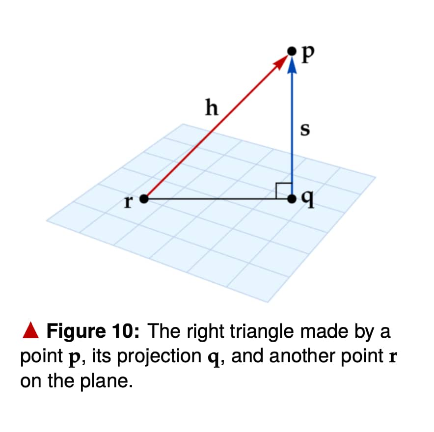
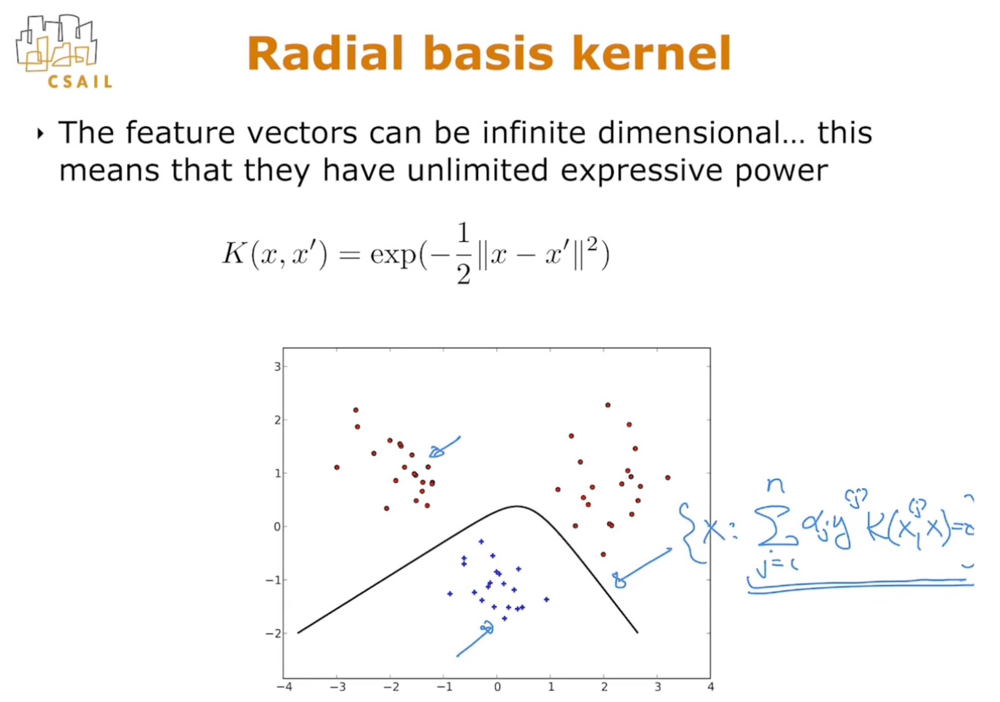
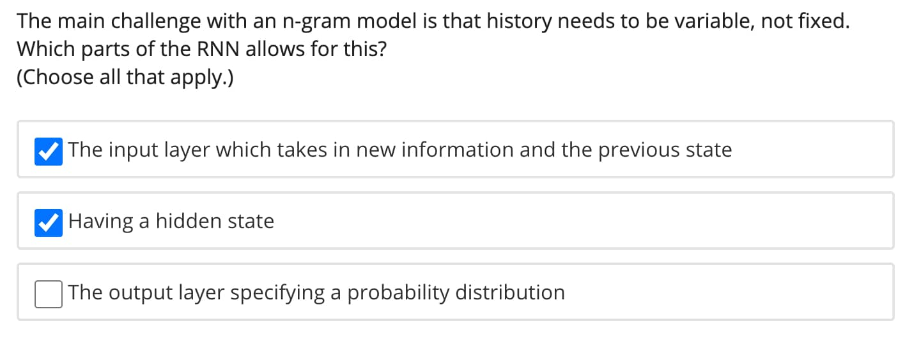

[toc]

# Conda Installtion & Programming basis 

## 1. Anaconda and Enrivonment

1. Anaconda是一个可以在单机上创建和管理很多虚拟环境(virtual environment)的工具，其集合了很多数据科学和机器学习的安装包如pandas、numpy、sklearn等，可以简单通过conda install package-name进行安装。

   ```python
   # 安装包
   conda install pandas
   
   # 创建环境
   conda create --name ev1
   
   # 激活环境
   conda activate ev1
   
   # 退出环境
   conda deactivate
   
   # 删除环境
   conda env remove -n ev1
   ```

   1. 为环境下载特定的包：可以在anaconda navigator里操作，也可以用命令行激活环境进行conda install/pip install

   2. 为pycharm配置conda环境：快捷键【command + ，】打开preferrences为指定project添加python interpreter。

      

## 2. Numpy的常用函数

1. 单个变量的操作：

   ```python
   # 1. 创建随机数组
   np.random.random((2,4))
   np.zeros((2,4))
   np.ones((2,4))
   
   # 2. 创建等差一维数组
   np.linspace(1,10,11)
   np.arange(1,10,0.5)
   
   # 3. 向量最大值/最小值、模计算
   x.max()
   x.min()
   np.linalg.norm(x)
   
   # 4. 获取数组指定位置的值
   x[1,1].item()
   ```

2. 多个变量的操作：

   ```Python
   # 4. 矩阵变换与运算
   x.T # 转置矩阵
   np.linalg.inv(x) # 逆矩阵
   np.matmul(x,y) / x@y # 矩阵乘法
   x*y # 矩阵元素乘法
   np.exp(x) # e指数乘法
   np.sin(x)/np.cos(x)/np.tanh(x) # 弦函数
   
   # 5. 向量化函数
   def function(x, y):
       if x <= y:
           f = x*y
       else:
           f = x/y
       return f
   f = np.vectorize(function，otypes = [float])
   f(x,y) # x和y为向量
   
   # 6.比较两个向量
   np.maximum(x,y) #对x和y的对应元素进行比较，取出较大元素，得到新的向量z
   ```

## 3. PyTorch的基础教学

1. PyTorthshi是梯度深度学习常用的计算包，基于numpy开发，包含了很多深度学习的模块并能自动求导(automatic differentiation)。

2. PyTorch中和numpy的数组一致的结构教Tensors( tensors = ndarrays)，这两个类型享受相同的记忆操作(share the same memory handles)，因此可以互相转化。其常用操作有：

   ```Python
   # 1. 创建随机数组
   torch.ones(2,2)
   torch.zeros(2,2)
   torch.randn(2,2) # 正态分布随机数
   
   # 2. tensors & ndarrays
   ndarray = tensor.numpy()
   tensor = torch.from_numpy(numpy_ndarray)
   
   # 3. 索引、切片(和数组一致)
   tensor[2,2] # 第三行第三列，返回数组
   tensor[2,2].item()  # 返回数值
   
   tensor[2:4,:]  # 第3、4行
   
   # 4. 简单运算
   a+b # 加法
   a*b # 元素相乘
   a.mm(b) # 矩阵相乘a@b
   a.matmul(b[:,0]) # 矩阵向量相乘
   
   # 5. 全部元素运算(in-place operation)
   a.div_(2)  # 全部元素除以2
   a.zero_()  # 全部元素设为0
   
   # 6. 改变维度
   a.unsqueeze(0).size()  # 在最开始增加维数，如(10,10)→(1,10,10)
   a.squeeze(0).size()   # 拿走最开始的维数，如(1,10,10)→(10,10)
   a.view(100,1)        # 更改维度形式，如(10,10)→(100,1)
   
   # 7. 打散一个tensor
   torch.randperm(5)  # 将一个序列打散，如5打散成(3,1,5,4,2)
   ```

2. 小批量梯度下降(mini-batch SGD)是深度学习中最常用的梯度下降法，不同于全梯度下降和完全随机梯度下降(full gradient descent and stochastic gradient descent)，它每次都随机选择一部分样本计算梯度。它的优点是：

   1. 相对于SGD，它更稳定
   2. 相对于FGD，它计算更高效(computational efficiency)

   因此，在Pytorch的深度学习模块中一般都以batched tensor 作为输入。我们来看看它是如何自动计算梯度的吧

   ```Python
   # 1. 看看简单的求导吧
   x = torch.randn(1, requires_grad=True) # 设定梯度对象
   y = x.exp()  # 设定函数 y=e^x
   y.backward(retain_graph=True)  # 反向传播函数，retain_graph=True可以多次求导
   print(x.grad) # 求导dy/dx = e^x
   
   # 2. 看看简单的连续求导
   x_a = torch.randn(1, requires_grad=True)
   x_b = torch.randn(1, requires_grad=True)
   x = x_a * x_b
   x1 = x ** 2
   x2 = 1 / x1
   x3 = x2.exp()
   x4 = 1 + x3
   x5 = x4.log()
   x6 = x5 ** (1/3)
   x6.backward(retain_graph=True)
   print(x_a.grad)
   print(x_b.grad)
   ```

3. 动手来一个自动求导的简单NN模型(SGD)：

   ```Python
   # 1. 载入函数包并设定随机种子（保证结果的一致性）
   import random
   import numpy as np
   
   def set_seed(seed):
       random.seed(seed)
       np.random.seed(seed)
       torch.manual_seed(seed)
       if torch.cuda.is_available():
           torch.cuda.manual_seed(seed)
   
   # 2. 载入数据 
   from sklearn.datasets import make_classification
   X, Y = make_classification(n_features=2, n_redundant=0,n_informative=1, n_clusters_per_class=1)
   X, Y = torch.from_numpy(X), torch.from_numpy(Y) # 转tensor
   X, Y = X.float(), Y.float() # 转成float形式
   
   # 3. 设定相关参数
   num_feats = 2  # 特征为2个
   hidden_size = 100  # 隐藏层
   num_outputs = 1 # 输出层1个
   eta = 0.1  # 学习率
   num_steps = 1000  # 求导次数
   indices = torch.randperm(X.size(0)) # SGD的随机处理序列
   avg_loss = []  # 求取每次更新参数后的平均误差
   
   # 4. 设定要求导/优化的参数
   W1 = torch.randn(hidden_size, num_feats, requires_grad=True) 
   b1 = torch.zeros(hidden_size, requires_grad=True)
   
   W2 = torch.randn(num_outputs, hidden_size, requires_grad=True)
   b2 = torch.zeros(num_outputs, requires_grad=True)
   
   parameters = [W1, b1, W2, b2]
   
   # 5. RUN
   for step in range(num_steps):
       # Get example
       i = indices[step % indices.size(0)]
       x_i, y_i = X[i], Y[i]
       
       # Run example
       hidden = torch.relu(W1.matmul(x_i) + b1)
       y_hat = torch.sigmoid(W2.matmul(hidden) + b2)
       
       # Compute loss binary cross entropy: -(y_i * log(y_hat) + (1 - y_i) * log(1 - y_hat)), Epsilon for numerical stability
       eps = 1e-6
       loss = -(y_i * (y_hat + eps).log() + (1 - y_i) * (1 - y_hat + eps).log())
   
       # Add to our running average learning curve. Don't forget .item()!
       if step == 0:
           avg_loss.append(loss.item())
       else:
           old_avg = avg_loss[-1]
           new_avg = (loss.item() + old_avg * len(avg_loss)) / (len(avg_loss) + 1)
           avg_loss.append(new_avg)
       
       # Zero out all previous gradients
       for param in parameters:
           # It might start out as None
           if param.grad is not None:
               # In place
               param.grad.zero_()
   
       # Backward pass
       loss.backward()
       
       # Update parameters
       for param in parameters:
           # In place!
           param.data = param.data - eta * param.grad
   ```

4. 实际上Pytorch有很多现成的魔法函数供我们调用。常用的NN函数有：

   ```Python
   import torch.nn as nn
   
   # 1. 设定相关层的初始值(默认会自动求导)
   ## 1.1. 线性层：in_features, out_features
   linear = nn.Linear(10, 10, bias=True) # 10 in, 10 out
   
   ## 1.2. 卷积层：in_channels, out_channels, kernel_size, stride
   conv = nn.Conv2d(1, 20, 5, 1)
   
   ## 1.3. RNN：num_inputs, num_hidden, num_layers
   rnn = nn.RNN(10, 10, 1)
   
   # 2. 构建模型
   class Net(nn.Module):
       def __init__(self):
           super(Net, self).__init__()
           # 1 input channel to 20 feature maps of 5x5 kernel. Stride 1.
           self.conv1 = nn.Conv2d(1, 20, 5, 1)
   
           # 20 input channels to 50 feature maps of 5x5 kernel. Stride 1.
           self.conv2 = nn.Conv2d(20, 50, 5, 1)
   
           # Full connected of final 4x4 image to 500 features
           self.fc1 = nn.Linear(4*4*50, 500)
           
           # From 500 to 10 classes
           self.fc2 = nn.Linear(500, 10)
   
       def forward(self, x):
           x = F.relu(self.conv1(x))
           x = F.max_pool2d(x, 2, 2)
           x = F.relu(self.conv2(x))
           x = F.max_pool2d(x, 2, 2)
           x = x.view(-1, 4*4*50)
           x = F.relu(self.fc1(x))
           x = self.fc2(x)
           return F.log_softmax(x, dim=1)
   
   # Initialize it
   model = Net()
   
   # 3. 设定优化器(optimizer)
   import torch.optim as optim
   optimizer = optim.SGD(model.parameters(), lr=0.01) # SGD
   
   # 4. 开始训练
   import tqdm
   import torch.nn.functional as F
   
   def train(model, train_loader, optimizer, epoch):
       # For things like dropout
       model.train()
       
       # Avg loss
       total_loss = 0
       
       # Iterate through dataset
       for data, target in tqdm.tqdm(train_loader):
           # Zero grad
           optimizer.zero_grad()
   
           # Forward pass
           output = model(data)
           
           # Negative log likelihood loss function
           loss = F.nll_loss(output, target)
   
           # Backward pass
           loss.backward()
           total_loss += loss.item()
           
           # Update
           optimizer.step()
   
       # Print average loss
       print("Train Epoch: {}\t Loss: {:.6f}".format(epoch, total_loss / len(train_loader)))
   
   # 5. 测试模型
   def test(model, test_loader):
       model.eval()
       test_loss = 0
       correct = 0
       with torch.no_grad():
           for data, target in test_loader:
               output = model(data)
               test_loss += F.nll_loss(output, target, reduction='sum').item() # sum up batch loss
               pred = output.argmax(dim=1, keepdim=True) # get the index of the max log-probability
               correct += pred.eq(target.view_as(pred)).sum().item()
   
       test_loss /= len(test_loader.dataset)
   
       print('\nTest set: Average loss: {:.4f}, Accuracy: {}/{} ({:.0f}%)\n'.format(
           test_loss, correct, len(test_loader.dataset),
           100. * correct / len(test_loader.dataset)))
   
   # 6. 设定数据加载器
   from torchvision import datasets, transforms
   
   train_loader = torch.utils.data.DataLoader(
       datasets.MNIST('../data', train=True, download=True,
                      transform=transforms.Compose([
                          transforms.ToTensor(),
                          transforms.Normalize((0.1307,), (0.3081,))
                      ])),
       batch_size=32, shuffle=True)
   
   test_loader = torch.utils.data.DataLoader(
       datasets.MNIST('../data', train=False,
                      transform=transforms.Compose([
                          transforms.ToTensor(),
                          transforms.Normalize((0.1307,), (0.3081,))
                      ])),
       batch_size=32, shuffle=True)
   
   # 7. 迭代训练模型
   for epoch in range(1, 10 + 1):
       train(model, train_loader, optimizer, epoch)
       test(model, test_loader)
   ```

   

## 4. How to Debug

1. PDB安装包：利用pdb使用命令行进行操作 https://realpython.com/python-debugging-pdb/

```python
# 创建特定的断点处
import pdb; pdb.set_trace() # 传统写法
breakpoint() # 推荐写法
python3 -m pdb my_program_name.py arg1 arg2 # 命令行写法

# p命令/pp命令打印变量
p variables

# q命令退出debug
## ll命令列出代码/函数来源

# step相关的命令
n  # 即step over
s  # 即step into
c  # 继续执行直到下一个断点

# 设置断点条件
b(reak) [ ([filename:]lineno | function) [, condition] ]

# a命令打印当前的参数列表
```

2. 利用pycharm进行debug：
   1. step over：执行下一步
   2. step into：进入定义的外部函数文件中执行每一步
   3. step into mycode：进入本脚本定义的函数代码执行每一步
   4. step out：跳出函数


3. python的可变参数设置：
   1. 当定义函数时，Python的默认参数将被评估一次，而不是在每次调用函数时被评估。这意味着，如果使用的可变默认参数发生了突变，那么调用的是突变的对象。因此，为了保证每次调用函数的参数，可以将其设置为none。
   2. lambda函数建立了x的函数，但是是在调用时才抓取相应的参数值。比如：for i in range(3):metrics.append(lambda x: x + i)，最终调用函数for metric in metrics: matric(2)只会抓取到i=2，输出结果4。因此，为解决这个问题，可以直接将i绑定到函数里。
   3. 参考资料：https://docs.python-guide.org/writing/gotchas/

```python
def get_sum_metrics(predictions, metrics=None): # 输入参数
   if metrics is None:
       metrics = []
    for i in range(3):
        metrics.append(lambda x, y=i: x + y) # 传入x和i作为lambda函数变量，保证获取相应的i

    sum_metrics = 0
    for metric in metrics:
        sum_metrics += metric(predictions)

    return sum_metrics
```

4. 易忽略的debug点：

   ```Python
   # 1. 由于数值的不稳定性，最好以小范围标识0，而不是直接设置为0。举例：当𝑥为浮点数时，可使用|𝑥|<= 1e-7来检查“𝑥 < 0”。
   x <= 1e-7
   
   # 2. 设置数值时，若数据为浮点型，则相应数字应设置为0.0、1.0等
   theta_0 = 0.0
   ```

# Unit 1: Linear Classifiers and Generalizations

## 1. Introduction to Machine Learning

1. 机器学习的定义：ML as a displine aims to design, understand and apply computer programs that ==learn from experience(i.e., data)== for the purpose of ==modeling, prediction, or control==.

2. 我们可以利用预测做很多事。例如：预测未来的结果(天气预报、市场走向等)、预测我们可能不知道的属性(图像识别、语言识别翻译)。

3. 机器学习的种类有很多：监督学习、无监督学习、半监督学习、主动学习、转换学习、强化学习等。

   

4. 监督学习的种类：分类器、回归、结构化预测(用语言描述图片内容等)。

   

## 2. Linear Classifier and Perceptron

### 2.1. Concepts of Linear Classifier

1. 关于线性分类的一些基础概念：
   1. 特点向量(feature vector, $x \in  \mathbb{R^d}$)和标签(labels)：x和y
   2. 训练集(training set, $S_n$)和测试集：训练集用于t训练模型，测试集用于衡量模型的泛化能力。
   3. 分类器：classifier, 一个x到y的函数映射(a map from x to y, $h(x \in \mathbb{R^d}) \rightarrow y$)
   4. 训练误差：training error，$\epsilon_n(h)=\frac{1}{n}\sum_{i=1}^n [[h(x^i) ≠ y^i]]$（h(x)等于y则[[A]]为0，否则为1 )，测试误差类似定义。
   5. 分类器集：一系列分类器(set of classifiers, means the choices we have or the set of hypotheses, $h \in H$)
   6. 决策边界(decision boundary)：将$x \in \mathbb{R^d}$的空间按照分类器进行分割，是一个hyperplane。

### 2.2. Mathematics of Hyperplane

1. 定义：超平面是指在n维空间中，余维度为1的子空间，即==超平面是n维空间中的n-1维的子空间==。特别地，2维空间的超平面就是一条线(line)；3维空间的超平面则是一个平面(plane)。

2. 公式：假设存在n维空间，则位于其超平面的数据点$(x \in \mathbb{R^n})$满足该条件$\theta_0 + \theta_1 x_1+ \theta_2 x_2 + \theta_3 x_3...+ \theta_n x_n=0$。

   1. $\theta_0$是某个常数，当$\theta_0 = 0$时，超平面经过原点。
   2. 当两个超平面除了$\theta_0$之外，其余参数均相等，则两个超平面相互平行。

3. 法向量(normal vector)：$\vec{\theta}= \{\theta_1,\theta_2,\theta_3,...\theta_n\}$是==垂直于超平面的法向量==。法向量决定了超平面的方向。

   1. 任何与法向量点积为0的向量亦平行于该超平面(parallel vector)。
   2. 法向量等于两个不同方向的平行向量的叉积，$\vec{\theta} = \vec{a} * \vec{b}$。

   

4. 点到超平面的距离s：

   1. 点到超平面的垂直距离s可以认为是==点$x_0$与超平面上任意一点$x_1$构成的向量与标准化法向量$\frac{\vec{\theta}}{||\vec{\theta}||}$的点积==，即该向量在标准化向量上的映射。
   2. s为正，则该点位于超平面的正面；s为负，则位于另一面。

   $$
   s = \vec{x_0x_1} \cdot \frac{\vec{\theta}}{||\vec{\theta}||} =\frac{(\vec{\theta} \cdot x_0 + \theta_0)}{||\vec{\theta}||}
   $$

   

5. 点到超平面的映射(Orthogonal Projection)：点$x_0$到超平面的映射等于$\vec{x_0x_1}- s \cdot \frac{\vec{\theta}}{||\vec{\theta}||}$，化简之后可以得到：
   $$
   x_0^{projection} = x_0 - \frac{\theta \cdot (\theta \cdot x_0+\theta_0)}{||\vec{\theta}||^2}
   $$

6. 超平面之间的夹角：==超平面的夹角等于法向量的夹角==。
   $$
   \alpha = cos^{-1}(\frac{\vec{\theta_1} \cdot \vec{\theta_2}}{||\vec{\theta_1}|| \cdot ||\vec{\theta_2}||})
   $$

### 2.3. Linear Separation and Perceptron Algorithm

1. 线性分离(linear separation)的定义：当存在参数向量$\vec{\hat{\theta}}$和偏移参数$\hat{\theta_0}$使得$y^{(i)}(\vec{\hat{\theta}} \cdot x^{(i)} + \hat{\theta_0}) >0$（指二分类，$y^{(i)}=-1或+1$），即训练集所有的数据都分类正确，则我们认为训练集是线性分离的。

   

   

2. 感知机算法(perceptron algorithm)：

   1. 训练集误差：
      $$
      \epsilon_n(h) = \frac{1}{n}\sum_{i=1}^n[[h(x^{(i)}≠y^{(i)})]] \\= \frac{1}{n}\sum_{i=1}^n [[y^{(i)}(\vec{\hat{\theta}} \cdot x^{(i)} + \hat{\theta_0})≤ 0]]
      $$

   2. 算法步骤：

      1. 输入训练集和迭代次数(input)：训练集$，\{(x^{(i)},y^{(i)}), i = 1,2,3...n\}$算法迭代的次数$T$。

      2. 初始化分类器集：$\vec{\theta} = \vec{0}; \theta_0 = 0$

      3. 循环更新参数直到找到最佳参数：
         $$
         for \quad t = 1,...,T :\\
         \quad for \quad i = 1,...,n :\\
         \qquad if \quad y^{(i)}(\vec{\hat{\theta}} \cdot x^{(i)} + \hat{\theta_0})≤ 0, then:\\
         update \quad \theta^{(i)} = \theta^{(i)} +  y^{(i)} x^{(i)}\\
         update \quad \theta_0 = \theta_0 +  y^{(i)}\\
         return \quad \vec{\hat{\theta}}, \hat{\theta_0}
         $$

      * ==更新后的参数能更好地进行预测，减小训练集误差==：
        $$
        y^{(i)}\cdot[(\theta^{(i)} +  y^{(i)} x^{(i)}) \cdot x^{(i)} + (\theta_0 +  y^{(i)})] \\
        = y^{(i)}\cdot(\theta^{(i)}x^{(i)} + \theta_0) + {(y^{(i)})}^2 \cdot(||x^{(i)}||^2 + 1) \\
        ≥ y^{(i)}\cdot(\theta^{(i)}x^{(i)} + \theta_0)
        $$

   

3. 以此延伸的算法有：

   1. 被动进取感知机算法(Passive-Aggressive (PA) Perceptron algorithm)：http://web.mit.edu/6.S097/www/resources/L01.pdf

   2. 平均感知机算法(Average Perceptron Algorithm)：参数取每一次更新的平均值，解决了若非线性可分，感知机不能收敛的问题。
      $$
      \theta _{final} = \frac{1}{nT}(\theta ^{(1)} + \theta ^{(2)} + ... + \theta ^{(nT)}) \quad T是循环次数，n是样本数
      $$

   3. Pegasos算法(Pegasos Algorithm)：增加了衰减因子$\eta$和正则化参数$\lambda$，增加了模型的泛化能力。https://courses.edx.org/assets/courseware/v1/16f13f7ac37ae86ebe0372f2410bcec4/asset-v1:MITx+6.86x+3T2020+type@asset+block/resources_pegasos.pdf

      

## 3. Hinge loss, Margin boundaries and Regularization

### 3.1. Large Margin Classifier and Margin Boundary

1. 大边界分类器(large margin classifier)：在使用分类器进行分类时，假设分类器①和分类器② 都能对训练集进行准确地分类，我们会更倾向于选择离数据点较远的分类器①，因为它更稳健(more robust)。

   

2. 边际边界(Margin boundary)：为了得到大边界分类器，我们对决策边界(decision boundary)的两边延伸相等的距离，得到正的边际边界(i.e. $\theta x + \theta_0=1$)和负的边际边界(i.e. $\theta x + \theta_0=-1$)。

   1. 边际边界到决策边界的正负号距离(signed distance)：如果数据分类正确，则距离为正；分类错误则距离为负。
      $$
      d = \frac{y^{(i)}(\theta \cdot x^{(i)} + \theta_0)}{||\theta||} \qquad y^{(i)}=+1或-1
      $$

   2. 也就是说：通过公式$y^{(i)}(\theta \cdot x^{(i)} + \theta_0)$可以是否分类正确。==当$y^{(i)}(\theta \cdot x^{(i)} + \theta_0)$≤0，说明分类错误(misclassified)；当$y^{(i)}(\theta \cdot x^{(i)} + \theta_0)$>0，说明分类正确==。
   3. 从距离公式可知，==$\theta$不仅仅决定着决策边界的方向，它的大小也控制着边际边界。$\theta$变大，边际边界变小==。
   4. 我们优化(optimization)的目标是最大化边际边界$\frac{1}{||\theta||}$。

   

### 3.2. Hinge loss, Regularization and Objective Function

1. 铰链损失(hinge loss)：

   1. 用于训练分类器的损失函数，用于==测量分类器是否正确按照边际边界进行分类(注意：不是决策边界)==。当数据点位于边际边界内或分类不正确，计算铰链损失，也就是说，铰链损失通过分类是否正确、数据点是否位于边际边界外两个标准"惩罚"数据。
   2. 因此，铰链损失被用于“最大间隔分类”，尤其适用于支持向量机(SVMs)。

   $$
   Loss_h(y^{(i)}(\theta \cdot x^{(i)}+\theta_0))= \\Loss_h(z) = 
   \left\{\begin{array}{lr}0， if \, z ≥1，即正确分类且不在边际边界内\\1-z， if \, z <1，即分类不正确或在决策边界上\end{array}\right.
   $$

   

2. 正则化(regularization)：最大化间隔，即$max \frac{1}{||\theta||}$，即最小化$\theta$，其正则化参数记为$\lambda(>0)$，用于权衡正则化和铰链损失。$\lambda$越大，说明我们更看重大间距，但可能损失较大；$\lambda$越小，说明我们更看重分类器的准确性，但可能边际边界和决策边界非常接近。
   $$
   L_2= \frac{\lambda}{2}|| \theta||^2
   $$

3. 目标优化函数(objective function)：由平均铰链损失和正则化部分组成，旨在平衡两者的关系，既找到能正确分类的分类器，又能使间隔最大化。通过==最小化目标函数，我们可以得到最合适的参数==。
   $$
   J(\theta, \theta_0) = \frac{1}{n}\sum_{i=1}^{n} Loss_h(y^{(i)}(\theta \cdot x^{(i)}+\theta_0)) + \frac{\lambda}{2}|| \theta||^2\\
   将\lambda移到损失函数中：\\
   \frac{1}{\lambda}J(\theta, \theta_0) = \frac{1}{\lambda n}\sum_{i=1}^{n} Loss_h(y^{(i)}(\theta \cdot x^{(i)}+\theta_0)) + \frac{1}{2}|| \theta||^2\\
   = c\sum_{i=1}^{n} Loss_h(y^{(i)}(\theta \cdot x^{(i)}+\theta_0)) + \frac{1}{2}|| \theta||^2
   $$


   

## 4. Generalization and Optimization

1. 接下来我们的目的是对目标函数进行优化，这里介绍的优化算法有：梯度下降(gradient descent)、随机梯度下降(stochastic gradient descent)、二次规划(quadratic programming, QP)。

### 4.1. Gradient Descent

1. 梯度下降：

   1. 初始化$\theta$
   2. 对目标函数进行求导得到$\theta$的斜率，接着对$\theta$进行更新，直到$\theta$不再改变：

   $$
   \theta \leftarrow \theta - \eta \frac{\partial J(\theta , \theta _0)}{\partial \theta }\\
   \eta称为步长或学习率(stepsize/learning rate)
   $$

   

   

### 4.2. Stochastic Gradient Descent

1. 随机梯度下降：我们本来的目标优化函数是计算平均损失和正则化项之和，但实际操作中，如果每优化一次$\theta$，我们就得遍历计算全部数据，会非常耗费时间，特别是当数据量较大时。

   1. 随机梯度下降是指==每次从数据集中随机抽取一个数据计算目标优化函数，并求导得到$\theta$的优化方向==，增加计算效率。

   2. 随机梯度下降的缺点在于：由于它是随机单样本的梯度，它的方向不会是百分百准确的，它可能没办法直接走向最优点，而是曲曲折折地前进。
      $$
      randomly \, select \, i \in \big \{ 1,...,n \big \}, update \, \theta:\\
      \theta \leftarrow \theta - \eta \nabla _{\theta } \big [\text {Loss}_ h(y^{(i)}(\theta \cdot x^{(i)} + \theta _0) ) + \frac{\lambda }{2}\mid \mid \theta \mid \mid ^2 \big ]\\
      其中:\\
      \nabla _{\theta } \big [\text {Loss}_ h(y^{(i)}(\theta \cdot x^{(i)} + \theta _0) ) = \left\{\begin{array}{lr}0， if \, loss=0\\-y^{(i)}x^{(i)}， if \, loss>0\end{array}\right.
      $$
      


2. 比起感知机算法，hinge loss代表的SVM算法的区别有：
   1. 梯度下降算法为避免越过最优点，使用下降的学习率(decreasing learning rate)。
   2. 即使我们对数据进行了正确分类，我们还是会继续更新$\theta$，因为正则化部分一直在更新，我们要找到最大间隔的分类器( maximize the margin)。

### 4.3. Quadratic Programming

1. 二次规划：除了对铰链损失和正则化部分进行同时约束权衡外，==在可实现的情况下，SVM算法也可以在保证分类准确或规定损失值的前提下最大化间距==。

   1. 举例：hinge loss=0

   $$
   find \quad \theta, \theta_0 \quad that:\\
   minimize \quad \frac{1}{2}||\theta||^2 \quad subject \,to\\
   y^{(i)}(\theta \cdot x^{(i)} + \theta_0) ≥1, i=1,...,n
   $$

   


# Unit 2: Nonlinear CLassification, Linear regression, collaborative filtering

## 1. Linear Regression

1. 相比我们之前学习的线性分类器，线性回归也是通过特征向量预测结果，即$f(x) = \sum _{i=1}^{d} \theta _ i x_ i +\theta _0$，但有两个以下区别：
   1. 观察到的值y不再是标签1或-1，而是连续的实数(real number)；
   2. 目标优化函数不同(不同的算法，会有略微差别)

### 1.1. Objective: Empirical Risk

1. 我们将需要优化的目标称为经验风险(Empirical Risk)，也就是计算我们的损失。计算损失的函数有很多(比如我们之前学的hinge loss)，我们最常用的是平方误差(square error)。

   1. 当预测值和实际值相差较远时，平方误差加倍惩罚了它(the larger deviation, the larger penalty)。
   2. 平方误差是可导的，使计算难度降低。

   $$
   R_n(\theta) = \frac{1}{n} \sum_{t=1}^{n} loss = \frac{1}{n} \sum_{t=1}^{n}\frac{(y^{(t)} - \theta \cdot X^{(t)})^2}{2}
   $$

2. 基于该目标函数进行优化，我们可能存在以下两种错误：
   1. 结构性错误(structural mistakes)：数据实际上是高度非线性化的，而你使用了线性回归，则会带来较大的经验风险，不能准确预测训练集。
   2. 评估性错误(estimation mistakes)：训练集数据太少，或者使用了太复杂的函数进行预测，都会降低模型的泛化能力，不能很好预测测试集及未知数据。

### 1.2. Learning Algorithm: Gradient, Closed form

1. 基于梯度的方法(Gradient Based Approach)
   $$
   \nabla_{\theta}\frac{(y^{(t)} - \theta \cdot X^{(t)})^2}{2} = \frac{d((y^{(t)} - \theta \cdot X^{(t)})^2)}{d \theta} = -(y^{(t)} - \theta X^{(t)}) \cdot X^{(t)}
   $$

   1. 使用随机梯度下降的步骤(SGD)：
      $$
      initialize \quad \theta = 0:\\
      randommly \,\,\, pick \,\,\, t = {1,....,n}:\\
      \theta = \theta - \eta((y^{(t)} - \theta X^{(t)})\cdot X^{(t)})\\
      \eta为学习率，可设置为衰减形式。
      $$
      

2. 闭合型解决方法(Closed Form Solution)：这是线性回归独有的解决方法，它能直接精确地计算出参数的值，而不需要一步一步更新参数。因为我们的损失函数刚好是凸函数(convex function)，所以我们能直接令导数等于0，算出最小损失对应的参数。
   $$
   \nabla R_ n(\theta ) = A\theta - b (=0) \quad \text {where } \,  A = \frac{1}{n} \sum _{t=1}^{n} x^{(t)} ( x^{(t)})^ T,\,  b = \frac{1}{n} \sum _{t=1}^{n} y^{(t)} x^{(t)}\\
   当A可逆，即样本数n远远大于参数维度d时：\\
   \theta = A^{-1}b
   $$

   1. 这种方法的缺点在于它的计算成本。当我们的数据集很大时，计算$A^{-1}$会非常困难。

   

   

### 1.3. Generalization and Regularization

1. 正则化的作用简而言之，就是增强模型的泛化能力和鲁棒性，使其能更好地预测。它==致力于将参数"推向"0，而如果参数无法合理解释数据，它可能就会被惩罚为0==。

2. 岭回归(Ridge Regression):
   $$
   J_{n, \lambda } (\theta , \theta _0) = R_n(\theta)+\frac{\lambda }{2} \left\|  \theta  \right\| ^2 \\
   = \frac{1}{n} \sum _{t=1}^{n} \frac{(y^{(t)} - \theta \cdot x^{(t)}-\theta _0)^2}{2} + \frac{\lambda }{2} \left\|  \theta  \right\| ^2
   $$
   

## 2. Nonlinear Classification and Regression

1. 正如我们之前学习的，线性分类器最终训练出来的模型为：$h(x;\theta,\theta_0) = sign(\theta \cdot x+\theta_0)$，寻找的是x和y之间的线性关系。而线性分类器则探索了x和y之间更多的关系。

### 2.1. How to Create Non-linear Classifier

1. 公式：
   $$
   非线性分类：\\
   h(x;\theta,\theta_0) = sign(\theta \cdot \phi(x) + \theta_0)\\
   非线性回归：\\
   f(x;\theta,\theta_0) = \theta \cdot \phi(x) + \theta_0
   $$

2. 创建非线性分类器和回归的方法有：

   1. 线性分类器的多项式扩展：使用线性分类器进行非线性的预测，最简单的方法就是==将x映射到更高维度的空间里==，创建x的多项式( polynomial terms)。这一方法的缺点是：创建新的特征向量可能会非常地高维度，计算成本很高。举个简单的二元方程例子：

   $$
   h(x;\theta,\theta_0) = sign(\theta \cdot \phi(x) + \theta_0) = sign(\theta_1 \cdot x + \theta_2 \cdot x^2 + \theta_0)
   $$

   2. 使用内核函数(kernel function)：内核函数是特征向量的点积，利用内核函数可以不需要真的写出多项式特征向量，只需要计算原特征向量的点积并乘方，使计算更加有效率(Computational Efficiency)。
      $$
      K(x,x') = \phi(x) \cdot \phi(x') = (1+x \cdot x')^p \quad p=1,2,...
      $$
      

      

   3. 其他非线性分类器：如随机森林等，通过建立决策数进行非线性分类。

   

### 2.2. Kernel Perceptron Algorithm

1. 使用内核函数，可以直接对数据进行预测，忽略$\theta_0$，初始化$\theta=0$，$\alpha_j$表示第j个数据点的错误次数，则根据感知机的算法：
   $$
   initialize \,\,\, \theta = 0, \alpha_1 = \alpha_2 =...=\alpha_n=0\\
   ---\\
   \theta = \sum_{j=1}^n \alpha_j \cdot y^{(j)} \phi(x^{(j)})\\
   两边乘以下一个数据点的特征向量，则：\\
   y^{(i)} = \theta \cdot \phi(x^{(i)})= \sum_{j=1}^n \alpha_j \cdot y^{(j)} \phi(x^{(j)}) \cdot \phi(x^{(i)}) = \sum_{j=1}^n \alpha_j \cdot y^{(j)} \cdot K(x^{(j)},x^{(i)})
   $$
   

   

### 2.3. Kernel Composition Rules and Radial Basis Kernel

1. 内核函数就是两个$\phi(x)$的乘积，其组成规则：
   1. 因为内核函数实际上是一个内积，因此：$K(x,x')>=0$
   2. 常数也是一个内核函数。举例：$K(x,x') = 1$
   3. 内核函数乘以x的标量函数(scalar function)还是内核函数。即：$\widetilde{K}(x,x') = f(x)K(x,x')f(x') = f(x)\phi(x) \cdot f(x')\phi(x')$
   4. 两个内核函数的和还是内核函数
   5. 两个内核函数的积还是内核函数


2. 当特征向量的维度过多或趋向于无穷时，我们可以采用径向基函数(RBF kernel)进行分类。该函数会在某个点收敛并停止。

   1. RBF核是支持向量机中最为常用的核函数。
   2. RBF核在处理大量的训练样本或含有大量特征的样本的时表现不是很好。

   $$
   K(x,x') =exp(- \frac{1}{2\sigma^2}||x-x'||^2)\\
   其中：||x-x'||^2表示两个特征向量之间的平方欧几里得距离。
   $$

   

## 3. Recommender Systems

### 3.1. Problem definition

1. 假设你有n个用户，m部电影，每个用户标记为a，每部电影标记为i，则我们可以得到一个矩阵y，其中$y_{ai}$代表了用户对电影的喜爱程度/评分。显然：
   1. 这个矩阵非常稀疏，因为每个用户看过的电影比起总体非常少。
   2. 我们希望通过==用户以往的评分以及和其他用户的相似度==预测他对未看过电影的评分，从而推荐评分最高的一系列电影给他。
   3. 我们不使用回归解决此类问题的原因有：
      1. 我们可能无法收集用于回归预测的所有重要特征，也就是特征向量x。影响用户评分的因素可能有很多，比如电影类型、电影结局、电影主角等。
      2. 当一个新用户给很少的电影评分时，我们无法准确预测他的电影偏好。

### 3.2. K-Nearest Neighbor Method

1. K最近邻是最开始用于电影推荐的算法。K设置了和你相似的邻居的参考池有多大，是该算法的超参数。该算法的中心思想是：

   1. 找到和“我”最相似的k个邻居

   2. 以邻居们对新电影的评分均值作为我对该电影的预测值，即
      $$
      \hat{y_{ai}} = \frac{\sum_{b \in knn(a,i)} y_{bi}}{k}
      $$

   3. 或者，对邻居们的相似性赋予权重，再进行预测，即：
      $$
      \hat{y_{ai}} = \frac{\sum_{b \in knn(a,i)} sim(a,b) \cdot y_{bi}}{\sum_{b \in knn(a,i)}sim(a,b)}
      $$

2. 该算法的缺点是：
   1. 算法的性能取决于你使用哪种方式计算邻居的相似度，比如cosine距离($\cos \theta = \frac{x_ a\cdot x_ b}{\left\|  x_ a \right\| \left\|  x_ b \right\| }$)，欧式距离($\left\|  x_ a-x_ b \right\|$)等。
   2. ==算法是从整体去评估用户的相似性，而没办法发现其中潜在的结构==，这和实际世界是不相符的。比如：我学习机器学习，因此会买这方面的书；我也喜欢种花，也会买这方面的书，但实际上不会有很多用户和我全部相似。也就是说，我可能在某个维度和一部分用户相似，在另一个维度和另一部分用户相似。而算法没办法找到这种内在联系。

### 3.3. Collaborative Filtering

1. 如今广泛用于推荐系统的算法是协同过滤(也叫矩阵分解，matrix factorization)，解决了之前的算法无法评估稀疏矩阵中数据间依赖关系(dependency)的问题。协同过滤算法重构了一个和Y同一大小的空矩阵X(nxm)，并将X表示为两个矩阵的积，并通过交替最优化这两个矩阵获得与Y最相似的X矩阵。

   

2. 算法步骤：

   1. 重构一个和Y相同大小的空矩阵X，并将其表示成$X = U V^T$

   2. 目标优化函数是：计算所有不为空的$y_{ai}$和对应的$x_{ai}$的平方误差及正则化。
      $$
      J(U,V) = \sum _{(a,i) \in D} \frac{(Y_{ai} - \big [UV^ T\big ]_{ai})^2}{2} + \frac{\lambda }{2} \left(\sum _{a,k} U_{ak}^2 + \sum _{i,k} V_{ik}^2\right).
      $$
   
3. 首先初始化$U$，并固定$U$，令$\frac{J(U,V)}{dV}$等于0，计算该条件下最优的$V$。
   4. 接着固定$V$，计算最优的$U$，如此反复，直至这两个矩阵不再变化。
   5. 多次初始化$U$，重复3、4步骤，得到多个局部最优矩阵组合。
   6. 比较各个局部最优矩阵组合，选择较好的组合。
   
3. 需要注意的是，该算法得到的是局部最小值(local minimum)，而不是全局最大值。因此，需要多次初始化，比较不同的局部最优组合。


## 4. Project Problem

1. 逻辑回归算法(logistic regression)、softmax函数和ovr多分类问题：

   1. softmax是sigmoid函数的变种，用于多分类问题，即制造多个ovr分类器，如：0 vs 非0，同时计算k个分类器的估计参数$\theta$。比如识别0-9个数字，则需要10个分类器和10组参数。
   2. https://learning.edx.org/course/course-v1:MITx+6.86x+3T2020/block-v1:MITx+6.86x+3T2020+type@sequential+block@P2_kernelregression/block-v1:MITx+6.86x+3T2020+type@vertical+block@P2_kernelregression-tab4

2. 测试集的作用就是测试模型的准确性，而不应该对测试集有其他用途！

   

3. PCA主成分降维法：PCA能有效获取最大方差的特征向量，可用于数据存储、数据可视化。通过对两个最大主成分的可视化可以得到一些有用的分类信息。

   

   

3. 欧几里得距离平方矩阵计算：https://medium.com/swlh/euclidean-distance-matrix-4c3e1378d87f

   ```
   def edm(x, y):
           p1 = np.sum(x**2, axis = 1)[:, np.newaxis]
           p2 = np.sum(y**2, axis = 1)
           p3 = -2 * np.dot(x,y.T)
           return p1+p2+p3
   ```

   

# Unit 3: Neural Networks


## 1. Feed-Forward Neural Network

### 1.1. Introduction of Neural Network

1. 内核分类器会使用一个固定的内核函数映射$\phi(x)$所有的特征，而不会根据变量特征而改变。比起非线性分类器，神经网络致力于优化特征的表现(feature representation)，即分类器会学习并优化不同特征的表现形式以提高分类性能。

2. 神经网络被广泛应用于计算机视觉(computer vision)、自然语言处理(NLP)、语音识别(speech recognition)、计算生物学(computational biology)等。它如今这么火爆的原因有：①我们已经有了很多数据；②硬件支持；③模型容易训练；④模型就像乐高一样可以随意组合。

   

3. 神经网络的优势：
   1. 可以设置很多隐藏层，从原始的特征中不断提取复杂和显著的特征(One of the main advantages of deep neural networks is that in many cases, they can learn to extract very complex and sophisticated features from just the raw features presented to them as their input)
   2. 结合了线性函数和非线性函数，每一层的输入和输出都进行了转化。

4. 扩展知识点：逻辑函数https://zh.wikipedia.org/wiki/%E9%82%8F%E8%BC%AF%E9%96%98
   1. NAND：输入都为1时，输出为0；其余输出为1。
   2. 其他：AND、OR、NOT、NOR、XOR、XNOR

### 1.2. Architecture of Neural Network

1. 神经网络的相关名词：==input、weight、hidden layer、output、width(每层单元数)、depth(层数)、linear function、non-linear function/activation function==。如果没有激活函数，那么每一层都是线性计算，这就和感知机算法没什么区别了。也就是说，神经网络的灵魂在于其激活函数，常用的非线性/激活函数有：

   1. relu函数(Rectified Linear Unit, 修正线性单元)：$f(z)= max\{0,z\} = max\{0, W \cdot A+w_0\}$，将低于0的线性函数结果z整合为0。

      

   2. tanh函数(Hyperbolic Tangent Unit, 双曲正切单元)：$f(z) = \frac{e^z-e^{-z}}{e^z+e^{-z}} \in [-1,1]$，是一个光滑的奇函数。

      

   3. 除此之外，还有sigmoid函数、softmax函数等。不过，最常用的是relu函数，因为模型较大时，它比较方便计算、稀疏。

3. 假设我们有一个简单的神经网络模型，输入为$x_1$和$x_2$，有一层2个单元的隐藏层(hidden layer)，则隐藏层的激活函数可以对数据进行重构，例如：坐标轴由$x_1$和$x_2$变成$f(z_1)$和$f_(z_2)$，使非线性的数据分布变成线性可分。实际上，隐藏层的作用就是==调整特征的表现形式(feature representation)，使得输出更符合预期。其中，冗余的隐藏层(即隐藏层单元数>原始特征数)可以使得分类更容易。

   

### 1.3. Back Propagation and SGD

1. 对于有很多隐藏层的前馈神经网络架构，更新参数/权重以最小化损失函数的方法是将==随机梯度下降和反向传播算法相结合==，通过计算导数链规则(chain rule)计算每一层权重的梯度。

   1. 符号表示：
      1. input：$x$
      2. weight：计算第i层—$w_i$；计算第i层第j个单元—$w_{ij}$
      3. Linear outcome: 第i层—$z_i = f_{i-1} \cdot w_i = tanh(z_{i-1} \cdot w_{i-1}) \cdot w_i$
      4. Activation function: 第i层—$f_i = tanh(z_i)$
      5. Loss function: $\mathcal{L}$，回归可以用平方差；分类可以用hinge loss
      6. grad and learning rate: 梯度—$\nabla_{w}\mathcal{L} $，学习率—$\eta$

   2. 计算梯度：
      $$
      \frac{d\mathcal{L}}{dw_1} = \frac{dz_1}{dw_1} \cdot \frac{df_1}{dz_1} \cdot \frac{dz_2}{df_1} \cdot \frac{d\mathcal{f_2}}{dz_2}...\cdot \frac{dz_L}{df_{L-1}} \cdot \frac{d\mathcal{L}}{dz_L}
      $$
      假设loss function为：$\mathcal{L}(y,f_L) = (y-f_L)^2$，则可知：

      1. $\frac{d\mathcal{L}}{dz_L} = 2(f_L-y)$
      2. $\frac{dz_L}{df_{L-1}} = w_L$
      3. $\frac{df_{Z-1}}{dz_{L-1}}  = (tanh(x))' = (1- f_{L-1}^2)$
      4. $\frac{dz_1}{dw_1} = x$

      代入可得：
      $$
      \frac{d\mathcal{L}}{dw_1} = x \cdot (1-f_1^2)(1-f_2^2)...(1-f_L^2) \cdot w_2 w_3w_3...w_L \cdot (2(f_L-y))
      $$

2. 利用反向传播算法计算梯度带了一个问题：==当我们的层数很多时，则梯度可能会很大或很小(explode or vanish)，导致优化越过了最低点或难以达到最低点。因此，当神经网络层数较多时，我们要考虑这一潜在的问题，通过正则化或学习率进行调整==。

3. 需要注意的是，随着层数的增多，模型更复杂，我们没办法再通过SGD和反向传播得到全局最优点，只能找到局部最优(local optimum)。

### 1.4. The Role of Overcapacity

1. 产能过剩(overcapacity)是指我们创造了太多的特征表现/单位，超过了实际解决问题所需(giving it more units than it actually needs to solve the problem)。也就是说，在最终输出结果时，并不是所有的单位(hidden unit)都发挥了作用。

   

2. 当然，更多的单位意味着决策边界更光滑，分类结果更准确。因此，==在训练模型初期，我们可以创建更复杂的、产能过剩的模型，以得到准确模型==，再通过正则化修剪模型。

3. 需要记住的是：更大的模型通常更容易训练和学习，因为模型会对各个单元进行调整，从集体上解决任务（Larger models tend to be easier to learn because their units need to be adjusted so that they are, collectively sufficient to solve the task）。

4. 各个超参数对产能的影响：

   

   

## 2. Recurrent Neural Networks (RNNs)

### 2.1. Sequence/Temporal Problem

1. 时间问题：对有时间波动的结果进行预测，比如欧元比美元汇率。

   1. 如果使用传统的回归方法或前馈神经网络构建模型，我们一般就使用滑动窗口选择特定时间段前的历史数据去训练模型，最后用该模型使用最近的数据预测未来数据。

      

2. 语言问题：如自然语言处理，如果我们要通过一段句子预测接下来的话，如何构建模型呢？

   1. 使用传统的回归方法或前馈神经网络构建模型，我们一般会将所有的词进行编码并构成特征向量。这种方法的缺陷在于：词与词之间的联系有很多，可能有多个词的联系，也可能有相隔较远的联系。因此，为了构建起词与词之间的联系，我们需要设计非常复杂的模型(one word、binary words、triple words)。

      

3. 对于序列问题，我们确实可以以前馈神经网络、传统回归/分类的形式去构建模型，通过手动设计复杂的模型，我们可以建立起特征向量间的序列联系。但实际上我们想要更简单地解决：==如何自动将”历史“映射到变量/表现中(how history is mapped to a vector/representation)==，也就是说我们想要让模型自动学会：

   1. 我们应该退回几步去观察？
   2. 如何将很久之前重要的特征保留下来，而不仅仅依靠最近的特征?

   

### 2.2. Encoding of Unfolded RNNs

1. 循环神经网络(RNN)在解决序列问题上就比FNN要高效得多，其编码(encoding)过程自动解决了FNN需要复杂的模型设计才能解决的序列间联系问题。
2. RNN的编码指将==一整个序列编译成一个向量==，而不使用传统的0-1编码模型(one-hot)。其编码思想是将序列的每个组成成分根据其重要性参数化(parametric transformation)。


3. 基础编码步骤(不含gating，unfolded RNNs)：

   1. $s_0=null$

   2. 每一层输入一个词(one word)，并加入新词，生成新的信息，则：$s_t = tanh(W^{s,s}s_{t-1}+ W_{s,x}{x_t})$，随着新信息的不断加入，$s_t$会不断被改写(overwrite)。

      

   2. 最终训练出来的参数是共享的，即每一层的参数是一样的。

      

### 2.3. Gating and LSTM Model

1. 门控(Gating)：基础的编码过程只是不断地对$s_t$进行重写和覆盖，但无法保留重要的历史信息，这时我们便引入了门控网络(gating)。一个简单的门控神经网络架构示意为：
   $$
   g_t = sigmoid(W^{g,s}s_{t-1}+W^{g,x}x_{t})\\
   s_t = (1-g_t) \odot s_{t-1} + g_t \odot tanh(W^{s,s}s_{t-1}+ W^{s,x}x_{t}) \quad 注：\odot表示元素相乘
   $$

   1. $g_t$表示了历史数据的重要程度(0-1)。
   2. 若$g_t$中的元素为0，则$1-g_t=1$，保留历史数据且不更新；若$g_t$中的元素为1，则$1-g_t=0$，不保留历史数据并改写为新的数据。

2. 长短期记忆(Long Short-Term Memory，LSTM)：常用的时间循环神经网络，适用于处理和预测时间序列中间隔和延迟非常长的重要事件。它设置了很多门控，组件包括：==初始状态(initial state $h_{t-1}$)、新信息(new information $x_t$)、遗忘门控(forget gate $f_t$)、输入门控(input gate $i_t$)、输出门控(output gate $o_t$)、记忆细胞(memory cell $o_t$)、可见状态(visible state $h_t$)==。不同的门控具有不同的功能，比如遗忘门控就计算了是否遗忘原记忆细胞的比例。

   

   

### 2.4. Markov Language Models

1.  马尔可夫模型被用于对语言回答的预测，运用的是条件概率的知识基础。假设我们有一个长度为$V$的句子，我们希望用它来预测接下来的话，则构建一个简单的一阶马尔可夫模型为(First Order Markov Language Models)：

   1. 开头和结尾必须用<beg>和<end>表示。
   2. 对于未出现在模型里的单词用<UNK>表示。
   3. 计算得到每个词基于前一个词的出现概率，如$P(course | <beg>)$

   

2. 应用前馈神经网络生成一阶马尔可夫模型结果的步骤：

   1. 首先对词语(preceding word)进行one-hot编码作为FNN的input
   2. 将input通过隐藏层映射到output
   3. output为每个词的条件概率$P(w_i =k | w_{i-1})$，且$\sum_k P_k = 1$
   4. 常用的output激活函数为softmax(因为要保证结果为[0,1]之间，且相加等于1)。即：$z_k = \sum_j x_j W_{jk} +W_{0k}$，$P_k = \frac{e^{z_k}}{\sum_j e^{z_j}}$

   

3. 前馈神经网络vs一阶马尔可夫模型的优点：

   1. FNN非常容易扩展(extendable)，我们可以根据需求进行one-hot编码，生成一阶、二阶、多阶马尔可夫模型。
   2. 通过增加隐藏层，我们可以不断增加模型的复杂度(complexity)。

   

   

4. 应用循环神经网络生成马尔可夫模型结果的步骤：

   1. 基础RNN：

   

   2. 更复杂的RNN：LSTM

      

      

### 2.5. Decoding of RNN

1. RNN模型的最后，我们需要将output的向量解码为句子。

   1. 以向量本身作为一个开始状态(starting state)，而不是零向量(zero vector)

   

## 3. Convolutional Neural networks

1. 卷积神经网络(CNNs)专门用于图像分类(image classification)，其关键步骤包括了卷积(convolution)和池化(pooling)。卷积层负责提取图像中的局部特征，池化层用来大幅减少数据和参数以防止过拟合(降维)；全连接层类似传统神经网络的部分，用来输出想要的结果。
2. 简单的前馈神经网络用于图像分类的问题有：
   1. 如果图片像素过高，如1000x1000，则FNN需要训练大量权重系数，会耗费大量的时间。
   2. 图片像素之间是存在相对关系的，如一部分像素的组合能构成蘑菇的图像，但FNN无法捕捉像素之间的相对关系。它训练出来的模型只是识别像素的绝对位置，如果蘑菇从右下角跑到右上角，它就无法识别了。

### 3.1. Convolution and 

1. 卷积层使用一定”规格“的卷积核/过滤器并设定步子大小(stride)来对整张图片进行扫描，并对每一个区域进行点积计算(dot product)，得到每个小区域的特征值，并最终得到卷积后的特征(convolved feature)。

   1. 每个卷积核相当于一种图像模式，如我们经常提到的各种滤镜。如果某个图像块与此卷积核卷积出的值大，则认为此图像块十分接近于卷积核。
   2. 如果给图像周围来一圈"零填充"(zero padding)，就可以记录到边角的卷积特征。

   

2. 卷积的数学知识——卷积和互相关(convolution vs convolution)

   1. 卷积：假设有两个函数f(t)和g(t)，将g(t)函数翻转一下得到g(-t)，从负无穷移动到正无穷，其与f(t)重叠的部分构成了g(t)和f(t)的卷积。其公式为：
      $$
      连续型：(f*g)(t) = \int_{-\infty}^{+\infty} f(\tau) g(-\tau+t)d{\tau}\\
      离散型：(f*g)(t) = \sum_{-\infty}^{+\infty} f(\tau) g(-\tau+t)
      $$

   2. 互相关：和卷积不同的是，互相关不翻转g(t)，其结果是卷积结果的翻转。公式为：
      $$
      连续型：(f*g)(t) = \int_{-\infty}^{+\infty} f(\tau) g(\tau+t)d{\tau}\\
      离散型：(f*g)(t) = \sum_{-\infty}^{+\infty} f(\tau) g(\tau+t)
      $$

   3. 在CNN中，f(t)相当于我们的input，g(t)则是卷积核/过滤器，因此，我们不需要将过滤器进行翻转，因为这是我们自行设定的。所以，我们在神经网络不区分卷积和互相关，更多时候用的是互相关的计算方法。

   

### 3.2. Pooling

```Python
# 构建NN模型
model = nn.Sequential(
              nn.Conv2d(1, 32, (3, 3)), # 卷积层
              nn.ReLU(), 
              nn.MaxPool2d((2, 2)), # 池化层
              nn.Conv2d(1, 64, (3, 3)),
              nn.ReLU(),
              nn.MaxPool2d((2, 2)),
              Flatten(),
              nn.Linear(1600 , 128), # 全连接层
              nn.Dropout(0.5, inplace = True), # dropout层
              nn.Linear(128, 10)
            )

# 构建模型参数好用的函数包
from torchsummary import summary 
summary(model, (1, 28, 28)) # (1,28,28)为x的维度数
```


### 3.3. Dropout

1. dropout的作用是防止过拟合，提高计算效率。


# Unit 4: Unsupervied Learning

## 1. Hard Clustering

1. 我们在生活中经常用到聚类，比如google news将相似的新闻放在一起同时推送给我们、数据压缩(data compression)。

2. 比如图像量化(image quantization)：你需要平衡存储空间和保真度之间的关系，确保数据保存下来没有完全失真。其原理就是：将颜色聚类为相似的k组，并使用每个聚类的“代表”颜色对图像重新着色。

   

3. 为了将两个东西聚集在一起，我们需要比较和计算他们的相似度(similarity),那么如何测量定义和测量相似度呢？下面我们先介绍对数据点进行唯一分类的“硬聚类方法”(hard clustering)。

### 1.1. Clustering definition
1. 定义1：假设我们有一组输入$S_n = {x^{(i)}|i = 1,...,n}$，我们对每一个元素划分到k个非空子集中，且每个子集的交集为空。
	1. input：$S_n = {x^{(i)}|i = 1,...,n}$, $K$
	2. output: $C_1, C_2, ... , C_k$

2. 定义2：相较于定义1只是对每个元素进行划分，这个定义还希望找到每个子集的代表(representative)$z^{(1)},...,z^{(n)}$，即能代表这个子集的向量。

   

### 1.2. Clustering Cost Computation
1. 那么现在问题来了，我们如何判断聚类结果的好坏呢？比如下图所示的两种聚类方法，我们怎么衡量它们的损失并选择最好的划分呢？(measure the costs)。
	
	

2. 衡量损失的方法为：
	1. 计算每个聚类内部的损失并相加，即：
	$$
	Cost(C_1,...,C_k) = \sum_{j=1}^{k} cost(C_j)
	$$
	2. 那么如何计算单个聚类的相似性和一致性(homogeneous and consistency)呢？方法有：
		1. 直径(diameter)：即聚类中两个离得最远的点的距离。
		2. 平均距离(average distance)：即聚类中点与点之间距离的平均值。
		3. 计算每个点与代表之间的距离(distance between points and representative)，在本课程中，用的就是第3种方法，即：
		$$
		Cost(C_j,z^{(j)}) = \sum_{i \in C} dist (x^{(i)},z_j)
		$$

3. 常用于计算点与点距离的方法有：
	1. 余弦相似度(cosine similarity)：即计算两个向量的夹角余弦值：
	$$
	cos(x_{(i)},x_{(j)}) = \fac{x_{(i)} \cdot x_{(j)}}{||x_{(i)}|| ||x_{(j)}||}
	$$
	
	2. 欧几里得距离(euclidean squared distance)：即计算两个向量间距离的平方，在本课程中使用该距离计算公式：
	$$
	euc_dis(x_{(i)},x_{(j)}) = ||x^{(i)} - x_{(j)}||^2
	$$
	
3. 综上讨论，本课程用的损失计算函数为以下所示，我们希望通过该标准找到最好的聚类方式和代表(best partition and representatives)：
	$$
	Cost(C_1,...,C_k,z^{(1)},..,z^{(k)}) = \sum_{j=1}^{k} \sum_{i \in C_j} ||x^{(i)} - z_{(j)}||^2
	$$

### 1.3. K-means Algorithm
1. K-means算法的原理是：
	1. 算法首先会随机选择代表，然后每个代表会聚集离它最近的点，形成最初的划分。
	2. 紧接着我们重新计算每个聚类的代表向量(选择聚类的中心位置为新的代表)，接着重新划分，直到聚类不再发生变化。

2. K-means算法的执行步骤为：
	1. 随机初始化代表$z_{(1)},...,z_{(k)}$，==该初始化会影响最终的分类结果==。
	2. 循环以下步骤直至收敛：
		1. 基于代表，为每个数据点分配离其最近的代表$z_{(j)}$，即：
		$$
		\text {Cost}(z_1, ... z_ K) = \sum _{i=1}^{n} \min _{j=1,...,K} \left\|  x^{(i)} - z_ j \right\| ^2
		$$
		2. 基于形成的聚类，找到使损失最小的新的代表$z^{(j)}$，即：
		$$
		z_ j=\operatorname {argmin}_{z} \sum _{i \in C_ j} \| x^{(i)} - z \| ^2
		$$
	
		3. 最优化损失函数，即令损失函数导数为0，可知代表其实就是聚类的数据点均值，这也应了算法名称——k均值：
		   $$
		   \frac{dC_j}{dz^{(j)}} = \sum_{i \in C_j}2(z^{(j)}-x^{(i)}) = 0\\
		   可得：z^{(j)} = \frac {\sum x^{(i)}}{|C_j|}
		   $$
		   
	
	

3. K-means算法的缺点：

   1. 需要手动设定K，人为影响大
   2. 初始化的代表会极大影响最后的结果，最终只能得到局部最优值
   3. 容易受离群值影响，鲁棒性低
   4. 当数据维度过高时，聚类效果不佳
   5. 代表是聚类的中心点，而不是原数据集里的一个数据点，在某些应用中会造成问题，比如google news，代表不是任何一个实际的文章，那么就会造成展示的问题。
   6. 传统的k-means只能使用欧几里得距离，而不能接受其他形式的相似度计算。

   

   

### 1.4. K-medoids Algorithm

1. K-medoids算法是k-means算法的变体，解决了k-means两个方面的问题：
   1. 除了欧几里得距离，算法也能接受其他任何形式的距离计算
   2. 代表不是重构的，而是数据集里的某个数据点。

2. K-medoids算法步骤：

   1. 随机初始化$z_{(1)},...,z_{(k)} \in \{x_1, x_2,...,x_n\}$ 

   2. 循环以下步骤直至收敛：

      1. 找到离最近的代表(任何有效的距离计算)
         $$
         \text {Cost}(z_1, ... z_ K) = \sum _{i=1}^{n} \min _{j=1,...,k} \text {dist}(x^{(i)}, z_ j)
         $$

      2. 找到最合适的代表$z_j \in \{x_1,...x_n\}$
         $$
         \sum _{x^{(i)} \in C_ j} \text {dist}(x^{(i)}, z_ j)
         $$

   

3. K-medoids vs k-means的计算复杂度(Computation Complexity)：

   1. K-means: $O(n,k,d)$
   2. K-medoids: $O(n^2,k,d)$

   

## 2. Generative Models

1. 生产模型和我们之前学习的分类/判别模型(Discriminative models)不同，两者的侧重点不同：
   1. 生产模型旨在找出每个类别的概率分布模型(probability distribution of each of the individual classes)，生成文件(documents)，如高斯分布等。
   2. 判别模型旨在找出各个类别之间的决策边界，如SVM。

### 2.1. Multinomial Model

1. 假设我们使用自然语言的bag of words生成了一个词语概率的多项式模型$M$,其对应的参数/概率组合是$\theta$，则：

   1. 假设我们有n个word，则我们的参数个数至少为n-1，其中有一个参数可以表示为$1-\theta_1-\theta_2....\theta_{n-1}$。
   2. 模型里每个单词$w$的生成概率为：

   $$
   P(w|\theta) = \theta_w, 其中：\\
   \theta_w ≥ 0, \sum \theta_w = 1
   $$

   3. 使用这个模型生成一个文件$D$的概率为：

   $$
   因为每个词之间相互独立，所以：\\
   P(D|\theta) = \prod_{i=1}^n \theta_{w_i} = \prod_{w \in W_D} \theta_{w}^{count(w)}
   $$

   

2. 如何找到最好的概率模型呢？使用最大似然估计法(Maximum Likelihood Estimate，MLE)。即：

$$
令log'(P(D|\theta))=0：\\
log'(P(D|\theta)) = log'(\prod_{w \in W_D} \theta_{w}^{count(w)})= (\sum_{w \in W_D} count(w) log(\theta_w))' = 0\\
求解可得最优的\theta
$$

3. 模型预测：假设我们已经得到二分类的两个概率模型，参数组合分别为$\theta^{+}$和$\theta^{-}$，则对于一个测试文件$D$，当：$P(D|\theta^{+}) ＞ P(D|\theta^{-})$时，我们将其分类为+。通过计算，我们可以知道，它的决策边界是一条通过原点的直线，就像我们的线性分类器：
   $$
   log(P(D|\theta^{+}))-log(P(D|\theta^{-})) = log(\prod_{w \in W_D} \theta_{w}^{+count(w)}) - log(\prod_{w \in W_D} \theta_{w}^{-count(w)})\\
   = \sum_{w \in W}count(w) log(\theta^+_w) - \sum_{w \in W}count(w) log(\theta^-_w) \\= \sum_{w \in W}count(w) log(\frac{\theta^+_w}{\theta^-_w}) = 0
   $$


4. 利用贝叶斯规则和后验概率改进模型，发现决策边界变成了有offset的直线：
   $$
   log \frac{P(y=+|D)}{P(y=-|D)} = log \frac{P(D|\theta^{+})}{P(D|\theta^{-})} + log \frac{P(y=+)}{P(y=-)} \\
   = \sum_{w \in W}count(w) log(\frac{\theta^+_w}{\theta^-_w}) + log \frac{P(y=+)}{P(y=-)} \\
   其中截距为log \frac{P(y=+)}{P(y=-)}
   $$
   

### 2.2. Gaussian Model

1. 不同于多项式模型的参数配置(n-1)，高斯模型只需要评估两个参数$\mu$和$\sigma^2$。假设数据$X = (x^{(1)},...,x^{(d)})^T$是一个多维度高斯向量(x的维度为d)，则：
   $$
   P(x| \mu, \sigma^2) = \frac{1}{(2 \pi \sigma^2)^{d/2}} e^{\frac{-||x-\mu||^2}{2 \sigma^2}}\\
   注：若是方差不相等的多变量高斯分布，则为：\\
   f_{\mathbf{X}}(\mathbf x) = \frac{1}{\sqrt{\left(2\pi \right)^ d \text {det}(\Sigma )}}e^{-\frac{1}{2}(\mathbf x-\mu )^ T \Sigma ^{-1} (\mathbf x-\mu )}, ~ ~ ~ \mathbf x\in \mathbb {R}^ d\\
   其中\Sigma表示d*d的协方差矩阵，\Sigma _ j = \sigma _ j^2 I，{det}(\Sigma )表示矩阵行列式
   $$

2. 如何评估并找到最优的参数呢？(假设方差和均值相等)

   1. 首先计算概率：
      $$
      \prod _{t=1}^ n P(x^{(t)} | \mu , \sigma ^2) = \prod _{t=1}^ n \frac{1}{{(2 \pi \sigma ^2)^{d/2} }} e^{-{\| x^{(t)} - \mu \| }^2 / 2\sigma ^2}
      $$

   2. 对概率公式进行取对数：
      $$
      \displaystyle  \displaystyle \log P(S_ n | \mu , \sigma ^2)\, =\, \log \left(\prod _{t=1}^ n \frac{1}{{(2 \pi \sigma ^2)^{d/2} }} e^{-{\| x^{(t)} - \mu \| }^2 / 2\sigma ^2}\right)\\
      =  \sum _{t=1}^ n \log \frac{1}{{(2 \pi \sigma ^2)^{d/2} }} + \sum _{t=1}^ n \log e^{-{\| x^{(t)} - \mu \| }^2 / 2\sigma ^2}\\
      = \sum _{t=1}^ n - \frac{d}{2} \log (2 \pi \sigma ^2) + \sum _{t=1}^ n \log e^{-{\| x^{(t)} - \mu \| }^2 / 2\sigma ^2} \\
      = -\frac{nd}{2} \log (2\pi \sigma ^2) - \frac{1}{2 \sigma ^2} \sum _{t=1}^{n} \| x^{(t)} - \mu \| ^2
      $$

   3. 取倒数为零：
      $$
      \frac{\partial \log P(S_ n | \mu , \sigma ^2)}{\partial \mu } = \frac{1}{\sigma ^2} \sum _{t=1}^{n} (x^{(t)} - \mu ) = 0\\
      \mu = \frac{1}{n}\sum_{t=1}^n x^{(t)}\\
      --------\\
      \frac{\partial \log P(S_ n | \mu , \sigma ^2)}{\partial \sigma ^2} = - \frac{nd}{2\sigma ^2} + \frac{\sum _{t=1}^{n} \| x^{(t)} - \mu \| ^2}{2(\sigma ^2)^2}\\
      \hat{\sigma }^2 = \frac{\sum _{t=1}^ n \| x^{(t)} - \mu \| ^2}{nd}
      $$

### 2.3. Mixture Model

1. 混合模型指的是将多项式和高斯结合在一起使用，即我们假设存在k个不同均值和方差的高斯分布，即$N \sim (x,\mu^{(j)},\sigma^2_j),j = 1,2,...,k$。每个高斯分布的发生概率$P_j, j=1,2,...,k$符合多项式模型$M$，即其原理可分成两个步骤：

   1. 计算其属于每一个高斯分布的概率$P_j$，取概率最高的聚类。

   2. 接着计算x在该聚类的条件概率$P(x|\mu^{(j)},\sigma^2_j)$。

   3. 也就是说，这个模型的参数包括：
      $$
      \theta: P_1,...,P_k;\ \mu^{(1)},...,\mu^{(k)}; \sigma^2_1,..., \sigma^2_k\\
      P_j被称为混合权重\text{(mixture weight)}
      $$

2. 通过这一个模型，我们可以得到一个数据点属于每个聚类的概率以及它总的发生概率，而不是单纯地将其唯一分到某个聚类，这就是我们接下来要讲到的“软聚类(soft clustering)。
   $$
   P(x|\theta= \sum_{j=1}^k P_j N(x, \mu^{(j)},\sigma^2_j)
   $$

3. 评估并找到最优的参数(MLE)：

   1. 假设我们有一组数据$S_n$，则这一个数据的发生概率为：
      $$
      P(S_n|\theta) = \prod_{i=1}^n \sum_{j=1}^k P_j N(x, \mu^{(j)},\sigma^2_j)
      $$

   2. 接下来就之前一样取对数，求导等。

## 3. Clustering with Generative Model 

### 3.1. EM Algorithm

1. 期望最大化算法(The Expectation Maximization (EM) Algorithm)是结合了GMM(generative mixture model)的软聚类方法。==算法计算的是每个数据点的聚类概率，因此一开始会计算同个数据点属于每个聚类的概率(如图)==，这也是EM和K-means、K-medorids不同的地方。随着算法不断迭代收敛，最终完成聚类。

   

2. 算法输入与输出：

   1. Input：
      1. $\{x^{(1)},...,x^{(n)}\}  \in \mathbb{R}^d$
      2. $k$ mixture components，即初始的$p_1,...,p_k$
      3. $k$ Gussian models, 其中$\mu^{(j)} \in \mathbb{R}^d$，$\sigma^2_j \in \mathbb{R}^{d \cdot d}$
   2. Output:
      1. Estimate: $\theta = {p_1,...p_k,\mu^{(1)},...\mu^{(k)}, \sigma_1^2,...\sigma_k^2}$

3. 算法步骤为：

   1. 随机初始化参数$\theta$(即：$\mu^{(j)}、\sigma^2_j、P_j$)

   2. E-step：基于数据点$x^{(i)}$，该点属于聚类$j$的后验概率$P(j|i)$
      $$
      p(\text {point }\mathbf x^{(i)}\text { was generated by cluster }j | \mathbf x^{(i)}, \theta ) \triangleq p(j \mid i)\\ = \frac{p_ j \mathcal{N}\left(\mathbf x^{(i)}; \mu ^{(j)},\sigma _ j^2 I\right)}{p(\mathbf x^{(i)} \mid \theta )}
      $$

   3. M-step：利用log-MLE得到新的$\theta$
      $$
      \ell (\mathbf x^{(1)},\dots ,\mathbf x^{(n)} \mid \theta ) \\= \sum _{i=1}^{n} \log \left[\sum _{j = 1}^ K p\left( \mathbf x^{(i)} \text { generated by cluster }j \mid \theta \right)\right]\\
      = \sum _{i=1}^{n} \log (p(x^{(i)}|\theta))
      $$

      1. 新的$\mu^{(j)}$：
         $$
         \widehat{\mu ^{(j)}} = \frac{\sum _{i = 1}^ n p (j \mid i) \mathbf x^{(i)}}{\sum _{i=1}^ n p(j \mid i)}
         $$

      2. 新的$P_j$：
         $$
         \widehat{p_ j}= \frac{1}{n}\sum _{i = 1}^ n p(j \mid i)
         $$

      3. 新的$\sigma^2_j$：
         $$
         \widehat{\sigma _ j^2} = \frac{\sum _{i = 1}^ n p(j \mid i) \|  \mathbf x^{(i)} - \widehat{\mu ^{(j)}} \| ^2}{d \sum _{i = 1}^ n p(j \mid i)}
         $$

   4. 不断重复E-step和M-step直至收敛。

4. 算法的缺点：

   1. 我们最终收敛得到的是局部最优值，也就是说：不同的初始值会带来不同的结果。建议：为了较好地进行初始化，我们可以先运行k-means算法，得到初始的$\mu$，并以整体方差作为初始值，以k-means中每个聚类的占比作为原始的混合权重。

   

   

### 3.2. K-means with Mixture Model

1. 与简单的K-means不同，结合混合模型，K-means返回的结果为每个聚类的高斯模型估计，其中高斯模型的均值$\mu$是聚类中心(centroids of clustering)。

2. 算法步骤：

   1. 随机初始化参数

   2. 循环以下步骤直至收敛：

      1. 基于$\mu$，为每个数据点分配离其最近的高斯模型，即：
         $$
         \text {Cost}(\mu_1, ... \mu_ K) = \sum _{i=1}^{n} \min _{j=1,...,K} \left\|  x^{(i)} - mu_ j \right\| ^2
         $$

      2. 基于形成的聚类，更新高斯模型的$\mu$和$\sigma^2$，即：

         1. 新的$\mu_j$:
            $$
            \widehat{\mu ^{(j)}} = \frac {\sum x^{(j)}}{|N_j|}
            $$

         2. 新的$\sigma_j^2$:
            $$
            \widehat{\sigma_j^2} = \frac{1}{d \cdot N_j} \sum(x^{(j)}- \mu^{(j)})^2
            $$

         3. 损失函数：
            $$
            Cost = \sum_{j=1}^k \sum(x^{(j)}- \mu^{(j)})^2
            $$

### 3.3. EM for Matrix Completion

1. 矩阵补充是推荐系统中重要的一部分，那么我们如何使用EM算法的数据生成模型来如何辅助协同过滤算法呢？假设有一个维度为$n*d$的评分矩阵$X$，其中为未评分为0，已评分的话为{1,2,3,4,5}，那么：

   1. 设定矩阵的行数为$U= \{1,...,n\}$，即：

      $X^{(u)}$ 表示第u行数据，即第u个用户的评分情况。

      

   2. 接着我们可以为$x^{(1)},..., x^{(n)} \in \mathbb{R}^d$构建GMM模型，则我们假设有k种用户群，但是在这里我们要注意排除未评分部分，即我们只计算已评分部分的参数，然后可以使用最终聚类结果里的$\mu^{(j)}$填充缺失值。

      1. 设已评分的索引(即x≠0)$C_u = \{\text{column index observed}\}$，则每个x的总概率为：
         $$
         P(X_{C_u}^{(U)}|\theta) = \sum_{j=1}^k p_j \cdot p(x_{C_u}^{(U)}| \mu_{C_u}^{(j)}, \sigma_{C_u,j}^2)\\
         = \sum ^{K}_{j=1} p_ j N(x_{C_ u}^{(u)}; \mu _{C_ u}^{(j)}, \sigma _ j^{2}I_{|C_ u| \times |C_ u|})
         $$

      2. 每个聚类的后验概率为：
         $$
         p(j\mid u) =\frac{p(u|j)\cdot p(j)}{p(u)} =\frac{p(u|j)\cdot p(j)}{\sum _{j=1}^{K}p(u|j)\cdot p(j)} \\=\frac{ \pi _{j}N(x_{C_{u}}^{(u)};\mu _{C_{u}}^{(j)},\sigma _{j}^{2}I_{C_{u}\times C_{u}}) }{ \sum _{j=1}^{K}\pi _{j}N(x_{C_{u}}^{(u)};\mu _{C_{u}}^{(j)},\sigma _{j}^{2}I_{C_{u}\times C_{u}}) }
         $$

      3. 因为X是一个非常大的矩阵，代码运行中需要注意数字下溢问题(numerical underflow issues)。可以使用的技巧有：

         1. log函数
         2. logSumExp技巧：假设$y=\log (\exp (x_{1})+...\exp (x_{n}))$，则定义$x^*=\max \{ x_{1}..x_{n}\}$，设置为：$y=x^*+\log (\exp (x_{1}-x^*)+...\exp (x_{n}-x^*))$

