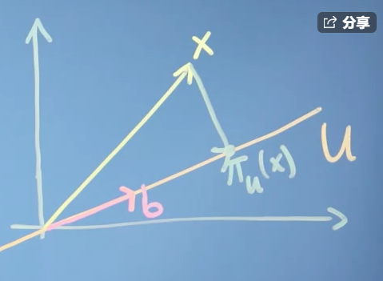
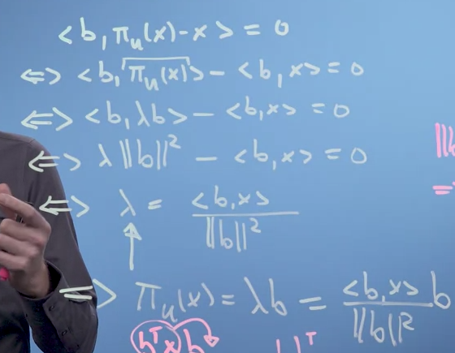
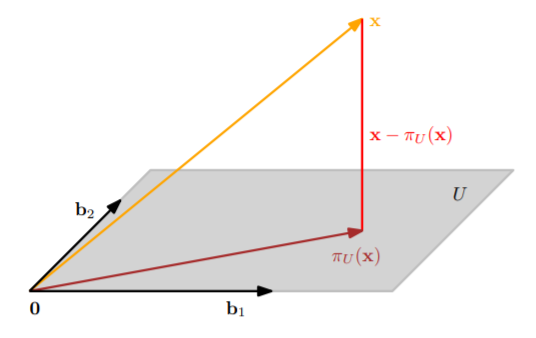
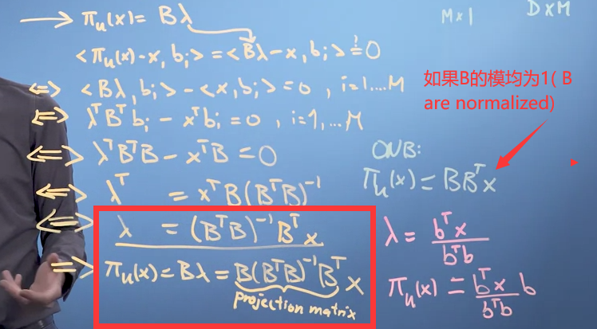
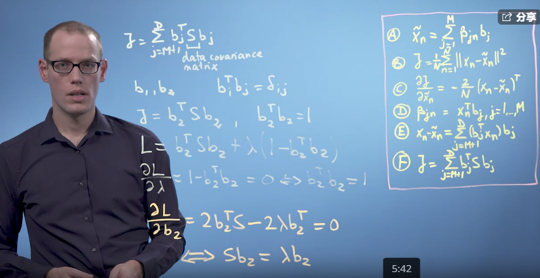
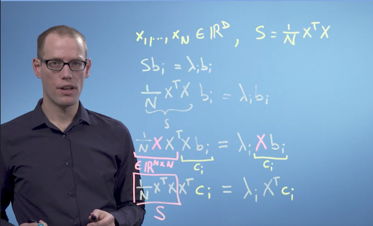

1. 在实际工作中，我们经常使用高维数据进行数据分析。但是，使用高维数据存在以下缺点：
   1. 分析困难，合理解释更困难
   2. 难以可视化
   3. 数据存储昂贵
2. 降维算法致力于**从高维数据中提取最重要的信息，便于数据存储、数据分析或数据可视化**。当然，降维算法会丢失数据的部分信息，若非必要，不建议在数据分析伊始进行降维。
3. PCA(principal component analysis)是一种经典的降维算法。

# 1. Basic Statistical Properties

## 1.1. Avarage Data Point: Mean

$$E(X) = \frac{1}{n} \sum_1^n x_n = \int_a^b x f_X(x)dx$$

$$f_X(x) \text{是X的概率密度函数,a和b是x的取值范围}$$

------

1. 均值描述了数据的中心(center)，但它不需要是某个特定的数据点。
2. 均值的线性转换：
   1. 元素+同一常数C：
      $E(X+C) = E(X)+C$
   2. 元素x同一常数A：
      $E(A \cdot X) = A \cdot E(X)$
   3. 总结起来，就是：
      $E(A \cdot X+C) = A \cdot E(X)+C$

## 1.2. Spread of Data: Variance

1. 方差描述了一个变量的分散程度，方差公式为：$\text{假设} \vec{X} = \{x_1,x_2,...,x_n\}$

   $\text{则方差向量化运算为：}$

   $V(X) = \frac{1}{n}\sum(X- \mu)(X-\mu)^T$

2. 根据方差的公式，可以得到协方差矩阵：$\text{假设} \vec{D} = \begin{bmatrix} x_1 & x_2 \\ y_1 & y_2 \end{bmatrix} \text{，即每1列代表1个数据点}$

   $\text{均值向量为：} \vec{\mu} = \begin{bmatrix} \mu_x \\ \mu_y \end{bmatrix} \text{，则协方差矩阵为：}$

   $Cov(data) = \frac{1}{n}(\vec{D}- \vec{\mu})(\vec{D}-\vec{\mu})^T$

3. 方差/协方差的线性转换：

   1. 元素+同一常数C：
      $V(X+C) = V(X)+C$
   2. 元素x同一常数A：
      $V(A \cdot X) = A^2 \cdot V(X)$
   3. 协方差矩阵x常数A向量：
      $Cov(A \cdot X + C) = A\ Cov(X) \ A^T$

4. 对于相互独立的随机变量X和Y：
   $V(X+Y) = V(X) + V(Y)$

# 2. Vector Calculation

## 2.1. Dot Product

1. x的向量模/长度是：
   $||X|| = \sqrt{X_T X} = \sqrt{\sum x_i^2}$
2. x和y的向量距离是：
   $d(X,Y) = ||X-Y|| = \sqrt{(X-Y)^T (X-Y)}$
3. x和y的点积是：
   $X \cdot Y = X^T Y = \sum x_i y_i = ||X||\,\,||Y||cos{\alpha}$

## 2.2. Inner Product

1. 内积是点积的一般化，点积是内积的一种特殊形式。内积的数学含义是对称的、正定的双线性映射(a symmetric positive definite bilinear mapping)。
   * 其中双线性(bilinear)指：两两内积成线性关系，假设存在三个向量X,Y,Z满足(<>表示内积)，则：

$$
<\lambda X+Z, Y> = \lambda<X,Y> + <Z, Y>\\
<X, \lambda Y+Z> = \lambda<X,Y> + <X,Z>
$$

------

* 正定(positive definite)是指：向量与自身的内积大于等于0，且<X,X> = 0时，X=0。即：

$$
<X,X> ≥ 0
$$

------

* 对称性(symmetry)指：X和Y的内积等于Y和X的内积：

$$
<X,Y> = <Y,X>
$$

------

2. 内积的计算公式：A为线性转换矩阵，其中当A为单位矩阵I时，X和Y的内积即为点积。

$$
<X,Y> = X^T A Y
$$

3. 利用内积计算向量长度(向量模)和向量间距离：
   1. 向量模与内积公式有关，不同的内积公式会得到不同结果：
      $||X|| = \sqrt{<X,X>}$

   2. 向量模的相关属性：

      $||\lambda X| = |\lambda| \cdot ||X||$

      $||X+Y|| ≤ ||X||+ ||Y|| \quad \text{注：三角不等}$

      $||<X, Y>|| = ||X|| \cdot ||Y|| \quad \text{注：Cauchy-Schwarz不等}$

   3. 向量距离和内积公式有关：
      $d(X,Y) = ||X - Y|| = \sqrt{<X-Y, X-Y>}$

4. 利用内积计算角度并理解正交(angles and orthogonality)：$cos \alpha = \frac{<X,Y>}{||X|| \cdot ||Y||}$

   1. 向量间的角度告诉了我们这两个**向量的方向的相似性**。

   2. 当两个向量内积为0，说明两个向量正交，角度等于90度。反过来行不通，也就是说，两个向量正交，内积不一定为0，取决于内积公式。

   3. 正交基向量(orthonormal basis)：

      $<b_i,b_j> = 0 \text{，且} i ≠ j$

      $||b_i|| = ||b_j|| =1$

5. 函数和随机变量的内积计算：

   1. 对于函数u(x)和v(x)，其内积等于：
      $<U,V> = \int_a^b u(x)v(x)dx$
   2. 当函数内积为0时，函数u(x)和v(x)在[a,b]内正交。
   3. 对于随机变量X和Y，其协方差就是一种形式的内积，满足内积对称、正定、双线性的特点，双线性举例：
      $Cov(\lambda X + Y, Z) = \lambda Cov(X,Z) + Cov(Y,Z)$
   4. 对于随机变量X和Y的夹角，则：
      1. X和Y的模为变量的标准差：$||X||= \sqrt{Cov(X,X)} = \sigma(X)$
      2. X和Y的夹角为：$cos \theta = \frac{Cov(X,Y)}{||X|| \cdot ||Y||} = \frac{Cov(X,Y)}{\sqrt{V(X) \cdot V(Y)}}$

## 2.3. K Nearest Neighborhood

1. k最近邻算法的原理基于向量间距离大小体现了向量的相似性。通过计算各个元素向量之间的距离，找到与原向量最近的k个点及其对应类别，通过投票计算选出得票最多的类别，完成预测分类。
2. knn简便算法的代码解释：[knn simple code](https://www.coursera.org/learn/pca-machine-learning/discussions/weeks/2/threads/JH42epDFStW-NnqQxerVMA)

```
#1. 计算矩阵两两向量之间的距离
from scipy.spatial.distance import cdist
dist = cdist(training_vectors, you_vector, metric='euclidean')

#2. 找到离原向量最近的k个点
sorted_idx=np.argsort(dist, axis=0)[:k]

#3. 找到k个点对应的标签y
labels=y[sorted_idx].ravel()

#4. 计算每个标签的个数并选择最多的标签
result=np.bincount(labels).argmax()

#5. 得到预测结果
return result
```

# 3. Orthogonal Projections

## 3.1. Projection onto 1D subspaces



1. 假设多维向量到一维空间U的映射为$\pi_U(x)$，一维空间U的基向量为b，其中x到*π*(*x*)的距离与U正交，则可知：

   1. $\text{存在任意实数}\lambda \text{，} \pi_U(x) = \lambda b$

   2. $\text{向量x到U的距离与b內积为0，} <b, \pi_U(x)-x> =0$

2. 通过推导可得到：
   

$$
\lambda = \frac{<b,x>}{||b||^2}\\
\pi_U(x) = \lambda b = \frac{<b,x>}{||b||^2} b
$$


3. 利用点积来求*λ*，则：

$$
\lambda = \frac{b^T x}{||b||^2}
\pi_U(x) = \frac{b b^T}{||b||^2} x
$$


4. 其中，x的映射矩阵(projection matrix)为：$P_{\pi} = \frac{b b^T}{||b||^2}$，映射矩阵满足正定和对称的特点（P = P@P，P= P.T）。x的重构错误(reconstruction error) 为：$||\pi_U(x) - x||$。

## 3.2. Projections onto n-dimensional subspaces



1. 假设x为m维向量，则其映射到n维空间U的$\pi_U(x)$满足：

   1. $\pi_U(x)$可用U的基向量进行线性表示：
      $\pi_U(x) = \lambda_1 b_1 + \lambda_2 b_2 +... + \lambda_n b_n = \sum^n_{i=1} \lambda_i b_i$
   2. 向量x到$\pi_U(x)$的距离与U的所有基向量都正交：
      $<x-\pi_U(x), b_1> = 0,\quad <x-\pi_U(x), b_2> = 0,\quad ... \quad,<x-\pi_U(x), b_n> = 0$

2. 根据推导可知：[推导过程](https://d3c33hcgiwev3.cloudfront.net/NfYmDxtEEeiDkQoaxapXkA_362ff9c01b4411e8af00d38a13203424_projections.pdf?Expires=1598054400&Signature=RcteZh0MygaLHQT2S14q2PYDXxarD8TfUAU20BdR8OwUlGn5SNxoJ6D1U3n1w6XfuSDyYgzHeO5dAE9b6~uoBhTfsW2aWsNDMIiI8gLwrg~EwivzDlj3A6Xbh2MW2qVtK7ZjQCHt2o6iFTY3T1pRAzBDaJVMyQi5-R0YySjxOwE_&Key-Pair-Id=APKAJLTNE6QMUY6HBC5A)
   

   1. 矩阵B(m列n行)为：$B = [b_1,b_2,...,b_n] \in \mathbb{R}^{mxn}$

   2. 向量Λ为：$\Lambda = [\lambda_1,...,\lambda_n]^T \in \mathbb{R}^{n}$

   3. 使用点积做內积，则可知：

      $<B, x- \pi_U(x)> = <B, x- B \Lambda> = B^T (x-B\Lambda) = 0 \Updownarrow$

      $B^TB\Lambda = B^T x \Updownarrow$

      $\Lambda = (B^TB)^{-1}B^Tx \Updownarrow$

      $\pi_U(x) = B \Lambda = B(B^TB)^{-1}B^Tx \Updownarrow$

   4. 映射矩阵$P_{\pi}$为：
      $P_{\pi} = B(B^TB)^{-1}B^T$

3. 需要注意的是：*π*(*x*)虽然是m维向量x在n维空间U的映射，但因为U仍然是用m维向量表示，因此，*π*(*x*)仍为m维。如果U用n维向量表示，则*π*(*x*)表示为n维。亦就是说，*π*(*x*)的向量维数取决于U。

# 4. Principal Component Analysis

## 4.1. Derivative of PCA

1. PCA是目前最常用的降维算法，基于正交投射(Orthogonal Projection) 将高维数据压缩成重构错误(reconstruction error)最小的低维数据。

2. 假设数据集为$X =\{x_1, x_2, ... , x_n\}$，$x_i$为D维数据点，则在D维空间里，*X*满足：

   1. $x_n = \sum_{i=1}^{D} \beta_{in}b_i$
   2. $\beta_{in} = x_n^T b_i$
   3. 假设M维空间U基向量为$B = \{b_i, b_2,..., b_m\}$，且$||b_i||=1$则：$x_m = B B^T X$，其中在U空间的坐标(coordinate)为$\lambda$，即：$\Lambda = B^T X$
   4. 如果把数据集X映射回到原来的D维空间，则可以表示成：
      $\tilde{x_n} = \sum_{i=1}^{M} \beta_{in}b_i + \sum_{i=M+1}^{D} \beta_{in}b_i ≈ \sum_{i=1}^{M} \beta_{in}b_i$其中忽视第二部分，第一部分就为主成分向量空间(principal subspace)

3. 主成分分析的目的就是找到使重构错误均方最小的基向量空间$b_i$(其实就是正交映射)和$\beta_{in}$(minimize the average squared reconstruction error)：

   $J = \frac{1}{N} \sum_{n=1}^{N}||x_n-\tilde{x_n}||$

   1. 要找到使J最小的参数$b_i$和$\beta_{in}$，需要使$b_i$和$\beta_{in}$各自的偏导(partial derivative)为0，并得到最优的参数解。根据求导链式法则：

      $\frac{dJ}{d\{\beta_{in}b_i\}} = = \frac{dJ}{\tilde{x_n}} \frac{\tilde{x_n}}{d\{\beta_{in}b_i\}}$

      $\text{公式1：}\frac{dJ}{\tilde{x_n}} = - \frac{2}{N}(x_n - \tilde{x_n})^T$

   2. 求$\beta_{in}$：

      $\text{偏导1：}\frac{dJ}{d\beta_{in}} = - \frac{2}{N}(x_n - \tilde{x_n})^T b_i = - \frac{2}{N} (x_n - \sum_{i=1}^{N} \beta_{in}b_i)^T b_i$

      $= - \frac{2}{N}(x_n^Tb_i - \beta_{in}b_i^T b_i) = - \frac{2}{N}(x_n^Tb_i - \beta_{in}) = 0$

      $\text{公式2：}\beta_{in} = x_n^T b_i$

   3. 重构错误均方函数/损失函数的另一种表达：

      $\text{公式3：}\tilde{x_n} = \sum_{i=1}^M B_{in}b_i = \sum_{i=1}^M (x_n^T b_i)b_i$

      $= \sum_{i=1}^M b_i (b_i^T x_n) = (\sum_{i=1}^M b_i b_i^T) x_n$

      $\text{公式4：}{x_n} = (\sum_{i=1}^M b_i b_i^T) x_n + (\sum_{i=M+1}^D b_i b_i^T) x_n$

      $\text{公式5：}{x_n} - \tilde{x_n} = (\sum_{i=M+1}^D b_i b_i^T) x_n = \sum_{i=M+1}^D (b_i^T x_n) b_i$

      ***

   $$
   \text{loss function：} J =  \frac{1}{N} \sum_{n=1}^{N}||x_n-\tilde{x_n}|| = \frac{1}{N} \sum_{n=1}^{N}||\sum_{i=M+1}^D (b_i^T x_n) b_i||^2 = \frac{1}{N} \sum_{n=1}^{N}\sum_{i=M+1}^D (b_i^T x_n)^2\\
   = \frac{1}{N} \sum_{n=1}^{N}\sum_{i=M+1}^D b_i^T x_n x_n^T b_i =  \sum_{i=M+1}^D b_i^T (\frac{1}{N} \sum_{n=1}^{N} x_n x_n^T) b_i = \sum_{i=M+1}^D b_i^T S b_i = trace((\sum_{i=M+1}^D b_i b_i^T)S)
   $$

* 假设E(X) = 0（处理数据前进行标准化），则$(\frac{1}{N} \sum_{n=1}^{N} x_n x_n^T)$为数据集的方差矩阵S，也就是说，损失函数计算了数据集的方差正交投射到(M+1,D)的子空间上/我们忽视的子空间。最小化损失函数，就是最小化正交投射到主成分互补子空间的方差，换句话说，**我们致力于在正交投射到主成分子空间后保留最多的方差**。

------

4. 当拉格朗日乘数是数据集方差矩阵的最小特征向量时，损失函数最小。也就是说，最大的特征向量构成主成分子空间的基向量和空间，其中也说明了：
   1. 数据集方差矩阵的特征向量相互正交，因为协方差矩阵是向量內积，满足对称的特点。
   2. 最大的特征向量保留了最大的方差，构成了主成分子空间。
      

## 4.2. Steps of PCA

1. 数据标准化(normalize the data)：保证数据均值为0，且每个维度的方差为1(unit-free)。

   $$x_N = \frac{x-\mu}{\sigma}$$

2. 计算数据集协方差矩阵的特征值和特征向量。数据维度越高，计算复杂度就越高。如果数据的维度多余数据个数(N<D)，则协方差的矩阵不是满秩的，rank(S) = N，这时我们可以将矩阵转换成NxN形式，减少计算复杂度。**注意：每一列为一个数据点，即X应转换为DxN的矩阵**。
   $$
   S_{DxD} = \frac{1}{N}X^TX\\
   S_{NxN} = \frac{1}{N}XX^T
   $$
   

3. 计算重构的数据：
   $$
   \tilde{x_N} = B (B^T  B)^{-1}B^T x_N
   $$

## 4.3. Codes of PCA

1. 手动敲代码：

```
# 1. 标准化数据（X：NxD）
mu = np.mean(X, axis =0)
std = np.std(X, axis =0)
std_filled = std.copy()
std_filled[std==0] = 1  # 防止有些std=0 导致计算出错，将std=0设为1
Xbar = (X-mu)/std_filled

# 2. 计算特征向量
S = np.cov(Xbar.T)
eig = np.linalg.eig(S)[1]

# 3. 设定主成分基向量数量
B = eig[ : , : 3]

# 4. 计算重构数据
pm = B @ np.linalg.inv(B.T @ B) @ B.T
recons = (pm @ X.T).T
```

1. 数据点少于维数的情况(N<<D)，该计算方式计算速度更快：

```
def PCA_high_dim(X, n_components):

    N, D = X.shape
    S = (X @ X.T)/N
    eig_vals, eig_vecs = np.linalg.eig(S)
    U = X.T @ eig_vecs # 得到真正的基向量
    B = U[:,:n_components]
    P = projection_matrix(B)
    X_tilde = (P @ X.T).T
    return X_tilde 
```

1. sklearn的现成包：

```
from sklearn.decomposition import PCA as SKPCA
pca = SKPCA(n_components=2, svd_solver='full')
sklearn_reconst = pca.inverse_transform(pca.fit_transform(Xbar))
```