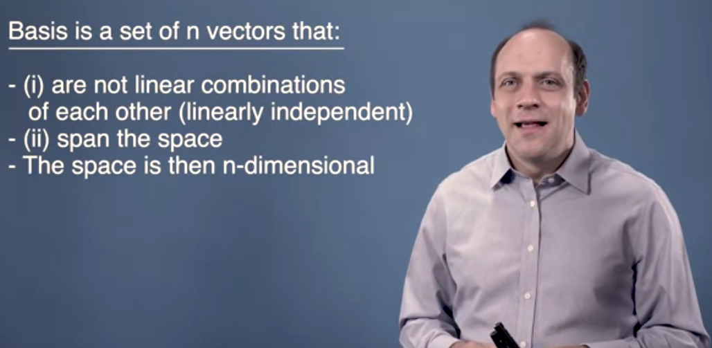
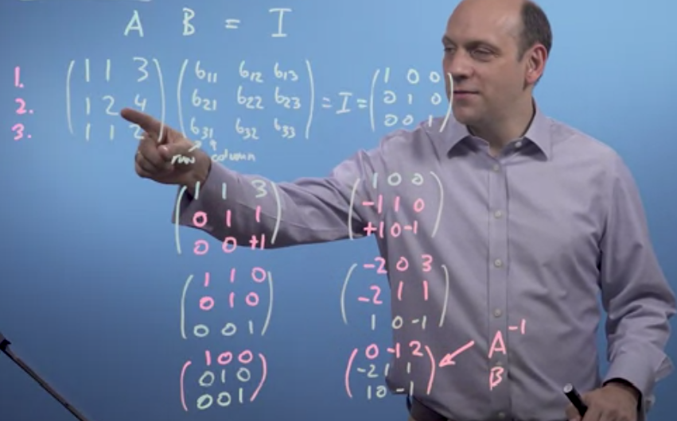
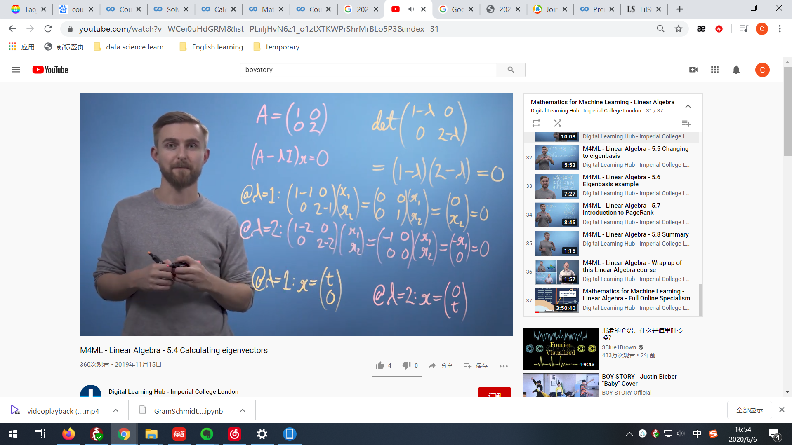
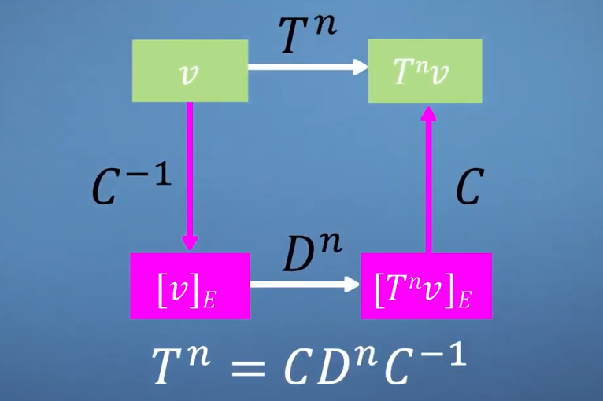
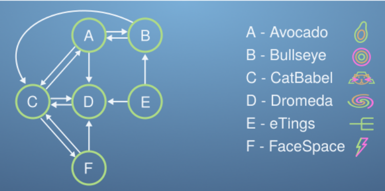
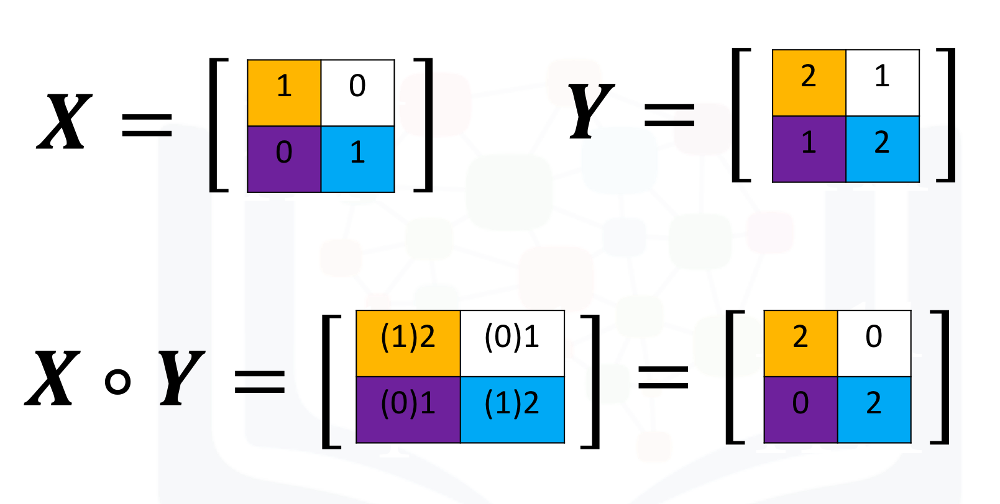

> 如果对知识有疑问，可以观看coursera课程或3blue1brown的视频。
[toc]

# 1. 向量（vector）
## 1.向量定义
* 向量有很多定义，可以是一组数据，也可以是属性的集合或参数的集合。
* 向量的定义在于你应用的领域和用途，因此，无需严格规定向量。

## 2.向量加法和标量乘法
* 加法(vector addition)：$\vec{a}+\vec{b} = \left|\begin{array}{l}2 \\ 3 \end{array}  \right| + \left|\begin{array}{l}4 \\ 5 \end{array}  \right| = \left|\begin{array}{l}2+4 \\ 3+5\end{array}  \right| = \left|\begin{array}{l}6 \\ 8\end{array}  \right|$
______________________________________________________________________________
* 标量乘法(scalar multiplication)：$3\vec{a} = 3\left|\begin{array}{l}2 \\ 3 \end{array}  \right| = \left|\begin{array}{l}2x3 \\ 3x3\end{array}  \right| = \left|\begin{array}{l}6 \\ 9\end{array}  \right|$

## 3.向量模和內积
* 向量模(modulus/length/size)：指向量的大小或长度。$\left|{\vec{a}} \right| = L(\left|\begin{array}{l}2 \\ 3 \end{array}  \right|) = \sqrt{2^2+3^2} = \sqrt{13}$
* 內积也叫点积(dot product/inner scalar/projection product)：指两个向量之间相乘得到的考虑了向量长度和方向的乘积，可用余弦定理和投射定理进行推导理解。
    * 点积计算公式：$\vec{a}  · \vec{b} = \left|\begin{array}{l}2 \\ 3 \end{array}  \right| · \left|\begin{array}{l}4 \\ 5 \end{array}  \right| = 2 x 4+3 x 5 = 23$
    *  交换向量位置：$\vec{a}  · \vec{b}= \vec{b}  · \vec{a}$
    *  结合向量加法：$\vec{a}  · (\vec{b}+\vec{c}) = \vec{a}  · \vec{b}+\vec{a}  · \vec{c}$
    *  结合标量乘法：$\vec{a}  · (3\vec{b}) = 3(\vec{a}  · \vec{b})$
* 余弦定理(cosine)和点积：
    * 余弦定理：$c^2 = a^2 +b^2 -2ab·{cos{\theta}}$
    * 余弦-点积：两个不同的向量点积可由向量模、向量夹角余弦值相乘得到
$\vec{a}  · \vec{b} = {\left|{\vec{a}} \right|} · {\left|{\vec{b}} \right|} · {cos{\theta}}$
    * 特殊情况：向量自身的点积是其模的平方
$\vec{a}  · \vec{a} = {\left|{\vec{a}} \right|} · {\left|{\vec{a}} \right|} · cos0 =  \left|\begin{array}{l}2 \\ 3 \end{array}  \right|·  \left|\begin{array}{l}2 \\ 3 \end{array}  \right| =(\sqrt{2^2+3^2})^2 = {\left|{\vec{a}} \right|}^2$
* 投射定理(projection)和点积：
    * 投射定理：假设有一束光垂直照射到向量b上，其落在向量a的阴影称为投射。
    * 投射-点积：两个不同的向量点积是向量a的长度和b投射到a的标量投影的乘积。$\vec{a}  · \vec{b} = {\left|{\vec{a}} \right|} · {\left|{{\vec{b}}_{projection}}\right|} = {\left|{\vec{b}} \right|} · {\left|{{\vec{a}}_{projection}}\right|}$
    * 标量投影：b投射到a的向量长度。
   ${\left|{{\vec{b}}_{projection}}\right|} = \frac{\vec{a}  · \vec{b}}{\left|{\vec{a}} \right|}$
    * 矢量投影：b投射到a的向量，由标量投影乘以a的单位向量i可获得矢量投影。
    ${{\vec{b}}_{projection}} = \frac{\vec{a}  · \vec{b}}{\left|{\vec{a}} \right|} · {\vec{i}}$
```
# 计算向量点积
import numpy as np
c = a @ b
c = np.dot(a,b)
# 计算向量模
m = np.linalg.norm(a)
```

## 4.基向量转换、向量空间和线性独立
* 基向量的表示：

  

    * 向量是由基向量（basis vector）表示的有方向有长度的箭头。比如，$\vec{i}$和$\vec{j}$分别表示基向量1和基向量2，则$\vec{a} = \left|        \begin{array}{l}2 \\ 3 \end{array}  \right|$表示$\vec{a} = 2\vec{i}+ 3\vec{j}$。
    * 我们一般默认的二维基向量是以自然单位向量$\left|\begin{array}{l}1 \\ 0 \end{array}  \right|$和$\left|\begin{array}{l}0 \\ 1 \end{array}  \right|$为坐标系表示的向量。

* 基向量的转换：
    * 实际上，向量可以用任何基向量来定义，比如将以自然单位向量为底的二维向量$\vec{a}$用正交向量$\vec{b1}$和$\vec{b2}$表示，换算公式为：
${\vec{a}_{b1}} = \frac{\vec{a}·\vec{b1}}{\left|\vec{b1}\right|^2} 
\qquad {\vec{a}_{b2}} = \frac{\vec{a}·\vec{b2}}{\left|\vec{b2}\right|^2}$
    
* 向量空间的定义：
  
    * 由基向量张成的空间就是向量空间，比如二维空间、三维空间等。
    
* 基向量的线性独立性：
    * 对于二维向量空间${\vec{b1}}$和${\vec{b2}}$，若存在${\vec{b3}} ≠ n_1{\vec{b1}} +n_2{\vec{b2}}$，则${\vec{b3}}$可以和${\vec{b1}}$、${\vec{b2}}$一起构成三维向量空间。
    
# 矩阵（Matrix）
## 1.矩阵定义
* 对于矩阵的定义，可以从多个方面理解：
    * 矩阵是将输入向量转换为输出向量的函数。
    * 矩阵是向量在空间里的线性转换（linear transformation），矩阵对向量进行变换，改变它们的大小和方向。
    * 方阵也可以表示了基向量的转换，比如$\left|\begin{array}{l}a_{11}&b_{11}\\ a_{12}&b_{12}\end{array}  \right|$中$\left|\begin{array}{l}a_{11}\\ a_{12}\end{array}  \right|$和$\left|\begin{array}{l}b_{11}\\ b_{12}\end{array}  \right|$分别表示在原坐标系中的基向量坐标。
* 常见的2D矩阵转换：
    * 缩放（ stretch）：保持轴方向不变，进行轴的伸缩，克表示为$\left|\begin{array}{l}s_x&0\\ 0&s_y\end{array}  \right|$
    * 倒置（inversion）：对所有的轴进行转置，表示为$\left|\begin{array}{l}-1&0\\ 0&-1\end{array}  \right|$
    * 反射（mirror）：对轴进行调换，就像镜子成像一样，绕原点逆时针反射 θ 度角可表示为$\left|\begin{array}{l}cos{\theta}&sin{\theta}\\ sin{\theta}&-cos{\theta}\end{array}  \right|$
    * 切变（shear）：对轴进行剪切，沿x轴表示为$\left|\begin{array}{l}1&k\\ 0&1\end{array}  \right|$，沿y轴表示为$\left|\begin{array}{l}1&0\\ k&1\end{array}  \right|$
    * 旋转（rotation）：对轴进行旋转，绕原点逆时针旋转 θ 度角可表示为$\left|\begin{array}{l}cos{\theta}&-sin{\theta}\\ sin{\theta}&cos{\theta}\end{array}  \right|$
* 特殊的矩阵类型有：
    * 单位矩阵$\vec{I}$(identity matrix)： 单位矩阵和向量相乘得到向量本身，即$\vec{I}\vec{a} = \vec{a}$
    * 对角矩阵${diag(n_1,n_2..)}$(diagonal matrix)：除对角线意外的元素均为0，对角矩阵相乘，结果仍为对角矩阵。
    * 奇异矩阵(sigular matrix)：若方块矩阵A满足行列式≠0，则称A为非奇异方阵，否则成为奇异方阵。
    * 正交矩阵（orthogonal matrix）：是一个行向量与列向量皆为正交/垂直的单位向量的方块矩阵。该矩阵的转置矩阵为其逆矩阵，即$\vec{A}^T = \vec{A}^{-1}$，其行列式值必定为+1或-1，具体例子为旋转与反射。
    * 稀疏矩阵

 ## 2.矩阵向量乘法
 * 矩阵向量乘法
     * 计算公式：(matrix-vector multiplication)：$\vec{A}\vec{b} = \left|\begin{array}{l}2&3 \\ 4&5\end{array}  \right|  \left|\begin{array}{l}4 \\ 5 \end{array}  \right| = \left|\begin{array}{l}2x4+3x5 \\ 4x4+5x5\end{array}  \right| = \left|\begin{array}{l}23 \\ 41\end{array}  \right|$
    * 结合向量加法：$\vec{A}(\vec{b}+ \vec{c}) =  \vec{A}\vec{b} + \vec{A}\vec{c}$
    * 结合标量乘法：$\vec{A}(3\vec{b}) = 3(\vec{A}\vec{b})$
* 与向量点积的关系：
    * 公式：$\vec{a} · \vec{b} =  \left|\begin{array}{l}1 \\ 2\end{array}  \right| · \left|\begin{array}{l}3 \\ 4\end{array}  \right| = \left|\begin{array}{l}1 & 2\end{array}  \right| \left|\begin{array}{l}3 \\ 4\end{array}  \right| = \vec{A}\vec{b}$
    * 可以认为：向量$\vec{a}$和$\vec{b}$的点积，相当于将$\vec{b}$投射到$\vec{a}$的一维空间中。如果将得到向量$\vec{a}$标准化为基向量$\vec{a^{"}}$（$\vec{a^{"}}$的模=1），则可以得到$\vec{b}$的一维坐标。

## 2.矩阵矩阵乘法
*  矩阵矩阵乘法(matrix-matrix multiplication)：
    *  计算公式：$\vec{A}\vec{b} = \left|\begin{array}{l}2&3 \\ 4&5\end{array}  \right|  \left|\begin{array}{l}4&5 \\ 6&7 \end{array}  \right| = \left|\begin{array}{l}(2x4+3x6)&(2x5+3x7) \\ (4x4+5x6)&(4x5+5x7)\end{array}  \right| = \left|\begin{array}{l}26&31 \\ 36&55\end{array}  \right|$
    *  三个矩阵相乘：$A_3(A_2 A_1) = (A_3 A_2)A_1$
```
# 矩阵向量和矩阵乘法都用@或np.dot
Y = np.array([[2, 1], [1, 2]]) 
X = np.array([[1, 1], [1, 1]]) 
print(X @ Y)
np.dot(X, Y)
```
## 3.逆矩阵、转置矩阵、高斯消除
* 逆矩阵：将矩阵变换进行复原，因此：$A^{-1} A = I$

* 转置矩阵（transposed matrix）：保持矩阵对角线不变，调换非对角线上的值，即$\vec{A_{ij}^{T}}=\vec{A_{ji}}$

* 高斯消除：高斯消除类似于方程组的解答，对挨个变量进行消除回代，最终得到单位矩阵和各值解。

  

* 利用python计算逆矩阵和求解方程：
```
#求逆矩阵
import numpy as np
A = [[1, 1, 1],
     [3, 2, 1],
     [2, 1, 2]]
Ainv = np.linalg.inv(A)

#求转置矩阵
AT = np.transpose(A)

#求解方程
A = [[4, 6, 2],
     [3, 4, 1],
     [2, 8, 13]]
s = [9, 7, 2]
r = np.linalg.solve(A, s)
```
## 4.行列式
* 行列式：指矩阵变换带来的每单位面积改变比例。
    * 计算公式：$\left|{\vec{A}}\right| = det(\left|\begin{array}{l}2&3 \\ 4&5\end{array}  \right|)  = 2x5-3x4 = -2$
    * 行列式为0：当行列式为0时，说明面积改变比例为0，向量空间发生了降维。此时矩阵无逆矩阵，矩阵的各个向量之间不是线性独立的。
    * 特征多项式(characteristic polynomial)：对于2D矩阵$\left|\begin{array}{l}a&b \\ c&d\end{array}  \right|$，其特征多项式满足$\lambda^2 - (a+d)\lambda + (ad-bc) = 0$。

```
import numpy as np
det = np.linalg.det(M)
```
## 5.爱因斯坦求和公约
* 爱因斯坦求和公约（Einstein summation convention）提供了矩阵相乘进行编码的快速方法，通过公约，我们省略了求和符号。
    * 矩阵向量相乘：假设A矩阵和B向量相乘得到C向量，则$c_{i} = \sum^1_j a_{ij}b_{j} = a_{ij}b_{j}$，举例：$c_{2} = a_{2j}b_{j}$
    * 矩阵矩阵相乘：假设A矩阵和B矩阵相乘得到C矩阵，则$c_{ik} = \sum^1_j a_{ij}b_{jk} = a_{ij}b_{jk}$，举例：$c_{21} = a_{2j}b_{j1}$

## 6.坐标系的转换及其线性变换、正交矩阵
* 我们常用的坐标系为正交的单位基向量$\left|\begin{array}{l}1 \\ 0\end{array}  \right|$和$\left|\begin{array}{l}0 \\ 1\end{array}  \right|$，也可称为自然直角坐标系。当我们希望转换基向量时，需要运用矩阵的运算。
* 非自然单位基向量的线性转换：$\vec{a_{M}^{A}}=\vec{A^{-1}}\vec{M}\vec{A}\vec{a^o}$
* 特殊的基向量转换：正交矩阵，其特殊性令其在坐标转换方面应用广泛，原因有：
    * 正交矩阵的转置矩阵等于逆矩阵，因此非常容易计算其逆矩阵。
    * 正交矩阵的行列式为+1或-1，因此不会改变向量的大小。
    * 正交矩阵的基向量互相垂直，因此可以使用向量点积的方法计算线性转换，降低了计算难度。

## 7.格拉姆-施密特正交化
*  格拉姆-施密特正交化（Gram-Schmidt process）：假设矩阵V由n个向量构成，即$\vec{V} = \{ v_1,v_2,v_3...v_n \}$，则我们可以通过格拉姆-施密特法则进行正交化。
*  正交化需要实现两个目的：①所有向量互相垂直；②所有向量均为单位长度1。实现步骤为：
    * 1.标准化${v_1}$向量，即$e_1 = \frac{v_1}{\left|{v_1}\right|}$
    * 2.标准化${v_2}$向量，则：
        * $u_2 = {v_2}-({v_2}·e_1)e_1$
        * $e_2 = \frac{u_2}{\left|{u_2}\right|}$
     * 3.标准化${v_3}$向量，则：
        * $u_3 = {v_3}-({v_3}·e_1)e_1-({v_3}·e_2)e_2$
        * $e_3 = \frac{u_3}{\left|{u_3}\right|}$
    *  4.以此类推，最终可以得到正交矩阵$\vec{E} = \{ e_1,e_2,e_3...e_n \}$。
* 通过得到正交矩阵，我们可以用简洁的方式得到矩阵构成的平面/坐标系，之后应用坐标系变换的特性可以轻松进行各种矩阵运算。例如：
    * 将向量A投射到该平面，则：$\vec{A_{E}} = \vec{E^{-1}}\vec{A} = \vec{E^{T}} \vec{A}$
    * 将向量A投射到该平面并进行线性变换后投射会原平面，则：$\vec{A_{o}^{"}} = \vec{E}\vec{M}\vec{E^{-1}}\vec{A} = \vec{E}\vec{M}\vec{E^{T}} \vec{A}$
```
# 正交化代码
import numpy as np
import numpy.linalg as la

verySmallNumber = 1e-14

def gsBasis(A) :
    B = np.array(A, dtype=np.float_) 
   
    for i in range(B.shape[1]) :
        for j in range(i) :
        # 得到正交向量
            B[:, i] = B[:, i] - B[:, i] @ B[:, j] * B[:, j]
        # 标准化向量
        if la.norm(B[:, i]) > verySmallNumber :
            B[:, i] = B[:, i] / la.norm(B[:, i])
        else :
            B[:, i] = np.zeros_like(B[:, i])
    return B

# 计算正交矩阵维度
def dimensions(A) :
    return np.sum(la.norm(gsBasis(A), axis=0))
```

# 特征向量和特征值
## 1.特征向量相关概念
* 特征向量的定义：
    * 几何定义：经过线性转换后，方向保持不变的向量被称为特征向量（eigenvector）。对于该部分向量，其长度/模的改变比例称为特征值（eigenvalue）。
* 如何求特征向量：
    * $A\vec{a} = \lambda \vec{a}$ ①
    * $(A-\lambda \vec{I})\vec{a} = \vec{0}$ ② # $\vec{0}$表示零向量
    *  $det(A-\lambda \vec{I}) = 0$ ③
    *  根据以上式子可以得到特征值$\lambda$，代入②可以得到全部的特征向量$\vec{a}$

* 特殊的2d特征向量例子：
    * 等比例缩放（ stretch）：对于等比例缩放的线性转换，如$\left|\begin{array}{l}2&0 \\ 0&2\end{array}  \right|$，向量都保持方向不变，因此，所有的向量都是特征向量。
    * 非180度旋转（rotation）：对于非180度旋转的线性转换，如$\left|\begin{array}{l}0&1 \\ -1&0\end{array}  \right|$，向量的方向都改变了，因此，无特征向量。
    * 180度旋转（rotation）：对于180度旋转的线性转换，向量都变成反方向了，因此，所有的向量都是特征向量。
    * 切变（shear）：对于切变的线性转换，存在两个特征向量，一个是沿着切变的轴$\left|\begin{array}{l}0 \\ 1\end{array}  \right|$或$\left|\begin{array}{l}1 \\ 0\end{array}  \right|$，一个则不是轻易可见的向量。这也说明，特征向量并不是明显可见的，在高维矩阵里，更难直接看出。
```
# 计算特征向量和特征值
import numpy as np
eVals, eVecs = np.linalg.eig(M)

```

## 2.使用特征向量作为基向量 ※
> 将特征向量和基向量变换概念结合起来进行对角化运算，这才是特征向量的神奇之处！！！
* 特征理论：假设我们要对向量v进行n次T的线性转换，则无捷径的算法是：$\vec{v^n} = \vec{T^n} \vec{v}$。如果T本身不是对角矩阵，那么高纬度矩阵相乘的计算量是巨大的。因此，需要利用特征向量和基向量变换简化成对角运算：
    * 1.求出特征值，得到特征向量矩阵C和特征基向量矩阵D（eigen basis），即$\vec{C} = \{v_1,v_2,v_3,...,v_n\}$，$\vec{D} = \left|\begin{array}{l}\lambda_1&0&...&0 \\ 0&\lambda_2&...&0\\ ...&...&...&... \\ 0&0&...&\lambda_n\end{array}  \right|$
    * 2.我们知道特征向量需满足$\vec{T}\vec{v} = \lambda \vec{v}$，因此$\vec{C}\vec{D} = \vec{T} \vec{C}$，则矩阵T可以表示为：$\vec{T} = \vec{C}\vec{D}\vec{C^{-1}}$。我们也可以从基向量变换法则方面进行理解，以2D矩阵为例：
        * ①将矩阵$\vec{T}$看做对原直角单位坐标系$\vec{I}$，即$\left|\begin{array}{l}1&0 \\ 0&1\end{array}  \right|$的线性转换，即$\vec{T} = \vec{T} \vec{I}$。
        * ②以特征向量$\vec{C}$作为新的基向量，则原基向量在新的坐标系里的表示为（$\vec{C^{-1}} \vec{I}$）。
        * ③以特征向量$\vec{C}$为基向量，则矩阵$\vec{T}$的线性转换则相当于$\vec{D}$，也就是（$\vec{D}\vec{C^{-1}} \vec{I}$）。
        * ④转换为原来的坐标系，则$\vec{T} \vec{I} = \vec{C} \vec{D}\vec{C^{-1}} \vec{I}$，越除掉$\vec{I}$则可以得到最终式子。除了$\vec{I}$之外，其实也适用于空间里的任何向量。
    * 3.$\vec{T^2} = \vec{C}\vec{D}\vec{C^{-1}}\vec{C}\vec{D}\vec{C^{-1}} = \vec{C}\vec{D}\vec{D}\vec{C^{-1}} = \vec{C}\vec{D^2}\vec{C^{-1}}$
    * 4.因此可以推断出： $\vec{T^n} = \vec{C}\vec{D^n}\vec{C^{-1}}$


## 3.算法介绍：PageRank
*  这个算法1998年由Google的创始人佩奇提出，用于谷歌搜索对网站进行排序展示。算法的设计原则和基本思想是重要的网站会被重要的网站链接，并根据网站被Pats访问的次数对网站进行排名。这其中就涉及一些重要的概念：
    * **拖拖拉拉的帕特们（Procrastinating Pats）**：比喻用户。假设Pats每次都浏览1个网站，且每隔1分钟，他们就会跟随网站上的1个链接到达另1个网站。一段时间后，链接最多的网站会有更多的Pats访问。从长远来看，每隔1分钟，每离开1个网站，就会有另一个Pat进来，保持每个网站上Pats的总数不变，最终根据在这个过程的最后被Pats访问的次数对网站进行排名。
    * **链接概率矩阵$\vec{L}$**：由各个网站的链接概率组成，每一列代表某一网站链接到所有网站的概率分布，每一行代表某一网站被链接的概率分布。如下图中，A网站可以链接到B、C、D，而无法连接到A、E、F，则矩阵的第1列为$\vec{L}[:,0] = [0,1/3,1/3,1/3,0,0]$。  
    * **排名向量$\vec{r}$**：即各网站的排名，满足$\vec{r^{i+1}} = \vec{L} \vec{r^{i}}$。当$\vec{r^{i+1}} = \vec{r^{i}}$时，得到最终网站排名。此时，$\vec{r_{final}}$为矩阵$\vec{L}$的特征向量，且特征值等于1。
    * **阻尼系数d（damping parameter）：Pats不是100%会跟随网站上的链接点击下一个网站，而可能随机重新点击一个网站。因此，设置跟随链接点击的概率为d，则随机重新点击的概率为1-d。因此，矩阵L可以被调整成$\vec{M} = d\vec{L} + \frac{1-d}{n}\vec{J}$，其中J是一个nxn且元素均为1的矩阵。
    
* 算法求解方式：求解方式有两种，一种是基于特征向量求得r，这个方式适用于网站及链接较少的情况；一种是基于迭代方式不断更新r，直到r保持不变，这个方式适用于大型网络。
    * 特征向量法：求得矩阵L的特征值和特征向量，找到特征值为1（即最大的特征值）的特征向量，即为r。
```
 # 用特征向量求r
 eVals, eVecs = la.eig(L) 
order = np.absolute(eVals).argsort()[::-1] # 从大到小排序
eVals = eVals[order]
eVecs = eVecs[:,order]

r = eVecs[:, 0]
100 * np.real(r / np.sum(r))
```
    * 迭代法：
        * ①初始化$\vec{r^0}$，设置$\vec{r^0} =  m * np.ones(n) / n$，其中m、n分别表示pats的个数和网站的个数。
        * ②设置迭代循环$r = M @ r$，直到r的变化在容忍范围内。
```
# 设置一个简单的迭代法pagerank
r = 100 * np.ones(6) / 6 # 初始化r，其中m为100，n为6
d = 0.5 # 设置d
M = d * L + (1-d)/6 * np.ones([6, 6]) # 设置M

lastR = r
r = M @ r
i = 0
while la.norm(lastR - r) > 0.01 : # 设置容忍度为0.01
    lastR = r
    r = L @ r
    i += 1

print(str(i) + " 迭代收敛")
r
# 定义一个简单的pagerank函数
def pageRank(linkMatrix, d) :
    n = linkMatrix.shape[0]
    M = d * linkMatrix + (1-d)/n * np.ones([n, n])
    r = 100 * np.ones(n) / n
    lastR = r
    r = M @ r
    i = 0
    while la.norm(lastR - r) > 0.0001 :
        lastR = r
        r = M @ r
        i += 1
    return r
```
# 4.其他知识
## 4.1.哈达玛积
* 哈达玛积（Hadamard product）又称为基本积。$A=(a_{ij})$和$B=(b_{ij})$是两个同阶矩阵，若$c_{ij}=a_{ij} x b_{ij}$,则称矩阵C=(cij)为A和B的哈达玛积。

```
import numpy as np

Y = np.array([[2, 1], [1, 2]]) 
X = np.array([[1, 1], [1, 1]]) 
Z = X * Y
```