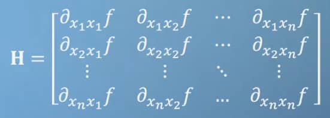

> 微分（Differentiation），积分（integral）。

* 基本概念
  * 1.函数（function）
  * 2.导数和求导（derivative & derivation）
* 多元变量系统
  * 1.偏导和总导
  * 2.雅可比式
  * 3.海森矩阵
  * 4.法则推广到多元函数
* 神经网络
* 近似计算和线性化
  * 1.麦克劳林级数
  * \2. 泰勒级数
  * \3. 多元泰勒级数
* 拟合最小化
  * \1. 牛顿迭代法
  * \2. 梯度下降
  * \3. 约束优化和拉格朗日乘数

# 基本概念

## 1.函数（function）

* 本质上，函数是输入与输出之间的关系（relationship between inputs and outputs），函数符号可以让人们意识到函数的本质，避免不必要的混乱，如*f*(*x*)。
* 但是，不同的时期或不同的应用，可能会用不同的符号来表示类似的函数，这是需要我们在学习的过程中注意的。
  
* 微积分就是对不断变化的变量（variables），不断调整函数/假设（hypothesis），直到获得最合适的输出。
* 特殊的函数例子：
  * $f(x)=\frac{1}{x}$：该函数具有不连续性（x≠0），且导数全部为负。
    
  * $f(x) = e^{x}, e = 2.71828...$：该函数的求导一直等于原函数。
    
  * $f(x) = sin(x), f(x) = cos(x)$：这两个函数是著名的三角函数：正弦函数和余弦函数。正弦函数的导数是余弦，余弦函数的导数是负正弦。
    
  * $f(x) = ln(x) = log_e{x}$：该函数的求导为$ln'(x) = \frac{1}{x}$，对数函数的求导为$(log_a{x})' = \frac{1}{x ln(a)}$。

## 2.导数和求导（derivative & derivation）

* 导数就是函数变化的梯度（Gradient，也叫rise over sun），也就是我们经常说的微分（differentiation），表达式为：$\frac{dx}{dy} = f'(x) =\lim_{\Delta{x}\to 0}\left(\frac{f(x+\Delta{x})-f(x)}{\Delta{x}}\right)$，根据这一表达式 ，我们可以推导出很多常用导数和常用法则。常用规则有：

* 求和法则（sum rule）：$\frac{d}{dx}(f(x)+g(x)) = \frac{df(x)}{dx} + \frac{dg(x)}{dx}$

* 幂法则（power rule）：若$f(x) = ax^b$，则$f'(x) = abx^{b-1}$

* 乘积法则（product rule）：若$A(x) = f(x)g(x)$，则$A'(x) = f(x)g'(x) + g(x)f'(x)$
* 链式法则（chain rule）：若$f = f(g) , g = g(x)$，则$f'(x) =f'(g) · g'(x)$，也写成：$\frac{df}{dx} = \frac{df}{dg} * \frac{dg}{dx}$。举例：$e^{-7x}$的导数就是：$(e^{-7x})' = (e^{v})' · (-7x)' = e^v · (-7) = -7e^{-7x}$

# 多元变量系统

## 1.偏导和总导

* 在多元变量系统中，偏导（partial derivation）要求除了求导的变量外，其余变量作为常数进行处理，求导过程和单变量类似。
  

* 偏导举例：在多元函数$f(x, y, z) = sin(x)e^{yz^2}$中，其各部分偏导为：

  * $\frac{df}{dx} = cos(x)e^{yz^2}$

  * $\frac{df}{dy} = sin(x)e^{yz^2}{z^2}$

  * $\frac{df}{dz} = sin(x)e^{yz^2}{2yz}$

* 根据偏导，可以根据x、y、z之间的关系得到一个变量t，用t表示所有的变量，求出以t为变量的全导（total derivative）。除了将t代入函数中求导，也可以通过求导公式获得，公式为：
  

* 全导举例：在多元函数$f(x, y, z) = sin(x)e^{yz^2}$中，变量x、y、z满足$x = t-1$，$y = t^2$，$z = \frac{1}{t}$，则总导数为：
  

## 2.雅可比式

* 雅可比向量（Jacobian vector）：对于多元函数$f(x_1,x_2,x_3,...)$，其雅克比向量为一阶导数的行向量$J = [\frac{df}{dx_1},\frac{df}{dx_2},\frac{df}{dx_3},...]$，即梯度的集合。结合线性代数知识，对于特定的$x_1,x_2,x_3,...$，雅克比向量表示在坐标系中该点指向的函数最大斜率（steepest slope of the function）。
  
* 雅可比矩阵（Jacobian matrix）：对于两个变量相同的函数$u(x,y)$和$v(x,y)$，其雅克比矩阵为一阶导数矩阵$J = \left|\begin{array}{l}{\frac{du}{dx}}&{\frac{du}{dy}}\\ {\frac{dv}{dx}}&{\frac{dv}{dy}} \end{array} \right|$
* 雅克比式的应用（Jacobian applied）：
  * 1.当每个函数的因变量和自变量线性相关时，导数/斜率/梯度恒为常数，这时雅克比矩阵是一个将自变量转换成因变量的线性变换。
    
  * 2.但是，现实中很多函数都是高度非线性相关的。不过它们一般还是平滑的，也就是说，将空间足够放大后，任何一个局部空间都可以近似认为是线性的。
    
  * 3.雅克比式和“优化”（optimization）息息相关，它可以帮助我们不断去调整变量，以达到函数的最优点（最大值/最小值）。优化的现实例子有：城市道路规划、公司产品规划以及、股票交易选择等。值得注意的是，如何区分全局最优点（global optimization）和局部最优点（local optimization）是困难的。
    
  * 4.为了提高计算机的运行效率，雅克比式可以书写成：$J = [\frac{f(x+\Delta x)-f(x,y)}{\Delta x}, \frac{f(x+\Delta y)-f(x,y)}{\Delta y},...]$，这里$\Delta$不需要近似为0，而可以设置一个合适的值，值太大可能导致估计不准确；值太小，计算机可能不能识别到函数结果的变化。

## 3.海森矩阵

* 海森矩阵可以看做是雅克比式的简单扩展，不同的是，海森矩阵的元素为二阶导数。海森矩阵是一个nxn且对角相等的方阵（函数具有连续性）
  
* 海森矩阵的应用：
  * 1.海森矩阵可以用于辅助雅克比式判断该最优点是局部最小点还是局部最大点，常有的状态有：
  * **未到达局部最优点**：当海森矩阵行列式为负，则函数未到达局部最优点；
  * **到达局部最小值**：当海森矩阵行列式为正且左上角的元素为正，则为局部最小值；
  * **到达局部最大值**：当海森矩阵行列式为正且左上角的元素为负，则为最大值；
  * **到达鞍部**：当海森矩阵行列式为负而雅克比式为0时，说明函数到达鞍部，此时梯度从一个方向指向鞍部，接着指向另一个方向。

## 4.法则推广到多元函数

* 我们已经学习了四大法则：求和、幂、乘积和链式。这四大法则也可以推广到多元函数中。
* 其中，链式法则的推广涉及了线性代数的向量点积计算：
  

# 神经网络

* 前馈神经网络利用了向量运算和线性代数计算，其中W表示权重(weights)，b表示偏差(bias)：

  $$ Z^{(L)} = (W^{(L)} * a^{(L-1)}) + b^{(L)} \qquad a^{(L)} = \sigma \, (Z^{(L)})$$

  $$ \sigma \, (Z^{(L)}) = \frac{1}{1+e^{-Z^{(L)}}}$$

  $$\text{cost function:} \quad C_k = (a_i^{(L)} - y_i)^2 \quad C = \frac{1}{n} \sum_k C_k$$

* 后馈神经网络使用多元函数的链式法则和雅克比式进行优化，假设只有2层：

  $$\text{第二层的权重及偏差: } \frac{dC}{dw^{(2)}} = \frac{dC}{da^{(2)}} \frac{da^{(2)}}{dZ^{(2)}} \frac{dZ^{(2)}}{dw^{(2)}} \quad \frac{dC}{db^{(2)}} = \frac{dC}{da^{(2)}} \frac{da^{(2)}}{dZ^{(2)}} \frac{dZ^{(2)}}{db^{(2)}}$$

  $$\text{第一层的权重: } \frac{dC}{dw^{(1)}} = \frac{dC}{da^{(2)}} \frac{da^{(2)}}{da^{(1)}} \frac{da^{(1)}}{dZ^{(1)}} \frac{dZ^{(1)}}{dw^{(1)}} = \frac{dC}{da^{(2)}} \frac{da^{(2)}}{dZ^{(2)}} \frac{dZ^{(2)}}{da^{(1)}} \frac{da^{(1)}}{dZ^{(1)}} \frac{dZ^{(1)}}{dw^{(1)}} $$

# 近似计算和线性化

> 泰勒级数(taylor series)通过导入高阶幂计算(adding high power terms)，被广泛应用于近似计算。

## 1.麦克劳林级数

* 选取函数上的一个点，以此进行0次(zero orderth)、1次(frist orderth)、2次...的幂求导，可以不断得到近似的函数。例如，选择x=0的点，则：

  $g_0(x) = f(0)$

  $g_1(x) = f(0)+f'(0)x$

  $g_2(x) = f(0)+f'(0)x+\frac{1}{2!}f''(0)x^2$

  $g_n(x) = f(0)+f'(0)x+\frac{1}{2!}f''(0)x^2+\frac{1}{3!}f'''(0)x^3+...+\frac{1}{n!}f^{n}(0)x^n$

* 以x=0进行幂推导，通过推导可得到麦克劳林级数(power series/maclaurin series)：

  $$g(x) = \sum \frac{1}{n!}f^{(n)}(0)x^n$$

  

* 有关麦克劳林级数，重要的推导为：
  

## 2. 泰勒级数

* 泰勒对麦克劳林级数进行了扩展，不再拘泥于x=0的值(you can reconstruct the function anywhere)，而是扩展到函数上的任意一点p。
  

* 常见近似例子：

  $cos(x) = 1- \frac{x^2}{2} + \frac{x^4}{24}- \frac{x^6}{720}+... = \sum \frac{(-1)^n}{(2n)!} x^{2n} \qquad \text{注：x=0时的近似}$

* 泰勒级数和麦克劳林级数在估计连续函数的特定点附近有优势(a fairly small region around the point)，但对于不连续的函数以及渐近线，它们的近似运算就存在很大误差，如下面的不连续函数，用幂级数计算就表现很差。

$\frac{1}{x} = 1- (x-1)+(x-1)^2-(x-1)^3+... = \sum \frac{(-1)^n}{(x-1)^n} \qquad \text{注：x=1时的近似}$

## 3. 多元泰勒级数

* 首先我们可以将泰勒级数中改写成：

  $$f(x+\Delta x) = \sum \frac{f^{(n)}(x)}{n!} \Delta x^n \qquad \text{注：p替换成x，x-p替换成} \Delta x$$

* 将泰勒级数推导至多元函数：
  

# 拟合最小化

## 1. 牛顿迭代法

* 牛顿迭代法（Newton's method）又称为牛顿-拉夫逊（拉弗森）方法（Newton-Raphson method），是牛顿在17世纪提出的一种在实数域和复数域上**近似求解方程**的方法。
* 多数方程不存在求根公司，因此寻找方程的近似根即*f*(*x*)=0就显得特别重要。牛顿迭代法结合泰勒级数来寻找方程的根。
  

## 2. 梯度下降

* 梯度下降(gradient descent)是对牛顿迭代法的一个扩展，用于寻找函数的最小值/最大值。
* 将优化比喻为下山，则梯度(grad)指示了最陡峭的路(most steepest road)。而当我们在寻找最合适的参数时，我们需要使误差最小，这就需要用到梯度下降法。但需要注意的是：
  * 如果函数有多个局部最小/最大值，则梯度下降法只会指向其中1个。因此，需要有多个起始点。
  * 越接近局部最小/最大值，函数斜率越小，即梯度步长也越小。

## 3. 约束优化和拉格朗日乘数

* 约束优化(constrained optimisation)指的是在变量满足g的约束条件下，求函数f的最优值。

* 拉格朗日乘数(lagrange multipliers)：$\lambda$，用于求解约束条件下f的最大和最小值，满足：

  $$G(f) = \lambda G(g)$$

* 假设函数$f(x,y) = x^2y$，约束条件：$g(x,y) = x^2+y^2=a^2$，则：

  