> * 课程内容包括：概率相关概念和模型，基础统计推断知识，数学工具及现实中的应用例子。
> * 学习概率论的原因：世界充满随机性(randomness)，了解世界的不确定性（uncertainty)，以便在数据分析减少不确定性。

1. 课程设置：

   1. Unit 1-5: basic probability/continuous and discrete random variables
   2. Unit 6: futher topics
   3.  Unit 7: statistical inference: bayesian inference
   4. Unit 8: limit theorems and statistics
   5. Unit 9: random arrival processes
   6. Unit 10: Markov chains

   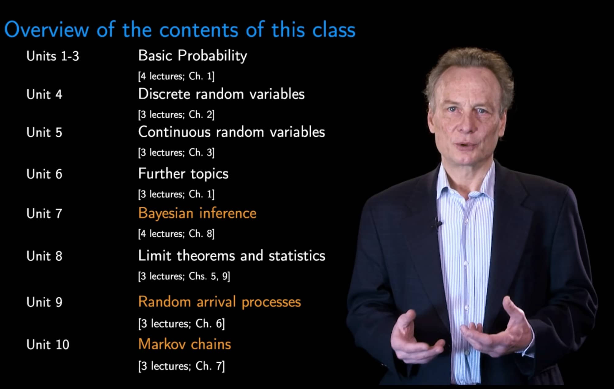

[toc]

# Unit1: Probability models and axioms

> 概率模型的基本结构及概率公理(axioms)。

1. 一个概率模型是对随机现象或随机试验的描述，可分为两步：

   1. 所有可能结果的集合(describe all possible outcomes)，即样本空间(sample space)。

   2. 描述每个结果的可能性(describe beliefs about likelihood of outcomes)，即概率定律(probability laws)。

## 1. Sample space & prob laws

### 1.1. Sample space

1. 样本空间即为所有可能结果的集合(set of possible outcomes, denote by $\Omega$)，它可以是离散的、有限的，也可以是连续的、无限的。

2. 样本空间的属性：
   1. mutually exclusive：结果之间相互排斥，即在每次实验最后只能发生一个结果，而其他的结果不可能发生。
   2. collectively exhaustive：样本空间穷举了所有可能的结果。不管实验结果如何，都只能指向样本空间里的一个结果。
   3. at the “right” granularity：样本空间只给出我们感兴趣的结果而不包含无关的变量。比如我们对抛一次硬币的结果感兴趣，则正确的样本空间为{head, tail}，而不是{head and rains, head and no rains, tail and rains, tail and no rains}，因为是否下雨并不是我们感兴趣的。样本空间的粒度取决于我们感兴趣的问题。

3. 样本空间的例子：

   1. 离散型：

   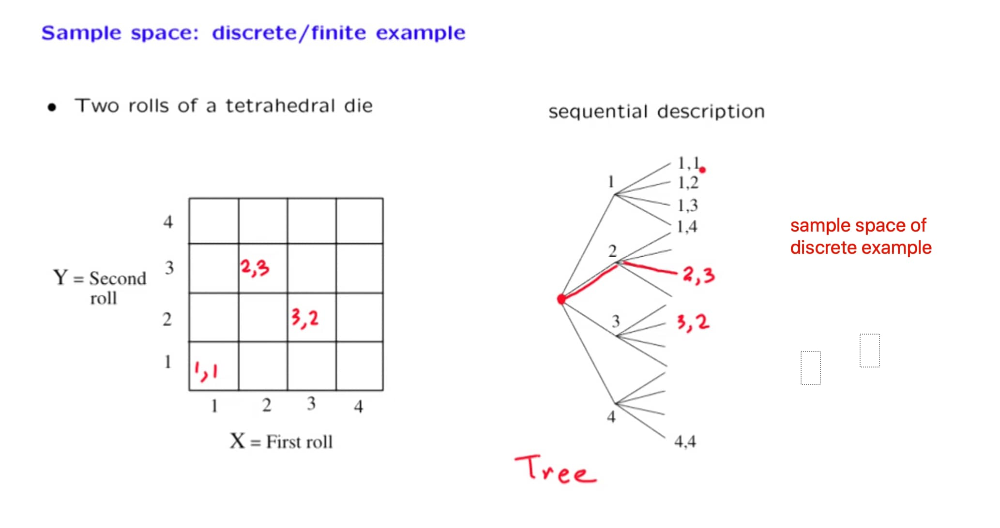

   2. 连续型：

   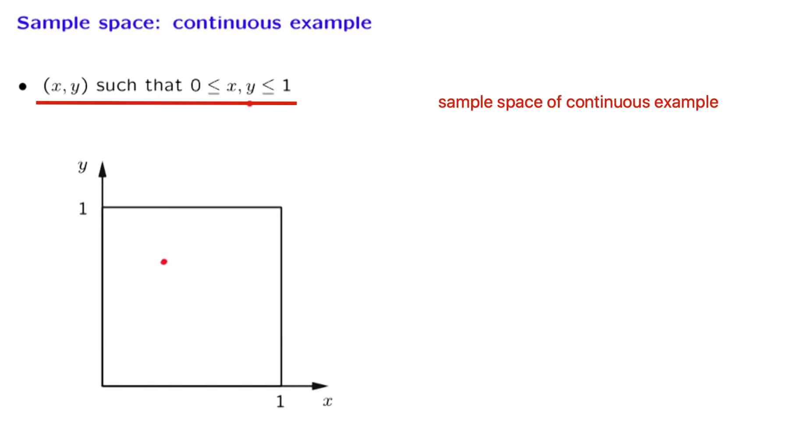

### 1.2. Probability axioms

1. 对于连续型变量，精确到一点的概率为0。因此我们一般描述的是一个区间/子集(subset)的概率。我们称样本空间的一个子集为事件(event)。

2. 概率公理：

   1. nonnagativity：非负性，$P(A)≥0$
   2. normalization：归一化，样本空间里的一个结果必然发生，因此整个样本空间的概率为1，$P(\Omega) = 1$
   3. additivity：可加性，如果事件A和事件B的交集为空集，则$P(A \cup B) = P(A)+P(B)$
   4. infinite additivity：无限可加性/可数可加性(countable additivity)，假设A1、A2、... An是一系列无限(sequence of disjoint)的不相交事件(可数的或区域的，countable/area)，则$P(A1 \cup A2 \cup A3 \cup ...) = P(A1)+P(A2)+P(A3)+...$

   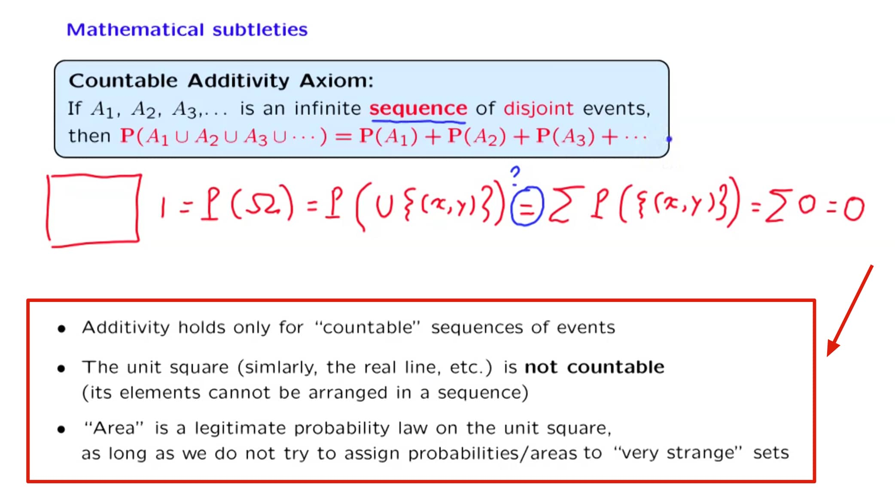

3. 概率公理延伸的其他属性：

   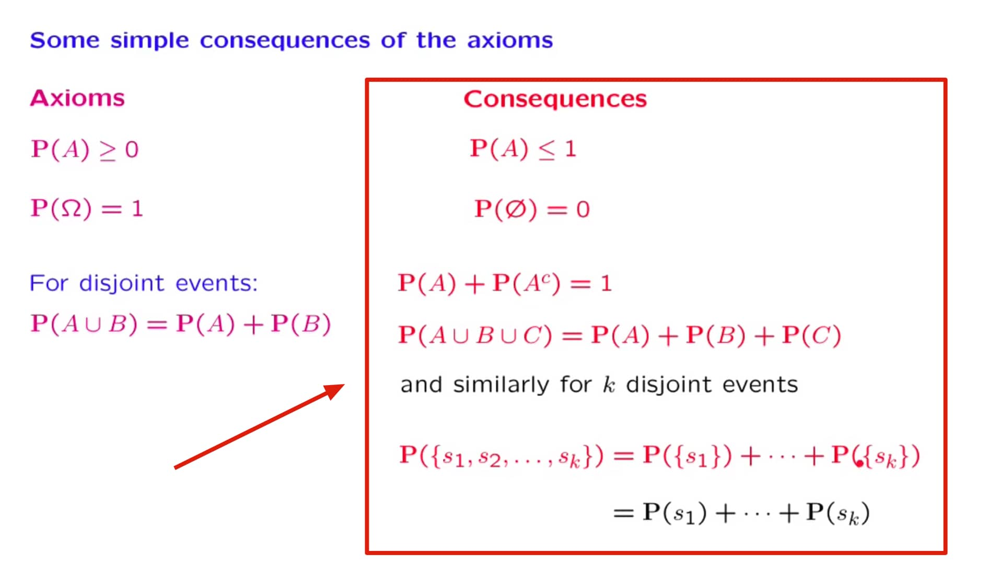

   

## 2. examples & definition

### 2.1. discrete & infinite example

1. 离散均匀定律(discrete uniform law)：假设样本空间有n个概率相等的元素，则每个元素的概率为$\frac{1}{n}$，包含k个元素的事件A的概率为$P(A) = \frac{k}{n}$，如掷骰子。

2. 举个离散但无限的样本空间的例子(discrete but infinite sample space):

   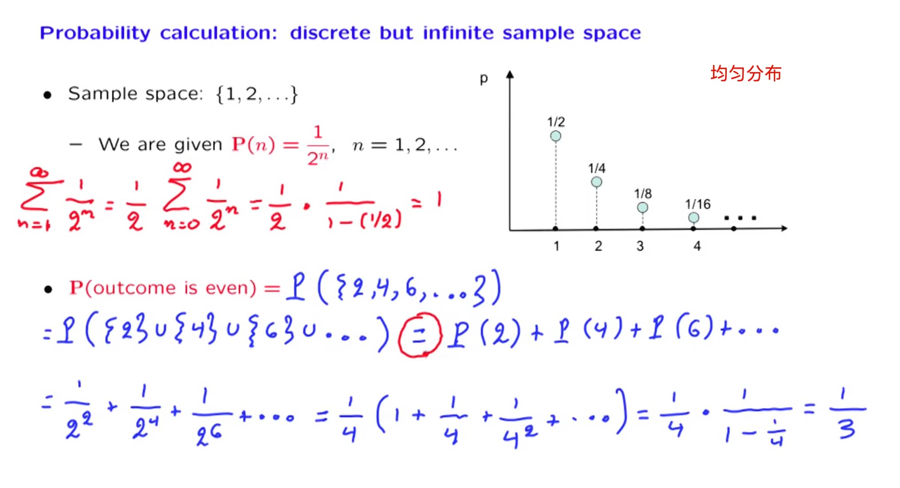

***

* 几何级数(geometric series)的求和公式：
  $$
  \sum_{0}^{n}a x^{n-1} = a\frac{x^n-1}{x-1} \quad x≠1
  $$
  
* 特别地，当$|x|<1$时，我们可以得到无限项的和：

$lim_{n \rightarrow \infty} x^n=0$,此时：$\sum_{n=0}^{\infty} a x^{n-1} = \frac{a}{1-x}$

* 举例：
  $$
  \sum_{n=0}^{\infty} \frac{1}{2^{n}} = \frac{1}{1-\frac{1}{2}} = 2
  $$
  

***

3. 关于可数可加性的公理：

### 2.2. role of probability

1. 概率经常可以被解释为：
   1. 信仰的描述(description of beliefs)
   2. 博彩偏好(betting preferences)

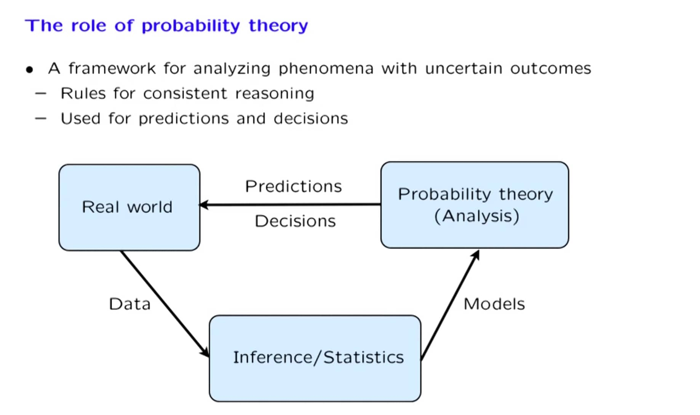

## 3. Mathematical background

### 3.1. sets & De Morgan's laws

1. 集合(set)：不同元素的组合(a collection of distinct elements)。集合可分成有限集合和无限集合。如果x属于集合S，则我们写为：$x \in S$。

   1. 有限集合：$S = \{a,b,c,d\}$
   2. 无限集合：$S = \{x \in R: cos(x) > \frac{1}{2}\}$

   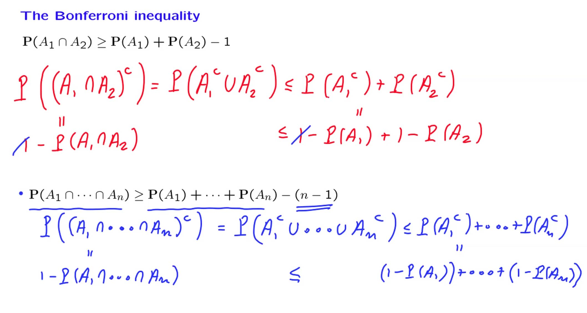

2. 德摩根定律(De Morgan's laws)：

$$(\cup_n S_n)^c = \cap_n S_n^c$$

$$(\cap_n S_n)^c = \cup_n S_n^c$$

### 3.2. sequences and their limits

1. 序列(sequence)：指一系列属于某一集合的$a_i$，其中$i \in N=\{1,2,3,...\}$。

2. 序列可能收敛至无穷，或者收敛至某个实数。

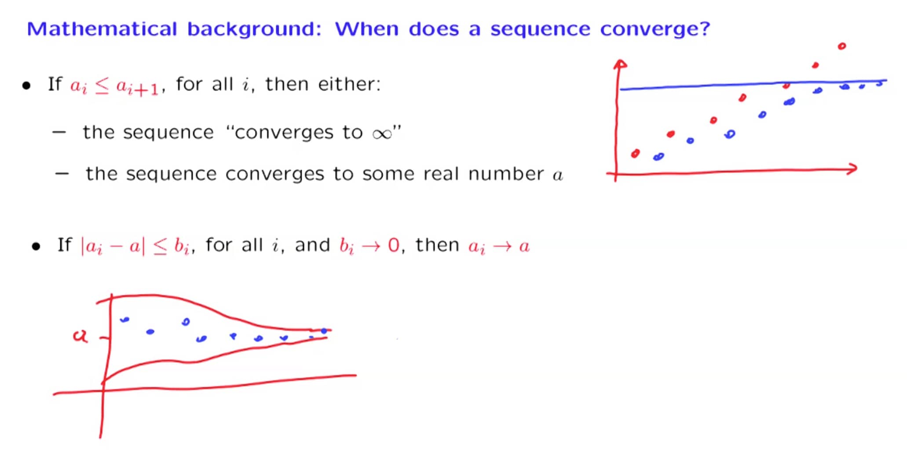

### 3.3. countable & uncountable sets

1. 集合是可数的是指：集合里每个元素可以有一个对应的正整数，如整数集合、正整数集合、0-1之间的有理数集合(整数和分数)。

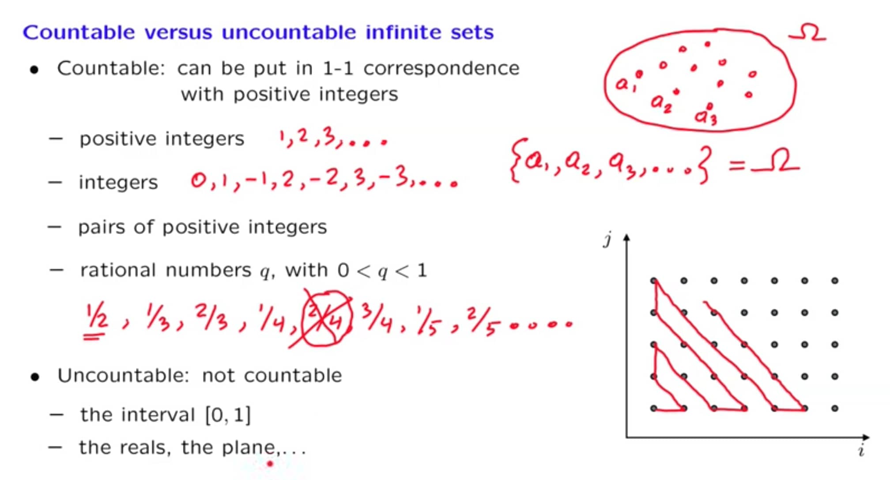

# Unit 2: Conditioning and independence

1. 条件化(conditioning)会根据部分信息更新概率，是一种非常有用的工具，可以使我们“划分并解决”复杂的问题。

2. 独立性(independent)用于对不相关(non-interactive)的概率现象进行建模，在构建基础复杂模型中发挥着重要作用。

## 1. Conditional Probabilities

1. 条件概率是指根据其他有关概率实验结果的信息修订我们的概率(Conditional probabilities are probabilities associated with a revised model that takes into account some additional information about the outcome of a probabilistic experiment.)。

2. 条件概率定义：P(A|B)，基于B发生，A发生的概率(probability of A, given that B occurred)

$$
P(A|B) = \frac{P(AB)}{P(B)} \qquad P(B)>0
$$

3. 条件概率的三大定理(three theorems)：

   1. 乘法法则(multiplication rule):

   $$
   P(AB) = P(B)P(A|B) = P(A)P(B|A)
   $$

   2. 总概率定理(total probability theorem)：
   $$
   P(B) = P(B \cap A)+P(B \cap A^C) \\= P(A)P(B|A)+ P(A^C)P(B|A^C)
   $$
   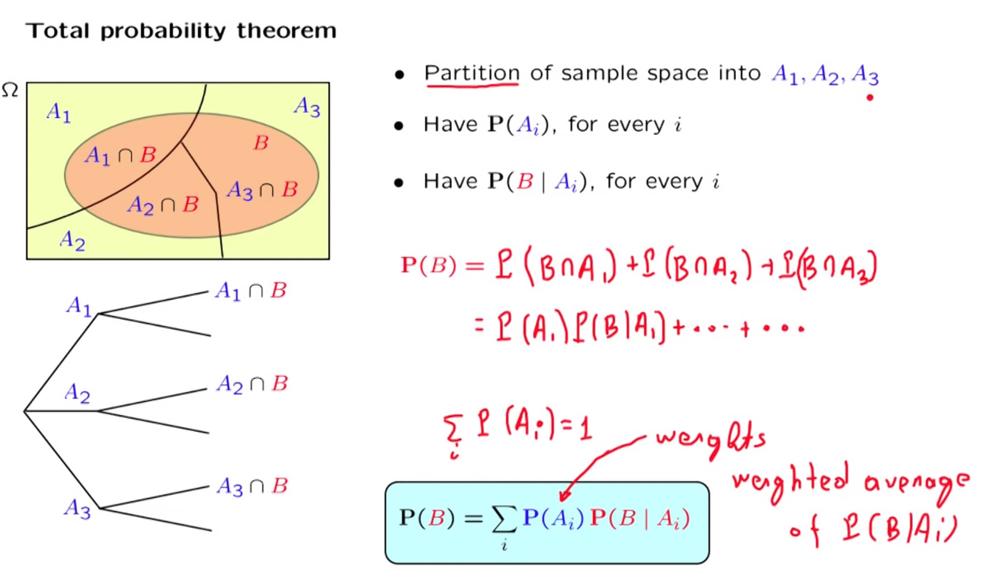

   3. 贝叶斯定理(Bayes' rule)：
      $$
      P(A_i|B) = \frac{P(A_i)P(B|A_i)}{\sum P(A_i) P(B|A_I)}
      $$

   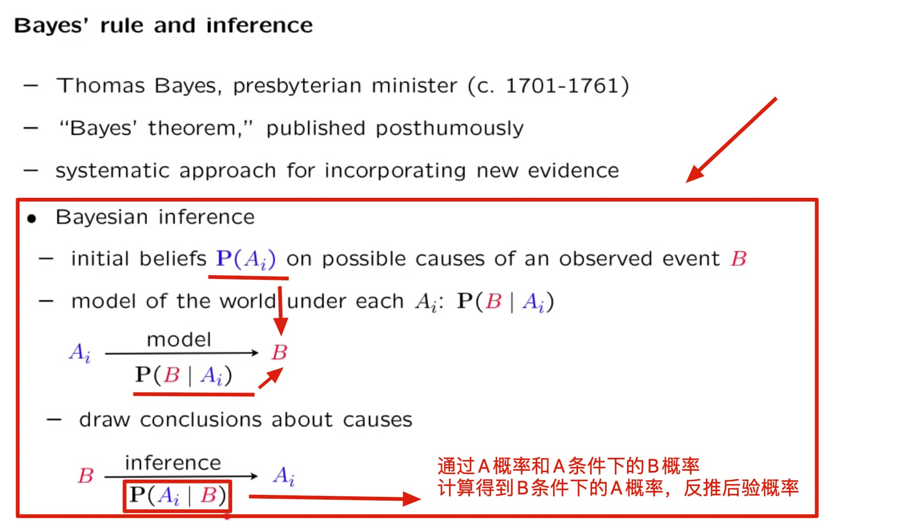

## 2. Independence

1. 当P(B|A) = P(B)时，即A的发生不影响B的发生(provide no information about B)，则认为A和B相互独立。

   1. 如果A和B相互独立，则①A和B的补集相互独立；②A的补集和B相互独立；③A的补集和B的补集相互独立。
   2. A和B相互独立的判断公式：

   $$
   P(A \cap B) = P(A)(B|A) = P(A) \cdot P(B)
   $$

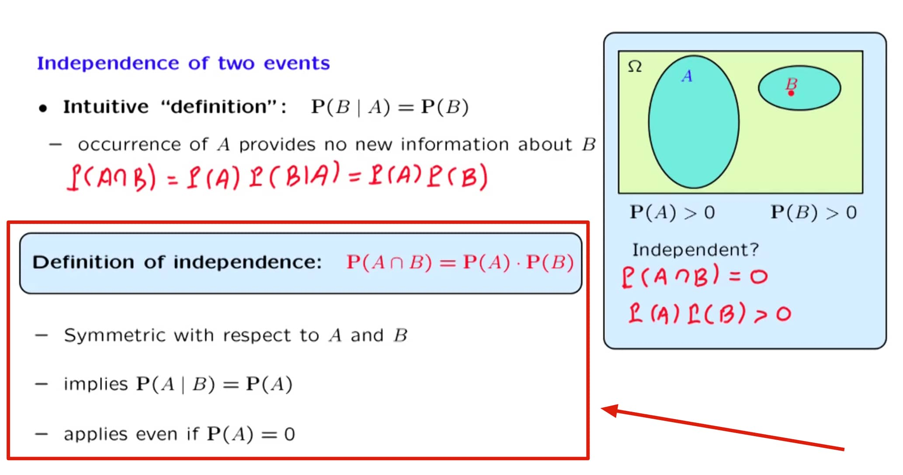

### 2.1. Conditional independence

1. 条件独立是指在给定条件C下，事件A和事件B条件独立。

   1. A和B相互独立并不意味着A和B在C条件下也条件独立。
   2. 判断条件独立的公式：

   $$
   P(A \cap B |C) = P(A|C) \cdot P(B|C)
   $$

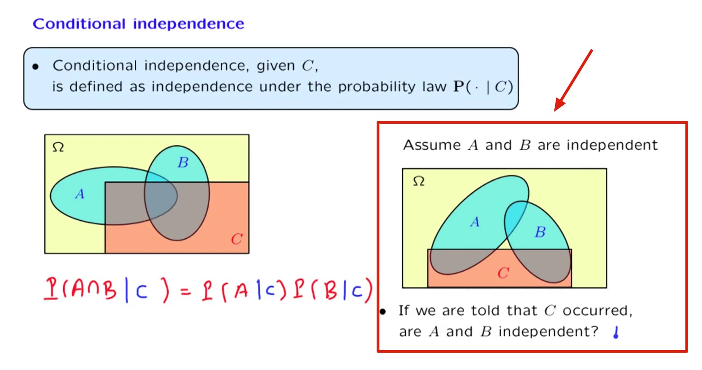

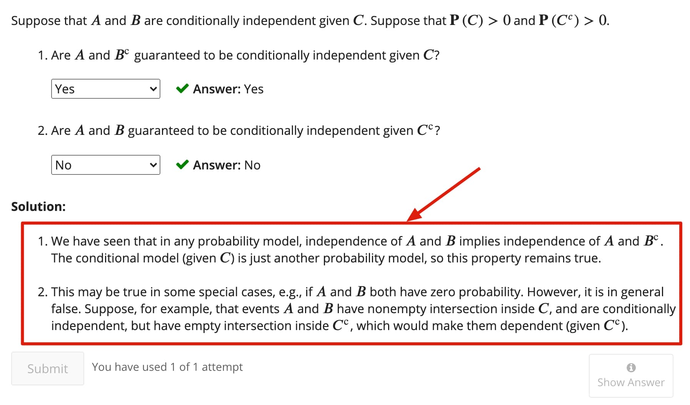

### 2.2. Independence of a collection of events

1. 从两个事件的相互独立类推，我们可以得到判断一系列事件独立性的公式：

$$
P(A_1 \cap A_2 \cap A_3 ... \cap A_m) = P(A_1) \cdot P(A_2) \cdot P(A_3) ... \cdot P(A_m)
$$

2. 成对独立(pairwise independence)的判断公式(假设仅有3个事件)：
   $$
   P(A_1 \cap A_2) =P(A_1) \cdot P(A_2)\\
   
   P(A_1 \cap A_3) =P(A_1) \cdot P(A_3)\\
   
   P(A_2 \cap A_3) =P(A_2) \cdot P(A_3)
   $$

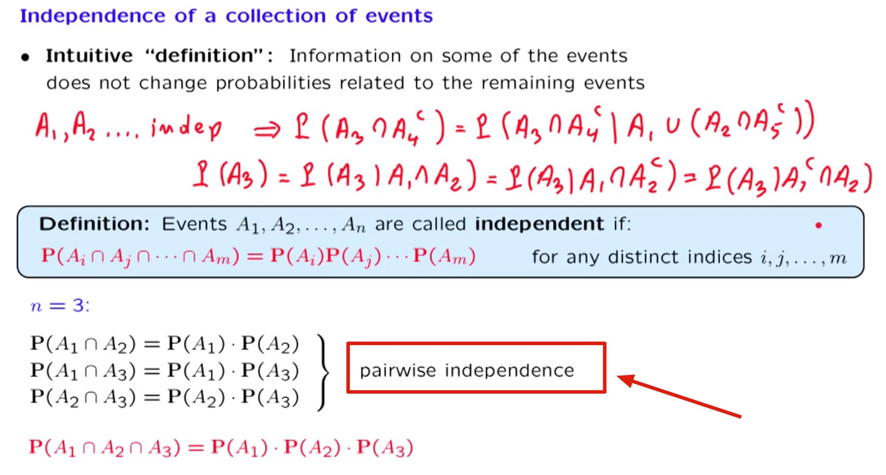

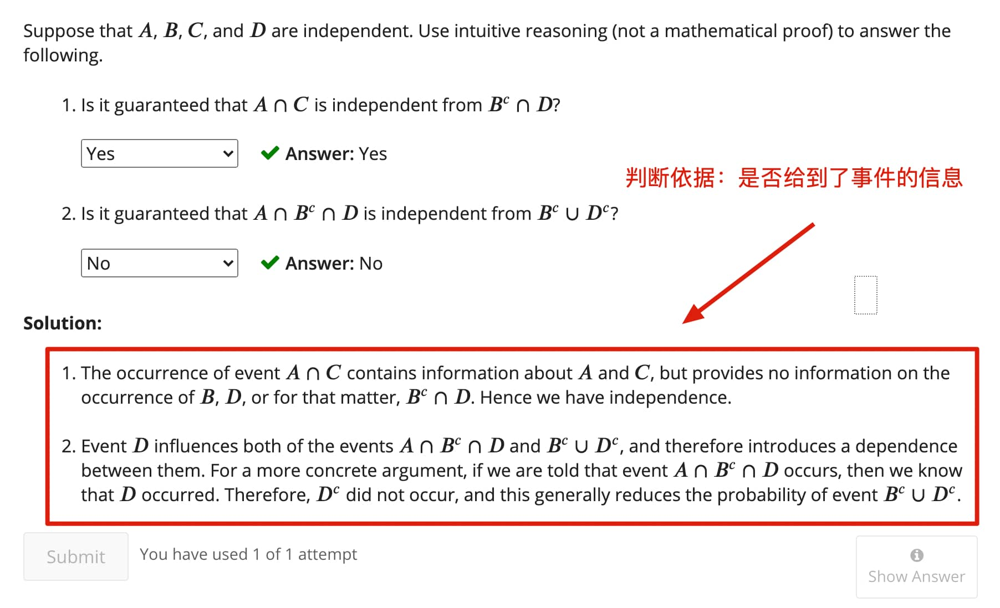

3. 著名的三道门问题(Monty Hall problem)说明了条件概率的重要性：

   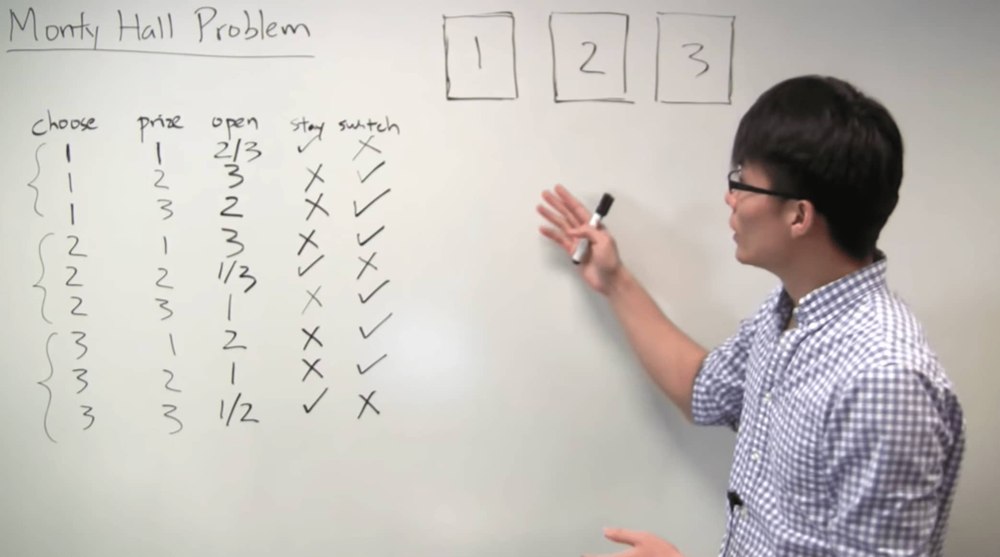

4. 解决条件概率和独立性的问题可以通过**韦恩图和树状图**简化问题，提高解题清晰度。

# Unit3: Counting

## 1. The counting principle

1. 假设我们完成某个事情需要$r$个步骤，每个步骤有$n_i$的选择，则根据基础计数原则(basic counting principle)，我们可以得到总的选择为：
   $$
   n_{总}=n_1·n_2·n_3...n_r
   $$

### 1.1. Permutation, subset& combination

1. 根据这一原则，我们可以逐一解决排列(permutation)、组合(combination)、子集(subset)、分区(partition)等问题。
   1. ==排列问题==：是指对n个元素的排列方法，则：

   $$
   n_{permutation}= n \cdot (n-1) \cdot (n-2)...1=n!
   $$

   2. ==子集问题==：假设计算{1...n}的子集数量，则每个元素都有2个选择(放进子集or不放进子集)，则子集的数量共有：

   $$
   n_{subset}=2 \cdot 2 \cdot 2 ... 2 = 2^n
   $$

   3. ==组合问题==：指从n个元素中取出k个(无排列)，则：
      $$
      n_{combination}=\binom{n}{k}=C_n^k=\frac{n!}{(n-k)!k!}
      $$
      

      1. $\sum^n_{k=0}\binom{n}{k}$相当于计算{1....k}的子集数量，则：$\sum^n_{k=0}\binom{n}{k} = 2^k$

      2. 特殊的：$0!=0$

2. 解决计数问题，根据基本计数原则进行分步骤计算每一步骤的可能性，而不同的步骤有不一样的计算难易度。比如n个人里组成k个人($k \in [0,n]$)的主席团，并选择1名主席，求主席团可能的组合数量。如果按照该步骤，我们需要做大量累加工作，则我们可以从另一个角度出发：

   1. 步骤①：选出一名主席，有$n$种选择；
   2. 步骤②：选择其他主席团成员，即包含主席在内的所有可能子集，有$2^{n-1}$种。
   3. 步骤③：$n_{总}=n \cdot 2^{n-1}$

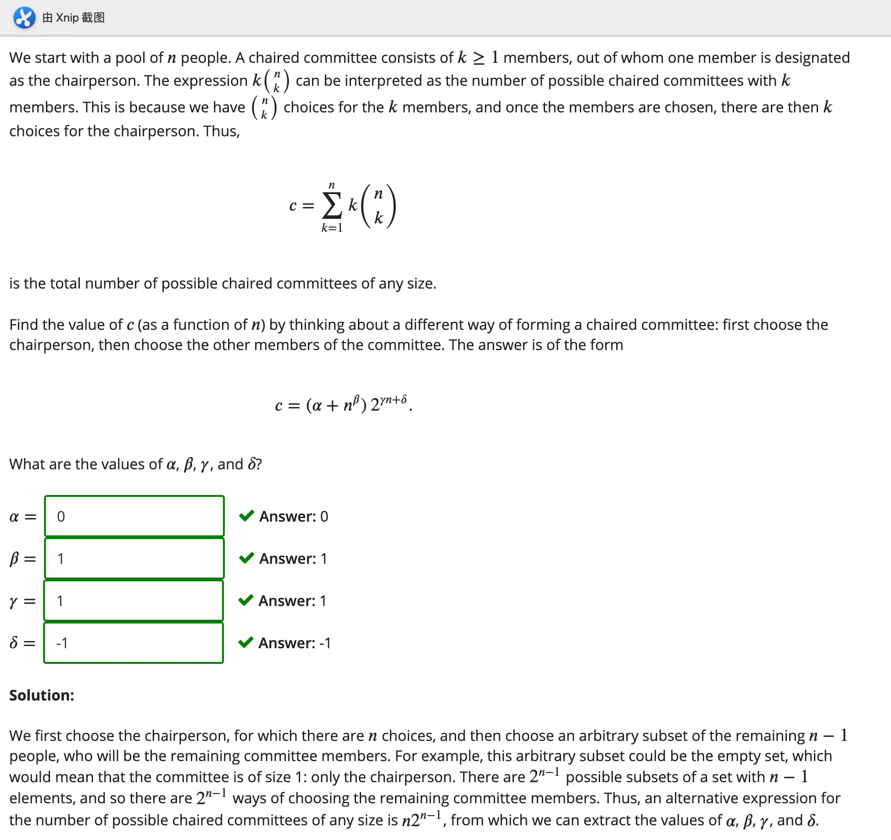

### 1.2. Partition & binomial probabilities

1. ==分区问题==：指将n个元素进行分割，则：

   1. 假设我们有n个元素，将其分成2个分区，分别有k个和n-k个元素，可组成的分区数量有：
      $$
      n_{partition} = \frac{n!}{(n-k)!k!} \text{(binomial coefficient)}
      $$

   2. 假设我们有n个元素，我们将其分成r个分区，各分区分别有$n_1,n_2,...n_r$个元素，可组成的分区数量有：

   $$
   n_{partition} = \frac{n!}{n_1! n_2!...n_r!} \text{(multinomial  coefficient)}
   $$

2. ==二项概率==：假设投掷一枚硬币，正面向上的概率为p，则投掷n次，共有k次正面向上的概率为：

$$
P(x=k)=\binom{n}{k}p^k(1-p)^{n-k} \text{(binomial probability)}
$$

3. ==多项概率==：假设有一个装有r种颜色球的盒子，每种颜色球的概率分别为$p_1, p_2, p_3,...p_n$。从盒子里取出n颗球，其中每种颜色各取出$n_1, n_2, n_3...n_r$个球($n_1+n_2+n_3...+n_r=n$)，其概率为：
   $$
   P(n2,n2,...n3)=\frac{n!}{n_1!n_2!n_3!...n_r!}p_1^{n_1}p_2^{n_2}p_3^{n_3}...p_r^{n_r}\\
   \text{(multinomial probility)}
   $$
   

# Unit 4: Discrete random variables

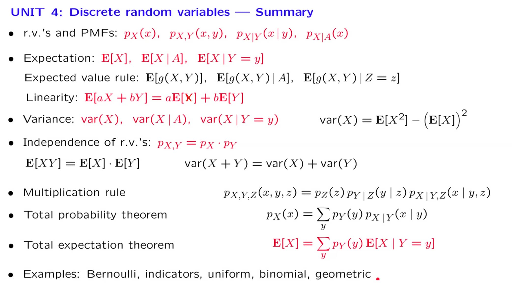

## 1. Probability mass functions and expectations

1. 本章介绍随机变量的概念和定义、概率质量函数、经典离散变量概率模型、期望及其属性。

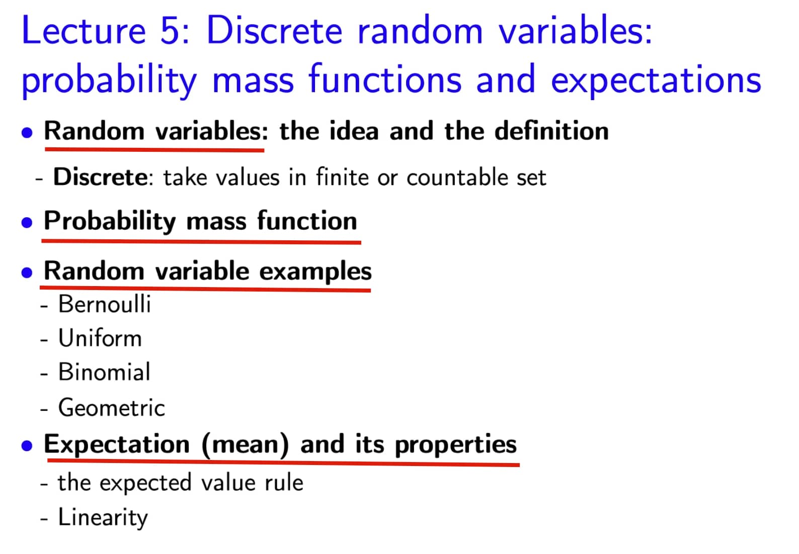

### 1.1. Random Variables

1. 随机变量(r.v.)的数学含义为：样本空间$\Omega$的实值函数(a function from the sample space $\Omega$ to the real number)。比如以一个班级为样本空间，从中随机抽出a、b、c，则abc的身高就是一个随机变量。注意：==随机变量必须由实际数值(numerical value)构成==。符号表示：
   1. 随机变量(random variable)：$X$
   2. 随机变量的实际数值(numerical value)：$x$

2. 需要注意的是：
   1. 一个样本空间根据不同的实值函数可以产生多个随机变量，如一个班级身高、体重等。
   2. 一个或多个随机变量的函数也是随机变量，如$X+2$，既可以将2看成一个简单的随机变量，也可以看成X的一个加法函数。
   3. 我们称只有一个实值的随机变量为确定性随机变量(deterministic random variable)，它没有任何随机性，如$X = \{1\}$。

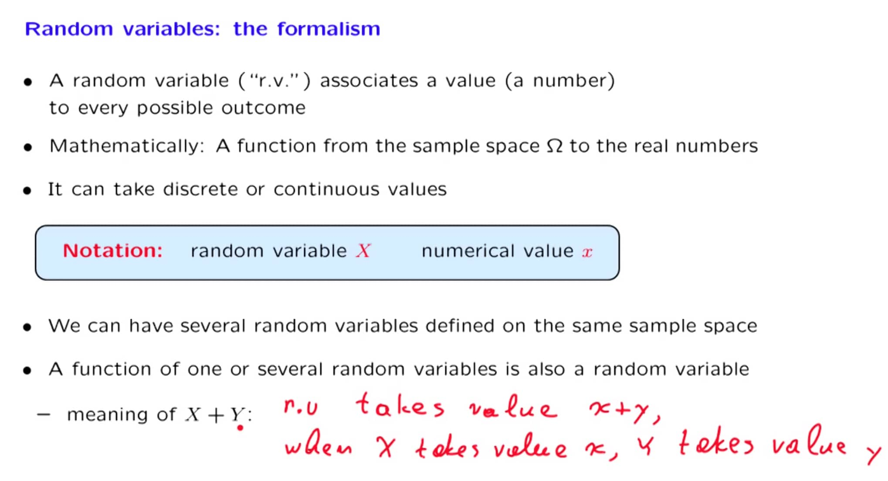

### 1.2. Probability mass functions

1. 我们用==概率密度函数来描述随机变量实值的可能性，简称PMF，PMF给出了不同实值的出现概率==(gives the probability of the different possible numerical values)。

   1. 离散型随机变量的PMF有时也叫做概率定律(probability law)或概率分布(probability distribution)。
   2. 需要记住的是：PMF也是一个函数，如$p_X()$。在括号里放入一个实值如$p_X(y)$则输出一个函数结果，也就是实值(number)；但如果括号里放入一个随机变量如$p_X(Y)$，则是一个新的r.v.(r.v.的函数也是r.v.)，这时主观上理解就是，用r.v. $X$的PMF来计算r.v. $Y$，得到一个新的r.v.。

2. PMF的符号表示：

   1. 一个实值$x$的出现概率：

   $$
   p_X(x) = P(X=x) = P(\{w \in \Omega \,s.t.X(w)=x\})\\
   注：w表示样本空间里的一个样本。
   $$

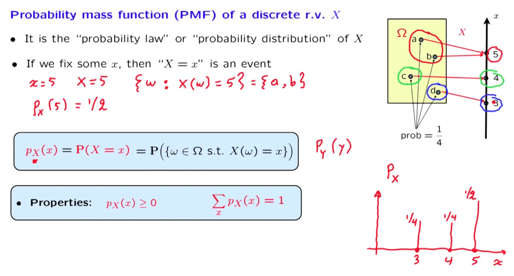

### 1.3. Classic Discrete variable

1. 伯努利随机变量和指标变量：

   1. 伯努利(Bernoulli)：是最简单的随机变量，指有两种可能实值(1或0)的一次结果，为1的概率p，为0概率为1-p。如一枚硬币投掷一次，正面或反面的r.v.。
   2. 指标(Indicator)：由伯努利可以延伸到事件的指标r.v.，即通过该指标判断事件是否发生，用$I$表示。例：对于事件A，$I_A = 1$表示事件发生；$I_A=0$表示事件未发生。

2. 离散均匀随机变量(discrete uniform r.v.)：

   1. 定义：在区间[a,b]内的任意一个整数都有相同的概率，即其样本空间为$\Omega = \{a,a+1,...,b\}$，r.v.为$X(w) = w$。
   2. PMF：所有的实值出现可能性都为$P=\frac{1}{b-a+1}$。

   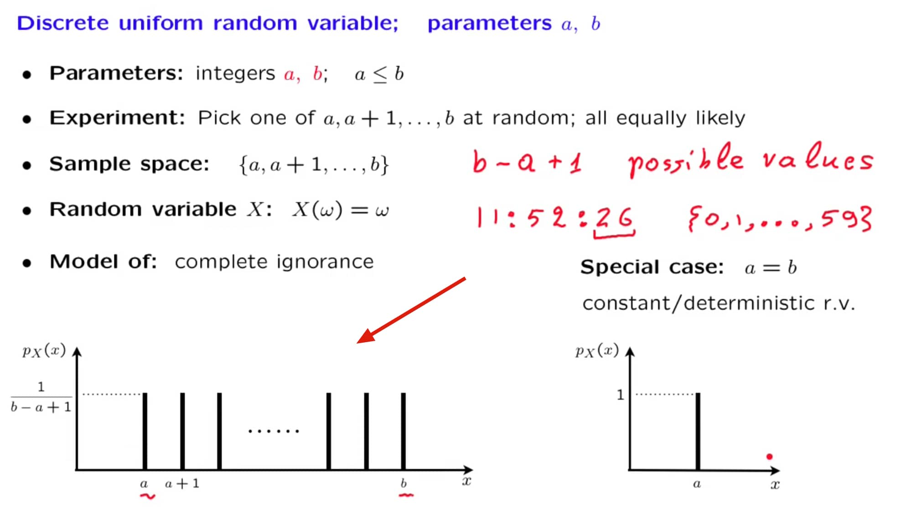

3. 二项随机变量(Binomial r.v.)：

   1. 定义：多次实验中成功的次数满足二项分布，如：一枚硬币投掷n次，正面向上的r.v.。

   2. PMF：n次实验中k次成功的概率
      $$
      p_X(k)=\binom{n}{k}p^k(1-p)^{n-k} \quad k = \{0,1,...,n\}
      $$

   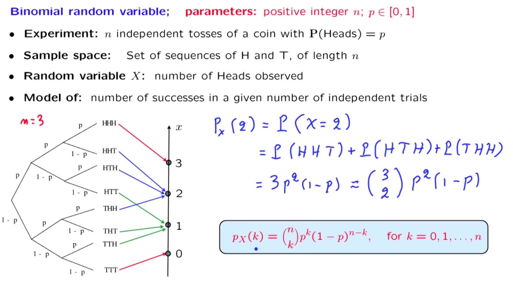

4. 几何随机变量(Geometric r.v.)：

   1. 定义：直到第一次成功时实验的次数满足几何分布，为无限离散型r.v.(infinite)。如：一枚硬币投掷，第k次出现正面的r.v.。

   2. PMF：直到第k次才成功的概率(k是无限的)
      $$
      p_X(k) = P(X=k)= (1-P)^{k-1}P \quad k=\{1,2,3...\}
      $$

   3. Trick：如果要计算大于第k次才成功的概率，则可以通过其对立事件获得，举例：
      $$
      P(X≥10)= P(前9次都是失败的) = (1-p)^9
      $$

   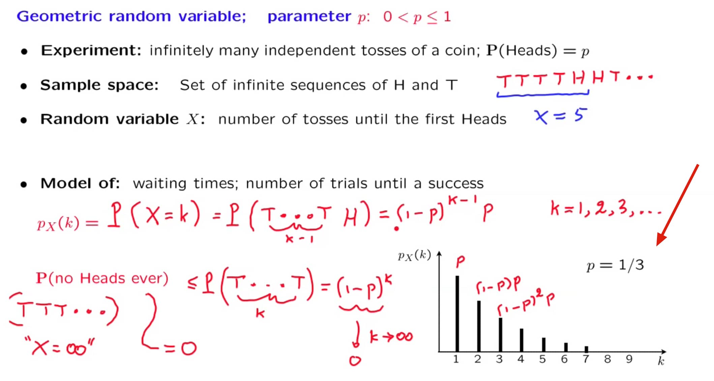

### 1.4. Expectation and Its Properties

1. 均值(expected value/expectation/mean)定义：==你期望看到的大量独立重复实验的平均值==(the average that you expect to see in a large number of independent repetitions of the experiment)。

   1. 均值与PMF：r.v.的所有可能取值及其概率

   $$
   E(X)= \sum_x xp_X(x)
   $$

   2. 均值与实值：r.v.所有实值的平均值
      $$
      E(X)=\frac{1}{n}\sum x_i
      $$
      

2. 关于均值需要明确的是：

   1. 均值不一定会在实验中出现，只是我们大量重复后的平均值。比如伯努利实验的均值为p，但实际上结果只可能是0或1。
   2. 当我们计算离散但无限的r.v.时(如：uniform r.v.)，期望也变成了一个无限的计算，此时为了让期望很好地被定义为某个数值(to be well-defined and finite)，我们需要假设绝对值$x$的期望绝对收敛：

   $$
   \sum_x|x|p_X(x) < \infty
   $$

3. 计算经典离散型r.v.的期望：
   1. 伯努利：$E(Bernoulli) = p$
   2. 离散均匀：$E(Uniform) = \frac{b+a}{2}$

   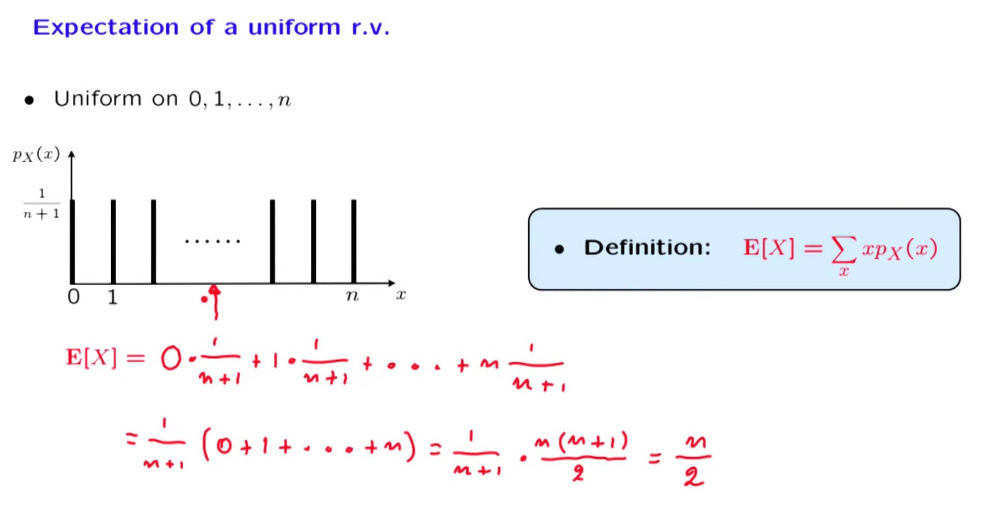

   3. 二项分布：多个独立伯努利实验均值相加可得，$E(binomial) = np$
   
   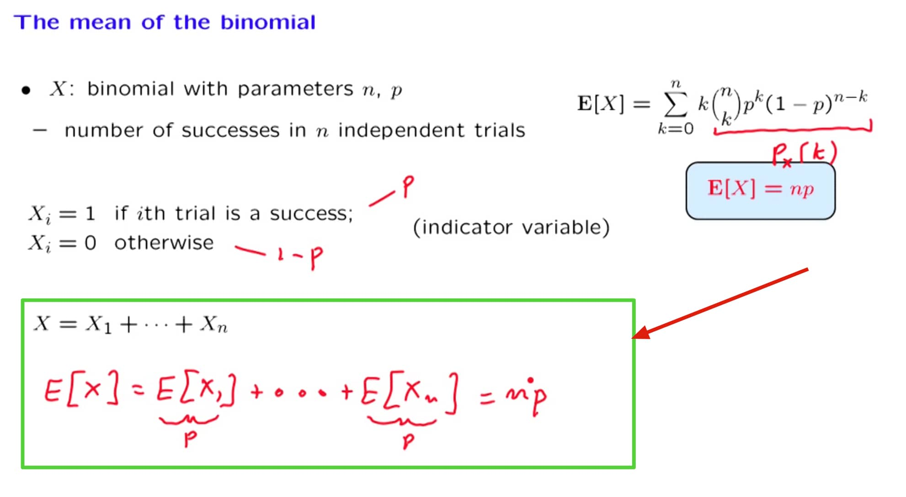
   
   4. 几何分布：利用几何分布的无记忆性可以推导出其期望。$E(Geometric) = \frac{1}{p}$
   
4. 期望的相关属性和法则：

   1. 基本属性(elementary properties)：
      1. if $X≥0$，then $E(X)≥0$
      2. If  $a≤X≤b$，then $a≤E(X)≤b$
      3. If c is a constant, $E(c)=c$
   2. 函数法则(expected value rule)：

   $$
   假设Y=g(X)，则：\\
   E(Y) = E[g(X)]=\sum_x g(X)p_X(x)
   $$

   ​		1. 举例：$E(X^2) = \sum_x x^2 p_X(x)$

   ​		2. 注意：$E[g(X)]≠ g[E(X)]$

   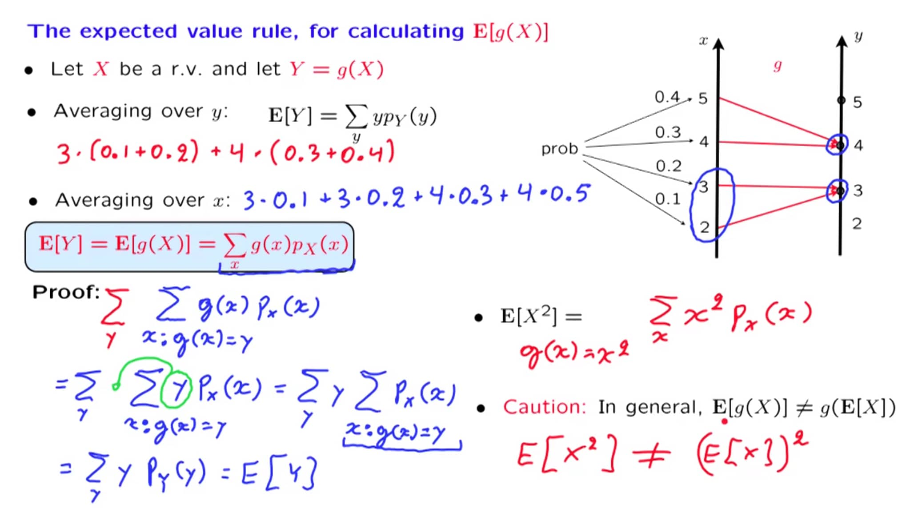

   3. 期望的线性(linearity)：
      $$
      E(aX+b) = aE(X)+b\\
      E(X+Y) = E(X) + E(Y)\\
      E(X_1+X_2+...+X_n) = E(X_1)+E(X_2)...+E(X_n)
      $$

## 2. Variance; Conditioning on an event; Multiple r.v.'s

本章我们介绍方差、条件概率、联合概率以及推导二项分布的期望值。

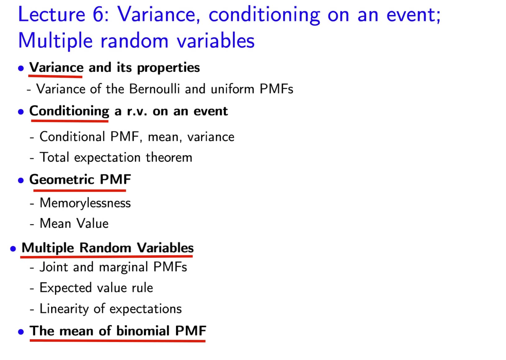

### 2.1. Variance

1. 定义：描述数据的散布程度(a measure of the spread of a PMF)。

   1. 公式1：
      $$
      Var(X) = E[(X-\mu)^2]=\sum_x(x-\mu)^2p_X(x)
      $$

   2. 公式2：
      $$
      Var(X) = E(X^2)-[E(X)]^2
      $$

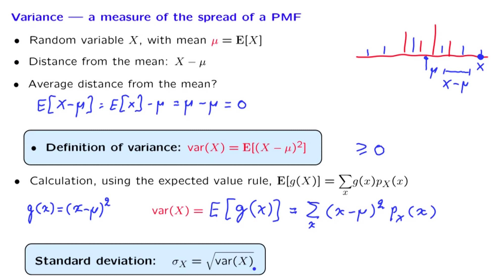

2. 属性：$Var(aX+b) = a^2 Var(X)$

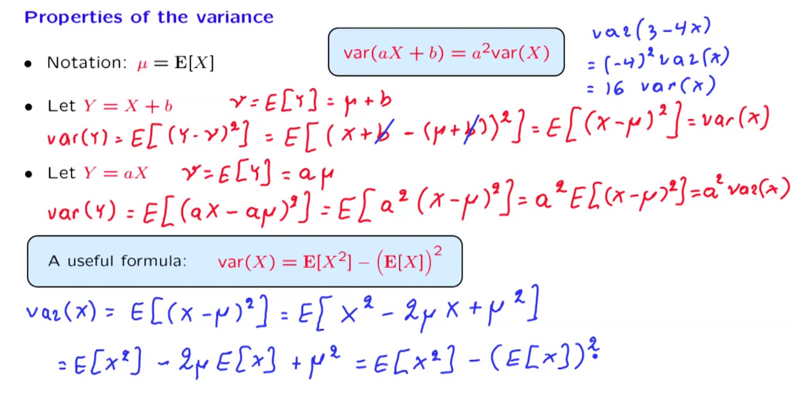

3. 计算经典离散型r.v.的方差：

   1. 伯努利：$V(Bernoulli) = p(1-p)$

      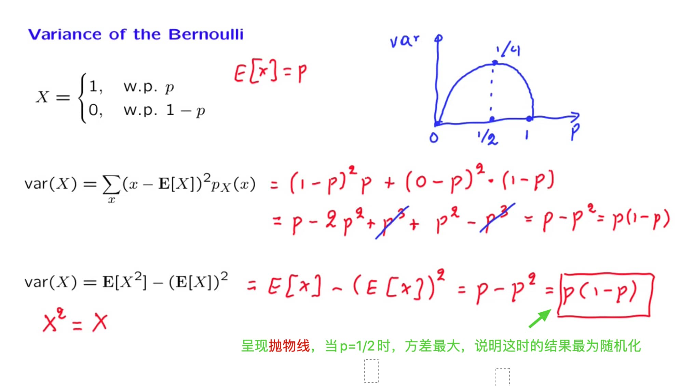

   2. 离散均匀：$V(Uniform)= \frac{1}{12}(b-a)(b-a+2)$

      

   3. 几何分布：$V(Geometric) = \frac{1-p}{p^2}$

      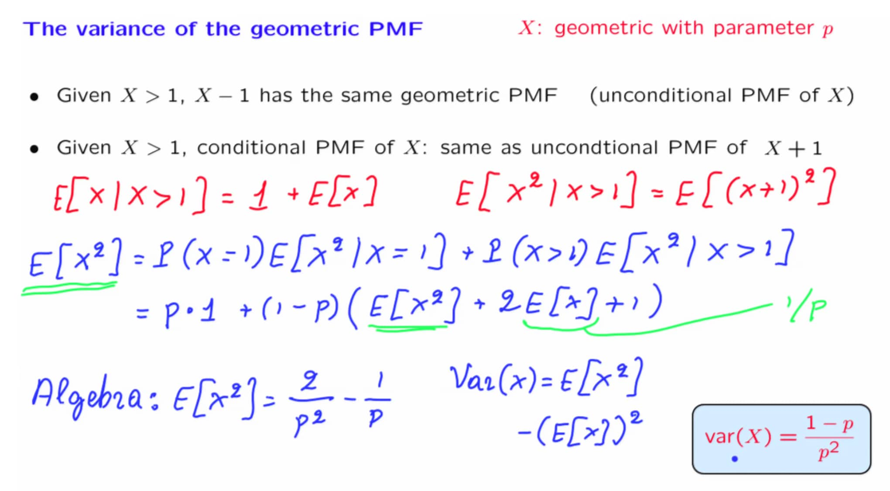

### 2.2. Multiple R.V. and Joint PMFs

1. Multiple r.v.包含多个变量(这里列出两个变量的公式，其余以此类推)：

   1. 他们的分布称之为联合分布(Joint PMF)，满足：

   $$
   p_{X,Y}(x,y) = P(X=x \,and \, Y=y)\\
   \sum_x \sum_y p_{X,Y}(x,y) = 1
   $$

   2. 单个变量的分布称之为边际分布(marginal PMF)，满足：
      $$
      p_X(x)= \sum_y p_{X,Y}(x,y)\\
      p_Y(y)= \sum_x p_{X,Y}(x,y)
      $$
      

   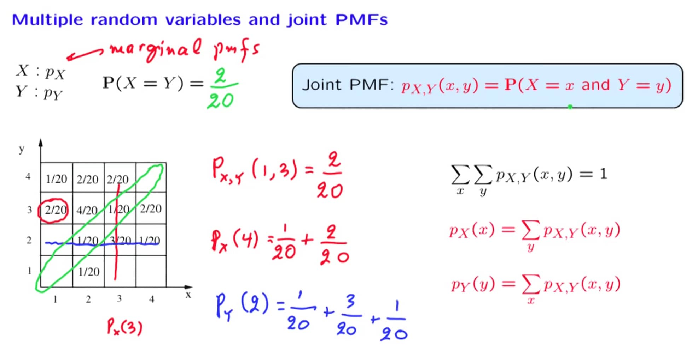

2. Function of Multiple r.v.：根据期望函数法则和联合分布，可知当$Z = g(X,Y)$时，则：
   $$
   p_Z(z) = P(g(X,Y)=z)=\sum_{(x,y):g(x,y)=z}p_{X,Y}(x,y)\\
   E[g(X,Y)] = \sum_x \sum_y g(x,y) \cdot p_{X,Y}(x,y)
   $$
   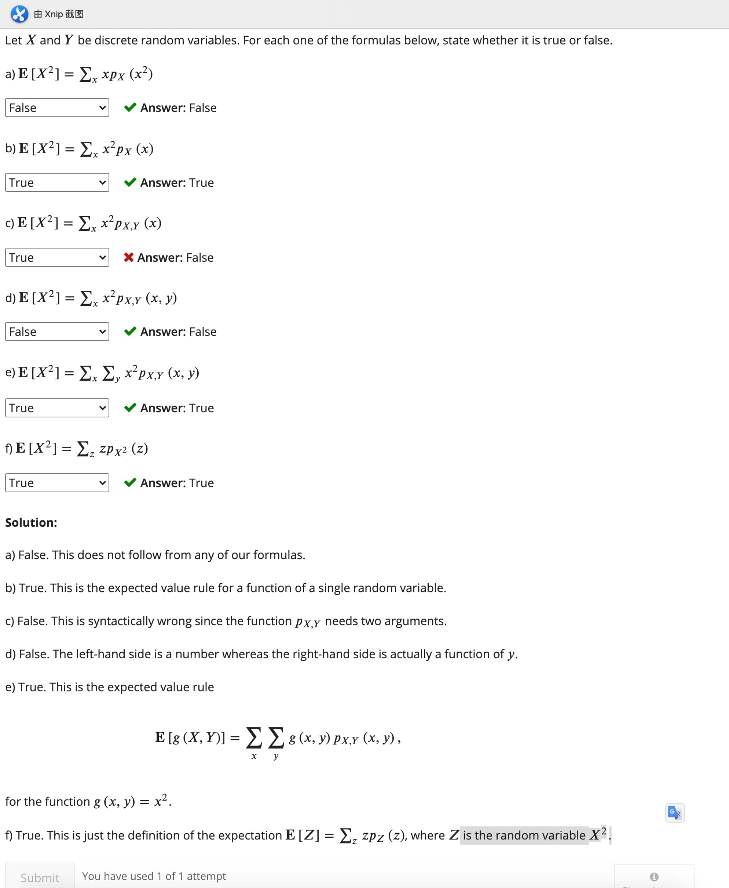

## 3.  Conditional PMFs and Independence of r.v.

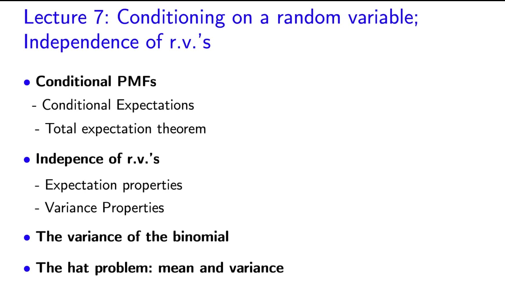

### 3.1. Definition of Conditional PMFs

1. 有条件的PMF和全集下的PMF是类似的，是基于某事发生的前提下更新了目标事件的PMF，但其概率和期望的计算是一样的。

   

2. 基于r.v. Y等于y的条件下，X条件PMF的概率计算公式有：

   1. 基础计算：
      $$
      p_{X|Y}(x|y) = P(X=x | Y=y)=\frac{P(X=x,Y=y)}{P(Y=y)}\\
      =\frac{p_{X,Y}(x,y)}{p_Y(y)} \quad \text{(y必须满足$p_Y(y)>0$)}\\
      $$

   2. 总概率定理：

$$
\sum_xp_{X|Y}(x|y) = 1 \quad \text{(y是Y的一个特定取值)}\\
p_X(x) = \sum_y p_Y(y)\cdot p_{X|Y}(x|y)
$$

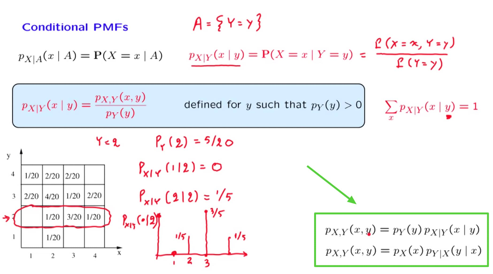		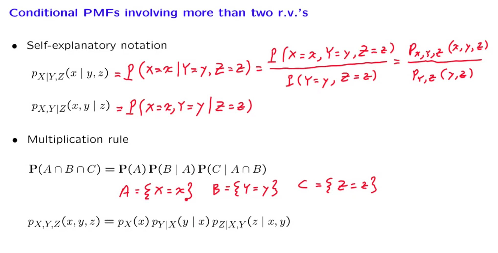

### 3.2. Conditional Expectation

1. 条件PMF均值的相关计算公式：

   1. 基础计算：

   $$
   E[X|Y=y] = \sum_x xp_{X|Y}(x|y)
   $$

   2. 函数法则(expected value rule)：
      $$
      E[g(X)|Y=y] = \sum_x g(x)p_{X|Y}(x|y)
      $$

   3. 总期望定理(Total expectation theorem):
      $$
      E(X)= P(A_1)E[X|A_1]+...+P(A_n)E[X|A_n]\\
      =\sum_yP_Y(y)E[X|Y=y]
      $$
      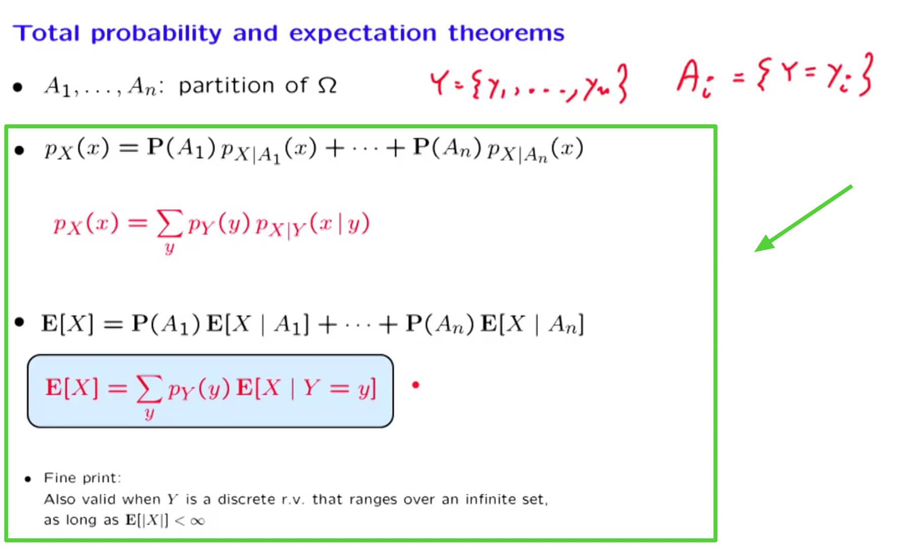

2. 几何r.v.的无记忆性和期望推导(memorylessness and expectation)：
   1. 无记忆性：即过去的结果不会影响将来的事件，如：前一次抛硬币的结果不会影响本次的结果。用条件PMF解释的话，指在抛硬币中，基于第一次是背面的事件，在抛到正面前的剩余次数还是为几何r.v.，该条件并未能更新我们第k次抛到正面的概率。

   

   2. 期望计算：

   

   

### 3.3. Independence of R.V.

1. 若两个r.v.相互独立，则他们满足：
   $$
   P_{X,Y}(x,y) = p_X(x)p_Y(y) \quad \text{(for all x,y)}\\
   ---\\
   P_{X|Y}(x|y) = P_X(x) \quad \text{(for all y)}
   $$
   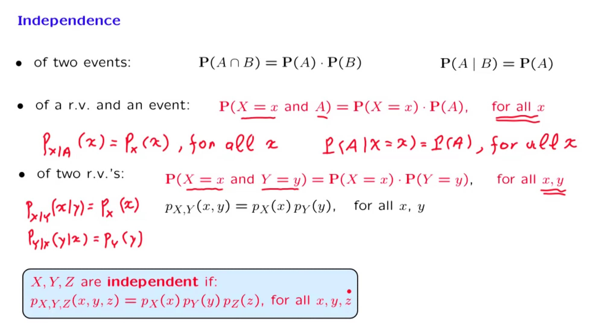

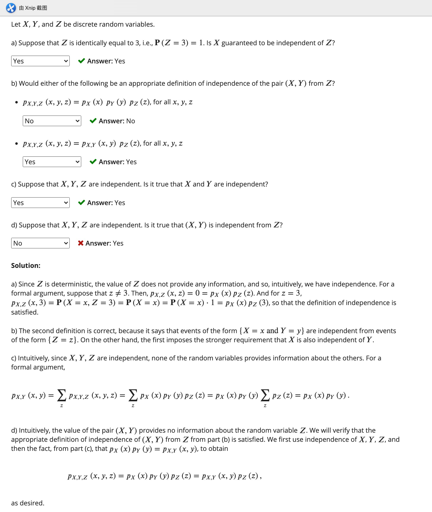

2. 如果r.v.相互独立，则期望满足：
   $$
   E[XY]= E[X] \cdot E[Y]\\
   g(X)和h(Y)也相互独立，则：\\
   E[g(X)h(Y)]= E[g(X)] \cdot E[h(Y)]
   $$
   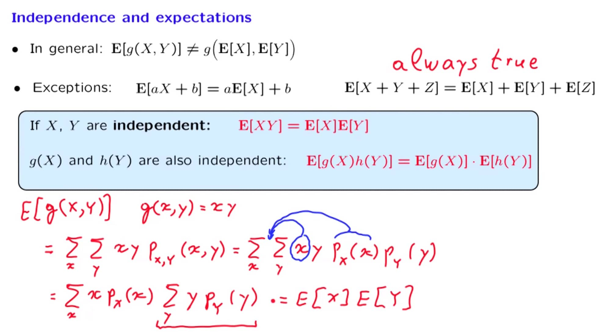

3. 如果r.v.相互独立，则方差满足(但反过来，方差满足以下条件，r.v.不一定相互独立)：
   $$
   Var(X+Y) = Var(X)+Var(Y) \quad \text{(X,Y必须相互独立)}
   $$
   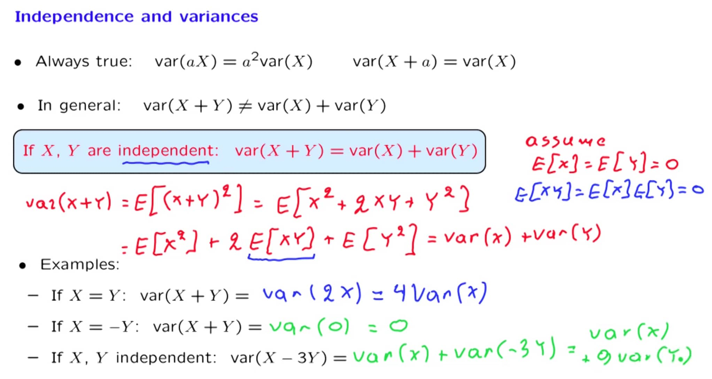

   1.  根据这一属性，我们可以推导出来二项分布的方差：$Var(binomial) = np(1-p)$

      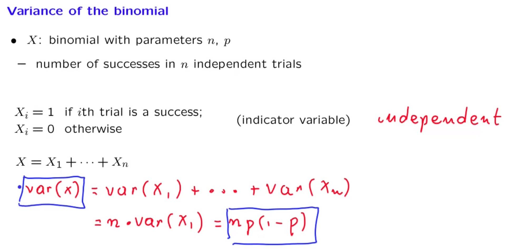

### 3.4. Important Inference

1. 利用尾部概率和(sum of tail probabilities)计算期望：假设X是一个非负整数r.v.，则：
   $$
   E[X] = \sum_{k=1}^{\infty}k \cdot p_x(k) = \sum_{k=1}^{\infty} P(X≥k)
   $$
   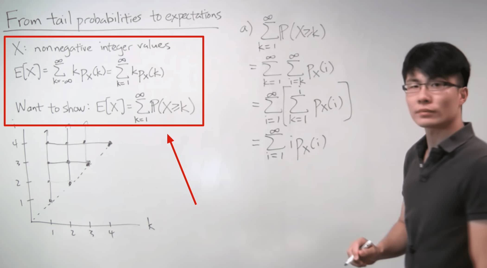

2. K次几何实验的期望计算(又称优惠券收集问题)：假设优惠券有A、B、C、D、E、F共6种优惠券，为收集全部种类的优惠券，你的期望购买次数为多少呢？
   $$
   T_1表示获得第一张券，以此类推：\\
   E[T] = E[T_1]+E[T_2]+...+E[T_n]\\
   =\frac{1}{p_1}+\frac{1}{p_2}+...+\frac{1}{p_n}=\frac{n}{n} + \frac{n}{n-1} +...+\frac{n}{1}\\
   =n \cdot (1+\frac{1}{2}+...\frac{1}{n}) = n \cdot ln(n) + \gamma \cdot n +0.5+ O(1/n)\\
   ≈ n \cdot ln(n)
   $$
   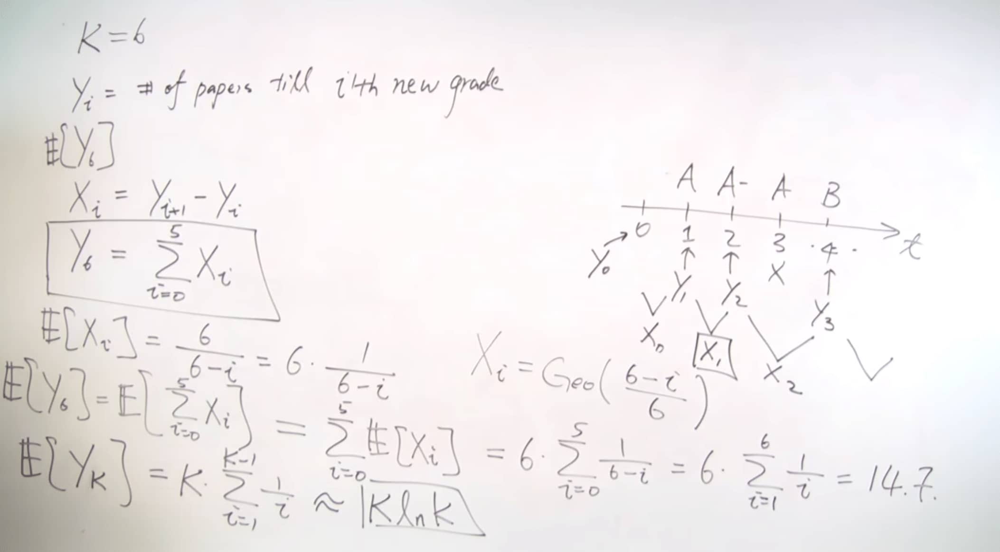

3. 指标变量求解反转数量(number of inversion)：假设有n个人选择n个座位，座位号码为随机变量$X_n$。如果i<j，而第i个人的座位号码$X_i$大于第j个人的座位号码$X_j$，则我们认为发生了反转，如何求反转的期望次数$E[N]$呢？

   1. 设定指标变量:

   $$
   I_{i,j}=\left\{
   \begin{aligned}
   1 & & X_i>X_j\\
   0 & & otherwise 
   \end{aligned}
   \right.
   $$

   2. 期望次数可表示为：
      $$
      E[N] = E[\sum_{i<j}I_{i,j}] = \sum_{i<j}E[I_{i,j}]
      $$

   3. 因为$X_i>X_j$和$X_i＜X_j$的发生概率是一致的，因此：
      $$
      E[I_{i,j}] = 1/2 \cdot 1 + 1/2 \cdot 0 = 1/2
      $$

   4. 因此，可得出期望次数为：
      $$
      E[N] = \sum_{i<j}E[I_{i,j}] = \frac{n(n-1)}{2} \cdot \frac{1}{2} = \frac{n(n-1)}{4}
      $$

4. 指标变量求解共同存活组数量(the number of joint alive)：假设有2m个人，分成m个组，一段时间后每个人存活的概率为p(存活概率相互独立)。用随机变量A表示存活的人数，随机变量S表示存活的组数，求任意存活人数下S的期望值$E[S|A=a]$。

   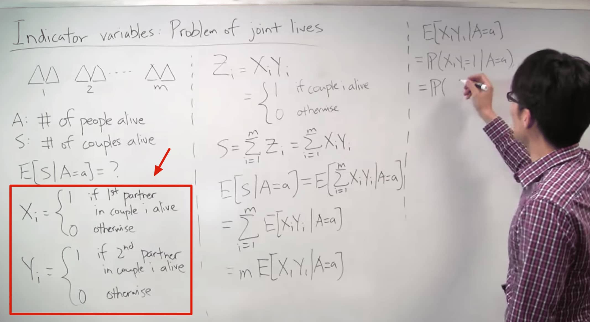

   

# Unit 5: Continuous Random Variables

1. 这个单元，我们将学习连续型随机变量和其概率密度函数，以及期望、方差、累积分布函数等属性。这些和离散型随机变量是类似的，但计算上存在一些小差别。

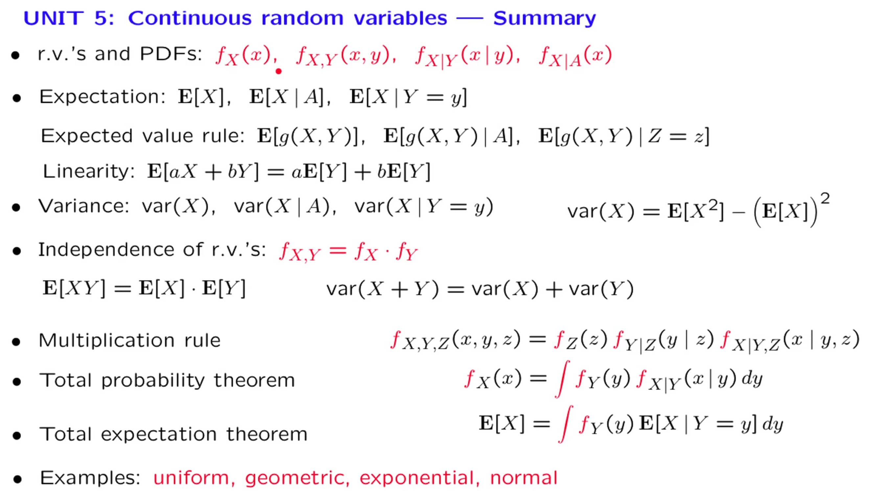

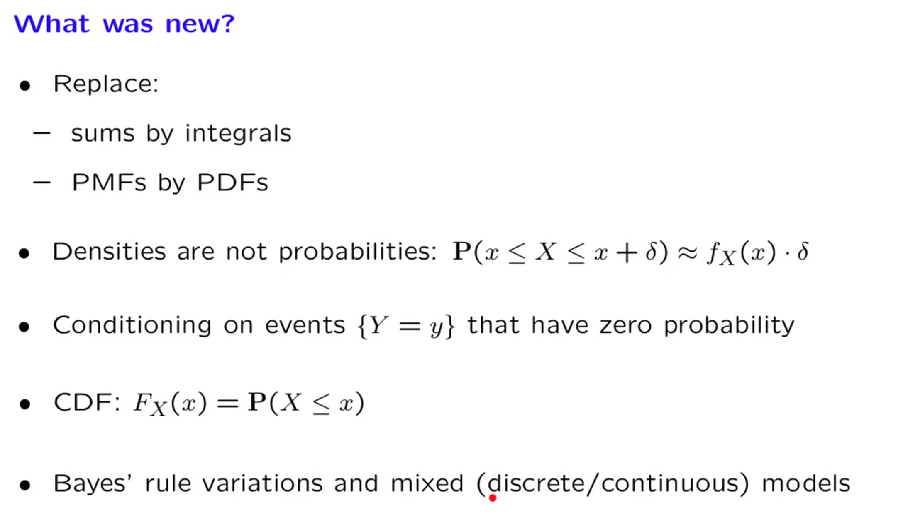

## 1. PDFs, CDF,Expectation, Variance and Classic Continuous r.v.


### 1.1. Probability Density Function

1.  概念：连续型随机变量的取值是实值范围(real line or interval of the real line)，其描述概率分布的函数称为概率密度函数，即PDF，符号记为$f_X(x)$。

   1. 注意：==概率密度函数≠概率==，而是在该x点，每单元长度的概率密度(probability per unit length)。即连续型r.v.的概率计算为：
      $$
      假设a≤x≤a+\delta且\delta →0，则\\
      P(a≤x≤a+\delta) = f_X(x) \cdot \delta
      $$

   2. 注意：并不是说一个连续型样本空间的函数映射就是连续型r.v.。连续型r.v.还必须要有能描述它的PDF。

   

2. PDF的基本属性：

   1. $\int_{-\infty}^{+\infty}f_X(x)dx = 1$
   2. $f_X(x)≥0$，但不一定小于1
   3. $P(X=a)=0$
   4. $P(a≤x≤b) = P(a<x<b)$

   

### 1.2. Expectation and Variance

1. 期望：和离散型r.v.类似，只是用了积分形式。
   $$
   E(X) = \int_{-\infty}^{+\infty}x\cdot f_X(x)dx
   $$

   1. 期望被很好地定义需满足(well defined mathematically)：$\int_{-\infty}^{+\infty}|x|\cdot f_X(x)dx <\infty$，我们一般假设满足这个条件。

   2. 期望值位于概率分布的中心，即$\int_{-\infty}^{\mu}x\cdot f_X(x)dx=\frac{1}{2}$，在图形中可以模糊地判断。

      

   3. 期望的属性：和离散型r.v.一致

      

4. 方差：
   $$
   Var(X) = E[(X-\mu)^2] = \int_{-\infty}^{+\infty}(x-\mu)^2 \cdot f_X(x)dx
   $$
   

### 1.3. Classic Continuous PDF

1. 连续型均匀和分段常数(Uniform and piecewise constant PDFs)：

   1. 连续型均匀：
      1. PDF：$f_X(x)=\frac{1}{b-a}$
      2. 期望：$E(X) = \frac{a+b}{2}$
      3. 方差：$Var(X) = \frac{(b-a)^2}{12}$
   2. 分段常数：每一段的PDF是相同的

   

2. 指数连续型r.v.(exponential random variables)：描述了直到事情发生前需要等待的时间。对应的离散型r.v.是几何分布(描述了直到某事成功前需要尝试的次数)。举例：顾客到达的时间、机器故障的时间、灯泡坏掉的时间。

   1. PDF：$f_X(x) = \lambda e^{-\lambda x} \quad (x≥0)$，它是从$(0,\lambda)$开始递减的曲线，和几何r.v.(离散型)相似。当x=a时，$P(x≥a) = e^{-\lambda a}$。

   2. 期望：$E(X) = \frac{1}{\lambda}$

   3. 方差：$Var(X) = \frac{1}{\lambda^2}$

      

   4. 特点：无记忆性，即基于已经过去的时间，事情发生需要等待的时间的概率分布保持不变。比如一个用了t个小时的灯泡，一个没用过的灯泡，它们能持续发亮x时间的概率是一样的，并不会说旧灯泡的概率就更低。类比几何分布，可以认为，每过$\lambda$的时间长度，成功的概率为$\lambda \delta \quad (\delta→0)$。

      

3. 正态r.v.(normal/Gaussian random variables)：作为概率学中最重要的r.v.，基于中心极限定理(central limit theorem)，它是最常见的随机模型(model for randomness)。

   1. 标准正态分布PDF：$N(0,1) \sim f_X(x)= \frac{1}{\sqrt{2 \pi}}e^{-x^2/2}$，也用$\phi$表示。
   2. 一般正态分布PDF：$N(\mu,\sigma^2) \sim f_X(x)= \frac{1}{\sigma \sqrt{2 \pi}}e^{-(x-\mu)^2/2 \sigma^2}$，$\sigma ≠0$
   3. 一般正态分布标准化：$\phi = \frac{X- \mu}{\sigma} \sim N(0,1)$，即$X = \phi \cdot \sigma +\mu$
   4. 期望：$E(X) = \mu$
   5. 方差：$Var(X) = \sigma^2$
   6. 计算正态分布的概率：使用标准正态分布CDF表。

   

   

### 1.4. Cumulative Distribution Functions

1. 定义：CDF是另一种描述概率分布的方式，既可用于描述连续型，也可描述离散型变量，表示为$F_X(x)=P(X≤x)$。

   1. 连续型：$F_X(x) = \int_{-\infty}^xf_X(x)dx$
   2. 离散型：$F_X(x)$
   3. 与PDF的关系：$\frac{dF_X(x)}{dx}=f_X(x)$，该点要可导。

   

2. 属性：

   1. 递增，non-decreasing
   2. x趋向正无穷，CDF趋向于1；x趋向负无穷，CDF趋向于0

   

## 2. Conditioning on an event, Multiple r.v.'s and Joint PDFs


### 2.1. Conditional PDFs

1. 定义：条件PDF和条件PMF是类似的，都是基于一个事件更新概率。基于事件A的发生，我们可以先计算满足事件A的X范围，并计算$P(X \in A)$，从而可以得到条件PDF。
   $$
   举例：基于X\in A的条件PDF:\\
   f_{X|x \in A}(x) \cdot \delta= P(x ≤X ≤x+\delta|x \in A) = \frac{P(x ≤X ≤x+\delta, x \in A)}{P(A)}\\
   因此：\\
   f_{X|x \in A}(x)= \left\{
   \begin{aligned}
   0 & & X \notin A\\
   \frac{f_X(x)}{P(A)} & & X \in A 
   \end{aligned}
   \right.
   $$
   

   

2. 条件期望：条件期望也是类似。

   

3. 总概率和期望定理：

   1. 总概率定理：
      $$
      f_X(x) = P(A_1)f_{X|A_1}(x) + P(A_2)f_{X|A_2}(x)+...+P(A_n)f_{X|A_n}(x)\\
      ---\\
      F_X(x) = P(A_1)F_{X|A_1}(x) + P(A_2)F_{X|A_2}(x)+...+P(A_n)F_{X|A_n}(x)
      $$

   2. 总期望定理：
      $$
      E[X] = P(A_1) \cdot E[X|A1] + P(A_2) \cdot E[X|A_2]+...+ P(A_n) \cdot E[X|A_n]
      $$
      

### 2.2. Mix R.V.

1. 除了离散型r.v.和连续型r.v.，还存在混合型r.v.，既有PMF，又有PDF。这时，使用CDF来描述变量就更为简便。
   $$
   对于混合型r.v.：\\
   X= \left\{
   \begin{aligned}
   Y & & P(Y)=p\\
   Z & & P(Z)=1-p
   \end{aligned}
   \right.\\
   其CDF可以表示为：\\
   F_X(x) = P(Y)F_{X|Y}(x) + P(Z)F_{X|Z}(x)
   $$
   

### 2.3. Joint PDFs, Marginal PDFs and Joint CDF

1. 联合PDF定义：连续型多变量的联合PDF和离散型类似，描述了变量间的关系，但理解上更抽象化。我们可以认为：==如果两个变量能被一个联合PDF描述，则认为他们是联合连续的(Two random variables are jointly continuous if they can be discribed by a joint PDF)==。而两个变量能被一个联合PDF描述，要求两个变量的概率在两个维度伸展。
   $$
   P((X,Y) \in B) = {\int \int}_{(x,y \in B)}f_{X,Y}(x,y)dxdy= P(a≤X≤b, c≤Y≤d)\\
   ---\\
    = \int_c^d \int_c^b f_{X,Y}(x,y)dxdy
   $$

   1. 属性：$f_{X,Y}(x,y)≥0$，$\int_{-\infty}^{+\infty}\int_{-\infty}^{+\infty} f_{X,Y}(x,y)dxdy = 1$
   2. 注意：与PDF一样，联合PDF提供的是每单位面积的概率密度，而非概率。
   3. 假设area(B)=0，则$P((X,Y) \in B)=0$，也就是说，联合分布是对X和Y的双重积分，需要满足2个维度的积分，只积分一个维度的话，P=0 (Probability is not allowed to be concentrated on a one-dimensional set)。举例：$X=Y$，则所有的点都将落在y-x=0的直线上，而直线构不成面积B，因此，X和Y无法联合连续(X and Y are not jointly continuous)。

   

2. 双重积分的条件解读：假设要计算$0<y<x<1$的概率，已知X和Y满足联合PDF$f_{X,Y}(x,y)$，则计算可以有两种方式：
   1. 基于$y \in [0,1]$，x的取值范围是[1,y]，则：$P(0<y<x<1) = \int _0^1 \int _ y^1 f_{X,Y}(x,y)\, dx\, dy$
   2. 基于$x \in [0,1]$，y的取值范围是[0,x]，则：$P(0<y<x<1) = \int _0^1 \int _0^ x f_{X,Y}(x,y)\, dy\, dx$

3. 边际PDF是对联合分布的其中一个变量进行积分。一个变量的边际分布可以认为是沿着另一个变量的维度计算每部分的概率。
	$$
	f_X(x) = \int f_{X,Y}(x,y)dy\\
	---\\
	f_Y(y) = \int f_{X,Y}(x,y)dx
	$$
	

4. 联合CDF计算公式：
	$$
	F_{X,Y}(x,y) = P(X≤x,Y≤y) = \int_{-\infty}^{y} \int_{-\infty}^{x} f_{x,y}(s,t)dsdt\\
	---\\
	f_{X,Y}(x,y) = \frac{d^2 F_{X,Y}(x,y)}{dxdy}
	$$


### 2.4. More than two variables


## 3. Conditioning on r.v.; Independence; Bayes' rule
### 3.1. Conditional CDFs given on r.v.
1. 之前我们已经学了基于一个事件或基于x的取值范围的条件PDF，接下来我们要接触的是基于一个r.v.的条件CDF。与前两种不同的是，r.v.的概率是不断变化的，也就是说，分母是变化的。因此，问题要更复杂。
	$$
	f_{X|Y}(x|y) = \frac{f_{X,Y}(x,y)}{f_Y(y)} \quad if \, f_Y(y)>0\\
	---\\
	P(X \in A|Y=y) = \int_A f_{X|Y}(x|y)dx
	$$
	
	
	
	

2. 随机变量条件CDF的属性：
	1. $f_{X|Y}(x|y) ≥ 0$
	2. $\int_{-\infty}^{+\infty}f_{X|Y}(x|y)dx = 1$
	3. 乘法法则：$f_{X,Y}(x,y)= f_Y(y) \cdot f_{X|Y}(x|y) = f_X(x) \cdot f_{Y|X}(y|x)$
	4. 总概率定理：$f_X(x) = \int_{-\infty}^{+\infty}f_Y(y)f_{X|Y}(x|y)dy$
	5. 期望定理：
		1. $E[X|Y=y] = \int_{-\infty}^{+\infty}x \cdot f_{X|Y}(x|y)dx$
		2. $E[X] = \int_{-\infty}^{+\infty}f_Y(y) \cdot E[X|Y=y]dy$
		3. $E[g(X)|Y=y] = \int_{-\infty}^{+\infty}g(x) \cdot f_{X|Y}(x|y)dx$
	

### 3.2. Independence of Continuous r.v.
1. 定义：当所有的x和y满足以下条件，则认为他们是相互独立的。
	$$
	f_{X,Y}(x,y)= f_X(x)f_Y(y), \quad \text{for all x and y}\\
	equivalent to:\\
	f_{X|Y}(x|y) = f_X(x) \quad \text{for all y with} f_Y(y)>0 \text{ and all x}\\
	equivalent to:\\
	F_{X,Y}(x,y)=F_ X(x)F_ Y(y)
	$$
2. 如果X和Y相互独立：
	$$
	E(XY) = E(X) \cdot E(Y)\\
	var(X+Y) = var(X) + var(Y)\\
	此外，g(X)和h(Y)也相互独立
	$$


3. 两个正态分布r.v.相互独立，其联合PDF围绕着$(\mu_x,\mu_y)$成一个立体的钟形。PDF的等高线图是与x轴、y轴相平行的层层椭圆(若两者不是相互独立，则椭圆会倾斜)。

   

### 3.3. Bayes Rule Variations
1. 贝叶斯公式的变形：
		1. 连续型r.v.：
		$$
		f_{X|Y}(x|y) = \frac{f_X(x)f_{Y|X}(y|x)}{f_Y(y)}
		= \frac{f_X(x)f_{Y|X}(y|x)}{\int f_X(x')f_{Y|X}(y|x')dx'}
		$$
		2. 离散型r.v.：
		$$
		p_{X|Y}(x|y) = \frac{p_X(x)p_{Y|X}(y|x)}{p_Y(y)}
		= \frac{p_X(x)p_{Y|X}(y|x)}{\sum_{x'}p_X(x')p_{Y|X}(y|x')}
		$$
		3. 混合型r.v.：
		$$
		假设K是离散型r.v.,Y是连续型r.v.:\\
		p_{K|Y}(k,y) = \frac{p_K(k) \cdot f_{Y|K}(y|k)}{f_Y(y)} = \frac{p_K(k) \cdot f_{Y|K}(y|k)}{\sum_{k'}p_X(k')f_{Y|K}(y|k')}
		$$
	
	

2. 贝叶斯公式的典型例子：
	1. 离散型r.v.和未知连续型变量
		
		
	2. 二进制信号和连续噪音：
		
		
	
	3. 后验的指数分布变量遵循均匀分布
	
	   

## 4. Important Extension
### 4.1. Mathematics: Intergration by Parts
1. 分部积分法，是求积分最常用、最基本的方法，通过微积分的链式法则推导而来。公式为：
	$$
	\int u \cdot dv = uv - \int v \cdot du\\
	推导过程为：\\
	1. \text{微积分链式法则：} d(uv) = u \dot dv + v \cdot vdu\\
	2. \text{两边进行积分：} \int d(uv) = uv = \int u \cdot dv+\int v \cdot du\\
	3. \text{最终公式：} \int_a^b u \cdot dv = [uv]^b_a-\int_a^b v \cdot du
	$$


### 4.2. Memoryless property of exponential PDF
1. 假设一个漫不经心的教授不小心和两个学生约了同一个咨询时间，每个学生咨询的时间长度是独立的指数分布，均值为30分钟。第一个学生准时到了，第二个学生晚了5分钟。那么，从第一个学生到达至第二个学生离开，教授预计要花多少时间呢？
	1. 这道题可以分成两种情况，第一种是第一个学生的咨询时间<=5分钟，这个时候，两个学生的咨询时间是不冲突的；第二种是第一个学生的咨询时间>5分钟，这个时候需要考虑指数分布的无记忆性，即第一个学生的咨询大于5分钟，基于该条件，通过推导可知：$E(T_1|T_1>5) = 5+E(T_1)$。
	
	2. 基于总期望定理和无记忆性，我们可以很简单地计算出来期望值
	
	   
	   
### 4.3. Probability to form a Triangle

1. 假设我们有一根长度为1的棍子，我们把它折成3断，也就是说，我们随意从棍子上取两个点折断，这两个点的选择是在棍子上随机且独立(randomly and independently on the stick)的均匀分布。折成的这三根棍子能拼成三角形的概率是多少呢？
	1. 这道题需要理解题意。在棍子上随机且独立的意思是：假设第一次折断之后分成a段和b段，则第二次折断的时候可以折a，也可以折b。因此X点和Y点的联合分布应该是$f_{X,Y}(x,y) = f_X(x) \cdot f_Y(y) = 1 \quad 0<x<1,0<y<1$.
	2. 紧接着使用三角形构成规则：两边之和不能大于第三边，即可求出。
	

### 4.4. Buffon's Needle’s Problem
1. 布冯细针问题是18世纪非常著名的概率问题，开创了几何概率学(geometric probability)的学科。假设地上有平行的线，彼此之间的距离为d，有一根长度为l的细针(l<d)，随机扔到地上，针与其中一条线相交的概率是多少呢？
	1. 首先我们设定两个变量：一个是针的中心到最近的一条线的垂直距离$X$，一个是针与最近一条线的锐角夹角$\Theta$。假设它们相互独立，则我们可以得到：
	$$
	f_X(x) = 2/d, \quad 0<x<2/d\\
	f_{\Theta}(\theta) = 2/ \pi, \quad 0<\theta<{\pi}/2\\
	f_{X,\Theta}(x, \theta) = 4/{\pi \cdot d}\\
	$$
	2. 而针与线相交的条件为：$X <= \frac{l}{2} sin(\Theta)$
	3. 通过计算可知$P(X <= \frac{l}{2} sin(\Theta)) = \frac{2l}{\pi d}$
2. 有趣的是，蒙特卡洛根据这一结论，模拟无数次细针实验，并估算出来了$\pi$的值，这就是著名的蒙特卡洛模拟(Monte Carlo simulation)。
3. 现代医学和物理经常利用概率和模拟实验去估计无法直接算出的参数。
   

   

# Unit 6: Further topics on random variables

1. 本单元学习多变量之间的分布推导、相关性和协方差以及条件期望的一个抽象感知。

   

## 1. Derived Distributions of r.v.s


### 1.1. Linear Function of r.v.
1. 离散型r.v.的线性转换：假设$Y=aX+b$，则：
	$$
	p_Y(y) = p_X(\frac{y-b}{a})
	$$
	
	

2. 连续型r.v.的线性变换：假设$Y = ax+b$，则：
	$$
	当a>0时：\\
	F_Y(y) = P(x≤\frac{y-b}{a}) = F_X(\frac{y-b}{a})\\
	当a<0时：\\
	F_Y(y) = P(x≥\frac{y-b}{a}) = 1-F_X(\frac{y-b}{a})\\
	由此可知：\\
	f_Y(y) = \frac{1}{|a|}f_X(\frac{y-b}{a})
	$$
	
	

3. 正态分布r.v.的线性变换：需记住，正态分布的线性转换还是正态分布。即$Y = ax+b$，$X \sim N(\mu, \sigma^2)$，则$Y \sim N(a \mu +b, a^2 \sigma^2)$。

  

### 1.2. The PDF of a general function
1. 求一个连续型r.v.的函数$Y = g(X)$的步骤为：
	1. 找到Y的CDF：$F_Y(y) = P(Y ≤ y) = P(g(X) ≤ y) = P(X ≤ h(Y))或P(X ≥ h(Y))$
	2. 求导得到PDF：$f_Y(y) = \frac{d F_Y(y)}{dy}$
	
	

2. 单调函数(monotonic function)：指当$x<x'$，$g(x) < g(x')$(单调增加)或$g(x) > g(x')$(单调减少)。则:
	$$
	f_Y(y) = f_X(h(y)) \cdot |\frac{dh(y)}{dy}|
	$$
	
	
	

### 1.3. A function of multiple r.v.'s
1. 假设$Z = g(X,Y)$，则Z的分布的推导和单变量函数是类似的，只不过要综合考虑多个变量的取值范围和pdf。

   

## 2. Sums of independent r.v.'s; Covariance and Correlation


### 2.1. Sums of independent r.v.'s
1. 求离散型r.v.的和$Z=X+Y$的PMF，假设X和Y相互独立，则：
	$$
	p_Z(z) = \sum_x p_X(x)p_Y(z-x)
	$$
	1. 计算技巧：假设要计算$P_Z(3)$, 则y = 3-x，为便于计算，可以将Y沿着Y轴翻转，并向右平移3个单位，这时得到了新的变量3-Y，这时只需将x和y取值相等的数的概率相乘即可。其他情况可以此类推。
	

2. 求连续型r.v.的和$Z=X+Y$的PDF，假设X和Y相互独立，则：
	$$
	f_Z(z) = \int_{-\infty}^{+\infty} f_X(x) f_Y(z-x)dx
	$$
	
	

3. 正态分布r.v.的和$Z=X+Y$的PDF：假设X和Y相互独立，则X+Y也满足正态分布$Z \sim N(\mu_x+\mu_y, \sigma_x^2+\sigma_y^2)$。
	
	

## 2. Covariance, dependency and Correlation
1. 协方差(Covariance)：描述了两个变量之间的相关性。根据公式，我们知道：如果X和Y倾向于变化相同时，协方差为正，即$X-E[X]$描述了X的偏差，$Y-E[Y]$描述了Y的偏差。
	$$
	一般计算公式：
	Cov(X,Y) = E[(X-E[X]) \cdot (Y-E[Y])] = E[XY] - E[X] \cdot E[Y]\\
	当X和Y相互独立时：\\
	Cov(X,Y) = E[(X-E[X]) \cdot (Y-E[Y])] = E[(X-E[X]) \cdot E[(Y-E[Y]) = 0\\
	（注意：反过来不成立，即Cov(X,Y)=0，X和Y不一定相互独立）
	$$
	
	
	1. 协方差属性：
		1. $cov(X,X)= Var(X)$
		2. $Cov(X,Y) = E[XY] - E[X] \cdot E[Y]$
		3. 线性：$Cov(aX+b, Y) = a \cdot cov(X,Y)$
		4. 可加性：$Cov(X,Y+Z) = Cov(X,Y) + Cov(X,Z)$
		
		

2. r.v.的和的方差：
	1. 两个r.v.的和的方差推导：
	$$
	Var(X+Y) = E[(X+Y-E[X+Y])^2] = E[((X-E[X])+(Y-E[Y]))^2]\\
	= E[(X-E[X])^2 + (Y-E[Y])^2 + 2(X-E[X])(Y-E[Y])] \\
	------\\
	= Var(X)+Var(Y)+2Cov(X,Y)
	$$
	2. 多个r.v.的和的方差：
	
	$$
	Var(X_1+X_2+...+X_n) = \sum_{i=1}^{n}Var(X_i) + \sum_{(i,j):i ≠j} Cov(X_i,X_j)
	$$
	
3. 相关系数(correlation coefficient)$\rho$：
  1. 作用：==将协方差单位化，以便于比较不同变量之间的相关性==。
  $$
  \rho (X,Y) = E[\frac{X-E[X]}{\sigma_X} \cdot \frac{Y-E[Y]}{\sigma_Y}] \\
  = \frac{Cov{X,Y}}{\sigma_X \cdot \sigma_Y} \quad -1≤ \rho ≤ 1\\
  ------\\
  值得注意的是：\\
  \rho (X,X) = 1
  $$
	
	2. 当X和Y相互独立时，$\rho$等于0；反过来不成立，即$\rho$和协方差一样无法判断独立性，判断独立性只能通过$P(XY) = P(X) \cdot P(Y)$。
	3. 当$|\rho| = 1$时，说明X和Y的数据散布一致或相反，两者线性相关，存在$X-E[X] = c(Y-E[Y])$
	4. $\rho (aX+b,Y) = \frac{a \cdot Cov(X,Y)}{|a| \cdot \sigma_x \sigma_Y} = sign(a) \cdot \rho(X,Y)$
	5. 如何解释相关系数：
		1. ==相关不等于因果(correlation ≠ causation)==
		2. ==相关性一般反映了两个变量之间可能存在潜在的共同影响因素==。比如我们发现数学天赋和音乐能力相关性很高，说明我们大脑可能有某个激素或功能共同影响了这两个变量。
	

4. 相关系数的应用：假设你是一个投资家，你在10个城市各投资了1千万，每个城市的收益服从随机变量$X_i$，假设他们的均值和标准差均为0和1.3，则变量之间的相关性会严重影响你对风险的评估。
	
  
  
## 3. Conditional Expectation and Variance Revisited


### 3.1. Conditional Expectation as a r.v.
1. 两个r.v.的条件期望$E(X|Y)$可以看做当Y=y时，与y有关的一个函数或r.v.，有其自己的分布、均值和方差。即：
	$$
	E(X|Y) = g(Y)
	$$
	
	

2. 我们利用期望的迭代法则(The law of iterated expectations)计算$E(X|Y)$的均值：
	$$
	1. E[E[X|Y]] = \sum_y E[X|Y=y]p_Y(y) = E(X)\\
	2. E[g(Y)X|Y] = g(Y) \cdot E[X|Y]\\
	3. E[X|Y] = E[X|h(Y)] \quad h是可逆函数
	$$
	

### 3.2. Conditional Variance as a r.v.
1. 和条件均值类似，两个r.v.的条件方差$Var(X|Y)$可以看做当Y=y时，Var(X|Y=y)的取值的随机变量/函数。

2. 总方差公式(the law of total variance):
	$$
	Var(X) = E[Var(X|Y)] + Var(E[X|Y])
	$$
	
	
	
	
	

### 3.3. The Sum of a Random Number of Random Variables
1. 与之前学习的不同，这次我们讨论随机数量的r.v.相加的和。即假设有$N$个店铺，你在每个店铺的消费为$X_i$，则总花费为:$Y = X_1+X_2+...+X_i$。
2. 其均值为：
	$$
	E(Y) = E[X_1+X_2+...+X_n] = E(N) \cdot E(X)
	$$
	
	

3. 其方差为：
	$$
	Var(Y) = Var(X_1+X_2+...+X_n) = E[N] Var(X) + (E[X])^2 Var(N)
	$$

	

## 4. Important Problem
1. 救护车到达时间问题：Ambulance travel time。
	1. 该问题的解法很传统，但需要我们画图辅助理解。首先计算我们需要计算的变量公式，接着计算其CDF，最终通过CDF推导PDF。
	https://learning.edx.org/course/course-v1:MITx+6.431x+3T2020/block-v1:MITx+6.431x+3T2020+type@sequential+block@sequential_Solved_problemsxxxx/block-v1:MITx+6.431x+3T2020+type@vertical+block@ch9-s5-tab3

2. 两个变量的差$Z=X-Y$的PDF求解：可以将$X-Y$看成$X+(-Y)$,这样就可以使用和的定理。
	$$
	f_Z(z) = \int f_X(x) f_{-Y}(z-x)dx = \int f_X(x) f_{Y}(x-z)dx
	$$
	https://learning.edx.org/course/course-v1:MITx+6.431x+3T2020/block-v1:MITx+6.431x+3T2020+type@sequential+block@sequential_Solved_problemsxxxx/block-v1:MITx+6.431x+3T2020+type@vertical+block@ch9-s5-tab4

3. 利用条件概率的期望迭代定理和总方差定理计算均值和方差：假设我们有一根长为l的棍子，我们随机均匀选择一个点折断，然后取左边的棍子再随机均匀选择一个点折断，求折断两次后左边棍子长度的期望和方差。则：
	1. 设第一次折断后左边的长度为Y，第二次折断后左边的长度为X，则我们要求解的是$E(X)$和$Var(X)$。则根据定理：
	$$
	期望迭代定理：E(X) = E[E[X|Y]]\\
	总方差定理：Var(X) = E[Var(X|Y)] + Var(E[X|Y])\\
	$$
	2. 根据定理，我们可以一步步求出答案。
	
	

4. 两个r.v.的线性函数PDF推导：
	
	

5. 利用连续型标准均匀r.v.即$U \sim U(0,1)$模拟生成已知CDF的随机变量。即：
	1. 生成连续型标准均匀r.v.
	2. 利用CDF的反函数得到X的取值。
	
	

# Unit 7: Bayesian inference
1. 本章我们将学习贝叶斯在假设检验和估计问题上的统计应用：
	1. 利用相关r.v.的观察值，我们使用贝叶斯公式找到未知分布r.v.的后验概率(posterior distribution)
	2. 未知分布r.v.的点估计方法：Maximum a Posteriori probability estimate, Least Mean Squares estimate, and Linear Least Mean Squares estimate
	3. 考虑对假设检验和估计问题的性能分析(performance analysis)
	
	

## 1. Introduction of Inference/Statistics


### 1.1. Big Picture of Probability and Inference
1. 统计学的作用是结合实际数据和概率模型去推断、预测和决策，即statistics = data + probability models。根据定义角度的不同，我们可以把统计问题分成：
	1. 模型构建 vs 推断未观察到的变量(model building vs inferring unobserved variables)
	
	   
	
	2. 假设检验 vs 估计(hypothesis testing vs estimation)
	
	   
	
### 1.2. The Bayesian Inference Framework
1. 贝叶斯推断框架的所有信息有：
	1. 一个未知的变量$\Theta$及其先验分布$p_{\Theta}$或$f_{\Theta}$
	2. 一个观察变量$X$及其条件概率$p_{X|\Theta}$或$f_{X|\Theta}$
	3. 求取变量$\Theta$的估计后验条件概率模型(estimator)：$p_{\Theta|X}(\theta|x)$或$f_{\Theta|X}(\theta|x)$
		1. $X$和$\Theta$均为离散r.v.：
		$$
		p_{\Theta|X}(\theta|x) = \frac{p_{\Theta}(\theta) \cdot p_{X|\Theta}(x|\theta)}{p_X(x)} = \frac{p_{\Theta}(\theta) \cdot p_{X|\Theta}(x|\theta)}{\sum_{\theta^{'}}p_{\Theta}(\theta^{'})p_{X|\Theta}(x|\theta^{'})}
		$$
		2. $X$和$\Theta$均为连续r.v.：
		$$
		f_{\Theta|X}(\theta|x) = \frac{f_{\Theta}(\theta) \cdot f_{X|\Theta}(x|\theta)}{f_X(x)} = \frac{f_{\Theta}(\theta) \cdot f_{X|\Theta}(x|\theta)}{\int f_{\Theta}(\theta^{'})f_{X|\Theta}(x|\theta^{'})d{\theta^{'}}}
		$$
	4. 求取变量$\Theta$的估计值(estimate)$\theta$
		1. 方法1：最大后验概率规则(maximum a posteriori probability, MAP)：$\hat{\theta}$是概率最大的取值，即满足$max_{\theta}P_{\Theta|X}(\theta|x)$。
		2. 方法2：最小均方误差规则(Least Mean Squares, LMS)：$\hat{\theta}$是条件概率的均值，即$E[\Theta|X=x]$。
	
	
	
	
	
2. 如何知道变量$\Theta$的先验分布呢？
	1. 假设$\Theta$的分布是对称统一的，即均匀分布
	2. 已得知的取值范围
	3. 先前的研究成果
	4. 主观设定或任意选择

3. 如何报告估计值的准确性：
	1. 离散型变量：一般选用MAP
		1. 单个估计值的错误(conditional prob of error)：
		$$
		P(\hat{\theta} ≠ \Theta | X=x) \quad 在MAP规则下最小
		$$
		2. 整体估计值的错误(overall prob of error)：
		$$
		P(\hat{\Theta} ≠ \Theta) = \sum_x P(\hat{\Theta} ≠ \Theta | X=x) p_X(x) = P(\hat{\Theta} ≠ \Theta | \Theta = \theta) p_{\Theta}(\theta)
		$$
	2. 连续型变量：一般选用LMS
		1.均方误差：
		$$
		E[(\hat{\Theta} - \Theta)^2|X=x]\\
		E[(\hat{\Theta} - \Theta)^2]
		$$


### 1.3. Beta distribution

1. 贝塔分布(Beta distribution)：是指一组定义在(0,1)区间的连续概率分布，有两个参数$\alpha$和$\beta$，是二项分布和伯努利分布的共轭实验，记为$X \sim Be(\alpha, \beta)$。
2. 经典例子为：为了推断一个未知概率的硬币(unknown bias of a coin)的概率变量$\Theta$，投掷了n次，得到K次正面。则：
$$
f_{\Theta | K}(\theta | k) = \frac{1}{B(\alpha, \beta)} x^{\alpha - 1}(1-x)^{\beta -1}
$$


3. 对该硬币的概率进行点估计：
	1. MAP：对条件概率进行log求导，得到$\hat{\theta}$
	
	   
	2. LMS：利用期望公式求出$E[\Theta | K=k]$
	   

4. 一个好用的公式：
	$$
	\int_0^1 \theta^{\alpha}(1-\theta)^{\beta} d{\theta} = \frac{{\alpha}!{\beta}!}{(\alpha+\beta+1)!}
	$$

## 2. Linear models with normal noise

### 2.1. Recognizing Normal PDFs
1. 之前我们已经学过了zhe之前我们已经学过了正态分布的pdf函数，而实际上，一个有关e的负指数函数很多时候都可以被改写成正态分布的pdf函数。

2. 假设$f_X(x) = c \cdot e^{-(\alpha x^2 + \beta x +\gamma)} \, \alpha >0$，则X满足$\mu = \frac{-\beta}{2 \alpha}$和$\sigma^2 = \frac{1}{2 \alpha}$的正态分布。

   

3. 正态的线性关系：我们已经知道两个正态分布的和还是正态分布，那么假设$X = \Theta + W$，其中$\Theta$和$W$相互独立的标准正态分布。则：
	$$
	f_{\Theta|X}(\theta|x) = c(x) \cdot e^{-(\frac{\theta^2}{2} + \frac{(x-\theta)^2}{2})} \quad 后验概率也是正态分布
	$$
	1. 因此，MAP评估和LMS评估的值是一致的，即：$\theta_{MAP} = \theta_{LMS} = \mu = \frac{x}{2}$
	
	

### 2.2. Multiple Observations of Normal v.r.
1. 现在我们讨论实际中的数据统计。
	1. 我们有一组观察数据：$X=\{x_1,x_2,x_3,...,x_n\}$。
	2. 每一个数据满足：$X_i = \theta + W_i$，其中$W_i$表示噪音。(noise/error)，所有的$W_i$满足$W_i \sim N(0, \sigma_i^2)$，即每个噪音的均值为0。
	3. 假设我们要估计的变量$\Theta \sim N(x_0, \sigma_0^2)$，且$\Theta$、$W_i$之间相互独立。

2. 根据以上数据，我们可以得到以下结论：
	1. 基于给定的$\theta$，$x_i$之间条件独立。因为：$f_{X_i|\Theta}(x_i|\theta) = f_{W_i}(\theta + w_i)$，$W_i$之间相互独立，因此，$x_i$之间条件独立。
	2. $X_i$基于$\Theta$条件独立，则：
	$$
	f_{X|\Theta}(x|\theta) = \prod_{i=1}^n f_{X_i|\Theta}(x_i|\theta) = \prod_{i=1}^n c_i \cdot e^{\frac{-(x_i-\theta)^2}{2\sigma_i^2}}
	$$
	3. 因此，$\Theta$的条件分布也是正态分布，可以简化为：
	$$
	f_{\Theta |X}(\theta|x) = c \cdot exp\{-quad(\theta)\}\\
	quad(\theta) = \frac{(\theta-x_0)^2}{2 \sigma_0^2} + \frac{(\theta-x_1)^2}{2 \sigma_1^2}+...+\frac{(\theta-x_n)^2}{2 \sigma_n^2}
	$$
	4. 根据MAP/LMS，我们可以得到$\Theta$的估计值：
	$$
	\hat{\theta}_MAP = \hat{\theta}_LMS = \frac{\sum_{i=0}^n \frac{x_i}{\sigma_i^2}}{\sum_{i=0}^n \frac{1}{\sigma_i^2}}
	$$
	5. 对估计值的解释：
		1. 估计是”线性的“，最终可改写成：$\hat{\theta} = a_0 + a_1x_1+...+a_n x_n$
		2. 估计值是先验均值$x_0$(prior mean)和观察值$x_i$的加权平均，权重由方差决定。
	   

3. 均方误差的计算(mean squared error, MSE)：
	$$
	E[(\Theta -\hat{\Theta})^2 | X=x] = E[(\Theta -\hat{\theta})^2 | X=x] = Var(\Theta|X =x) = \\1/ {\sum_{i=0}^n \frac{1}{\sigma_i^2}} = E[(\Theta -\hat{\Theta})^2]
	$$
	1. 从公式可以得知：$\sigma_i^2$越大，MSE/方差越大。
	
	2. ==MSE和观察值无关==，只与先验方差和噪音方差有关。
	
	   
	
### 2.3. Multiple Observations of Multiple Normal v.r.
1. 实际上现实生活中我们经常面对的是多个参数的估计。我们最常用也最经典的模型就是线性正态模型，因为该模型有非常有趣的属性，比如MAP和LMS的估计值是一样的、均方误差和观察值样本无关等。
	
	
2. 假设我们要估计一个线性模型的参数，其为$X_i = \Theta_0 + \Theta_1 t_1 + \Theta_2 t_2^2 + W_i$，其中$\Theta_j \sim N(0, \sigma_j^2)$，$W_i \sim N(0, \sigma^2)$，$\Theta_j$和$\W_i$之间相互独立。则：
  1. 后验条件概率为：
  $$
  f_{\Theta|X}(\theta|x)= c(x) \cdot exp(-\frac{1}{2}(\frac{\theta_0^2}{\sigma_0^2}+ \frac{\theta_1^2}{\sigma_1^2} + \frac{\theta_2^2}{\sigma_2^2}) - \frac{1}{2\sigma^2} \sum_{i=1}^{n}(x_i-\theta_0 -\theta_1 t_i - \theta_2 t_i^2)^2)
  $$
  2. 接着利用MAP对各个$\theta$进行求导，得到多个线性方程式，便能一一解开各个参数估计值。
   

  

  

## 3. Least Mean Squares(LMS) estimation
### 3.1. Calculation of LMS
1. 无观察值下的LMS：最小化均方误差$E[(\Theta - \hat{\theta})^2]$，即设定$\frac{d}{d \hat{\theta}} = 0$，则可知当$\hat{\theta} = E(\Theta)$，均方误差最小。
	$$
	E[(\Theta - \hat{\theta})^2] : \hat{\theta} = E(\Theta)\\
	此时：E[(\Theta - \hat{\theta})^2] = Var(\Theta)
	$$
	
	
	
2. 有单个观察值$X$的LMS：
	$$
	E[(\Theta - \hat{\theta})^2|X] : \hat{\theta} = E(\Theta|X)\\
	此时：E[(\Theta - \hat{\theta})^2|X] = Var(\Theta|X)
	$$
	
	

3. 有多个观察值$X=(X_1,X_2,...,X_n)$：

   
   
### 3.2. LMS Performance Evaluation
1. 实际上，我们已经知道了，LMS的结果评估用的就是MSE。
	$$
	MSE = E[(\Theta - E[\Theta|X])^2|X=x] = E[Var(\Theta|X)] = \int f_{X}(x) \cdot Var(\Theta|X=x)dx
	$$


### 3.3. Challenge and properties of LMS
1. 实际上用LMS进行估计存在以下问题：

   
   
   

2. 最小均方估计的属性有：
	1. 估计器：$\hat{\Theta} = E[\theta|X]$
	2. 误差：$\sim{\Theta} = \hat{\Theta} - {\Theta}$
	3. 属性1：$E[\sim{\Theta}|X=x] = 0$
	4. 属性2：$Cov(\sim{\Theta}, \hat{\Theta}) = 0$
	5. 属性3：$Var(\Theta) = Var(\hat{\Theta}) + Var(\sim{\Theta})$
	
	

## 4. Linear least mean squares (LLMS) estimation


### 4.1. LMS and LLMS
1. LLMS(Linear Least Mean Square)是说$\Theta$和$X$之间存在线性关系，如$\Theta = aX+b$。因此，此时：
	$$
	E[(\Theta-\hat{\Theta})^2] = E[(\Theta - ax-b)^2]\\
	\hat{\Theta}_{LMS} = \hat{\Theta}_{LLMS} = aX+b = E[\Theta|X]
	$$


2. 最小化LLMS，则：
	1. b的最优值：
		$$
		E(\theta) - a \cdot E(x)
		$$
	2. a的最优值：
		$$
		a = \frac{Cov(\Theta,X)}{Var(X)} = \frac{\rho \sigma_{\Theta}}{\sigma_X}
		$$
	3. $\hat{\Theta}_{LLMS}$等于：
		$$
		\hat{\Theta}_{LLMS} = E(\Theta) + \frac{Cov(\Theta,X)}{Var(X)}(X-E[X]) = E(\Theta) + \frac{\rho \sigma_{\Theta}}{\sigma_X}(X-E[X])
		$$
	4. LLMS的MSE等于：
		$$
		E[(\hat{\Theta}_L - \Theta)^2] = (1-\rho^2) Var(\Theta)
		$$

  
  
  
  
3. 比起LMS复杂的计算，通过LLMS，我们不需要知道X的分布，==只需要知道$X$和$\Theta$的均值、方差和协方差==，就可以近似估计$\Theta$。因此，线性估计被广泛应用。
	1. 当$E[\Theta|X]$与X成线性时，LMS和LLMS的结果一致。
	2. 但是，当$E[\Theta|X]$的非线性程度很大时，线性估计的误差有可能很大，影响了准确性。
  

### 4.2. Coin bias example of LLMS


### 4.3. LLMS with multiple observations
1. 假设我们有多个观察值，则我们希望得到估计器$\Theta = a_1X_1 + ... + a_nX_n +b$，那么我们如何得到最优的a和b呢？也就是说，我们如何最小化MSE：$E[(a_1X_1 + ... + a_nX_n +b-\Theta)^2]$。

2. 比起多个观察值时，LMS的计算困境，LLMS的计算是线性的，只需要将单个观察值的方法进行推广即可，明显简单得多！

   
   
   
   
   
   
   

## 3. Solve the problem
### 3.1. Simple Bayesian problem


### 3.2. LMS and LLMS


