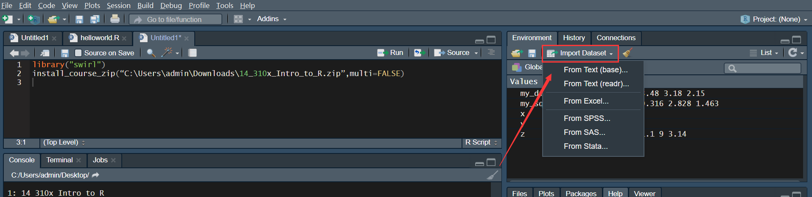

> 在Rstudio输入以下代码可以获取相应的教程：
>
> * library("swirl")
> * install_course_zip('E:/Learning/python/ML/MIT-data analysis for social scientists/14_310x_Intro_to_R.zip',multi=FALSE)
> * swirl()
> * 选择Intro to R

* R的基本设置-R Orientation
  * 1.设置和查找工作路径
* R的基本构造-Basic Building Blocks
  * 1.使用小窍门
  * 2.认识R的向量
* R了解数据
  * \1. 字符串函数
* R做探索性数据分析
* R的统计函数
* R的线性模型
  * lm函数
  * f函数/t函数

# R的基本设置-R Orientation

## 1.设置和查找工作路径

```
# 1. 获取当前工作路径和文件
## 1.1. 获取工作路径
getwd()
## 1.2. 了解目录内容
dir()/list.files()

# 2. 设置工作路径
setwd("E:/Learning/python/ML/MIT-data analysis for social scientists")
# 路径要用正斜杠/

# 3. 导入文件
## 3.1 导入excel文件
install.packages("readxl")
library(readxl)

my_excel_data <- read_excel("my_excel_data.xlsx")

## 3.2. 导入csv文件
my_csv_data <- read_csv("my_csv_data.csv"，header = TRUE)

## 3.3. 导入.dta文件(stata)
install.packages("foreign")
library(foreign)

my_dta_data <- read.dta("my_dta_data.dta")

## 3.4. 导入.sav文件(SPSS)
install.packages("haven")
library(haven)

my_sav_data <- read_sav("my_sav_data.sav")

## 3.5. 导入txt文件
text <- read.table("data.txt", sep = ',', header = TRUE)
 
## 也可以通过右上面板的"import dataset"导入
```



# R的基本构造-Basic Building Blocks

## 1.使用小窍门

```
# 1. 查找R相关主题的信息
help.start()

# 2. 了解向量函数的用途
?c

# 3. 重新运行之前写过的函数
上箭头


# 4.自动补足代码
tab键

# 5.删除R中现存的所有对象
rm(list = ls())
```

## 2.认识R的向量

1. R的基本用途是当做计算器使用。不过R作为一门编程语言，我们是希望通过自动化一些过程来避免重复。
2. 在R中，包含数据的任何对象称为数据结构(data structure)，其中，向量是最简单的一种，用c()函数创建(represents concatenate)。
3. 向量的数学运算(+/-/^ etc.)可以映射给每一个元素，简便了计算。

```
# 1. 计算器功能
5+7

# 2. 给变量赋值
x <- 5+7
y <- x-3
y

# 3. 数据结构构建-向量
z <- c(1, 8, 10)
c(z, 5, z)
z * 2+100 #返回每个元素的计算结果

# 5. 相关算术运算
sqrt()
abs()
+、-、/、^

# 6.向量的运算
c(1,2,3,4)+ c(0,10)
# 当两个向量的长度相等时，返回元素个数相同的结果向量；当长度不等时，R复制短向量元素直到长度一致。
```

# R了解数据

```
# 1.summary/str：查看各列的四分位数及行列数/查看数据结构
summary(data)
str(data)

# 2.nrows/dim：查看行数/查看行列数
nrows(data)
dim(data)

# 3.max/min/unique/sort/length：最大/最小/无重复值/排序/个数
max(data$height)
min(data$height)
sort(unique(data$height))
length(unique(data$height))

# 4.which：查找符合条件的行索引
which(data$height == 150)

# 5.is.matrix/is.data.frame：数据是否为矩阵/df，返回布尔值
is.matrix(data)

# 6.as.matrix/as.data.frame/as.numeric：将数据转换为矩阵/df/数字
data_df <- as.data.frame(data)

# 7.t：转置矩阵
data_t <- t(as.matrix(data))

# 8.[-1,]/rbind/cbind：删除行/插入行/插入列
1st_row_delete <- data[-1,]
add_row <- rbind(data, c(2,2,2))
add_column <- cbind(data, c(2,2))

# 9.mean/sum/sd/var：平均值、求和、标准误、方差
mean(data$height, na.rm = TRUE)
```

## 1. 字符串函数

```
# 1.截取字符串
str_sub(data$year, 2, 5)

# 2.替换字符串
str_replace(data$year, 'X', " ")
```

# R做探索性数据分析

```
# 1.tail/head：查看后6行/前6行
tail(data)

# 2.filter函数：筛选出指定条件的数据
library(dplyr)
data_filter <- filter(data, height == 150)

# 3.gather()：将指定的多列合并成一个变量的值
library(dplyr)
data_year <- gather(data, year, rate, 1960:2015) %>% select (year, country, rate) # gather函数第二个参数为创建的新变量名称，第三个参数为填入变量值的新变量，第四个参数为要转化的列。

# 4.spread()：和gather函数作用相反，即将一列变量的值分开成多列变量
spread_year<-select(data_year, year, country, rate) %>%
  spread(country, rate)
```

# R的统计函数

```
# 1. 抽样函数
data <- sample(x = total_data, size = 10, replace = TRUE) 
    # x：总数据
    # size：抽样个数
    # replace：是否放回抽样
    
# 2. 生成特定分布的随机样本
## 2.1. 生成正态分布样本
normal <- rnorm(n = 10000, mean = 2, std = 5)
plot(density(normal))

# 3.for循环
coin <- c('heads', 'tails')
toss <- c()

for (i in 1:100){
    toss[i] <- sample(x = coin, size =1)
}

table toss

# 4.apply函数（汇总信息）
apply( X = data, MARGIN = 2, FUN = table)
    # X表示数据集
    # MARGIN表示作用在行or列，=1表示汇总行信息，=2表示汇总列信息
    # FUN表示命令
```

# R的线性模型

## lm函数

* 该函数用于拟合线性模型。

```
# 拟合线性模型
bivariate <- lm(bodymass ~ height, data = data) # Y~X
multi <- lm(bodymass ~ height + age, data = data) # Y~X

# 查看模型信息
class(multi) # 类别是'lm'
summary(multi) # 模型参数等信息
names(multi) # 模型可调用变量名称

# 画出线性回归模型
plot(height, bodymass) # X,Y
abline(bivariate, col = 'red') # 画出回归线

# 得到参数的置信区间
confint(bivariate, level = 0.95)
```

## f函数/t函数

* f分布函数：df/pf/qf/rf
* t分布函数：dt/pt/qt/rt
* f检验函数：anova/car包

```
# f检验
## 1.计算f的临界值

## 2.计算对应的p值

# t检验


# 假设检验
## 1.使用car包
library(car)
R <- c(0,1,0)
linearHypothesis(model, R)

## 2.使用anova
restricted_model <- lm(Y ~ restricted_X, data = data)

anova(restricted_model, model)
```