# 1. Hive是什么？

> Hive是基于hadoop HDFS之上的数据仓库工具，也就是说，数据来源于HDFS。
> 数据仓库是一个**面向主题的、集成的、不可更新的、随时间不变化**的数据集合，它用于支持企业或组织的决策分析处理。
> 对hive有任何不懂，可以上hive官网打开hive wiki查看。

## 1.1.数据仓库基础知识

### 1）数据仓库和数据库的区别

* 数据库：传统的关系型数据库的主要应用是基本的、日常的事务处理，即OLTP，例如银行交易。
* 数据仓库（DataWarehouse）：数据仓库系统的主要应用主要是OLAP，支持复杂的分析操作，不可更新。
* 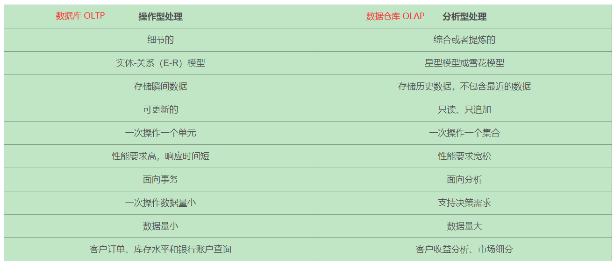

### 2）数据仓库的结构和建立过程

* 数据源（如mysql、oracle）——>将特定数据导入数据仓库（ETL）——>数据仓库引擎（服务器）——>前端展示（数据查询-数据报表-数据分析等）
  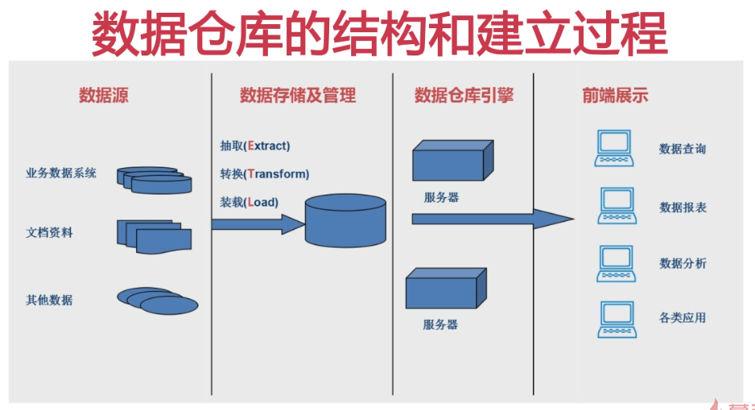

### 3）OLTP应用和OLAP应用

* OLTP(
  on-line transaction processing)：
  联机事务处理，强调数据库内存效率，主要是基本的、日常的事务处理，例如银行交易。
* OLAP(On-Line Analytical Processing)：联机分析处理，强调数据查询和分析，侧重决策支持，并且提供直观易懂的查询结果，例如：商品推荐系统。

### 4）数据仓库中的数据模型

* 星型模型：以事实表为中心，所有的维度表直接连接在事实表上，像星星一样。星型模型的特点是数据组织直观，执行效率高。
  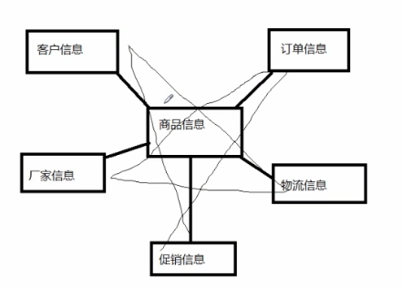
* 雪花模型：基于星型模型发展起来。雪花模型的维度表可以拥有其他维度表的，虽然这种模型相比星型模型更规范一些，但是由于这种模型不太容易理解，维护成本比较高，而且性能方面需要关联多层维表，性能也比星型模型要低。所以一般不是很常用。
  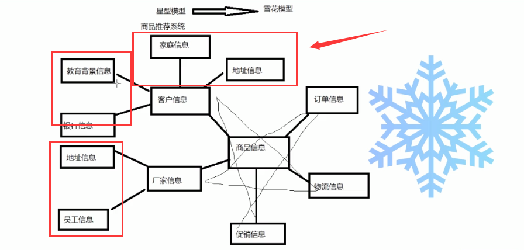

## 1.2.Hadoop是什么

> hadoop是一个开源的分布式存储+分布式计算平台，用于搭建大型数据仓库，实现PB级数据存储、处理、分析、统计等业务。
> hadoop由两个方面组成，一个是：
> 1）HDFS系统(Hadoop Distributed File System)：分布式文件系统、存储海量数据。
> 2）MapReduce框架：并行处理框架，实现任务分解和调度。

### 1）hadoop前生

* Google发明了大数据技术：MapReduce、BigTable、GFS，解决了三大数据储存的问题：①：能用PC机，降低成本；②：软件容错，硬件不够，软件来凑；③：简化并行的分布式计算。
* 但是！！！谷歌没有开放源代码，所以一个模仿google大数据技术的开源项目出现了。

### 2）hadoop功能和优势

* 优势：
  * ①：高扩展
  * ②：低成本：普通PC机
  * ③：成熟的生态圈，如hive、Hbase（一个可以运行在Hadoop集群上的NoSQL数据库）、zookeeper
    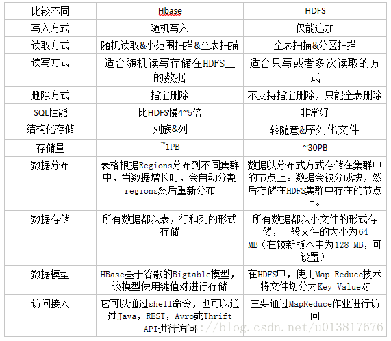

## 1.3.Hive的介绍

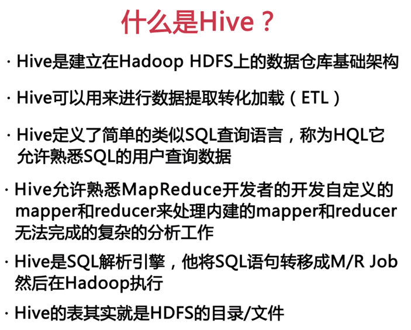

# 2.Hive体系结构

* 元数据：
  * Hive为了能操作HDFS上的数据集，那么他需要知道数据的切分格式，即表的信息。
  * 表的信息（和数据无关），包括表名、表列、分区及其属性、标的属性、表数据所在目录等。
  * Hive本身就是一个解释器，所以他不存储数据，元数据存储在数据库（metastore）中，支持mysql、derby等数据库，derby是hive自带数据库。

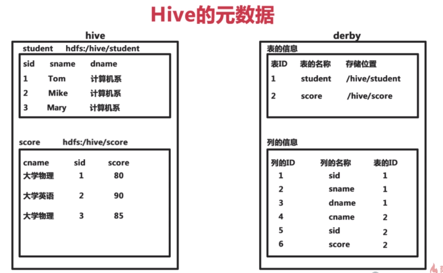

* HQL的执行过程：
  * 解释器、编译器、优化器从词法语法分析、编译、优化并生成查询计划（plan）。
  * 生成的查询计划存储在HDFS中，并随后由MapReduce调用执行。
    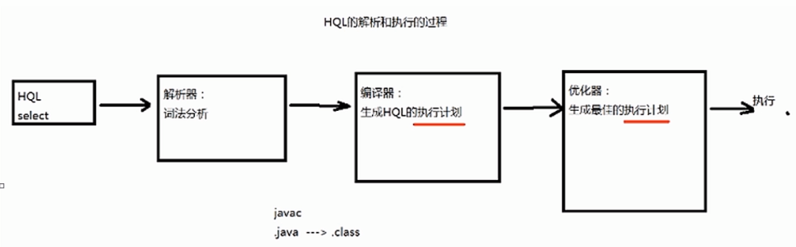
* hive体系图解：
  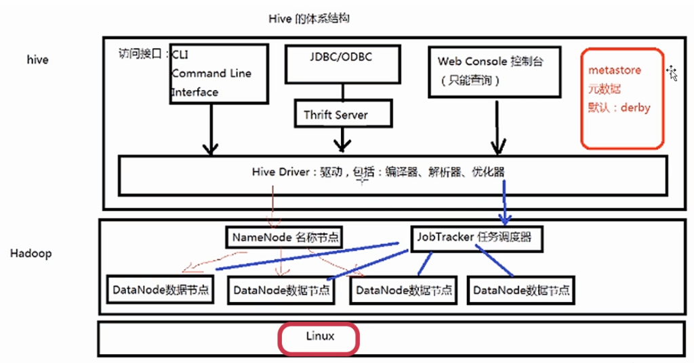

# 3.hive安装

* 最新版本下载：https://hive.apache.org，点击download。
* 历史版本下载：http://archive.apache.org/dist/hive
* **hive基于hadoop工作，所以hive安装前需要安装hadoop。**
* 安装模式：
  * 嵌入模式：元数据存储在hive自带的derby数据库中，且只允许创建一个连接，有局限性，多用于Demo。安装时默认嵌入模式，无需任何配置。
  * 本地模式：元数据存储在mysql数据库中，Mysql数据库与hive运行在同一台物理机器上，多用于开发或测试。
  * `远程模式`：元数据存储在mysql数据库中，Mysql数据库与hive运行在不同操作系统上，允许创建多个连接，多用于生产环境中。
    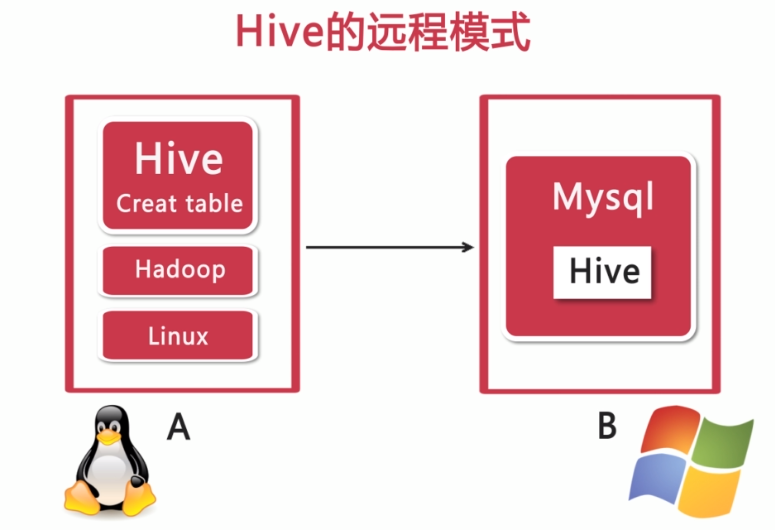
* 远程模式的安装：记得将lib加入到path里
  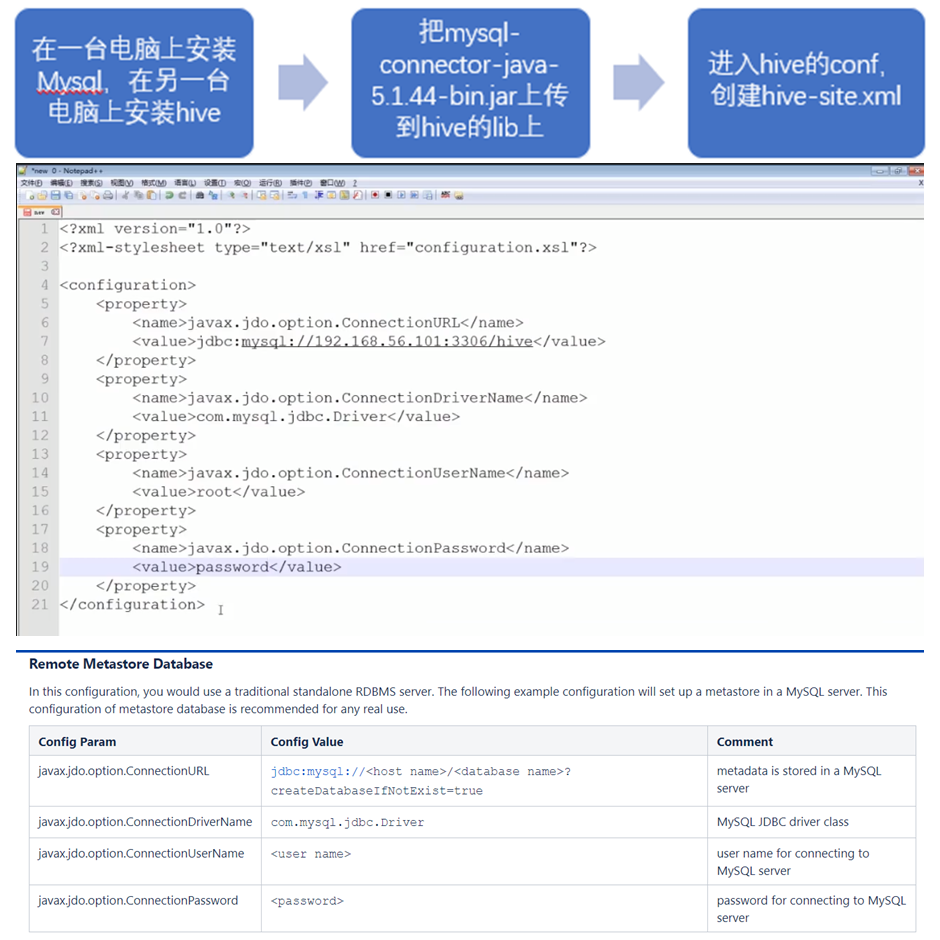

# 3.hive管理

> hive的管理有三种：CLI（命令行）方式，Web可视化界面方式，远程服务启动方式。

* CLI：# hive进入，quit退出，也可以输入# hive-S（这样就不会打印MapReduce的调试语句，直接输出结果）
  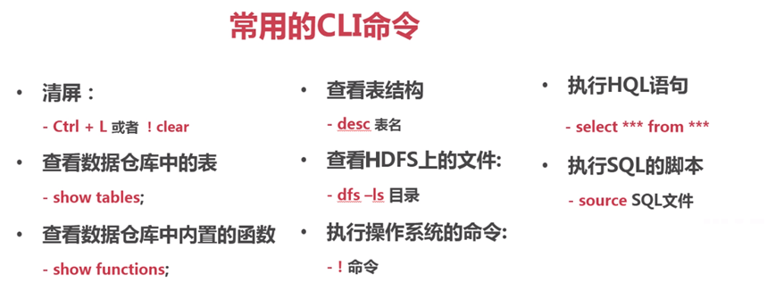
* Web界面方式：
  * 安装：如果安装的hive版本不自带web界面，需要下载source进行编译：
    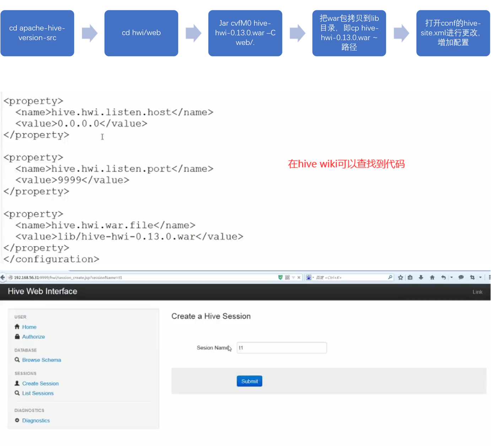
  * 启动方式：CTL输入# hive--service hwi &
* 远程服务启动方式：
  * 启动方式：# hive--service hiveserver &
  * 端口号：10000
  * 以JDBC或ODBC的方式，通过thrift server访问hive。

# 4.hive数据类型

## 4.1.基本数据类型

* tinyint/smallint/int/bigint：整数类型
* float/double：浮点数类型
* boolean：布尔类型
* string：字符串类型，包括char和varchar

## 4.2.复杂数据类型

* array：[]，数组，由一系列相同数据类型的元素组成。
* map：<>，集合类型，包含key-value键值，可以通过key访问元素。
* struct：{}，结构类型，可以包含不同数据类型的元素。这些元素可以通过“点语法”的方式来得到所需要的元素。
  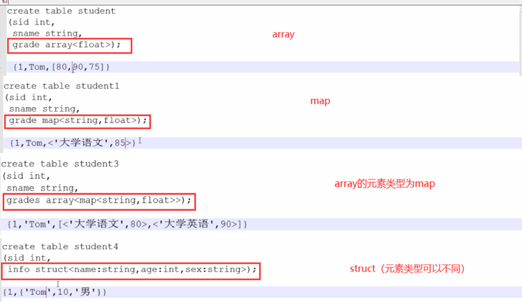

## 4.3.时间数据类型

* Date：格式{{yyyy-mm-dd}}，但不包含时间，date数据可以通过cast函数变成timestamp、string。
* Timestamp：时间戳的偏移量，是一串数字。
* interval：年月间隔。
* 更多可查看[hive wiki](https://cwiki.apache.org/confluence/display/Hive/LanguageManual+Types#LanguageManualTypes-date)

## 4.4.hive的数据存储

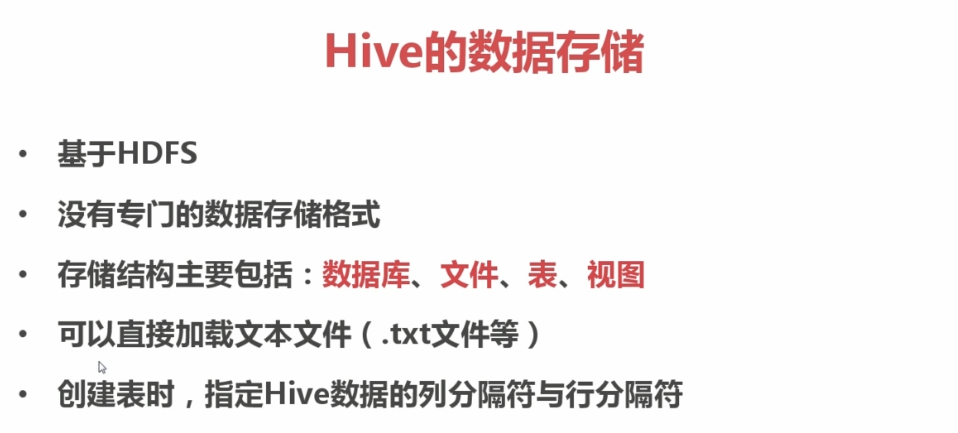

# 4.hive的数据模型

> * 表：内部表（table）、分区表（partition）、外部表（external table）、桶表（bucket table）
> * 视图

## 4.1.内部表 table

* 特点：
  * 与数据库的table概念上类似
  * 每一个table在HDFS都有一个相应的目录存储数据，默认存在/user/hive/warehouse
  * 所有的数据都保存在这个目录下
  * 删除表时，元数据与数据都会被删除
* 相关语句：

```
    #指定存储位置：location '路径'
    #指定存储的分隔符：row fromat delimited fields terminated by ','
    #拷贝其他表的数据到新表：create table test2 as select * from test1
    #增加一列：alter table test1 add colums(ID string)
```

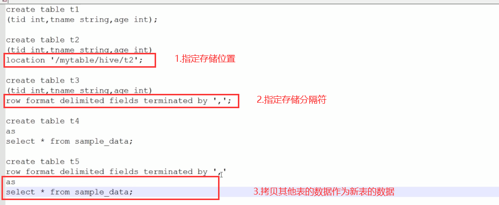

## 4.2.分区表 partition

* 特点：
  * 分区表其实就是按照partition列对表格进行拆分。
  * 一个partition对应表下一个文件，所有的partition数据都存储在同一目录下。
  * 当数据量非常大的时候，将表格按照一定条件进行分区可以提高查询效率。
    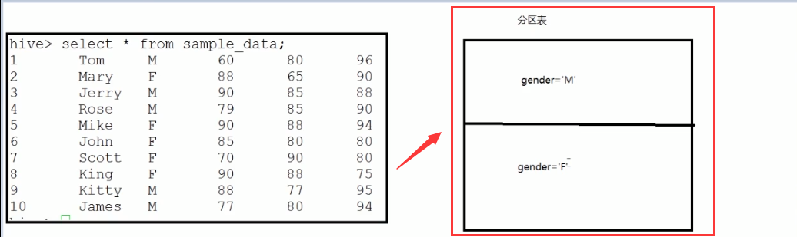
* 相关语句：

```
    #指定分区字段：partition by '字段'
   #插入新的数据：insert into test2 partition(gender='F') select * from test1 where gender='F'
```

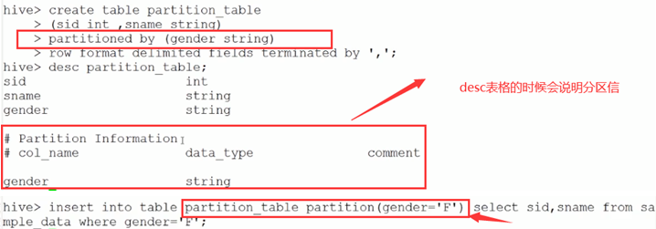

## 4.3.外部表 External table

* 特点：
  * 指向已经在HDFS中存在的数据，可以创建partition。
  * 它和内部表在元数据的存储上是一致的，区别在于：①内部表需要先在hive 的数据仓库中创建表，再加载表数据，表数据存在数据仓库目录中。②外部表是加载已存在HDFS的数据，因此，创建表和加载数据同时完成，但数据还是HDFS的原位置。亦就是说：外部表只是建立了一个链接，当删除外部表时，不会删除数据。
    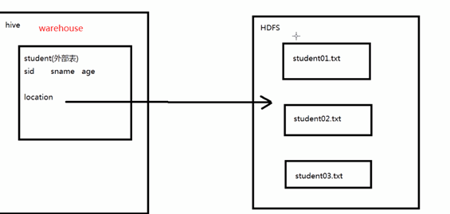
* 相关语句：

```
    #加载指定目录：on '路径'
   #创建外部表：create external table
```

## 4.4.桶表 Bucket table

* 特点：
  * 桶表是对数据进行哈希取值，打散了之后放到不同的文件中存储，避免造成热块。
  * 分桶列是实际存在的列。
* 相关语句：

```
    #创建桶表：create table test1(sid int,sname string,age int) clustered by (sname) into 5 buckets
```

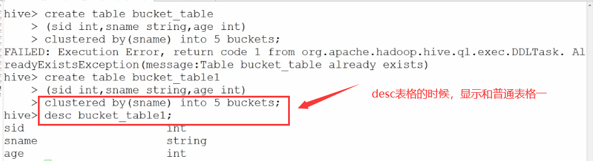

## 4.5.视图 view

* 特点：
  * 视图是一种虚表，是一个逻辑概念，可以跨越多张表。
  * 视图建立在已有表的基础上，视图赖以建立的这些表称为基表。
  * 视图可以简化复杂的查询。
* 相关语句：

```
    #创建视图：create view view1 as select a.id,a.name,b.salary,b.dept from test1 a,test2 b where a.id=b.id;
```

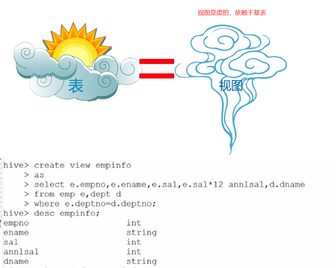

# 5.hive常用语句

## 5.1.数据导入

### 1.使用load语句

```
load data [local] inpath 'filepath' [overwrite] into table tablename [partition (partcol1=val1,partcol2=val2...)
# local：如果是系统文件则加local，如果是在HDFS上，则不加。
```

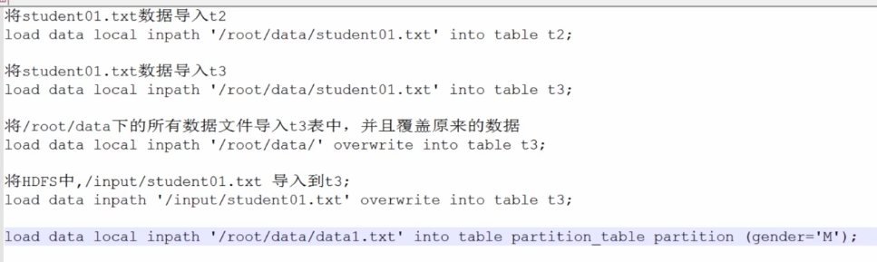

### 2.使用sqoop

* sqoop是一个开源的数据导入和导出工具。
* 数据导入：

```
./sqoop import --hive-import--connect jdbc:oracle:thin:@192.168.56.101:1521:oral--username scott--password tiger--table emp--m1--columns'empno,ename,job,sal,deptno'
```

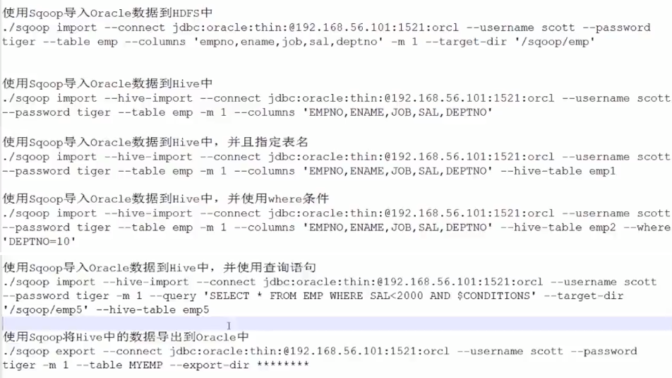

## 5.2.数据查询

### 1.基本查询

* 对于没有函数的简单查询作业，可以启用fetch task功能，不使用mapreduce，提高查询效率。配置方式：

```
# 1.进入hive
set hive.fetch.task.conversion=more;
# 2.打开cmd
hive--hiveconf hive.fetch.task.conversion=more
# 3.永久更改
#修改hive-site.xml文件
select [all/distinct] expr1,expr2,...from tablename
[where where-condition]
[group by col-list]
[cluster by col-list]
    [distribute by col_list][sort by col_list]
    [order by col_list]
[limit numbber]
#distribute by 指定分发器（partitioner）。
```

* nvl(column,0)函数：当数值为null时，为避免计算出错，转换为0值。

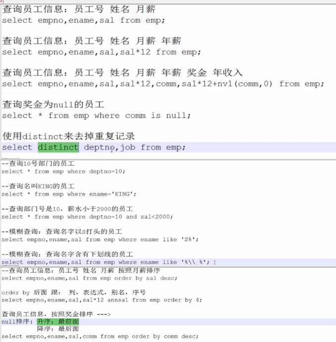

### 2.内嵌函数

* Hive的数学函数包含两种，一种是内嵌函数，一种是由java学的自定义函数。
* 内嵌函数又包括内置函数、表函数、聚合函数
  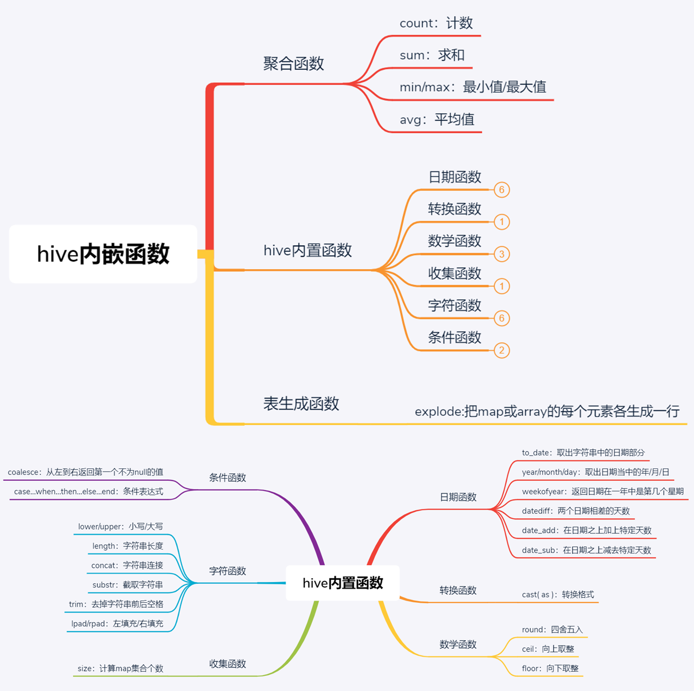

## 5.3.表连接


## 5.4.子查询

* hive的子查询只支持where和from子句中的子查询。

# Appendix

## 1. 常用linux操作

[石墨文档](https://shimo.im/docs/cvTv9wRWKY6wcDpR)

### cd

// 进入当前目录下的hello文件夹
cd hello
// 返回上级目录
cd ..
// 返回上上n级目录
cd ../../../..
// home目录下的用户名是家目录，想去的话：
cd ~

### pwd

// 打印当前路径
pwd

### ls/mkdir

// 显示当前目录下内容
ls // 创建文件夹hello
mkdir hello // 删除文件、文件夹

### rm/mv/cp

// eg 删除文件test.txt
rm test.txt
// eg 删除文件夹hello
rm -r hello
// eg 加上-f参数用于直接删除文件夹，不提示，force
rm -rf hello // 移动文件、文件夹
// eg 移动hello文件夹到上一级目录
mv hello ../
// eg 移动hello文件夹到指定目录
mv hello 路径 // 拷贝文件、文件夹
// eg 拷贝hello文件到上一级目录
cp hello ../
// eg 拷贝hello文件夹到上一级目录
cp -r hello ../ // 查看文本内容

### cat/tail/head

// eg 查看test.txt内容
cat test.txt 
// 查看文本的最后几行、默认不加参数会取最后10行
// eg 查看test.txt最后10行
tail test.txt 
// 查看文本的开始几行、默认不加参数会取开始10行
// eg 查看test.txt开始10行
head test.txt

### clear

// 清楚当前屏幕上的输出内容
clear

### sudo pip/vi

// 使用管理员身份执行命令
// eg 使用管理员身份安装python包
sudo pip install xxx // 编辑文本
// eg 编辑test.txt
vi test.txt
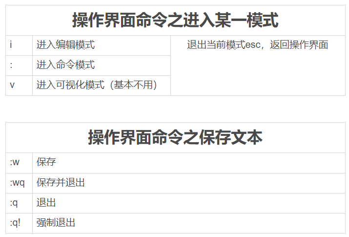

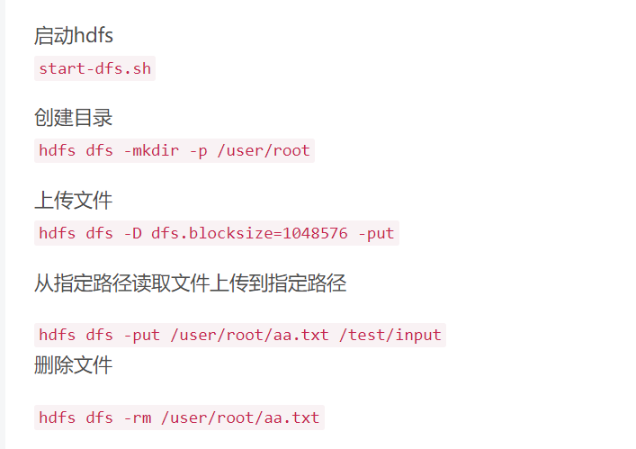

## 2. Hadoop相关基础知识

### 1.大数据概念及特点

> 大数据主要解决海量数据的存储和海量数据的分析计算问题。

* 大数据（BIG DATA）:指因数据量太大无法在一定时间范围内用常规软件工具进行捕捉、管理和处理的数据集合，是需要新处理模式才能具有更强的决策力、洞察发现力和流程优化能力的**海量、高增长率和多样化的信息资产**。

* 数据储存单位：bit、byte、KB、MB、GB、**TB、PB、EB、ZB**、YB、BB、NB、DB

* 大数据特点：Volume（大量）、Velocity(高速）、Variety(多样）、Value（低价值密度）

* 大数据部门组织结构:

  

  * ETL(Extract-Transform-Load)是将业务系统的数据经过抽取、清洗转换之后加载到数据仓库的过程，目的是将企业中的分散、零乱、标准不统一的数据整合到一起，为企业的决策提供分析依据。ETL的设计分三部分：数据抽取、数据的清洗转换、数据的加载。

### 2.hadoop介绍

* hadoop是一个分布式系统基础架构：
  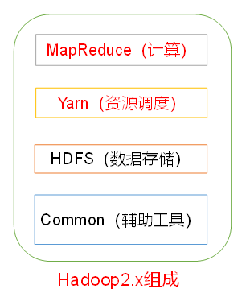
* 大数据技术生态体系
  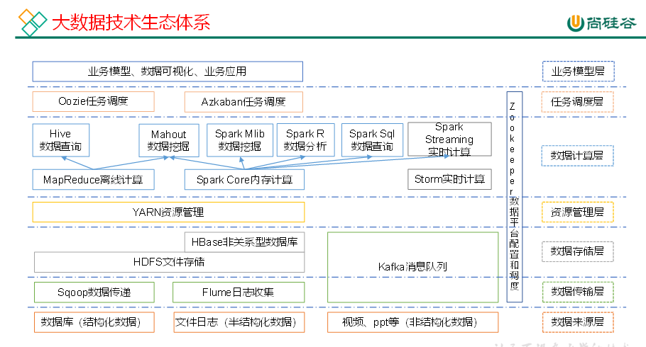
  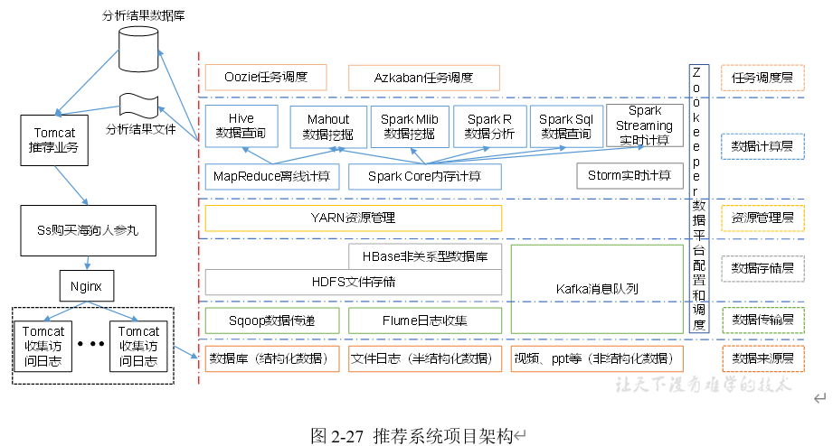
* Hive：Hive是基于Hadoop的一个数据仓库工具，可以将结构化的数据文件映射为一张数据库表，并提供简单的SQL查询功能，可以将SQL语句转换为MapReduce任务进行运行。 其优点是学习成本低，可以通过类SQL语句快速实现简单的MapReduce统计，不必开发专门的MapReduce应用，十分适合数据仓库的统计分析。