# 1.SQL基础知识

## 1.1.数据库基础

* 数据库（database）：以特定方式存储，能予多个用户共享的数据集合，包括关系型和非关系型。举例：小型的有access、foxbase；中型的有mysql、sql server；大型的有oracle、db2、sybase。
* 数据表：以特定方式存储的数据集合，包括行（row/record）、列（column）、值（value）、主键（primary key）。

## 1.2.MySQL相关定义

* **MySQL**：是开源的完全免费的数据库系统，是目前最流行的关系型数据库管理系统。

* **MySQL Workbench**：是一款专为 MySQL设计的集成化管理软件,也是下一代的可视化数据库设计、管理的工具。

* **数据字典（data dictionary）**：是数据库的说明书，数据库中所有成分的定义和解释集合，方便查询各项数据的意义、来源于使用方法。

* 实体关系模型（E-R图）

  ：是设计关系型数据的基础，表明数据库中的各个数据表之间的联系：

  * E（Entity）表示数据表
  * A（Attribute）表示字段
  * R（Relationship）表示表间关系。
    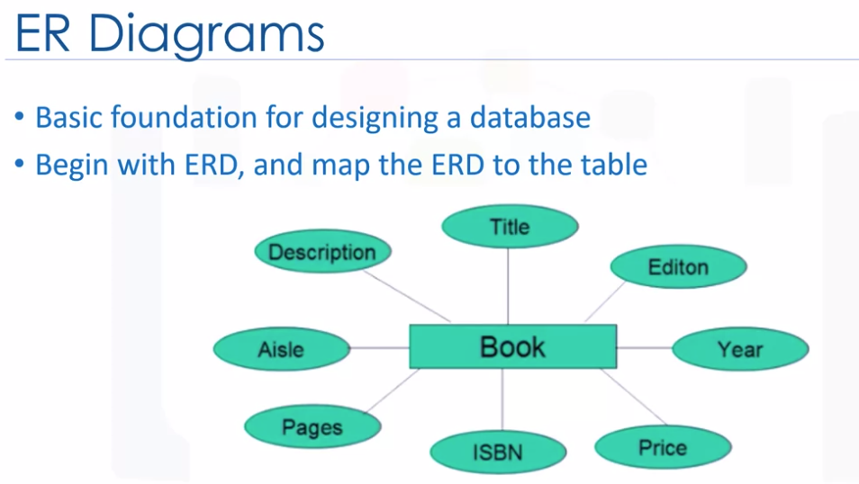

* **架构和实例（schema vs instance）**：关系型数据库的两个组成部分。shema包含表名、列名、类型及字段约束等，用于创建数据库的架构；而instance则是一个具体的表。
  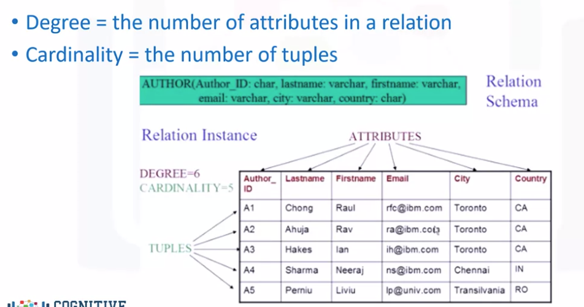

# 2.SQL语言基础知识

## 2.1.语句基本规则

* SQL关键字不区分大小写
* 使用''或""来表示字符串
* 使用`'来表示数据库、数据表和字段名
* SQL基本数据类型：数字、日期和时间、字符串、二进制
* 使用分号;来完成语句。

## 2.2.数据库表操作

| 功能                 | 语句                                                 | 举例                                                         |
| -------------------- | ---------------------------------------------------- | ------------------------------------------------------------ |
| 展示所有数据库       | show database                                        | show database                                                |
| 展示当前工作的数据库 | select database()                                    | select database()                                            |
| 创建数据库           | CREATE DATABASE`name` /CREATE DATABASE IF NOT EXISTS | CREATE DATABASE `online_data`                                |
| 删除数据库           | drop database`name`                                  | drop database `online_data`                                  |
| 使用数据库           | use `name`                                           | use `online_data`                                            |
| 展示表格             | show tables from `name`                              | show tables from `online_sale`                               |
| 展示表格的列名       | show columns from<表名>                              | show columns from`online_sale`                               |
| 创建数据表           | create table `name`                                  | create table `客户信息`(`顾客号码` int,`顾客姓名` varchar(20),`信用额` decimal,`上次购买日期` datetime,`顾客照片` blob) |
| 删除数据表           | drop table`name`                                     | drop table `客户信息`                                        |
| 修改数据表           | alter table`name`                                    | alter table `客户信息` add column `性别` char                |

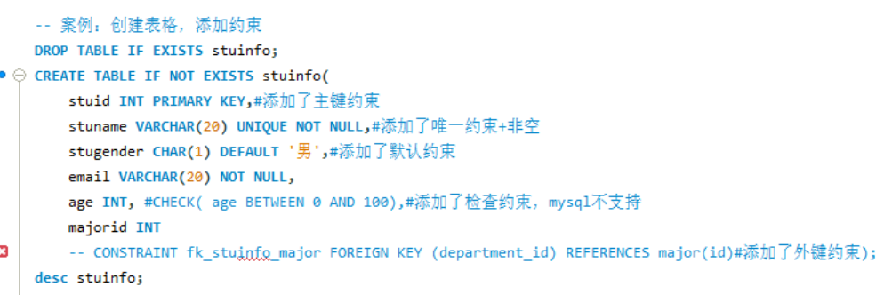

* MySQL常见报错信息和处理方法：https://shimo.im/docs/Gl4FBl55Z0geetDD/read

## 2.3.核心查询语句

**1.数据查询和过滤**
\* 数据查询：select（查询结果是一个虚拟表）
\* 数据列赋名：as
\* 数据过滤：where <columnname> condition1 and/or/not condition2 （聚合函数前）、having <columnname> condition1 and/or/not condition2 （聚合函数后，可以对新列操作）
\* 查询结果排序：order by asc/desc（排序列表可以是单个字段、多个字段、表达式、函数、列数、以及以上的组合）
\* 查询结果输出：limit n/startrow,rownumber
\* 查询唯一值（去除重复行）：select distinct
\* 去重计算：count distinct()
\* 关系运算符：> < >= <= = <> （不等于）
\* 逻辑运算符：and or not
\* 有无查询：select exists，例如：查询是否有Abel。——>SELECT EXISTS(
SELECT * FROM employees WHERE last_name = 'Abel'
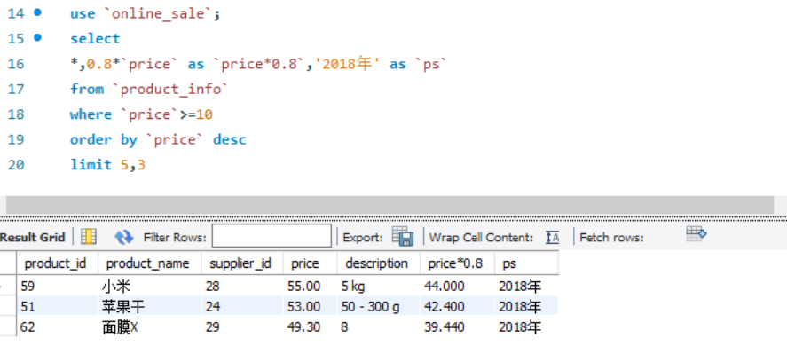

**2.数据表间连接**
\* 输出两表匹配的数据：select<表名.列名>from<左表名> inner join <右表名> on <左表键值列名> =<右表键值列名>
\* 匹配左表进行合并：select<表名.列名>from<左表名> left join <右表名> on <左表键值列名> =<右表键值列名>
\* 匹配右表进行合并：select<表名.列名>from<左表名> right join <右表名> on <左表键值列名> =<右表键值列名>
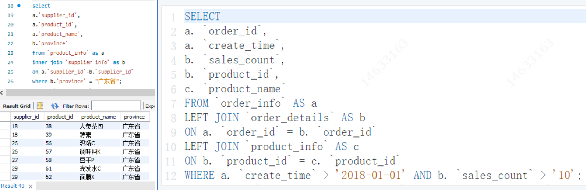

```
# SQL核心查询语句
SELECT [DISTINCT]
    <列名>, <聚合函数 AS <别名>
 FROM <左表名> [AS <别名>]
 [LEFT JOIN <右表名> AS <别名>]
 [ON <左表键值列名> =<右表键值列名>] # 表间连接
 
 [WHERE <过滤条件>] 
 [GROUP BY <聚合类别列名>} 
 [HAVING <过滤条件>] 
 [ORDER BY <排序列名> (ACE|DESC)] 
 [LIMIT <行数>]
```

**3.数据增改删**

| 功能                               | 函数                                    | 举例                                                         |
| ---------------------------------- | --------------------------------------- | ------------------------------------------------------------ |
| 获取表中各列信息，包括类型和缺失值 | describe<表名>                          | describe `online_data`                                       |
| 插入新的行                         | insert into<表名>(字段)values(值)       | insert into `online_data`(`customer_id`,`price`,`city`)values(10002,30,'深圳') |
| 修改一行或多行                     | update<表名>set<字段>=<新值>where<条件> |                                                              |
| 删除满足某些条件行                 | delete from<表名>where<条件>            | --                                                           |
| 更改数据类型                       | cast(col as new_type)                   | cast(create_time as datetime) as 精确日期                    |

## 2.4.SQL进阶语法

**1.子查询：子查询必须是完整的语句**
\* 单行单列子查询：
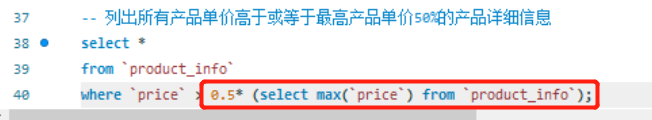
\* 多行单列子查询：利用关键字in/not in
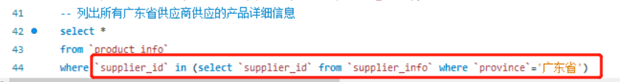
\* 临表子查询：设置临时表a
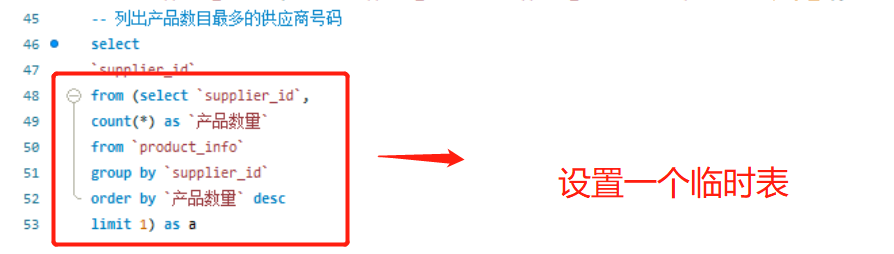
**2.条件判断语句**
\* 条件判断：case when<条件>then<输出>else<输出> end as <字段>
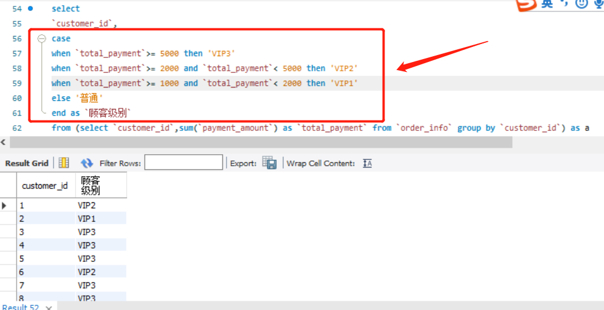
**3.SQL语句优化**
\* 避免返回所有数据，只选择产生结果的必要数据列。
\* 尽量使用between而不是in，比如between 1 and 4 而不是in (1,2,3,4)。
\* 优先使用where语句过滤原数据之后再聚合，避免不必要的聚合运算。
\* 尽量在最后执行排序order by，避免不必要的order by语句。

# 3.SQL进阶用法

## 3.1.模糊查询

### 1.like/not like

* 功能：一般和通配符搭配使用，对字符型数据进行部分匹配查询。常见的通配符：
  * **_ 代表任意单个字符**
  * **% 代表任意多个字符**
  * **若要查含有_或%的数据，则要设置转义符escape(也是可以用\直接转义）**
* 案例1：查询员工信息表中姓名第一个字符为e的员工信息。——>select * from employees where last_name like 'e%';
* 案例2：查询员工信息表中姓名第三个字符为x的员工信息。——>select * from employees where last_name like '__x%';
* 案例3：查询员工信息表中姓名第二个字符为%的员工信息。——>select * from employees where last_name like '_@%%' escape '@'

### 2.in/not in

* 功能：查询某字段的值是否属于指定的列表之内。即：a in/not in (常量值1,常量值2,常量值3,...)
* 案例1：查询工种编号不是IT_PROT或是ST_CLERK或是AD_VP的员工信息。——>select * from employees where job_id not in ('IT_PROT','ST_CLERK','AD_VP');

### 3.between and/not between in

* 判断某个字段的值是否介于xx和yy之间，区间值包含在内，且不能调换顺序，等价于逻辑表达式的效果，即>=xx and <=yy。
* 案例1：查询部门编号在30-90之间的员工信息。——>select * from employees where department_id between 30 and 90;

### 4.is null/is not null

* 查询无数据的信息。'='只能判断普通的内容；is 用于判断null值；<=>表示安全等于，既能判断普通内容，也能判断null值，但可读性差，很少用到。
* 案例一：查询有奖金的员工信息。——>select * from employees where commission_pct is not null;

### 5.any/some/all

* any/some用于判断某字段的值是否满足其中任意一个。如x>any(10,20,30)相当于x>10，x=any(10,20,30)相当于x in (10,20,30)。
* all用于判断某字段的值是否满足里面所有的值。如如x>all(10,20,30)相当于x>30。

### 6.起别名

* 方式一：使用as关键字
* 方式二：用空格

## 3.2.常用函数

### 3.2.1.字符函数

| 功能                             | 函数                                     | 举例                                                         |
| -------------------------------- | ---------------------------------------- | ------------------------------------------------------------ |
| 字符拼接                         | CONCAT                                   | CONCAT(first_name,last_name)                                 |
| 获取字节长度                     | LENGTH                                   | LENGTH('hello,郭襄')                                         |
| 获取字符个数                     | CHAR_LENGTH                              | CHAR_LENGTH('hello,郭襄')                                    |
| 获取字符大写/小写                | UCASE/LCASE                              | UCASE('hello')                                               |
| 截取子串                         | substr(str,起始索引，截取的字符长度)     | SUBSTR('张三丰爱上了郭襄',1,3)                               |
| 获取字符第一次出现的索引         | INSTR(str,字符)                          | INSTR('三打白骨精aaa白骨精bb白骨精','白骨精')                |
| 去掉前后指定的字符，默认是去空格 | TRIM(字符 from str)                      | SELECT TRIM('x' FROM 'xxxxxx虚xxx竹xxxxxxxxxxxxxxxxxx') AS a |
| 左填充/右填充                    | LPAD/RPAD(str,填充后的字符个数,填充字符) | SELECT LPAD('木婉清',10,'a')                                 |
| 变大写/变小写                    | UPPER/LOWER                              | SELECT CONCAT(UPPER(SUBSTR(first_name,1,1)),LOWER(SUBSTR(first_name,2)),'_',UPPER(last_name)) "OUTPUT" FROM employees |
| 右截取/左截取                    | LEFT/RIGHT(str,字符长度)                 | SELECT LEFT('鸠摩智',1)                                      |

### 3.2.2.数学函数

| 功能                       | 函数                          | 举例                           |
| -------------------------- | ----------------------------- | ------------------------------ |
| 绝对值                     | ABS                           | SELECT ABS(-4)                 |
| 向上取整/向下取整/四舍五入 | CEIL/FLOOR/ROUND              | SELECT ROUND(1.8712345,2)      |
| 截断数字                   | TRUNCATE                      | SELECT TRUNCATE(1.8712345,1)   |
| 取余                       | MOD(被除数，除数)=被除数%除数 | SELECT MOD(-10,3)=SELECT -10%3 |
| 平方根                     | SQRT(x)                       | SQRT(4)                        |
| y次方                      | POW(x,y)                      | POW(2,3)                       |

### 3.2.3.日期函数

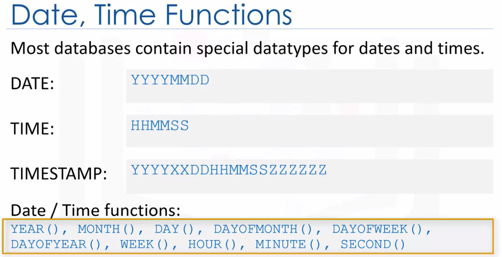

| 功能                           | 函数                            | 举例                                                         |
| ------------------------------ | ------------------------------- | ------------------------------------------------------------ |
| 获取日期/月份/年份             | DAY/MONTH/YEAR                  | DAY(SALEDATE)                                                |
| 获取当前日期和时间             | now()/CURRENT_DATE/CURRENT_TIME | SELECT NOW()                                                 |
| 获取当前日期/时间              | CURDATE/CURTIME                 | SELECT CURDATE()                                             |
| 计算日期间隔                   | DATEDIFF(date1,date2)           | SELECT DATEDIFF('1998-7-16','1998-7-15')                     |
| 转换日期格式                   | DATE_FORMAT(字段，新格式)       | SELECT DATE_FORMAT('1998-7-16','%Y年%M月%d日 %H小时%i分钟%s秒') |
| 按指定格式解析字符串为日期类型 | STR_TO_DATE                     | SELECT * FROM employees WHERE hiredate<STR_TO_DATE('3/15 1998','%m/%d %Y') |

### 3.2.4.流程控制函数

| 功能     | 函数                                                         | 举例                                                         |
| -------- | ------------------------------------------------------------ | ------------------------------------------------------------ |
| 判断函数 | IF(condition,true的结果,false的结果)                         | SELECT IF(commission_pct IS NULL,0,salary*12*commission_pct) 奖金,commission_pct FROM employees |
| 多重判断 | CASE WHEN condition1 THEN result1 ELSE result2 END           | SELECT salary,CASE WHEN salary>20000 THEN 'A' WHEN salary>15000 THEN 'B' WHEN salary>10000 THEN 'C' ELSE 'D' END AS a FROM employees |
| 判断空值 | IFNULL(value1, value2)，如果value1不为空，返回value1，否则返回value2 | IFNULL(commission_pc, 0)                                     |

### 3.2.5.聚合函数

* 数据聚合：select<列名>,<聚合函数()>from <表名> group by<列名>

| 聚合函数      | 说明                                  |
| ------------- | ------------------------------------- |
| count(列名)   | 返回指定列中的行数（不包含null）      |
| count(*)      | 返回数据表的行数（包含null）          |
| sum(列名)     | 返回指定数值列的求和（不包含null）    |
| avg(列名)     | 返回指定数值列的平均值（不包含null）  |
| min/max(列名) | 返回指定列的最大/最小值（不包含null） |

## 3.3.排序查询

* 排序列表可以是单个字段、多个字段、表达式、函数、列数、以及以上的组合。
* 案例：按多个字段排序。查询员工的姓名、工资、部门编号，先按工资升序，再按部门编号降序。——>SELECT last_name,salary,department_id FROM employees
  ORDER BY salary ASC,department_id DESC

## 3.4.连接查询

### 3.4.1.等值连接

* 表格之间有明确的值对应关系，可以添加筛选条件+分组+排序。
* 案例1：查询部门中员工个数>10的部门名，并按员工个数降序。——>SELECT COUNT(*) 员工个数,d.department_name FROM employees e JOIN departments d ON e.`department_id`=d.`department_id` GROUP BY d.`department_id` HAVING 员工个数>10 ORDER BY 员工个数 DESC;
* 案例2：三表连接：SELECT last_name , department_name , location_id , city FROM employees e JOIN departments d ON e.`department_id` = d.`department_id` JOIN locations l ON d.`location_id` = l.`location_id` WHERE e.`commission_pct` IS NOT NULL

### 3.4.2.非等值连接

* 表格之间无明确的值对应关系，但存在范围，可以采用模糊查询进行连接。
* 案例1：查询部门编号在10-90之间的员工的工资级别，并按级别进行分组。——>SELECT COUNT(*) 个数,grade FROM employees e JOIN sal_grade g ON e.`salary` BETWEEN g.`min_salary` AND g.`max_salary` WHERE e.`department_id` BETWEEN 10 AND 90 GROUP BY g.grade
* 案例2：查询每个部门的平均工资的工资级别。——>SELECT dep_ag.department_id,dep_ag.ag,g.grade
  FROM sal_grade g JOIN (SELECT AVG(salary) ag,department_id FROM employees GROUP BY department_id) dep_ag ON dep_ag.ag BETWEEN g.min_salary AND g.max_salary
  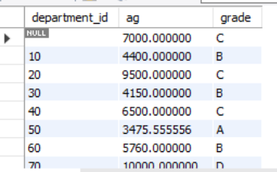

## 3.5.联合查询

* 当查询结果来自于多张表，但多张表之间没有关联，但表的字段意义相同，这个时候可以使用联合查询进行行合并，也称为union查询。
* 语法：
  select 查询列表 from 表1 where 筛选条件
  union/union all
  select 查询列表 from 表2 where 筛选条件
* union实现去重查询；union all 实现全部查询，包含重复项
* 案例：合并美国和中国的表。——>SELECT * FROM usa WHERE uage >20 UNION SELECT * FROM chinese WHERE age >20

## 3.6.自增长列

* 自增长列要求必须设置在一个键上，比如主键或唯一键
* 自增长列要求数据类型为数值型
* 一个表至多有一个自增长列
* 案例：
  * CREATE TABLE gradeinfo(gradeID INT PRIMARY KEY AUTO_INCREMENT,gradeName VARCHAR(20));
  * INSERT INTO gradeinfo(gradename)VALUES('一年级'),('2年级'),('3年级');

## 3.7.DDL

> Data Define Language数据定义语言,用于对数据库和表的管理和操作。

### 3.7.1.库的操作

* 创建数据库：CREATE DATABASE IF NOT EXISTS <数据库名>;
* 删除数据库：DROP DATABASE IF EXISTS <数据库名>;

### 3.7.2.表的管理

* 创建表：CREATE TABLE IF NOT EXISTS <表名>(字段名 数据类型 【字段约束】);
  * 数据类型：整型（TINYINT SMALLINT INT BIGINT ）、浮点型（FLOAT(m,n)、DOUBLE(m,n) 、DECIMAL(m,n)）、字符型（CHAR(n):n可选，VARCHAR(n)）、日期型（DATE、TIME、DATETIME、TIMESTAMP）、二进制型（BLOB 存储图片数据）
  * 常见约束：

| 常见约束    | 说明                                                         |
| ----------- | ------------------------------------------------------------ |
| NOT NULL    | 非空：用于限制该字段为必填项                                 |
| DEFAULT     | 默认：用于限制该字段没有显式插入值，则直接显式默认值         |
| PRIMARY KEY | 主键：用于限制该字段值不能重复，设置为主键列的字段默认不能为空，一个表只能有一个主键，当然可以是组合主键 |
| UNIQUE      | 唯一：用于限制该字段值不能重复                               |
| CHECK       | 检查：用于限制该字段值必须满足指定条件，CHECK(age BETWEEN 1 AND 100) |
| FOREIGN KEY | 外键:用于限制两个表的关系,要求外键列的值必须来自于主表的关联列 |

```
CREATE TABLE IF NOT EXISTS author(
    author_id CHAR(2) PROMARY KEY NOT NULL,
    lastname VARCHAR(15) NOT NULL,
    firstname VARCHAR(15) NOT NULL,
    email VARCHAR(15) NOT NULL,
    city VARCHAR(15)
    );
```

* 修改表：ALTER TABLE 表名 ADD|MODIFY|CHANGE|DROP COLUMN 字段名 字段类型 【字段约束】

| 功能       | 举例                                                         |
| ---------- | ------------------------------------------------------------ |
| 修改表名   | ALTER TABLE stuinfo RENAME TO students                       |
| 添加字段   | ALTER TABLE students ADD COLUMN borndate TIMESTAMP NOT NULL  |
| 修改字段名 | ALTER TABLE students CHANGE COLUMN borndate birthday DATETIME NULL |
| 删除字段   | ALTER TABLE students DROP COLUMN birthday                    |

* 删除表：DROP TABLE IF EXISTS<表名>
* 复制表：分三种类型，包括仅仅复制表的结构、复制结构和数据、复制字段

| 功能              | 举例                                                         |
| ----------------- | ------------------------------------------------------------ |
| 复制表的结构      | CREATE TABLE newTable2 LIKE departments                      |
| 复制表的结构+数据 | CREATE TABLE newTable3 SELECT * FROM girls.`beauty`          |
| 复制字段          | CREATE TABLE emp SELECT last_name,e.department_id,salary,location_id FROM myemployees.`employees` e,myemployees.departments WHERE 1=2 |

## 3.8.DML

> DML(Data Manipulation Language)数据操纵语言：insert update delete——对表中的数据的增删改。

### 3.8.1.数据插入

* 插入单行：insert into 表名(字段名1,字段名2 ,...) values (值1，值2,...);
* 插入多行：insert into 表名(字段名1,字段名2 ,...) values (值1，值2,...),(值1，值2,...),(值1，值2,...);

### 3.8.2.数据修改

* update 表名 set 字段名 = 新值,字段名=新值,...where 筛选条件
  

### 3.8.3.数据删除

* 删除指定行：delete from 表名 where 筛选条件，如果没有where条件，所有的行都会被删除。
* 删除表中全部数据：truncate table 表名
  

## 3.9.事务

* 事务由由一条或多条sql语句组成，要么都成功执行，要么都无法执行，如果失败则用rollback查找问题。
* 第一步：取消事务自动开启：SET AUTOCOMMIT = 0
* 第二步：开始事务：START TRANSACTION
* 第三步：编写事务的sql语句
* 第四步：提交事务：COMMIT
* 第五步：回滚查询问题：ROLLBACK

# 4.其他知识

## 4.1.SQL难题

1.查询各部门中工资比本部门平均工资高的员工的员工号, 姓名和工资。

* 解题思路：子查询和连接查询
  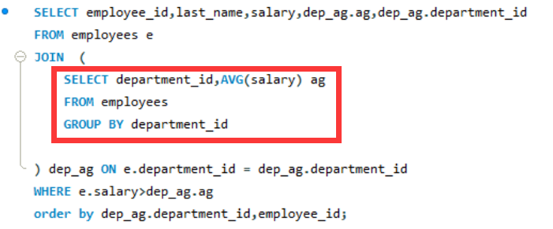

2.找出所有首都和其国家名字，

* 解题思路：like、通配符和concat函数
  SELECT capital,name FROM world where capital like concat('%',name,'%')

3.查询1984年的获奖者和获奖类目，但把化学和物理类目放在最后。

* in函数
  SELECT winner, subject FROM nobel WHERE yr=1984 ORDER BY subject IN ('Physics','Chemistry') asc
  4.找出哪些國家的人口是高於歐洲每一國的人口。
* all/any函数+子查询
  SELECT name FROM world
  WHERE population > ALL(SELECT population FROM world WHERE continent='Europe')

4.顯示歐洲的國家名稱name和每個國家的人口百分比，以德國的人口的百分比作人口顯示。

* round函数+concat函数+子查询
  SELECT name,concat(round(population/(select population from world where name = 'Germany')*100,2),'%') FROM world WHERE continent ='Europe'

5.哪些國家的GDP比Europe歐洲的全部國家都要高呢?

* null值排除（null不排除无法做比较）+子查询
  SELECT name FROM world WHERE gdp > ALL(SELECT gdp FROM world WHERE continent='Europe'and gdp is not null)

6.找出所有国家人口都小于等于25000000的洲。然后列出这些洲的国家名字、洲名和人口。

* group by语句和max函数
  select name, continent,population from world
  where continent in (select continent from world
  group by continent having max(population) <= 25000000)

7.一些国家的人口是其在同一洲的其他国家的三倍以上。列出国家和洲名。

* 同表运算+all语句
  select name,continent from world x
  where x.population/3 >= all(select population from world y where x.continent=y.continent and x.name!=y.name and y.population>0)

## 4.2.SQL重要函数

### 4.2.1.ROW_NUMBER

* ROW_NUMBER函数：从1开始，对字段进行排序。
* ROW_NUMBER() OVER(PARTITION BY COL1 ORDER BY COL2)表示根据COL1分组，在分组内部根据 COL2排序，而此函数计算的值就表示每组内部排序后的顺序编号（组内连续的唯一的)
  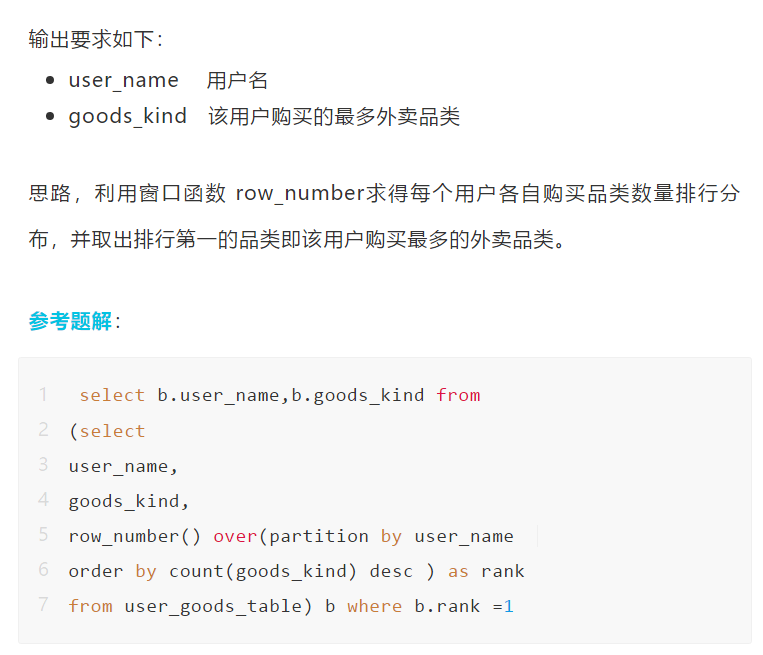

### 4.2.2.NTILE

* ntile函数可以对序号进行分组处理，将有序分区中的行分发到指定数目的组中。
* ntile(n) over(order by col1)表示根据col1进行分组，分成n组。
* 案例：导出支付金额在前20%的用户。
  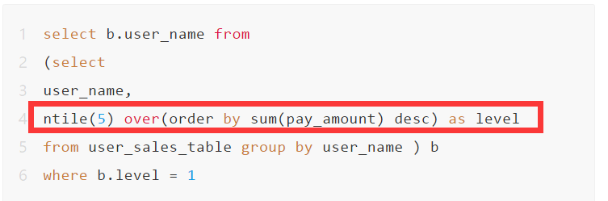

### 4.2.3.LEAD

* LEAD()是一个Window函数，它提供对当前行之后的指定物理偏移量的行的访问，对于将当前行的值与后续行的值进行比较非常有用。

* LEAD(return_value ,offset [,default]) OVER ( [PARTITION BY COL1 ORDER BY COL2)表示对return_value进行偏移（offset），如果offset超出分区范围，则该函数返回default。

* 案例：导出连续7天都登陆平台的重要用户。

  

  * CAST(col as new_type)函数用于将某种数据类型的表达式显式转换为另一种数据类型。
  * date_sub(date,interval )函数将从一个日期/时间值中减去一个时间值（时间间隔）。

# 5.如何处理实际问题

## 5.1.导入数据

### 1.导入sql文件

* 【server】-【data import】
  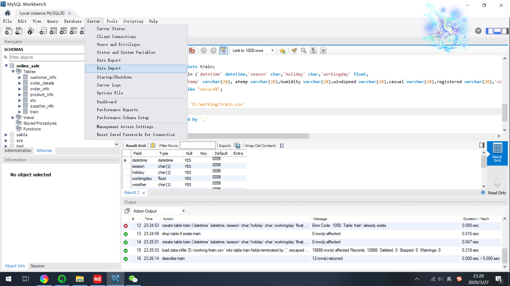

### 2.导入csv文件

* 新建表格，设置字段。
  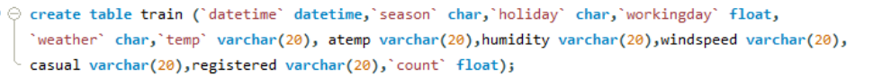
* load data infile "csv文件名" into table
  "工作表名"
  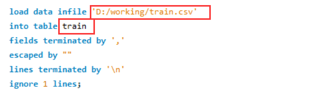