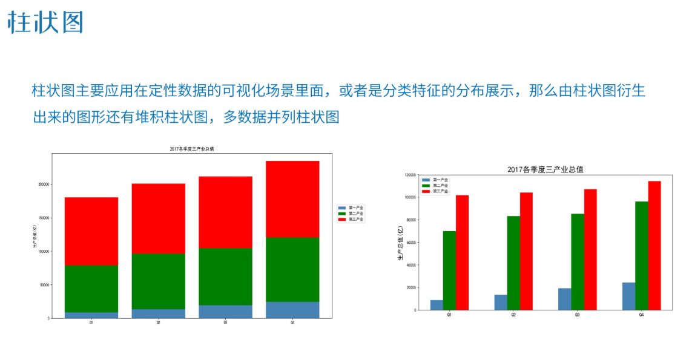
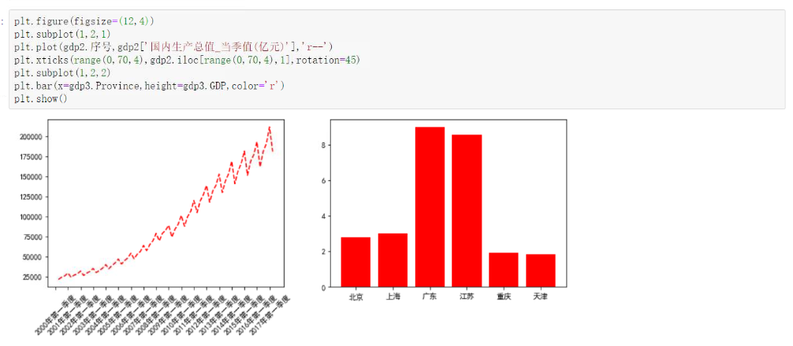

> * matplotlib：用于数据可视化的基础模块。
> * scikit-learn：机器学习专用库，提供了完善的机器学习工具箱。
> * seaborn：用于绘制更加精致的图形。
> * scipy：数值分析，例如线性代数，计分和插值等。
> * statsmodels：常用于统计建模分析。

***导入绘图数据库：import matplotlib.pyplot as plt***

# 1、matplotlib绘图基础

1. 保证Jupyter正常显示图形：

* %matplotlib inline

1. 画个简单的图形：

* plt.plot（x,y,lw,'c,marker,ls',markersize,markeredgecolor,markerfacecolor,label）

3. 解决中文乱码问题：

* plt.rcParams['font.sans=serif']=['SimHei']>用来正常显示中文标签
* plt.rcParams['axes.unicode_minus']=False>用来正常显示负号

4. 画带有图例的图形

* plt.legend(loc='best')
  

5. 画布/标题/xy轴设置/储存图片
   

# 2、简单图形绘制

## 2.1、饼图：plt.pie

## 2.2、条形图：plt.bar

## 2.3、直方图：plt.hist

## 2.4、散点图：plt.scatter

# 3、图形基本设置

* 图例设置：plt.legend
* 获取画布并修改：plt.gcf、plt.figure
* 设置网格线：plt.grid
* 设置x、y轴的参考线：plt.axvline、plt.axhine
* 设置x、y轴的参考区域：plt.axvspan、plt.axhspan
  

# 4、统计图形实战

## 4.1、柱状图

* 结合pd.pivot_table和pd.crosstab函数制作堆叠的柱状图。
* 采用bottom参数进行堆叠。

## 4.2、直方图

* 直方图的绘制和bins的划分息息相关，bins不同，绘制出的直方图会有很大区别。
* 直方图内同一个bin中的样本具有相等的概率密度，增加bin的数量有利于更精确地展现变量的分布。
* 当bin增加到样本最大值时，样本中未出现的值概率为0，导致概率密度函数不连续，因此，可以借助核密度图进行判断（Kernel Density Estimation(KDE)）。
  

## 4.3、箱线图

## 4.4、散点图

* 采用for循环进行多类型散点图制作
  

## 4.5、折线图

# 5、完善统计图形

## 5.1、图例使用

## 5.2、画布移动

## 5.3、标题设置

## 5.4、图形添加内容

# 6、图形样式高级操作

## 6.1、绘制双坐标轴

## 6.2、绘制多个图形

* 采用subplot函数，简单易懂。
  
* 采用subplot2grid函数，和subplot类似，只是区域规划机制不同。
  
  