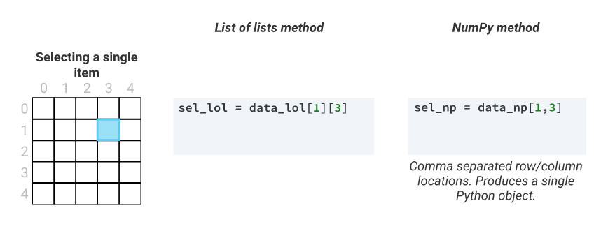
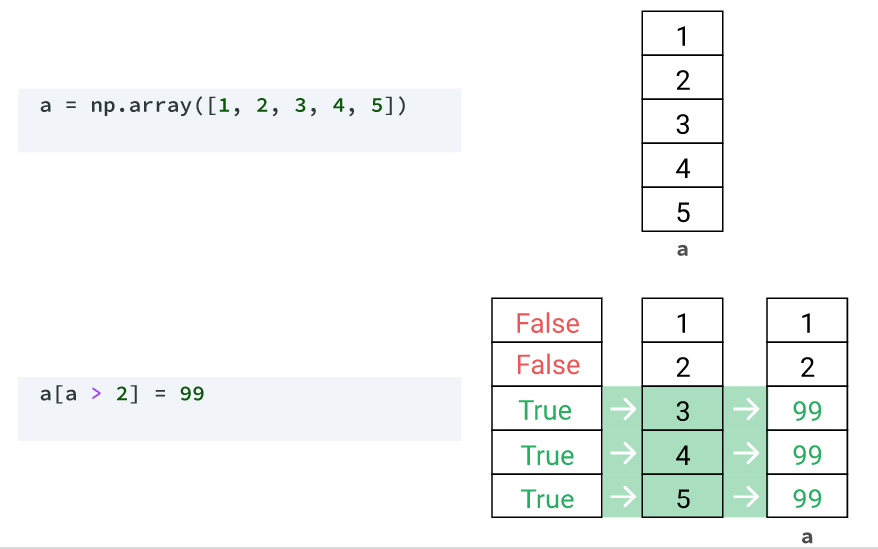
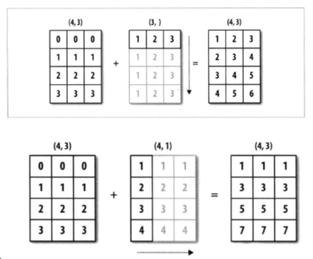

# 写在最前的话

> * Numpy是数据科学计算的基础模块，用于数值计算。
> * Numpy基于数组计算/向量化计算，比Python自带的数据结构如列表等要速度快很多，如[3,4,5]+1>>[4,5,6]，这是列表做不到的。
> * NUMPY拥有很多高级函数，可以对数组、列表等数据结构进行高效的处理。
> * 我们一般用到的都是二维数组，即2d ndarray，其中axis=0表示竖向操作（即对行进行操作），axis=1表示横向操作（即对列进行操作），切勿搞错。

***导入数据库：import numpy as np***
***读取文件： np.genfromtxt('nyc_taxis.csv',delimiter = ',', skip_header = 1)***

# 1、Numpy基础知识

## 1.1、数组创建

| 函数                                           | 用法                                                         | 举例                                                     |
| ---------------------------------------------- | ------------------------------------------------------------ | -------------------------------------------------------- |
| np.array                                       | 自定义创建数组                                               | np.array([[1,2,3,4],[5,6,7,8],[9,10,11,12]],dtype='int') |
| np.arange(n1,n2,step)                          | 创建给定区间内步长相等的一维数组                             | np.arange(1,10,0.5)                                      |
| np.linspace(n1,n2, num，endpoint=true)         | 创建给定区间和元素数量的等差一维数组                         | np.linspace(0,10,11)                                     |
| np.logspace(n1,n2, num，endpoint=true,base=10) | 创建以对数刻度均匀间隔的一维数组                             | np.logspace(0,10,11,base=2)                              |
| np.zeros(shape,dtype)、np.ones(shape,dtype)    | 创建给定形状和类型的全0数组，类似的还有np.ones、np.full      | np.zeros([2,3],dtype='int')                              |
| np.zeros_like(dnarray,dtype)                   | 创建与dnarrray形状相同的全0数组，类似的还有np.ones_like、np.full_like | np.zeros_like(d,dtype='int')                             |
| np.eye(num)                                    | 创建给定列数的二维单位对角矩阵，对角线上是1，其他地方是0。   | np.eye(6)                                                |
| np.diag(dnarray)                               | 创建dnarray的二维对角矩阵，对角线上是dnarry的元素，其他地方是0。 | np.diag([2,3,4])                                         |
| np.random.random(shape)                        | 创建指定形状的随机数数组                                     | nprandom.random((4,5))                                   |

## 1.2、数组属性

| 属性             | 用法                       | 举例                                 |
| ---------------- | -------------------------- | ------------------------------------ |
| ndarray.ndim     | 查看数组的维度数           | np.array([[1,2,3],[4,5,6]]).ndim     |
| ndarray.shape    | 查看数组的形状             | np.array([[1,2,3],[4,5,6]]).shape    |
| ndarray.size     | 查看数组的元素数量         | np.array([[1,2,3],[4,5,6]]).size     |
| ndarray.dtype    | 查看数组的数据类型         | np.array([[1,2,3],[4,5,6]]).dtype    |
| ndarray.itemsize | 查看数组每个元素的字节大小 | np.array([[1,2,3],[4,5,6]]).itemsize |

------

***注：“=”和“.copy”的区别***

| 拷贝方式                 | 说明                                   | 举例                                                         |
| ------------------------ | -------------------------------------- | ------------------------------------------------------------ |
| dnarray2=dnarray1        | 浅拷贝，视图上修改，原数据也会根据改变 | dnarray1=np.array([1,2,4])>>dnarray2=dnarray1 >>dnarray2[0]=3>>dnarray1 |
| dnarray2=dnarray1.copy() | 深拷贝，新数组修改，原数据不会改变     | dnarray1=np.array([1,2,4])>>dnarray2=dnarray1 .copy()>>dnarray2[0]=3>>dnarray1 |

## 1.3、索引和切片

### 1.3.1、连续索引

#### 1.3.1.1、一维数组索引和切片

* 一维数组索引和列表类似，但处理速度更快

| 索引方式                    | 用法                         | 举例                                  |
| --------------------------- | ---------------------------- | ------------------------------------- |
| ndarray[index]              | 索引指定元素                 | np.array([1,2,4])[0]                  |
| ndarray[index1:index2]      | 索引指定区间，左闭右开       | np.array([1,2,4])[0:2]                |
| ndarray[index1:index2:step] | 索引指定间距的区间，左闭右开 | np.array([1,2,4,5,7,8,9,3,10])[0:5:2] |

| 修改方式                               | 用法               | 举例                                                  |
| -------------------------------------- | ------------------ | ----------------------------------------------------- |
| ndarray[index] =                       | 修改指定元素       | d=np.array([1,2,4])>>d[0]=3>>d                        |
| ndarray[index1:index2]=[n1,n2...]      | 修改指定区间       | d=np.array([1,2,4])>>d[0:2]=[1,3]>>d                  |
| ndarray[index1:index2:step]=[n1,n2...] | 修改指定间距的区间 | d=np.array([1,2,4,5,7,8,9,3,10])>>d[0:5:2]=[2,3,6]>>d |

#### 1.3.1.2、多维数组索引和切片

| 索引方式                             | 用法                                           | 举例                                                      |
| ------------------------------------ | ---------------------------------------------- | --------------------------------------------------------- |
| ndarray[axis]                        | 索引指定行数                                   | d=np.arange(0,10,0.5).reshape(4,5)>>d[0]                  |
| ndarray[row_n1:row_n2,col_n1:col_n2] | 索引二维数组的指定元素或切片                   | d=np.arange(0,10,0.5).reshape(4,5)>>d[0:1,2]              |
| ndarray[axis1,axis2,...]             | 索引指定元素，等同于ndarray[axis1][axis2][...] | d=np.arange(0,10,0.5).reshape(4,5)>>d[0,0]                |
| ndarray[ : , : , : :step]            | 索引指定区间                                   | d=np.arange(0,10,0.5).reshape(4,5)>>d[:,2:4]              |
| ndarray[criteria]                    | 对数组进行条件索引，输出一维数组结果           | d=np.arange(0,10,0.5).reshape(4,5) >>d[(d>=3.5) & (d<=7)] |

### 1.3.2、花式索引

| 花式大法                         | 说明                             | 举例                                                         |
| -------------------------------- | -------------------------------- | ------------------------------------------------------------ |
| dnarray[[ , ,...]]               | 索引并排列第一维的指定行数       | d=np.arange(0,10,0.5).reshape(4,5)>>d[[1,3]]                 |
| dnarray[[ , ],[ , ],...]         | 索引并排列指定维的指定行数或元素 | d=np.arange(0,10,0.5).reshape(4,5)>>d[[1,3],[0,4]]           |
| dnarray[np.ix_([ , ],[ , ],...)] | np.ix_表示交叉的元素数组         | d=np.arange(0,10,0.5).reshape(4,5)>>d[np.ix_([1,3],[0,4])]#等同于d[[1,3]][:,[0,4]] |

### 1.3.3、数组修改

| 赋值大法              | 说明               | 举例                                         |
| --------------------- | ------------------ | -------------------------------------------- |
| dnarray[criteria] = x | 对相应行列进行赋值 | d=np.arange(0,10,0.5).reshape(4,5)>>d[:,0]=1 |

# 2、Numpy高级用法

## 2.1、数组形状改变

### 2.1.1、普通形状改变

| 函数                                          | 用法                                                         | 举例                                                        |
| --------------------------------------------- | ------------------------------------------------------------ | ----------------------------------------------------------- |
| ndarray.reshape( , ,...)                      | 展示数组形状的改变，只返回视图，不改变原数组                 | d=np.arange(0,10,0.5).reshape(4,5)>> d2=d.reshape(2,10)>>d2 |
| ndarray.resize( , ,...)                       | 改变数组的形状                                               | d=np.arange(0,10,0.5).reshape(4,5) >>d.resize(2,10)>>d      |
| ndarray.shape=( , ,...)                       | 改变数组的形状                                               | d=np.arange(0,10,0.5).reshape(4,5) >>d.shape=(2,10)>>d      |
| ndarray.ravel(order='c') /ndarray.reshape(-1) | 将ndarray数组展平为一维数组，order='c'(默认）则横向展平，order='F'则竖向展平,在函数基础上改变元素，原数组视图和结果均发生改变。 | d=np.arange(0,10,0.5).reshape(4,5)   >>d.ravel()            |
| ndarray.flatten(order='c')                    | 和ndarray.ravel类似，不过仅为过程视图，在函数基础上改变元素，原数组结果不改变。 | d=np.arange(0,10,0.5).reshape(4,5) >>d.flatten()            |

***注：n维数组形状进行变化，若n-1维都已知，那么Python会自动指定未知维度。如：d.shape=(2,2,5)等同于d.shape=(2,2,-1)。***

### 2.1.2、花式形状改变

| 函数                             | 用法                                                         | 举例                                                         |
| -------------------------------- | ------------------------------------------------------------ | ------------------------------------------------------------ |
| dnarray[ : ,np.newaxis]          | 一维数组变二维数组                                           | d2=np.arange(10)>>d2[np.newaxis,:].shape                     |
| np.hstack(( , ,...))             | 按水平方向合并，列数必须相同                                 | d1=np.array([1,2,3]) >>d2=np.array([3,4,6]) >>np.hstack((d1,d2)) |
| np.vstack(( , ,...))             | 按垂直方向合并，行数必须相同                                 | d1=np.array([1,2,3]) >>d2=np.array([3,4,6]) >>np.vstack((d1,d2)) |
| np.concatenate(( , ,...),axis= ) | 按指定轴合并，axis=0(默认)沿垂直方向合并，axis=1沿水平方向合并。 | d1=np.array([[1,2,3]]) >>d2=np.array([[3,4,6,4]]) >>np.concatenate((d1,d2),axis=1) |
| np.tile(dnarray,( , ,...))       | 通过重复dnarray数组的对应轴创建新的数组                      | d1=np.array([[1,2],[3,4]])>>np.tile(d1,(2,3))                |

## 2.2、ufunc广播机制

* ufunc通用函数，指能够对array中所有元素进行操作的函数。
* Broadcasting指对不同形状的array之间进行算术运算的方式。
* 不同形状的数组运算时，Numpy则会执行广播机制。

### 2.2.1、广播运算机制

* **一维数组**：广播运算时，按照行补齐方式，当行数不一致时，首先补齐行数，再进行运算。
* **二维数组**：列或行数一致时可进行广播运算，列数不一致则补齐列数进行运算；行数不一致则补齐行数运算。
* **多维数组**：情况更复杂，以有基准能补齐为原则进行广播运算。

### 2.2.2、通用函数

#### 2.2.2.1、一元函数

* 一元函数指仅接受一个数组参数，对数组的全部元素进行运算。

ndarray.min() to calculate the minimum valuendarray.max() to calculate the maximum valuendarray.mean() to calculate the mean or average valuendarray.sum() to calculate the sum of the values

| 函数                              | 用法                                                    | 举例                                         | 算术符运算                   |
| --------------------------------- | ------------------------------------------------------- | -------------------------------------------- | ---------------------------- |
| ndarray.min()/max() /mean()/sum() | 最小值、最大值、平均值、求和。                          | d1=np.array([-1,2,-3])>>d1.sum()             | --                           |
| np.abs()/np.fabs()                | 每个元素的绝对值，abs适用全部数据类型，fabs无法适用复数 | d1=np.array([-1,2,-3])>>np.abs(d1)           | --                           |
| np.sqrt()                         | 每个元素的平方根                                        | d1=np.array([9,4,16])>>np.sqrt(d1)           | d1=np.array([9,4]) >>d1**0.5 |
| np.square()                       | 每个元素的平方                                          | d1=np.array([3,2,4])>>np.square(d1)          | d1=np.array([3,2]) >>**2     |
| np.exp()                          | 每个元素以自然常数e为底的指数函数                       | d1=np.array([3,2,4])>>np.exp(d1)             | --                           |
| np.log()/np.log10() /np.log2()    | 每个元素以e为底（默认）、10为底、2为底的对数            | d1=np.array([100,1000,10])>>np.log10(d1)     | --                           |
| np.sign()                         | 每个元素的符号：1（正），0(0)，-1(负)                   | d1=np.array([-3,0,3])>>np.sign(d1)           | --                           |
| np.ceil() /np.floor()/np.round()  | 向上取整、向下取整、四舍五入                            | d1=np.array([-3.5,0.7,3.3])>>np.ceil(d1)     | --                           |
| np.isnan()                        | 返回一个布尔数组，指示每个元素是否是NaN(不是数字)       | d1=np.array([-3.5,0.7,np.nan])>>np.isnan(d1) | --                           |

***注：在判断函数后加上.any()/.all()会输出一个做整体判断的布尔型数据。如np.isnan([-3.5,0.7,np.nan]).all()会输出False，np.isnan([-3.5,0.7,np.nan]).all()会输出True。***

#### 2.2.2.2、二元函数

* 二元函数指仅接受两个数组参数，对数组的全部元素进行运算。

| 函数                                                         | 用法                                                         | 举例                                                         | 算术符运算 |
| ------------------------------------------------------------ | ------------------------------------------------------------ | ------------------------------------------------------------ | ---------- |
| np.add(ndarray1, ndarray2)                                   | 两个数组相加                                                 | d1=np.array([1,2,3])>>d2=np.array([4,5,6]) >>np.add(d1,d2)   | d1 + d2    |
| np.subtract(ndarray1, ndarray2)                              | 两个数组相减                                                 | d1=np.array([1,2,3])>>d2=np.array([4,5,6]) >>np.subtract(d1,d2) | d1-d2      |
| np.multiply(ndarray1, ndarray2)                              | 两个数组相乘                                                 | d1=np.array([1,2,3])>>d2=np.array([4,5,6])  >>np.multiply(d1,d2) | d1*d2      |
| np.divide(ndarray1, ndarray2)、np.floor_divide(ndarray1, ndarray2) | 两个数组相除、整除                                           | d1=np.array([1,2,3])>>d2=np.array([4,5,6])     >>np.divide(d2,d1) | d2/d1      |
| np.power(ndarray1, ndarray2)                                 | ndarray1的每个元素作为dnarray2每个元素的幂进行计算           | d1=np.array([1,2,3])>>d2=np.array([4,5,6])    >>np.power(d2,d1) | d2**d1     |
| np.maximum(ndarray1, ndarray2)、np.fmax(ndarray1, ndarray2)  | 元素最大值，fmax忽略nan值                                    | d1=np.array([7,2,3])>>d2=np.array([4,5,6]) >>np.maximum(d2,d1) | --         |
| np.mod(ndarray1, ndarray2)                                   | 除法的余数                                                   | d1=np.array([7,10,8])>>d2=np.array([4,5,6])        >>np.mod(d1,d2) | d1%d2      |
| np.greater(ndarray1, ndarray2)                               | 判断ndarray1的元素是否大于ndarray2，输出布尔型，类似的函数还有greater_equal、less、not_equal、equal等 | d1=np.array([10,8,11])>>d2=np.array([7,9,8]) >>np.greater(d1,d2) | d1>d2      |

#### 2.2.2.3、数组级别函数

* 数组级别的函数一般是一些统计函数，像聚合类的函数求和（sum）,求平均（mean）等。

| 函数                      | 用法                                                       | 举例                                                         |
| ------------------------- | ---------------------------------------------------------- | ------------------------------------------------------------ |
| np.sum(dnarray,axis= )    | 计算指定轴上的元素之和，axis=0竖向计算，axis=1水平计算     | d1=np.array([[7,10,8],[1,2,3]])>>np.sum(d1,axis=0)           |
| np.mean(dnarray,axis= )   | 计算指定轴上的元素平均值，axis=0竖向计算，axis=1水平计算。 | d1=np.array([[7,10,8],[1,2,3]])>>np.mean(d1,axis=0)          |
| np.std、np.var            | 计算标准差、方差                                           | d1=np.array([[7,10,8],[1,2,3]])>>np.std(d1,axis=0)           |
| np.percentile(a,q,axis= ) | 沿着指定的轴计算数据的第q百分位数，q=50则相当于median函数  | d1=np.array([[7,10,8],[1,2,3]])>>np.percentile(d1,[10,50],axis=0) |
| np.ptp(a,axis= )          | 沿着指定的轴计算值的范围（最大值-最小值），相当于max-min   | d1=np.array([[7,10,8],[1,2,3]])>>np.ptp(d1,axis=1)           |

#### 2.2.2.4、集合函数

| 函数                              | 用法                                             | 举例                                                         |
| --------------------------------- | ------------------------------------------------ | ------------------------------------------------------------ |
| np.unique(dnarray)                | 输出dnarray中的所有元素（剔除重复值）的一维数组  | d1=np.array([[7,2,8,3],[8,2,3,7]])>>np.unique(d1)            |
| np.intersectld(dnarray1,dnarray2) | 交集                                             | d2=np.array([4,8,6])>>d3=np.array([7,8,9]) >>np.intersect1d(d2,d3) |
| np.union1d(dnarray1,dnarray2)     | 并集                                             | d2=np.array([4,8,6])>>d3=np.array([7,8,9]) >>np.union1d(d2,d3) |
| np.in1d(dnarray1,dnarray2)        | dnarray1的每个元素是否被dnarray2包含，输出布尔型 | d2=np.array([4,8,6])>>d3=np.array([7,9,8])         >>np.in1d(d2,d3) |
| np.setdiff1d(dnarray1,dnarray2)   | dnarray1中不被dnarray2包含的元素                 | d2=np.array([4,8,6])>>d3=np.array([7,9,8]) >>np.setdiff1d(d2,d3) |
| np.setxor1d(dnarray1,dnarray2)    | 差集                                             | d2=np.array([4,8,6])>>d3=np.array([7,9,8]) >>np.setxor1d(d2,d3) |

## 2.3、搜索与排序

* **排序函数**：sort函数和argsort函数。
* **搜索函数**：agrmax和argmin函数。
* **条件复制**：np.where可以自定义返回满足条件的情况，np.extract返回满足条件的元素值。

| 功能         | 函数                               | 说明                                                         | 举例                                                         |
| ------------ | ---------------------------------- | ------------------------------------------------------------ | ------------------------------------------------------------ |
| 正向排序     | np.sort()                          | axis=-1（默认），沿着最后一个轴排序；axis=None，变成一维数组进行排序。 | d1=np.array([[7,10,8,1],[7,1,2,3]])>>np.sort(d1,axis=None)   |
| 反向排序     | np.array(sorted（ ,reverse= True)) | np.sort函数无reverse参数，用python自带的sorted函数转为列表进行排序。 | d1=np.array([[7,10,8,1],[7,1,2,3]]) >>n=np.array(sorted(np.ravel(d1),reverse= True)) |
| 正向排序索引 | np.argsort()                       | 数组进行正向排序（从小到大）后每个元素对应原数组的索引位置   | d1=np.array([[7,10,8,1],[7,1,2,3]])>>np.argsort(d1,axis=None) |
| 反向排序索引 | np.argsort()[::-1]                 | 数组进行反向排序（从大到小）后每个元素对应原数组的索引位置   | d1=np.array([[7,10,8,1],[7,1,2,3]])>>np.argsort(d1,axis=None)[::-1] |
| 最大索引     | np.argmax()                        | 最大值对应的索引位置，axis默认为None；axis=0，竖向比较；axis=1，水平比较 | d1=np.array([7,10,8,1])>>np.argmax(d1)                       |
| 最小索引     | np.argmin()                        | 最小值对应的索引位置，axis默认为None。                       | d1=np.array([7,10,8,1])>>np.argmin(d1)                       |
| 条件复制     | np.where(condition, [x, y])        | 根据条件，True返回x，False返回y                              | d1=np.arange(5,17,dtype=int).reshape(4,3) >>np.where(d1>10,'两位数','一位数') |
| 条件复制     | np.extract(condition, dnarray)     | 返回dnarray中条件为True对应元素的一维数组                    | d1=np.arange(5,17,dtype=int).reshape(4,3) >>np.extract(np.mod(d1,3)==0,d1).shape |

# 3、Numpy文件读写

## 3.1、文件读取和储存

* **文件读取**：使用genfromtxt函数和loadtxt函数读取txt和csv文件，两个函数功能类似，genfromtxt针对的更多是结构化数据。
* **文件存储**：一般存储为txt或者csv格式，使用savetxt（fname,data,delimiter,fmt）函数保存路径、数据、分隔符和格式。
* **特别说明**：数据分析中不常用numpy读取数据，掌握既可。

| 函数                                           | 用法                                                         | 举例                                                         |
| ---------------------------------------------- | ------------------------------------------------------------ | ------------------------------------------------------------ |
| np.genfromtxt(fname,delimiter= ,skip_header= ) | 读取有特定分隔符的文件，并跳过部分行数，类似的函数有np.loadtxt | data=np.genfromtxt(r"c:\data\第二章\123.txt',delimiter=','，skip_header=1) |
| np.savetxt(fname,data,delimiter,fmt)           | 存储文件，指定路径、数据、分隔符及存储格式（如存储为有2位小数的浮点型，则fmt='%.2f'） | data=np.savetxt(r"c:\data\第二章\1234.txt',data,delimiter=','，fmt='%.3f') |

## 3.2、字符串处理

* Numpy提供char模块处理列表的字符串，运用向量化运算方式。
* char模块的函数和python自带的字符串处理函数类似，但可以对数组、列表的所有元素同时运算，操作更简便、运行更快，如连接、切片、删除、替换等。
* 为求简便，下表函数以列表数据结构进行举例。

| 函数                                                         | 用法                                                         | 举例                                                         | PYthon自带                                                   |
| ------------------------------------------------------------ | ------------------------------------------------------------ | ------------------------------------------------------------ | ------------------------------------------------------------ |
| np.char.add(x1,x2)                                           | 连接字符串，x1和x2的形状必须相同                             | np.char.add(['中国','武汉'],['加油','加油'])                 | --                                                           |
| np.char.multiply(a,i)                                        | 对a中的元素进行i次复制连接                                   | np.char.multiply(['中国','武汉'],3)                          | [i*3 for i in ['中国','武汉']]                               |
| np.char.center(a, width,fillchar= )                          | 以a的元素居中，指定字符串宽度（width），两边填充指定的1个字符（fillchar）。 | np.char.center(['中国加油','武汉加油'],6,fillchar="❤")       | --                                                           |
| np.char.capitalize(a)                                        | a的所有元素首字母大写                                        | np.char.capitalize(["hello","love"])                         | [i.capitalize() for i in ["hello","love"]]                   |
| np.char.title(a)                                             | a的所有字母首字母大写                                        | char.title(['hello world','hello python'])                   | [i.title() for i in ['hello world','hello python']]          |
| np.char.lower(a)、np.char.upper(a)                           | a的所有元素转小写、转大写                                    | np.char.upper(['asde','derf'])                               | [i.upper() for i in ['asde','derf']]                         |
| np.char.join(x1,x2)                                          | x1的元素和x2的元素挨个连接                                   | np.char.join([':','_'],['hello','world'])                    | --                                                           |
| np.char.replace(a,old,new, count= )                          | 替换a中所有元素old的部分为new部分，count=None(默认）对元素所有old进行替换，count=num规定替换的old个数 | np.char.replace(['我要好好学数据分析,好好学', '我要好好学Python,好好学'],'好好学','认真学',count=1) | [i.replace('好好学','认真学',1) for i in ['我要好好学数据分析,好好学','我要好好学Python,好好学']] |
| np.char.strip(a,chars= )、np.char.rstrip(a, chars= )、np.char.lstrip(a, chars= ) | 删除前导或后置字符，chars默认为空格。rstrip只删除后置（从右边right），lstrip只删除前导（从左边left） | np.char.strip(["-hello","love-"],'-')                        | --                                                           |
| np.char.split(a,sep= ,maxsplit= )                            | 以sep分割a中每个元素，maxsplit默认等于None                   | np.char.split(['Mary,Jone, Peter','Alice,Bob,Tom'],sep=',')  | --                                                           |
| np.char.find    (a,sub,start= ,end= )                        | 找到a每个元素中sub字符串的最低索引，输出索引数组，可利用start和end进行元素切片 | np.char.find(['asde','deasrf', 'hdekas','hdehh'],'as')       |                                                              |
| np.char.count(a, sub, start=0, end=None)                     | 计算a中每个元素包含sub字符串的次数，可利用start和end进行元素切片 | np.char.count(['中国武汉','亚洲中国'],'武汉')                | --                                                           |
| np.char.islower(a)                                           | 判断函数，判断a中每个元素是否都是小写，输出布尔型，类似的还有isalnum、isalpha、isdigit、isupper等 | np.char.islower(['love','worlD','EARTH'])                    | --                                                           |
| np.char.startswith(a, prefix, start= , end= )、np.char.endswith (a, suffix, start= , end= ) | 判断函数，判断a中每个元素是否以prefix开头/以suffix结尾，输出布尔型，可利用start和end进行元素切片 | np.char.endswith(['中国武汉','亚洲中国'],'武汉')             | --                                                           |

***<u>注：如果觉得每次都要写np.char.很麻烦，可以在一开始使用该模块写：from numpy import char，之后调用函数写char.就可以。***

# 4、Numpy统计计算

## 4.1、随机数生成

* 随机数通过np.random函数生成伪随机数，代码每次运行，结果都不一样。
* 为了保持结果一致，需要使用np.random.seed函数固定初始化种子。

| 函数                                         | 用法                                                         | 举例                                                         |
| -------------------------------------------- | ------------------------------------------------------------ | ------------------------------------------------------------ |
| np.random.seed(seed)                         | 制定随机数生成器种子，以保证随机数函数运行结果一致。seed可以随便定义，无要求。 | np.random.seed(1)                                            |
| np.set_printoptions(precision= ,threshold= ) | 设置numpy的打印格式，precision表示浮点数输出的小数位数，threshold表示摘要输出时的元素阈值，其他参数可以输入help(np.set_printoptions)查询 | #设置显示为浮点型：np.set_printoptions(suppress=True)>> pd.set_option ('display.float_format',lambda x: '%.2f'% x) |
| np.random.random(size)                       | 生成size形状的0-1之间的随机浮点数                            | np.random.random((2,3))                                      |
| np.random.rand(d1,d2,...)                    | 生成（d1,d2,...）形状的0-1之间服从均匀分布的随机浮点数，和random函数类似 | np.random.rand(2,3)                                          |
| np.random.randint(low,high,size)             | 生成[low,high)之间size形状的随机整数                         | np.random.randint(3,18,(2,3))                                |
| np.random.uniform(low,high,size)             | 生成[low,high)之间size形状的均匀分布随机浮点数，low默认等于0，high默认等于1 | np.random.uniform(3,18,(2,3))                                |
| np.random.normal(loc,scale,size)             | 生成均值为loc，标准差为scale，形状为size的正态分布随机数。loc默认为0，scale默认为1。 | np.random.normal(3,18,(2,3))                                 |
| np.random.randn(d1,d2,...)                   | 生成均值为0，标准差为1，形状为(d1,d2,...)的标准正态分布随机数。 | np.random.randn(2,3)                                         |
| np.random.shuffle(a)                         | 对a的所有元素进行随机重新排序，原数组a发生改变。             | d=np.array([2,3,4,7,8,10])>> np.random.shuffle(d)>>d         |
| np.random.permutation(a)                     | 对a的所有元素进行随机重新排序，生成视图，原数组a不发生改变。 | d=np.array([2,3,4,7,8,10])>> d1=np.random.permutation(d)>>d1 |

## 4.2、线性代数

| 函数                  | 用法                                                         | 举例                                                         |
| --------------------- | ------------------------------------------------------------ | ------------------------------------------------------------ |
| np.dot(a,b)           | a和b数组的点积。a、b若均为一维数组，dot就是ab各元素相乘后的总和。a、b若均为二维数组，dot就执行矩阵运算（a的行数必须等于b的列数） | a=np.arange(0,10).reshape(5,2) >>b=np.arange(0,10).reshape(2,5) >>np.dot(a,b) |
| np.transpose(a)       | 将a进行矩阵转置，列转成行                                    | a=np.arange(0,10).reshape(5,2) >>np.transpose(a)             |
| np.linalg.inv(a)      | 求a的逆矩阵                                                  | np.linalg.inv([[1,2],[3,4]])                                 |
| np.diag(a,k= )        | 取出a对角线的元素,k=0（默认）取左对角线                      | np.diag([[1,2],[3,4]])                                       |
| np.linalg.solve(a,b ) | 解一个线性矩阵方程                                           | a=np.array([[39],[34],[36]]) >>b=np.random.randint(1,4,(3,3)) >>np.set_printoptions(suppress= True) >>np.linalg.solve(b,a) |