# 写在前面的话

> * Pandas是专门做数据处理和分析的，拥有许多各种复杂的函数。
> * Pandas功能强大，支持类似于SQL的数据处理。
> * Pandas的底层依赖于Numpy，是在Numpy的基础上发展而来。Pandas的主要数据结构是DataFrame，类似于numpy的二维数组。
> * panda比numpy更适合处理数据的特性之一是它对字符串（数组要求数据必须同一类型）、列和行标签的支持。

***设置显示的小数点数：pd.set_option('display.float_format', lambda x: '{:.3f}'.format(x))***

***设置显示格式：
pd.set_option('display.max_columns', None)
pd.set_option('display.max_rows', None)***

***导入数据库：import Pandas as pd***

# 1、Pandas基础知识

## 1.1、常用数据结构

* **Series**：由一组数据以及一组与之对应的数据标签（即索引组成）；可以通过pandas.Series来创建Series，每个Series可以看成是DataFrame的一个列。
* **DataFrame**：Pandas基本数据结构，类似excel中的表格形式；既有行索引、列索引，相当于多个Series。

### 1.1.1、Series创建与属性

| 函数                                     | 用法                                                         | 举例                                                         |
| ---------------------------------------- | ------------------------------------------------------------ | ------------------------------------------------------------ |
| pd.Series(data= ,index= ,dtype= ,name= ) | 创建Series，其中data可以为列表、一维数组或字典；index表示索引，必须与数据等长；dtype表示数据类型；name表示对象名称 | s=pd.Series(np.array([1,2,3,4,5,6]),index=('a','b','c','d','e','f'),dtype=int,name='this is a Series') |
| Series1.append(Series2)                  | 将Series2的数据加在Series1之后                               | s1=pd.Series({'father':40,'mother':38}) >>s2=pd.Series({'son':12,'daughter':5}) >>s1.append(s2) |
| Series.drop(index= ,inplace= ))          | 删除指定数据。inplace=False（默认）返回视图；inplace=True改变Series。 | s1=pd.Series({'father':40,'mother':38}) >>s1.drop('father',inplace=True)>>s1 |

| Series属性    | 用法             |
| ------------- | ---------------- |
| Series.values | 返回所有元素     |
| Series.index  | 返回索引         |
| Series.dtype  | 返回数据类型     |
| Series.ndim   | Series都是一维的 |
| Series.shape  | 返回series的形状 |
| Series.size   | 返回对象的个数   |

### 1.1.2、DataFrame创建与属性

| 函数                                    | 用法                                                         | 举例                                                         |
| --------------------------------------- | ------------------------------------------------------------ | ------------------------------------------------------------ |
| pd.DataFrame (data,index,dtype,columns) | 创建Dataframe。data可以为列表，二维数组和字典；index表示行索引，columns表示列索引。 | df2=pd.DataFrame({"name":['alice','tom','peter'], 'age':[23,26,30]},index(1,2,3)) >>df2['name']=np.array(np.char.capitalize(list(df2['name']))) >>df2 |

| DataFrame属性     | 用法                         |
| ----------------- | ---------------------------- |
| DataFrame.values  | 返回所有元素                 |
| DataFrame.index   | 返回索引                     |
| DataFrame.dtypes  | 返回每个变量的数据类型       |
| DataFrame.ndim    | 一般为二维                   |
| DataFrame.shape   | 一般为二维的形状             |
| DataFrame.size    | 返回对象的个数               |
| DataFrame.columns | 返回列标签，也可以设置列标签 |

## 1.2、数据获取和保存

* pandas内置了10多种数据源读取函数，常见的是csv和excel。
* pandas读取出来的数据直接就是数据框格式，方便后续的数据处理和分析。
* 读取csv文件时，需注意编码，常用编码有**utf-8、gbk、gbk2312**等。
  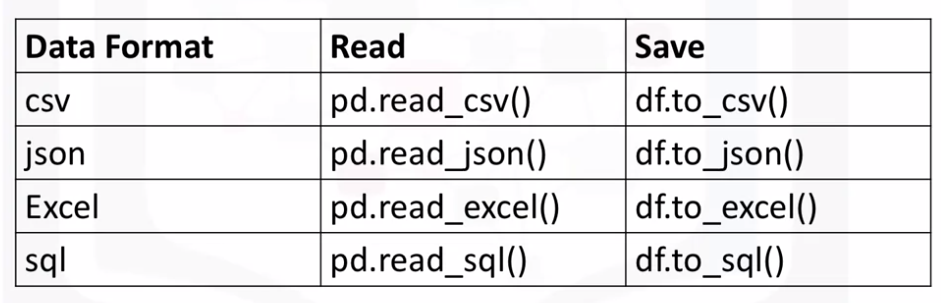

| 函数                                                         | 参数                                                         | 用法                                          | 举例                                                         |
| ------------------------------------------------------------ | ------------------------------------------------------------ | --------------------------------------------- | ------------------------------------------------------------ |
| os.getcwd()                                                  | 无参数                                                       | 获取当前工作目录（current working directory） | import os>>os.getcwd()                                       |
| os.chdir(path)                                               | path：路径                                                   | 改变当前工作目录为path，方便直接读取文件      | os.chdir('D:')                                               |
| pd.read_csv  （path,encoding= ,dtype= ,nrows= ,  sep= ,na_values= ,header= ） | 该函数有很多参数，常用的有：①encoding：编码，有中文字符使用utf-8、gbk、gbk2312；②dtype：规定数据类型，可使用字典对指定变量进行规定；③nrows：规定读取的行数，默认为None；④sep：分隔符，默认为','。⑤na_values：规定指定值显示为NaN；⑥header：规定第几行作为表头，默认第1行。 | 导入csv文件                                   | pd.read_csv('data.csv',encoding= 'gbk',dtype {'info_id':str,'ID':str},nrows=10 ,header=0) |
| pd.read_csv （path,index_col=[values]) >> df.index.name = None | ①index_col：规定某几列变量为索引。②df.index.name = None：移除索引列的标签名称。 | 导入csv文件，并设置特定的列为索引。           | df = pd.read_csv("f500.csv", index_col=0)>> df.index.name = None |
| pd.read_excel （path,sheet_name= ,encoding= ,dtype= ,nrows= ,sep= ,na_values= ,header= ） | 读取excel比csv多了一个参数，即工作表名称（sheet_name），sheet_name默认等于None，读取全部工作表。 | 导入excel文件                                 | pd.read_excel('data.csv', sheet_name=0, encoding='gbk',dtype {'info_id':str,'ID':str},nrows=10 ,header=0) |
| DataFrame.to_csv (path,index= ,encoding= )                   | index：是否保存索引，一般写False。                           | 保存为csv文件                                 | data4.to_csv ('data4.csv',index=False)                       |
| DataFrame.to_excel (path,index= ,encoding= )                 | index：是否保存索引，一般写False。                           | 保存为excel文件                               | data4.to_excel ('data4.xlsx',index=False)                    |

## 1.3、数据筛选

### 1.3.1、简单筛选

**loc的使用**
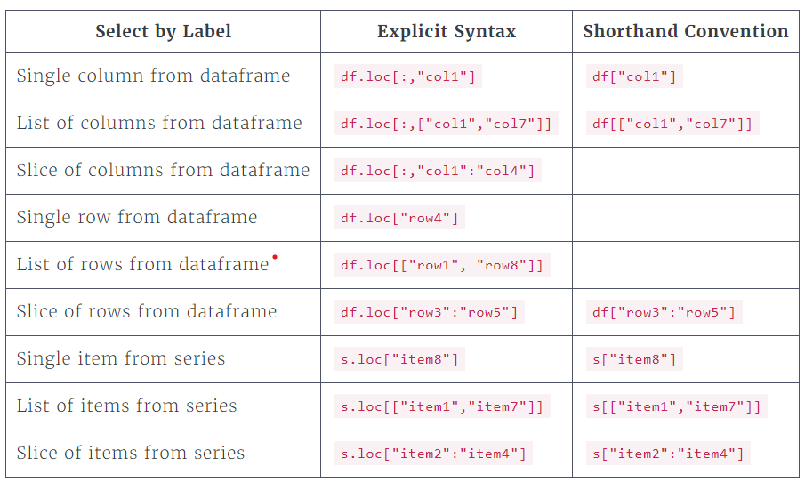
**iloc的使用**
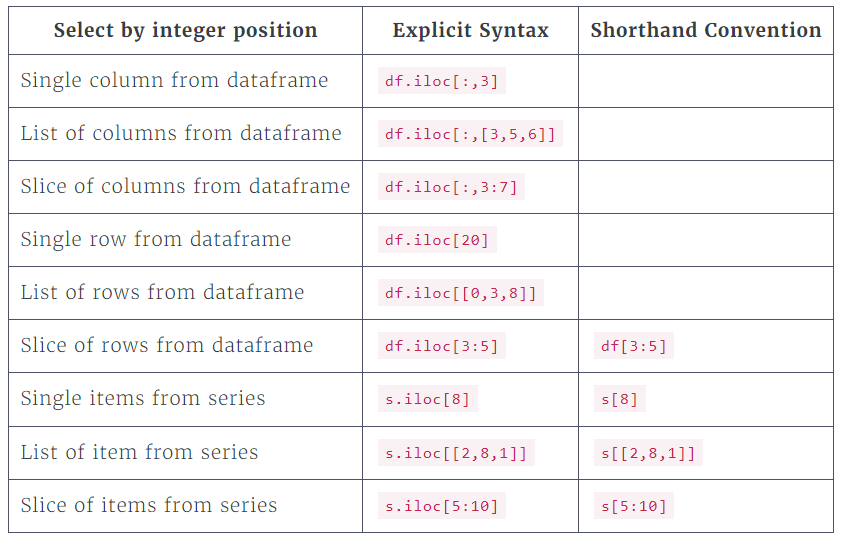

| 函数                                      | 用法                                                         | 举例                              |
| ----------------------------------------- | ------------------------------------------------------------ | --------------------------------- |
| DataFrame[column_label]                   | 筛选特定的列数据，可以是单个标签A1，也可以是列表[A1,A2]      | data[['info_id','ID']]            |
| DataFrame[row_label_slice]                | 筛选特定的行数据，必须行标签切片A1:A4                        | data[7:10]                        |
| DataFrame[column_label] [row_label_slice] | 筛选特定的列和行切片，可先写行，也可先写列，无特别规定。     | data[['info_id','ID']] [:50]      |
| DataFrame.loc[row_label, column_label]    | 根据标签筛选特定的行和列，可以是单个标签A1，切片A1:A4，列表[A1,A2]；注意不能写索引。 | data.loc[[7,10],['info_id','ID']] |
| DataFrame.iloc[row_index, column_index]   | 筛选特定的行和列，可以是单个索引，切片，列表。               | data.iloc[2:7,[2,3]]              |

### 1.3.2、条件筛选

* 常见条件有

  ：

  * 布尔条件：==, >, <, !=, &, |,~
    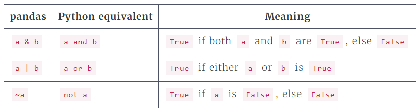

```
# 组合布尔条件（需要加括号）
big_rev_neg_profit = df.loc[(df["revenues"] > 100000) & (df["profits"] < 0),:]
```

* isnull/notnull：筛选出含缺失值/不含缺失值的数据，举例：df.loc[df["price"].isnull(),['house','year']]

| 函数                                          | 用法                                                         | 举例                                                         |
| --------------------------------------------- | ------------------------------------------------------------ | ------------------------------------------------------------ |
| DataFrame.loc[criteria,B]                     | 筛选特定条件下的列，criteria表示筛选条件，如'info_id'==200;B表示列标签，注意不能写索引。 | data.loc[data['info_id']==200,['info_id','name','ID']]       |
| DataFrame[values] [criteria]                  | 筛选特定条件下的列，criteria可以有多个，用‘&’连接即可；values可以是列表。 | data[(data['order_id']==458) & (data['amounts']>3)] [['order_id','amounts','dishes_name']] |
| DataFrame[values].between (n1,n2,inclusive= ) | 规定数字型变量的筛选区间，inclusive=True（默认）包含n1和n2，输出布尔型 | data[(data['order_id']==458) & (data['amounts']. between(0,30,inclusive=True))] [['order_id','amounts','dishes_name']] |
| DataFrame[values].isin ([str1,str2,...])      | 规定字符型变量的筛选区间，筛选变量中与(str1,str2,...)字符相匹配的值。 | data[data['dishes_name'].isin(['内蒙古烤肉','蒜香包'])] [['order_id','amounts','dishes_name']] |
| DataFrame[values]. str.contains(str)          | 规定字符型变量的筛选区间，筛选变量中含有str字符的值。        | data [data['dishes_name'].str.contains('烤')] [['order_id','amounts','dishes_name']] |

### 1.3.3、增删改查

| 功能       | 函数                                                         | 用法                                                 | 举例                                                         |
| ---------- | ------------------------------------------------------------ | ---------------------------------------------------- | ------------------------------------------------------------ |
| 增加列变量 | DataFrame['new_value']=                                      | 增加新变量                                           | Data['payment'] =data['price']*data['amount']                |
| 删除列变量 | DataFrame.drop([value1,value2,...], axis=1,inplace= True)    | 删除value1,value2,...等变量                          | data.drop('dishes_id',axis=1,inplace=True)                   |
| 删除列变量 | del DataFrame['value']                                       | 删除列变量，一次只能删一个                           | del Data['payment']                                          |
| 调整列顺序 | DataFrame.insert (n,value_name,Series)                       | 调整列顺序，先删后插                                 | Series=data['dishes_id'] >>data.drop('dishes_id', axis=1,inplace=True) >>data.insert(0,'dishes_id',series) |
| 删除指定行 | DataFrame.drop(labels=[n1,n2,...],axis=0,inplace= True)      | 删除[n1,n2,...]的行                                  | Data.drop([2,3],axis=0)                                      |
| 修改指定值 | DataFrame.loc[criteria,B]=                                   | 修改指定值                                           | data.loc[data['order_id']==458,'order_id'] =45800            |
| 列重命名   | DataFrame.rename(columns={'value_oldname':'value_newname'}, inplace=True) | 为指定列重名，也可以用df.columns = ['value_newname'] | data.rename(colunms={'price':'单价'},inplace=True)           |
| 行重命名   | DataFrame.rename(index={'index_oldname':'index_newname'}, inplace=True) | 为指定行重命名                                       | data.rename(index={0:0900},inplace=True)                     |
| 查看数据   | np.sum(DataFrame.isnull(),axis=0)                            | 查看每一列的缺失值数量                               | --                                                           |
| 替换值     | data.repalce(to_replace= ,value=)                            | 替换变量中指定的值                                   | df = pd.DataFrame({'A': [0, 1, 2, 3, 4],'B': [5, 6, 7, 8, 9], 'C': ['a', 'b', 'c', 'd', 'e']}) >>df.replace([0, 1, 2, 3], 4) |

# 2、Pandas高级操作

## 2.1、数据库数据读取和保存

* 访问数据库：使用pymysql和sqlalchemy建立连接

**导入相关的库：**

* import pymysql
* from sqlalchemy import create_engine

| 函数                                                         | 参数                                                         | 用法                    | 举例                                                         |
| ------------------------------------------------------------ | ------------------------------------------------------------ | ----------------------- | ------------------------------------------------------------ |
| create_engine ('mysql +pymysql: //user:password@IP:3306/test01') | ①mysql+pymysql：dialect[+driver]；②user：用户名；③password：密码；④IP：IP地址；⑤3306：端口号；⑥test01：数据库名 | 建立mysql连接，格式固定 | create_engine ('mysql+pymysql:// root:123456 @localhost:3306/test01') |
| pd.read_sql(sql,con)                                         | sql：指定的sql文件，eg:sql='select * from customer_info'；con：连接引擎，即create_engine函数 | 读取sql文件             | --                                                           |
| DataFrame.to_sql(name,con= ,if_exists= ,index= )             | ①name：命名；②con：连接引擎，即create_engine函数；③if_exists：如果表已存在，如何执行。if_exists='fail'：引发ValueError，if_exists='replace'：替换原来的表，if_exists='append'：追加在原来的表之后；④index： 是否将索引写入，默认为True，一般选False。 | 存为sql文件             | --                                                           |

***注：数据分析需要频繁读取文件数据，为了方便读取，可以直接建立一个函数。***
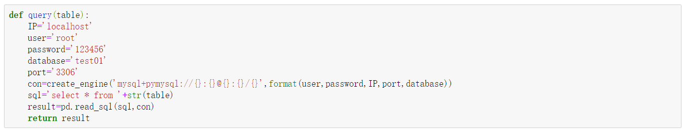

## 2.2、数据整合

* 数据整合又叫数据合并，将不同的数据合并在一起，集成在一张表上，有利于之后的分析。
* 常见的合并方法有**堆叠、按主键进行合并**，堆叠又分为横向堆叠和纵向堆叠，按主键合并类似于sql里面的关联操作。

| 功能       | 函数                                                         | 用法                                                         |
| ---------- | ------------------------------------------------------------ | ------------------------------------------------------------ |
| 横向堆叠   | pd.conca t([d1,d2,...],axis=1,join= )                        | 横向合并，join='inner',只显示重叠部分；join='outer',显示全部。 |
| 纵向堆叠   | pd.concat([d1,d2,...], axis=0,ignore_index=True )            | 纵向合并，ignore_index=True忽略之前的索引。                  |
| 重置索引   | DataFrame.reset_index (drop=True,inplace=True)               | 对数据表进行索引重置                                         |
| 按主键合并 | pd.merge(left=d1,right=d2, how= ,left_on= ,right_on=,sort=True ) | 左右表按指定变量合并。①how='left'，则匹配左表进行合并；how='right'，则匹配右表进行合并；how='outer',则全部输出，匹配不上的显示NaN；how='inner',则只输出匹配数据，其余不输出；②sort=True表示根据键进行排序；③right_on和left_on：合并的键，如果两者相同，可直接用on参数。 |
| 按索引合并 | pd.merge(left=d1,right=d2, how= ,left_index=True ,right_index=True) | 左右表按索引合并，现实操作不常用。                           |

## 2.3、层次化索引

* 在导入文件上时增加index_loc[values]参数设置多层索引。
* 利用loc函数元组进行多层索引，格式：loc[(index1,index2),values]。

# 3、Pandas分组聚合和透视图

## 3.1、数据排序

* 使用DataFrame.sort_values函数进行排序，并使用DataFrame.reset_index函数重置索引。

| 函数                                                         | 用法                   | 参数                                                         | 举例                                                         |
| ------------------------------------------------------------ | ---------------------- | ------------------------------------------------------------ | ------------------------------------------------------------ |
| DataFrame.sort_values ([values],ascending= ,na_position= ，inplace= ) | 对数据按values进行排序 | ①[values]：排序的变量，可以为单个字符或列表；②ascending：是否升序，True（默认）表示升序，False表示降序；③na_position：NaN值放置位置，'first'放最前，'last'（默认）放最后。 | data.sort_values ('Year',ascending=True, na_position='last', inplace=True) |

## 3.2、分组聚合

### 3.2.1、描述性统计

| 函数                                                         | 用法                                                         | 举例                                                         |
| ------------------------------------------------------------ | ------------------------------------------------------------ | ------------------------------------------------------------ |
| DataFrame.head(n)                                            | 查看Dataframe的前n行                                         | df2=pd.DataFrame({"name":['Alice','Tom','Peter'],'age':[23,26,30]},index=(1,2,3))>>df2.head(2) |
| DataFrame.tail(n)                                            | 查看Dataframe的最后n行                                       | df2.tail(2)                                                  |
| DataFrame.info()                                             | 查看数据基本信息，包括数据类型 、计数、是否有缺失值、储存空间 | df2.info()                                                   |
| DataFrame.describe()                                         | 统计数值型数据的基本信息，包括计数、平均值、标准差、百分位数、最小最大值 | df2.describe()                                               |
| DataFrame.describe(include=['object'])                       | 统计字符型数据基本信息，包括计数、频率最大字符等。           | df2.describe(include=['object'])                             |
| DataFrame.describe(include='all')                            | 统计所有数据的基本信息，包括数值和字符等。                   | df2.describe(include='all')                                  |
| Series.mean/max/min /quantile/median/count /value_counts/cumcount/unique | 定向查看Series数据的平均值/最大值/最小值/百分位数/中位数/计数/值计数/累计计数/取值范围。 | df2['Alice'].value_counts()                                  |
| DataFrame.mean/max/min /quantile/median/count /cumcount/unique/len | 定向查看df数据的平均值/最大值/最小值/百分位数/中位数/计数/累计计数/取值范围/长度。 | len(df2)                                                     |

### 3.2.2、分组运算

| 函数                                     | 参数                                                         | 用法                                                  | 举例                                                         |
| ---------------------------------------- | ------------------------------------------------------------ | ----------------------------------------------------- | ------------------------------------------------------------ |
| DataFrame.groupby ([values], as_index=), | values：用于分组的变量，可写成by=''; as_index指是否使用分组变量作为索引，默认为True | 使用变量进行分组。                                    | data[['Year','Sales','income']].groupby('Year')              |
| DataFrame.groupby ([values]).size()      | size:计算组的大小（数量）                                    | 即便变量分组后各组的数量                              | data[['Year','Sales','income']].groupby('Year').size()       |
| DataFrame.agg(func, axis=0)              | func:函数、字符、列表或字典；axis默认等于0。                 | 聚合查询多个数据                                      | group=data[['Year','Sales','income']].groupby('Year') >>group.agg([np.sum,np.mean]).loc[[1980,3490],('Sales',['mean','sum']) >>group.agg({Sales':np.sum,'income':[np.mean,np.median]}) |
| DataFrame.apply(func, axis=0)            | func:只能为函数；axis默认等于0。                             | 和agg函数类似，但func只能为函数，可以接lambda表达式。 | DataFrame.apply(lambda x: x[2]-x[3],axis=1)                  |
| DataFrame.transform (func,axis=0)        | func：函数、字符、列表或字典。                               | 对行和值进行操作，但无法进行聚合操作。                | data['Sales].transform(lambda x: x*2)                        |

***注：agg/apply/transform的区别：***

* agg：agg方法灵活，能够对分组对象进行相同的聚合，还可以选择不同的聚合方法。
* apply：apply可以进行聚合计划，还可以按行进行计算。
* transform：返回与数据同样长度的行，无法进行聚合计算。

## 3.3、透视表和交叉表

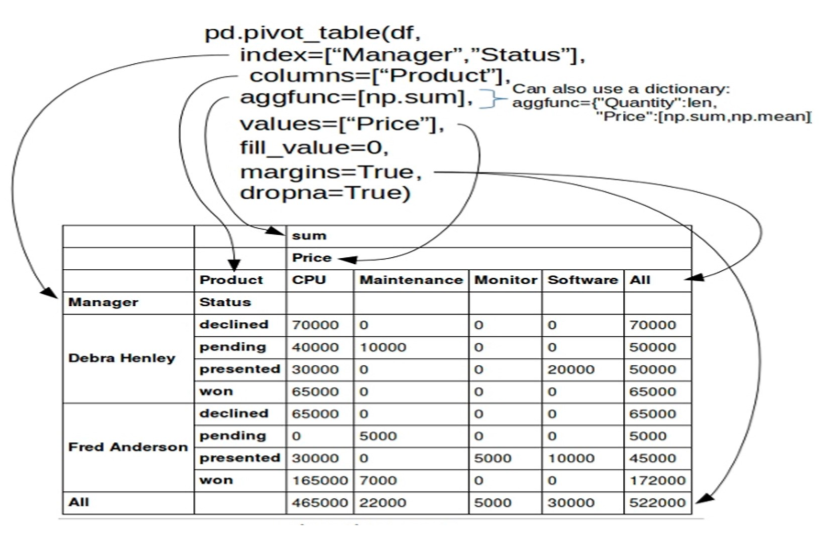

| 函数                                                         | 参数                                                         | 用法                                                         | 举例                                                         |
| ------------------------------------------------------------ | ------------------------------------------------------------ | ------------------------------------------------------------ | ------------------------------------------------------------ |
| pd.pivot_table(data,index,columns, value,aggfunc,fill_value,margins, margins_name= ) | ①index：行分组键，可以是列表；②columns：列分组键，可以是列表；③value：透视图统计的变量，只能为数值型；④aggfunc：聚合函数，默认为mean；⑤margins：是否需要总计。⑥fill_value：用来替代NaN的值。 | 用于对某个指定的变量进行数据透视                             | pd.pivot_table(data,index='Year', columns='Games',value='US_Revenue', aggfunc[np.mean,np.sum],fill_value=0, margins=True, margins_name='总计值') |
| pd.crosstab(index,columns,values, aggfunc,margins, margins_name,normalize) | 参数无data，normalize用于计算频率normalize='index'，计算行频率；normalize='columns'，计算列频率；normalize='all'，计算全部的频率。其余参数和pivot_table功能类似。 | 可以实现和pivot_table一样的功能，不过一般用来查看频率和频数(默认）。 | pd.crosstab(index=data['Platform'], columns=data['Game'],margins=True]) |

# 4、Pandas数据预处理

## 4.1、Pandas其他函数运用

### 4.1.1、数据类型转换（日期等）

* Pandas里基本数据类型有object、int64、float64、datetime64和timedelta[ns]。对应的Python数据类型看下图：
  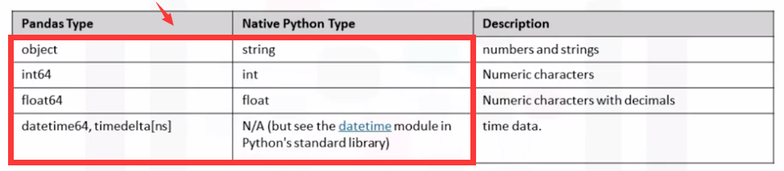

| 函数                                                         | 参数                                                         | 用法                                         | 举例                                                         |
| ------------------------------------------------------------ | ------------------------------------------------------------ | -------------------------------------------- | ------------------------------------------------------------ |
| pd.to_datetime (arg,format,errors)                           | ①arg：需要转化的参数，可以是多种形式；②errors：无法转化的表示，errors='coerce',无效值返回NaN；errors='raise'（默认）,无效值引发异常报错；errors='ignore',无效值返回原来的值。③format：参数格式，eg：%d%m%Y。 | 将变量转化为日期,返回视图。                  | data['time']=pd.to_datetime (data['time'],format='%Y年%m月',errors='coerce') |
| DataFrame.dt.date、DataFrame.dt.time                         | 无参数                                                       | 取出时间变量中的日期/时间。                  | data['date']=data['date'].dt.date                            |
| DataFrame.apply(lambda x: x.year)、DataFrame.apply(lambda x: x.month)、DataFrame.dt.year/month | 无参数                                                       | 取出时间变量中的年份、月份。                 | data['date']=data['date'].apply (lambda x: x.year)           |
| pd.datetime.today()                                          | 无参数                                                       | 当前日期和时间，精确到毫秒。                 | --                                                           |
| np.timedelta64(a,b)                                          | a：表示间隔或周期；b：表示单位，可以是'm'（分）,'h'(小时）,'D'（天）等。 | 用于控制时间间隔，间隔多少年/月/天/时/分/秒/ | (date_end-date_start)/np.timedelta64(1,'D')                  |
| DataFrame.astype(dtype)                                      | dtype：强制转换的数据类型或类别代码                          | 强制转换数据类型，输出视图。                 | data['price']= data['price'].str[:-1].astype('float')        |
| DataFrame.str.extract (pat, flags=0, expand=True)            | pat：正则表达式，需要提取的用括号包含。                      | 使用正则从字符数据中抽取匹配的数据           | data['Name'].str.extract(' ([A-Za-z]+).', expand=False)      |

***注：Numpy中区分了str和object类型，而pandas使用本机Python字符串，因此使用Numpy字符串函数直接处理pandas的'object'会报错，需要先将dtype转成str。***

### 4.1.2、数据抽样与计算

| 函数                                            | 参数                                                         | 用法                                                 | 举例                                                         |
| ----------------------------------------------- | ------------------------------------------------------------ | ---------------------------------------------------- | ------------------------------------------------------------ |
| DataFrame.sample (n,replace= )                  | n:抽样的行数；replace=False即不放回抽样。                    | 抽样                                                 | data.sample(n=5000,replace=False)                            |
| np.prod(ndarray,axis=1)                         | axis:作用轴                                                  | 计算给定轴上数组的乘积。                             | data['total_price'= data[['Quantity',Unitprice']].apply (np.prod,axis=1)（*相当于data['Quantity']* data['Unitprice']) |
| DataFrame.pct_change()                          | --                                                           | 计算当前元素与先前元素之间的百分比变化，即(x1-x2)/x1 | data['总价变化率']=data['total_price'].pct_change()          |
| DataFrame.rolling (window)                      | window:整数，设置滚动窗口的大小。                            | 提供滚动窗口的计算                                   | data['5天平均值']= data['total_price'].rolling(5).mean()     |
| DataFrame.shift (periods= ,fill_value= ,axis=0) | periods:整数，向下平移的大小；fill_value：填充值，默认为NaN；axis：移动的轴，默认为0。 | 按给定轴平移。                                       | data['总价变化率'=(data['total_price']-data['total_price'].shift(1)) /data['total_price'],即相当于pct_change函数。 |

## 4.2、数据清洗

### 4.2.1、重复值

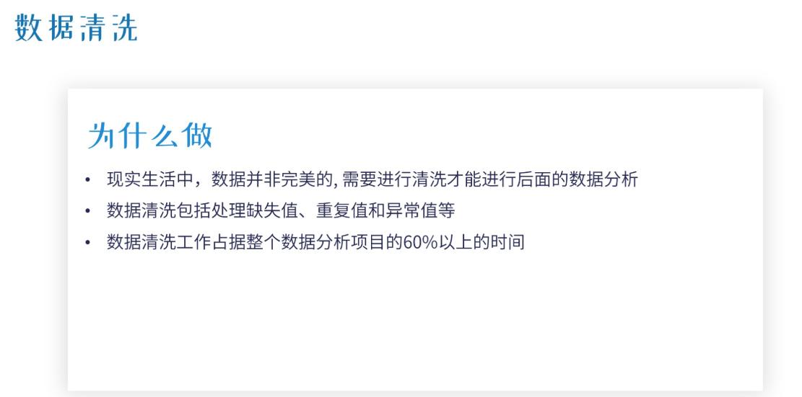

* 重复值一般采取删除法来处理。
* 但有些重复值不能删除，例如订单明细、数据或交易明细数据等。

| 函数                                                  | 参数                                                         | 用法                           | 举例                                           |
| ----------------------------------------------------- | ------------------------------------------------------------ | ------------------------------ | ---------------------------------------------- |
| DataFrame.duplicated (subset= ,keep= )                | ①subset：依据哪些变量判断是否是重复值，可以是列表；②keep：保留哪些结果为“True”，='first'(默认），保留第一个重复值为True；='last'，保留最后一个为True；=False，全部标记为'True'。 | 判断是否有重复行，返回布尔型。 | np.sum(data.duplicated (subset=['name','ID'])) |
| DataFrame.drop_duplicates (subset= ,keep= ,inplace= ) | 见DataFrame.duplicated                                       |                                |                                                |
| 根据subset，忽略索引，返回删除重复行的DataFrame       | --                                                           |                                |                                                |

### 4.2.2、缺失值

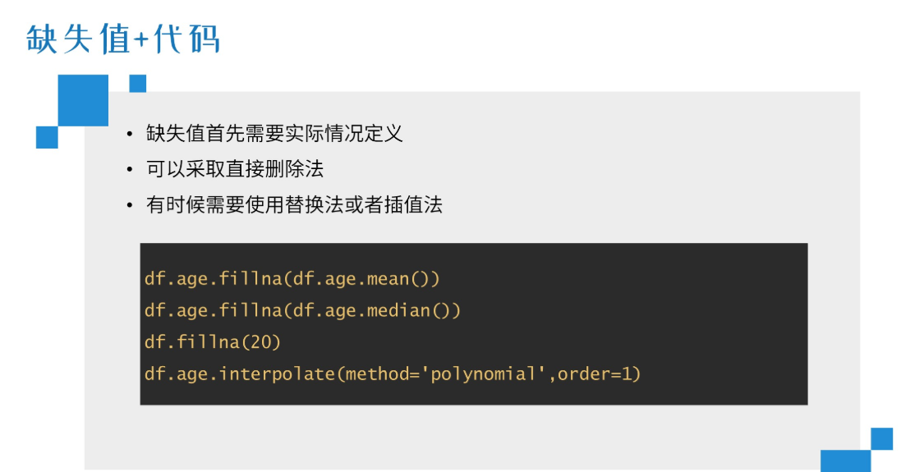

| 函数                                          | 参数                                                         | 用法                                                         | 举例                                                         |
| --------------------------------------------- | ------------------------------------------------------------ | ------------------------------------------------------------ | ------------------------------------------------------------ |
| DataFrame.isnull()                            | 无参数                                                       | 判断是否有缺失值，输出布尔型。                               | data.apply(lambda x: np.sum(x.isnull())/len(x), axis=0)      |
| DataFrame.dropna()                            | --                                                           | 不加参数，直接删除含有缺失值的行                             | data.dropna(inplace=True)                                    |
| DataFrame.dropna (how= ,subset= ,inplace= )   | ①how：='all'，只删除全部为NaN值的行；='any'，删除任何含有NaN值的行。②subset：数组或列表，可指定参照列 。 | 按条件删除有缺失值的行。                                     | data.dropna(how='any',subset=['gender'],inplace=True)        |
| DataFrame.fillna (value= ,inplace= ,method= ) | ①value：填充NaN值的值，可以是标量、字典和数据表。            | 填充NaN为指定值，如平均数（Mean）、中位数（Median）、众数（Mode）。②method：填补方法，='ffill',用上一行数据填补；='bfill'，用下一行数据填补； | data.gender.fillna (value=data.gender.mode()[0] /data.fillna (value={'gender':data.gender.mode()[0]}) |
| DataFrame.interpolate (method= ,axis= )       | method：插值方法，='linear'(默认），线性插值；='polynomial'，多项式插值 | 根据不同的方法在NaN处插入新值。                              | data.age.interpolate (method='polynomial',order=1)           |

### 4.2.3、异常值

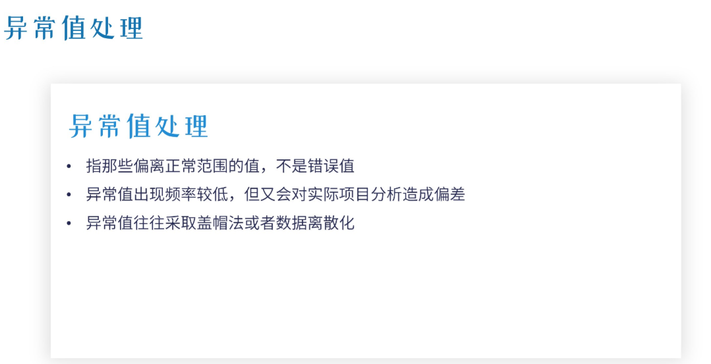

* 异常值识别：①：＞data.mean()+2*data.std() or <data.mean()-2*data.std() ；②>Q3+1.5*(Q3-Q1) or<Q1-1.5*(Q3-Q1)。
* 最大正常值替换法：data['value'>Q3+1.5*(Q3-Q1) ]=data['value'<Q3+1.5*(Q3-Q1) ].max()
* 分位数替换法：将大于99%分位数的值用99%分位数替换，小于1%分数位的值用1%分位数替换。

| 功能                       | 函数                        | 参数                                                         | 举例                                                         |
| -------------------------- | --------------------------- | ------------------------------------------------------------ | ------------------------------------------------------------ |
| 箱型图                     | DataFrame.Plot(kind='box')  | kind：画图种类                                               | data.counts.plot(kind='box')                                 |
| 直方图                     | DataFrame.Plot(kind='hist') | --                                                           | --                                                           |
| 将变量分成多个区间         | pd.cut(x= ,bins= ,labels= ) | ①x：用于分段的变量；②bins：分段数；labels：标签，数量需要和分段一样。 | pd.cut(data['counts'],4,labels=range(1,5))                   |
| 将变量按百分位分成多个区间 | pd.qcut(x= ,q= ,labels= )   | ①q：分位数数组                                               | pd.qcut(data['counts'],[0,0.25,0.5,0.75,1],labels=range(1,5)) |

# 5、神奇外挂

## 5.1、pandas_profiling

1.生成报告：data=pd.read_csv('train.csv')》data.profile_report(title='Data')
2.保存报告：data.profile_report(title='Data').to_file('Data.html')

## 5.2、关于计数

* 可以有多种方式计算字段的不重复值数
  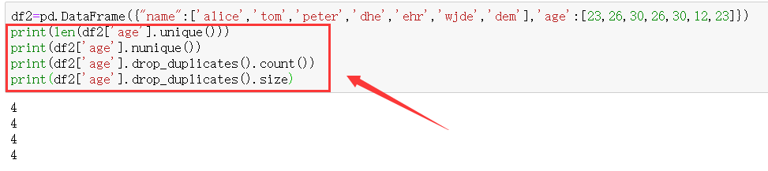
* nunique、len(unique())：这两个是numpy中的函数，因此必须指定字段名。
* drop_duplicates.count()则是pandas中的函数。
* size是dataframe的属性，也可以用于计数，不过不能加括号。

## 5.3、关于计算

* 差分操作DataFrame.diff(periods=1, axis=0)：即先进行数据表位移
  df.shift(self, periods=1, freq=None, axis=0)，接着用df-df.shift()即可得到。

