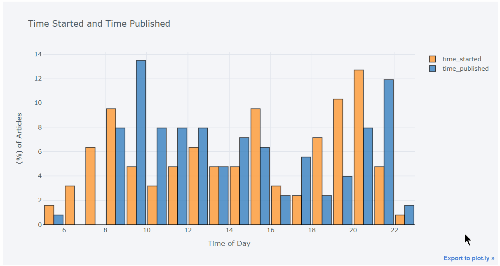
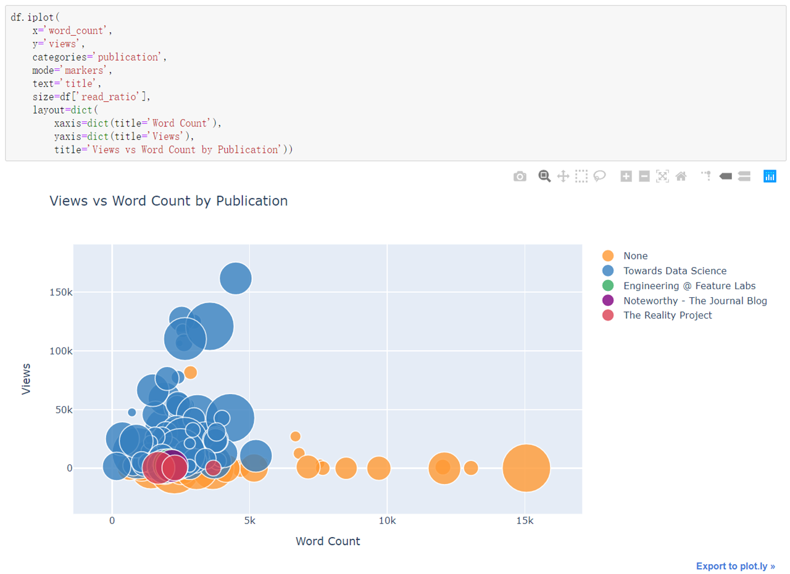

# 前言

> * 本文将介绍如何使用Plotly+Cufflinks更简便地制作出更好的图表。
> * 这是Github上一个大神发布的资料，本人学习之后觉得非常实用，所以和大家分享。需要查看代码的童鞋指路Github：https://github.com/WillKoehrsen/Data-Analysis
> * 本文中的所有代码都是使用Jupyter notebook完成的，在使用pip命令安装了plotly和cufflinks之后，可以import使用它们。

# 1、Plotly+Cufflinks是什么？

* Plotly Python包是Plotly公司开发的可视化软件的开源版本，是基于plotly.js构建的，而后者又建立在d3.js上。
* 因为Plotly不能直接接受numpy和pandas的数据结构，所以用一个名为cufflinks的封装器来使用Pandas数据可以减少数据处理工作。
* 这两个库的组合使用起来很简单，大部分时候可以用**一行代码**生成非常棒的图表，
  会比Matplotlib简单多了。
* 导入库：
  * import plotly.graph_objs as go
  * import cufflinks as cf
  * from plotly.offline import iplot,init_notebook_mode
  * init_notebook_mode(connected=True)
  * cf.go_offline(connected=True)

# 2、花样制作各式图表

> 直方图、箱线图、柱状图、散点图、折线图、饼图、散点矩阵、热力图、散点3D图、气泡3D图，全部都可以用简单的一行代码搞定！

## 2.1、直方图

* 直方图是绘制单一变量的首选图，下图是作者WillKoehrsen绘制的变量['Claps']直方分布图：

* 代码非常简单，就是在data之后加一个iplot后缀，并添加相应的参数。图表是交互式的，把鼠标放在bins可以获得相应数据。

### 2.1.1、分组直方图

* 绘制分组直方图只需要添加参数[barmode='group']即可，非常简便。
  
  

### 2.1.2、叠加直方图

* 绘制叠加直方图则添加参数[barmode='overlay']。
  

### 2.1.3、小结

* 代码：df['value'].iplot(kind='hist',bins= ,xTitle= ,yTitle= ,title= )
* 其他参数：linecolor、opacity（透明度）、bargap（间隔）、histnorm、barmode

## 2.2、柱状图

* 对于条形图，需要先应用聚合函数，将x轴变量设为索引，然后再使用iplot绘图。例如作者以['publication']进行分组并计算变量['fans']的数量，再进行图形展示：
  
* 如果绘制多个分类的柱状图，则相应添加多个y轴变量即可，非常简单！
  

### 2.2.1、双坐标轴

* 如果两个分组变量的范围相差太大，我们又想把它们放在同一个坐标轴上，则可以设立y2轴。
* 设立y2轴只需要添加参数secondary_y。
  

### 2.2.2、小结

* 代码：df.iplot(kind='bar',xTitle= ,yTitle= ,title= )
* 其他参数：secondary_y、secondary_y_title

## 2.3、箱线图

* 箱线图的制作和直方图类似，不过要把kind参数换成[kind='box']。
  
  

### 2.3.1、分类箱线图

* 如果我们需要制作分类箱线图，则需要先制作一个透视表。
  

### 2.3.2、小结

* 代码：df.ilpot(kind='box',xTitle= ,yTitle= ,title= )、df.pivot(columns= ,values= )
* 其他参数：colorscale、layout

## 2.4、散点图和折线图

* 制作散点图和折线图的话，和前面3个图不同，需要将kind参数更改为mode参数，不然会报错。
* x轴变量默认为索引，但可以通过参数[x=' ']进行更改。
  

### 2.4.1、增加拟合线

* 增加拟合线相关参数：bestfit=True
  

### 2.4.2、增加文字注释

* 利用text参数增加文字注释。
* 作者利用字符串格式化和HTML写了一个例子：
  

### 2.4.3、分类散点图

* 制作分类散点图可以通过categories参数添加：
* 此外，也可以通过size参数对散点做进一步的区分，但size参数所带变量必须是数值变量。
  

### 2.4.4、添加参考区域或参考线

* 使用hline和vline参数可以添加线，使用vspan和hspan参数可以添加区域，和Matplotlib语法是类似的~
  

### 2.4.5、小结

* 相关参数：bestfit、text、categories、symbol（散点形状设置）、size（散点大小）、xrange（x轴范围）、yrange（y轴范围）、hline（水平参考线）、vline（垂直参考线）、hspan（水平参考区域）、vspan（垂直参考区域）

## 2.5、散点矩阵和热力图

* 导入画图库：import plotly.figure_factory as ff
* 散点矩阵画图函数：ff.create_scatterplotmatrix()；热力图画图函数：ff.create_annotated_heatmap()
  

## 2.6、饼图

* 要制作饼图，需要先用聚合函数对变量进行分类，但不能设置分类变量为索引，否则无法画图。
  

## 2.7、3D图形

* 除了以上图形，plotly也可以画好看的3D图形，比如曲面图、3D散点图等。
  

# 3、总结

> * 比起Matplotlib和seaborn，Plotly可以快速地实现交互可视化，并输出令人愉悦的图形，让我们能更深入地探索数据细节。