写在前面的话

> * plotly是一个基于JavaScript的绘图库，可以绘制精致的动态交互图形，绘图结果默认保存成html文件，可以通过浏览器查看。
> * plotly不能直接接受numpy和pandas的数据结构，需要将数据转换成其可识别的数据结构。

**导入数据库：**
**1. import plotly as py**
**2. import plotly .graph_objs as go**
**3. from plotly .graph_objs import Scatter**
**4. from plotly .offline import iplot,init_notebook_mode**
**5. import cufflinks**
**6. cufflinks.go_offline(connected=True)**
**7. init_notebook_mode(connected=True)**

# 1、plotly基础知识

## 1.1、offline.plot和offline.iplot

* 使用plotly.offline.plot(data,filename='file.html')函数可以在本地新建一个HTML文件，并可以选择是否在浏览器中打开这个文件。
* 使用py.offline.init_notebook_mode()进行初始化，利用plotly.offline.iplot函数可在Jypyter notebook直接绘图。

## 1.2、简单绘图

* data.iplot(kind=' ',xTitle= ,yTitle= ,title= ,layout= )
  * 举例：叠加直方图：data['age','oder-time'].iplot(kind='hist',histnorm='percent',barmode='overlay')
  * 举例：添加文本注释：data.iplot(mode='lines+markers+text',text=text,y= ,opacity=0.8)
  * 举例：分类变量：data.iplot(x= ，y= ,categories= )

## 1.2、plotly绘图流程

1. 添加图轨数据，使用go.Scatter、go.Bar等函数
2. 设置画图布局，使用go.Layout函数
3. 集成图轨，布局数据，使用go.Figure函数
   4.绘制输出，使用offline.plot和offline.iplot函数。

# 2、常见图形绘制

## 2.1、折线图和散点图：

* **go.Scatter(x,y,mode,name,marker,line)：**
  * x----x轴数据
  * y----y轴数据
  * mode----线条（lines）、散点（markers）、线条加散点（markers+lines）
  * name----图例名称
  * marker/line----散点和线条的相关参数
* **go.Layout(title,xaxis,yaxis)**
  * title----标题
  * xaxis----控制x轴参数
  * yaxis----控制y轴参数
  * legend----设置图例位置和字体
    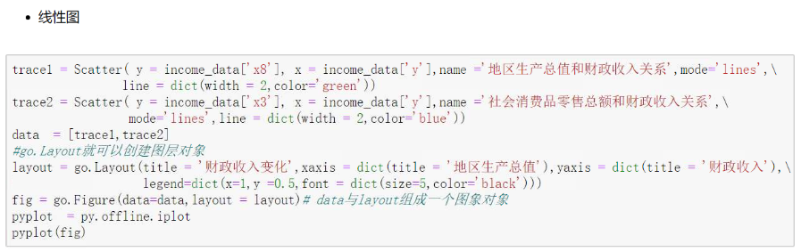

## 2.2、柱状图：

* go.Bar(x,y,marker,opacity)：
  * x----x轴数据
  * y----y轴数据
  * marker----设置图形的参数
  * opacity----透明度

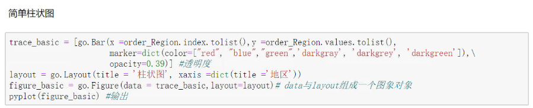

* **若需要制作柱状簇图，则制作多个分类图轨，并形成列表即可。**

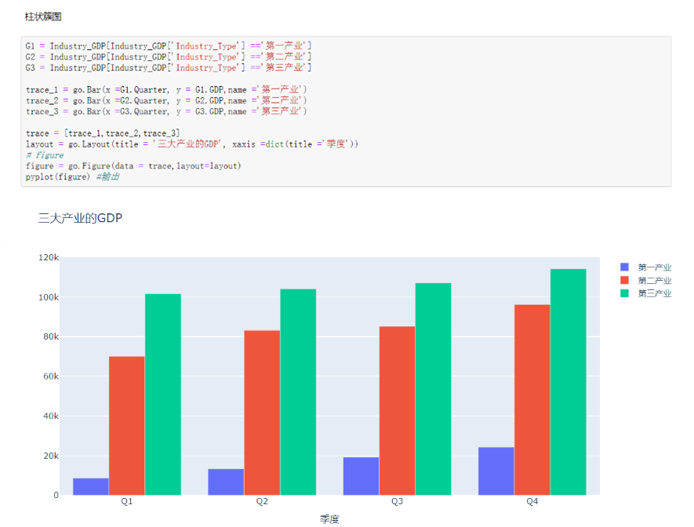

* **若需要制作堆叠柱状图，则制作多个图轨，并形成列表。布局设置添加参数barmode='stack'。**
  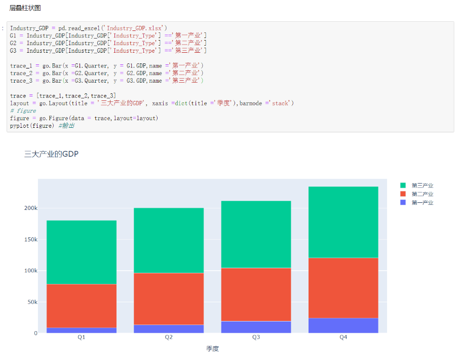

## 2.3、直方图

* **go.Histogram(x,y,marker)：**
  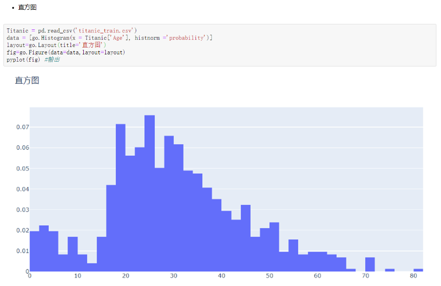

## 2.4、饼图

* **go.Pie(x,y,hole,textfont)：**
  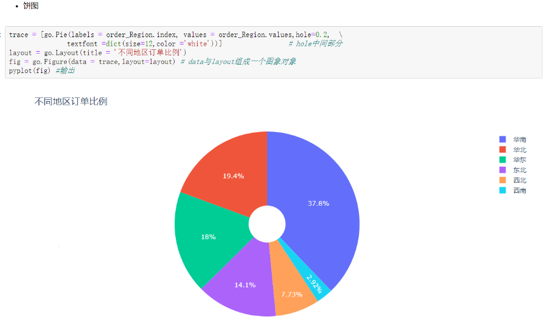

# 3、图形设置

## 3.1、多图表

* **多图表其实画多个画图轨迹就可以了。**
  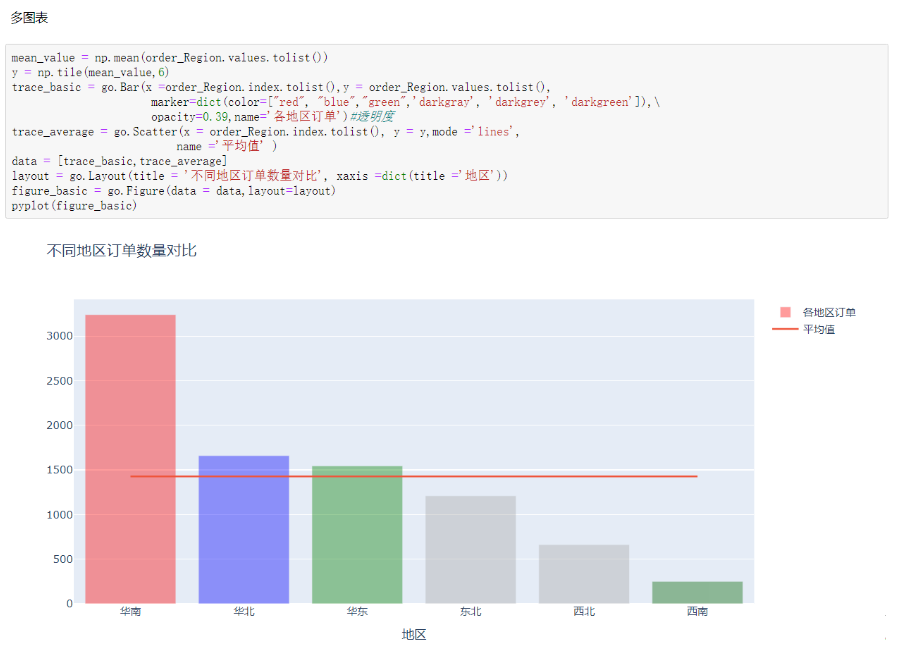

## 3.2、双坐标轴

* **双坐标轴则layout增加yaxis2参数，例如：yaxis2=dict（title='税收收入',overlaying='x',side='right'）**
  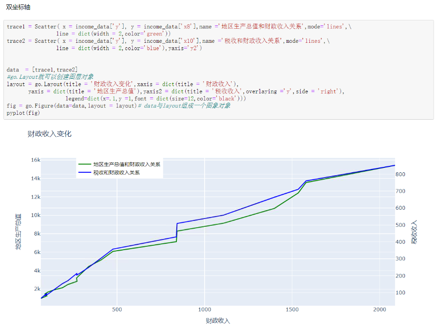

## 3.3、多子图

* 多子图需要设置subplot。
  * 1. from plotly import tools
  * 1. fig=tools.make_subplots(rows=2,cols=1)
  * 3.fig.append_trace(trace1,1,1)>fig.append_trace(trace2,2,1)
  * 4.fig['layout'].update(height= ,width= ,title=' ')’
    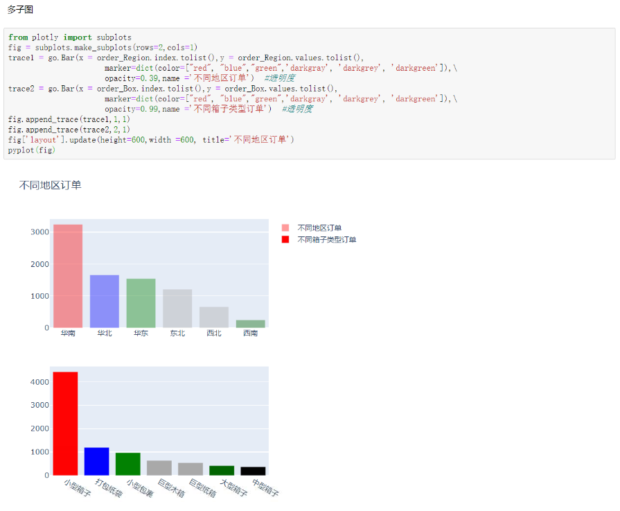

# 3、进阶图表

## 3.1、散点矩阵

* **import plotly.figure_factory as ff**
* **figure=ff.create_scatterplotmatrix(data[[x1,x2,x3,x4,x5,x6]],diag=['histogram'],index=x1)
  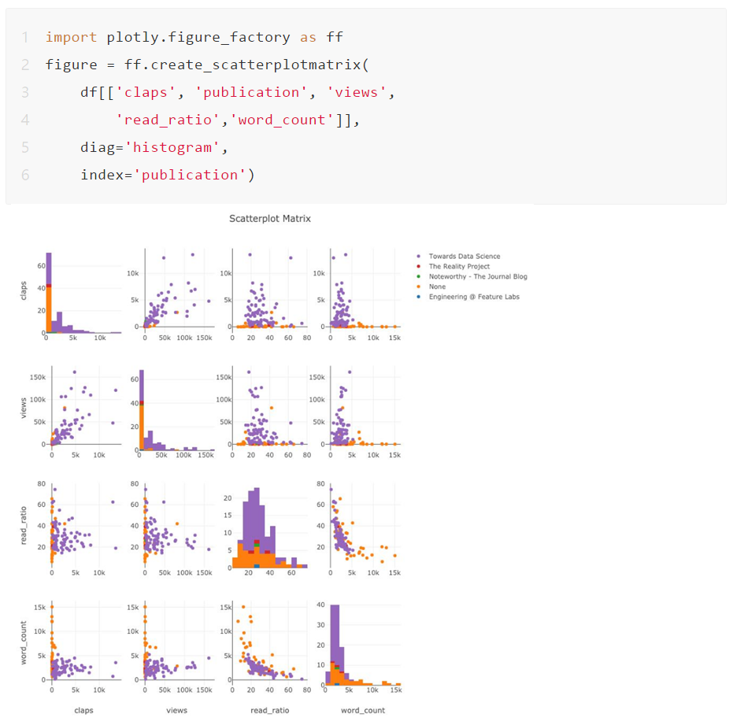

## 3.2、热力图

* **import plotly.figure_factory as ff**
* **corrs=data.corr()**
* **figure=ff.create_annotated_heatmap()**
  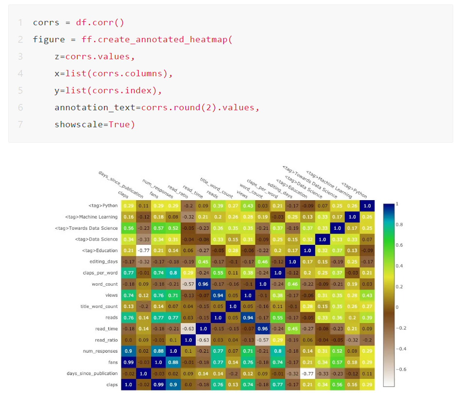