# 1.Python使用入门

## 1.1.软件安装

### 1.Jupyter notebook快捷操作

| 快捷键      | 作用                       |
| ----------- | -------------------------- |
| shift+enter | 运行本单元，选中下个单元   |
| ctrl+enter  | 运行本单元                 |
| Y           | 单元转入代码状态           |
| M           | 单元转markdown状态         |
| A           | 在上方插入单元             |
| B           | 在下方插入单元             |
| X           | 剪切选中的单元             |
| C           | 复制选中的单元             |
| V           | 粘贴到下方单元             |
| D+D         | 连续按两次，删除选中的单元 |
| Tab         | 代码补全或缩进             |

### 2.代码编写规则

* 多行语句：多行代码语句用\实现换行
* 保留字符：不能做变量、函数及类的命名
  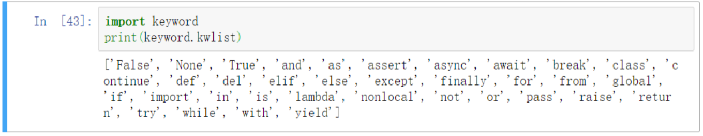
* 赋值：常用=对变量进行赋值
* 通过type(variable)可以查看数据类型及结构。

## 1.2.数据类型及结构

### 1.数据类型

* 数值类型：int、float、complex、long（无限大小的整数，整数最后是一个大写或小写的L。）
  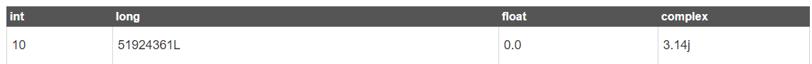
* bool、string、constant（常量）
* 数据类型强制转换：int(3.12)、float(3)、str()
* string可以看做有序序列，并通过[]截取字段访问，但不可更改单个元素(类似元组）。
  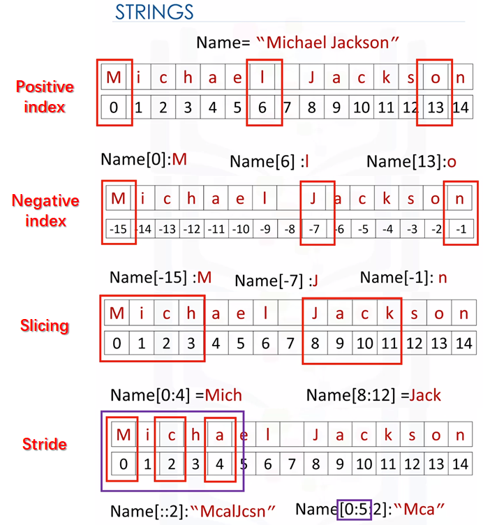

#### 1）字符串

* 原始字符串：r/R，eg：r"\n"
* 转义符：\，eg: 打印反斜杠为print("\")
* 代码换行符：\（在行尾）
* 打印换行符：\n
* 打印空格符：\t
  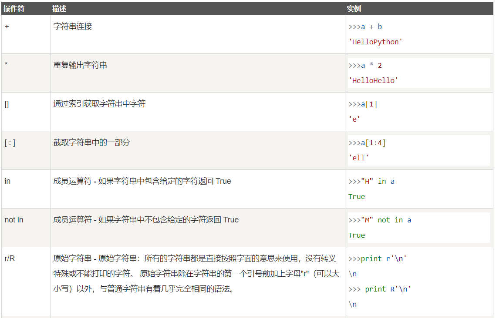
* 字符串格式化
  1)方法1：%

```
"我叫 %s，今年 %d 岁！我身高%.2f米'" % ('小明', 10, 1.467) #后面用元组表示
```

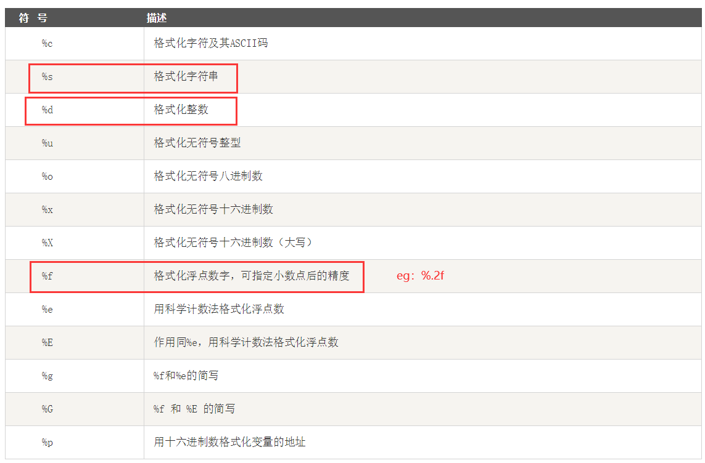
1）方法2：.fotmat函数：优点是可以不用说明需要格式化的类型

```
print('{}网址： "{}!"'.format('菜鸟教程',  'www.runoob.com'))
print('{name}网址： {site}'.format(name='菜鸟教程',  site='www.runoob.com')) #可以加关键字参数
```

| 操作                                                         | 说明                                                         |
| ------------------------------------------------------------ | ------------------------------------------------------------ |
| string.capitalize()/string.lower()/string.upper()/string.title() | 把字符串的第一个字符大写/全部小写/全部大写/所有单词首字母大写 |
| string.count(str, beg=0, end=len(string))                    | 返回 str 在 string 里面出现的次数，如果 beg 或者 end 指定则返回指定范围内 str 出现的次数 |
| string.find(str, beg=0, end=len(string))                     | 检测 str 是否包含在 string 中，如果 beg 和 end 指定范围，则检查是否包含在指定范围内，如果是返回开始的索引值，否则返回-1 |
| string.format()                                              | 格式化字符串                                                 |
| string.isalnum()/string.isalpha()/string.isdigit()           | 如果 string 至少有一个字符并且所有字符都是字母或数字/都是字母/都是数据则返回 True,否则返回 False |
| string.join(seq)                                             | 以 string 作为分隔符，将 seq 中所有的元素(的字符串表示)合并为一个新的字符串 |
| string.lstrip()/string.rstrip()/string.strip()               | 删除字符串末尾的空格                                         |
| string.startswith(obj, beg=0,end=len(string))                | 检查字符串是否是以 obj 开头                                  |
| string.replace(old_string, new_string)                       | 替换指定的字符                                               |

```
# 利用字符串函数修改列名
def new_string(old_string):
    new_string = old_string.strip()
    new_string = new_string.replace('Operating System', 'os')
    new_string = new_string.replace(' ', '_')
    new_string = new_string.replace('(', '')
    new_string = new_string.replace(')', '')
    new_string = new_string.lower()
    return new_string

new_columns = []
for column in df.columns:
    new_column = new_string(column)
    new_columns.append(new_column)
    
df.columns = new_columns
```

### 2.复合数据结构

* 复合数据结构可以包含多种数据类型和结构，有列表、元组、集合和字典。比如，元组可以包含整数、浮点型、字符串、元组等。
  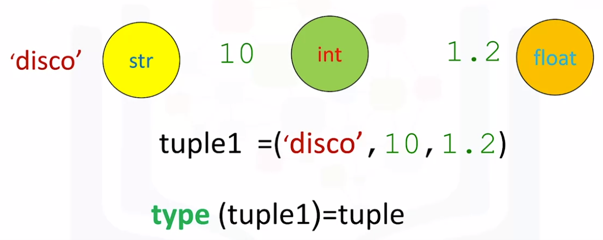

| 数据结构  | 特点                                           | 举例                                                         |
| --------- | ---------------------------------------------- | ------------------------------------------------------------ |
| 列表[]    | 不同数据类型元素的有序集合                     | a=[1,2,3]>a.append(4)                                        |
| 元组()    | 元组是一种有序列表，**但变量不能更改**         | b=(1,2,3,4)>b[1]                                             |
| 集合set() | **无序的、不重复的组合体**                     | c={1,2,'love'}                                               |
| 字典{}    | 存放无序的键/值（key/value）映射类型数据的容器 | dic={'name':["小米","小三"],'age':[23,46],'id':["1001","2008"]}>len(dic) |

#### 1)列表

| 操作                                             | 说明                                     | 举例                                      |
| ------------------------------------------------ | ---------------------------------------- | ----------------------------------------- |
| list[0]                                          | 使用下标索引来访问列表中的值             | list2 = [1, 2, 3, 4, 5, 6, 7 ]>list2[1:5] |
| list.append(obj)/list.extend(seq)                | 添加元素                                 | list2.append(2)/list2.extend([2])         |
| list.sort()/list.reverse()                       | 正向排序/反向排序                        | list2.sort()                              |
| del list[0]                                      | 删除列表的元素                           | --                                        |
| len()/max()/min()                                | 列表元素个数、最大值、最小值             | len([1,2,3])                              |
| list.count(obj)                                  | 计算某个元素的出现次数                   | --                                        |
| list.index(obj)                                  | 从列表中找出某个值第一个匹配项的索引位置 | --                                        |
| list.pop(index)/list.remove(obj)/del list[index] | 移除列表中的某个元素                     | --                                        |
| string.split(delimiter)                          | 基于指定分隔符，将字符串转换为列表       | "hard,work".split(",")                    |

#### 2)元组

| 操作              | 说明                                  | 举例                       |
| ----------------- | ------------------------------------- | -------------------------- |
| tuple[0]          | 使用下标索引来访问元组中的值          | tup1 = (12, 34.56)>tup1[0] |
| del tuple         | 元组不能删除单个元素，del删除整个元组 | tuple                      |
| len()/max()/min() | 元组元素个数、最大值、最小值          | len((1,2,3))               |
| sorted(tuple)     | 元组元素排序                          | sorted((4,2,3))            |

#### 3)集合

* 集合不是有序序列，因此不像字符串、元组、列表和字典一样可以索引元素。
* 集合的元素都是唯一的，没有重复的元素。集合举例：set1 = {'love',1,(1,2,3),[4,5]}
  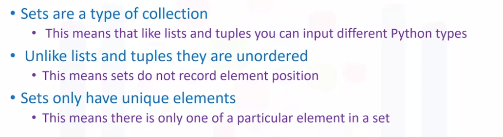

| 操作                                                | 说明                                                         | 举例           |
| --------------------------------------------------- | ------------------------------------------------------------ | -------------- |
| set(list)                                           | 将列表转换为集合                                             | set([3,5,2,3]) |
| s.add(x)\s.update({x,y})                            | 将元素 x 添加到集合 s 中，如果元素已存在，则不进行任何操作。 | --             |
| s.discard(x)                                        | 移除集合中的元素，如果元素不存在，不会发生错误。             | --             |
| s.pop()/s.remove(x)                                 | 删除集合中的一个元素                                         |                |
| len(s)                                              | 计算集合 s 元素个数。                                        |                |
| s.clear()                                           | 清空集合                                                     |                |
| x in s                                              | 判断元素 x 是否在集合 s 中，存在返回 True，不存在返回False。 |                |
| intersection(s1,s2) \symmetric_difference()\union() | 集合的交集(也可以写成s1&s2)\两个集合中不重复的元素集合\并集  |                |
| s1.issubset(s2)                                     | 判断是s1是否是s2的子集，是的话返回True                       |                |

#### 4)字典

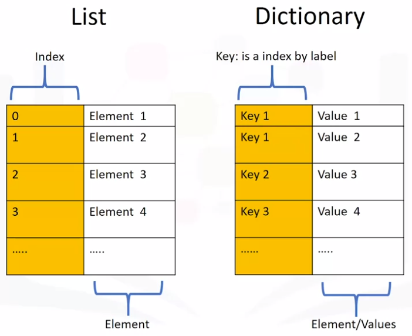

* 字典的键必须是唯一且可更改的。字典表示实例：{"key1": 1, "key2":[1,2,3], "key3":"666"}。

| 操作                    | 说明                           | 举例                                 |
| ----------------------- | ------------------------------ | ------------------------------------ |
| len(d)                  | 返回键的个数                   | --                                   |
| d[key]/d.get('key')     | 根据键取值                     | d['name']                            |
| "key" in dict           | 判断是否存在该键，存在返回True | 'movies' in d                        |
| d.keys()/d.values()     | 获取字典的全部键或全部值       | for item in d.values(): print(item)  |
| d.items()               | 获取字典的全部键和值           | for item in d.items(): print(item)   |
| del d[key]/d.pop('key') | 删除指定键和值                 | del d['name']                        |
| d.clear()/del d         | 清空字典或删除字典             | --                                   |
| d.update()              | 更新字典                       | d.update(Year=2019, Day=20, Hour=10) |

## 1.3.控制语句

### 1.条件语句

```
if condition_1: 
statement_block_1 
elif condition_2: 
statement_block_2 
else: 
statement_block_3
```

### 2.循环语句

* while循环

```
while <expr>:
    <statement(s)>
[else:
    <additional_statement(s)>]
```

* for循环

```
for <variable> in <sequence>: 
<statements> 
[else: 
<statements>]
```

* break：跳出 for 和 while 的循环体。如果你从 for 或 while 循环中终止，任何对应的循环 else 块将不执行。
* continue： 跳过当前循环块中的剩余语句，然后继续进行下一轮循环。
  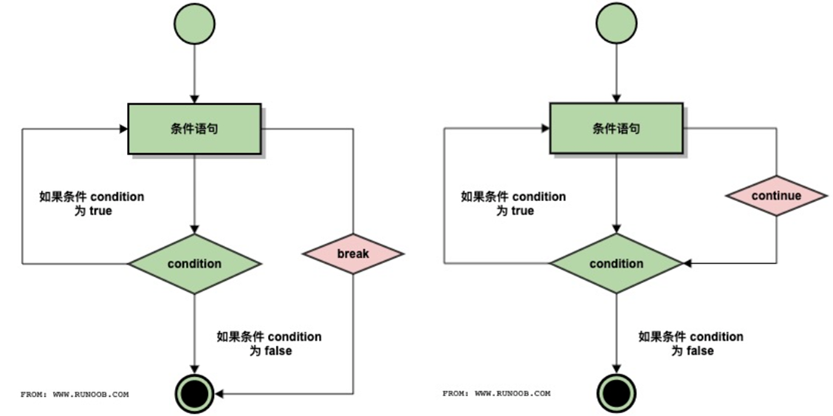
* pass：不做任何事情，一般用做占位语句。
* 举例

```
list = ['red', 'yellow', 'blue']

# 利用索引循环
for i in range(3):
    list[i] = 2 * list[i]
# 利用元素循环
for element in list:
    i = 2*i
# 利用enumerate（索引加元素）循环
for i, element in enumerate(list):
    print(i, element)

# while循环
newlist = []
i = 0
while (list[i] != 'blue'):
    newlist.append(list[i])
    i=i+1
```

### 3.异常处理语句

* try/except语句

```
x=1
dict1={'a':1,'b':2,'d':4}
try:
    if x==dict1['c']:
        print('ok')
    else:
        print('not found')
except:
    print('字典中无此键')
```

* try/except else语句、及+finally语句
  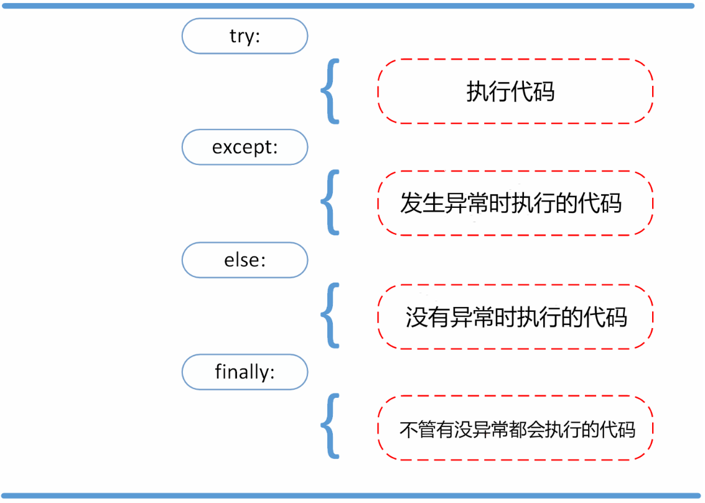
* 抛出异常：raise语句

## 1.4.迭代器

* 迭代器对象从集合的第一个元素开始访问，直到所有的元素被访问完结束。迭代器只能往前不会后退。
* 迭代器有两个基本的方法：iter() 和 next()。raise StopIteration
  用于结束迭代。
  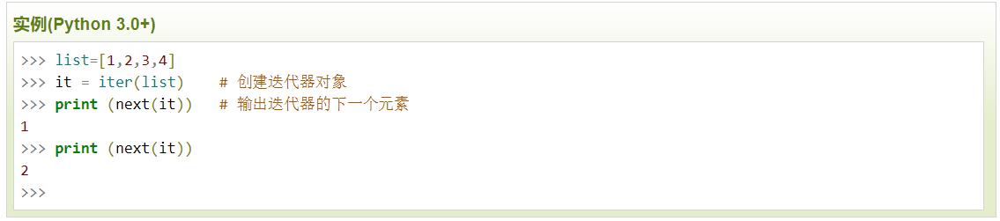

# 2.Python基础进阶

## 2.1.函数

### 1.内置函数

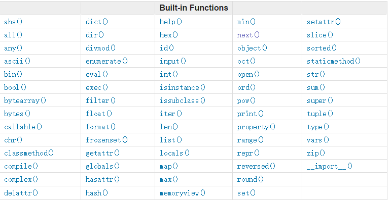

| 函数                                                       | 说明                                                         |
| ---------------------------------------------------------- | ------------------------------------------------------------ |
| all()/any()                                                | 判断全部元素，返回true或false                                |
| str()/list()/tuple()/complex() /dict()/int()/float()/set() | 数据类型转换                                                 |
| type()                                                     | 查看数据类型                                                 |
| dir()                                                      | 不带参数时返回当前范围内的变量，方法和定义的类型列表，带参数时返回参数的属性，方法列表,如：dir(list) |
| sorted()                                                   | 正向排序                                                     |
| help()                                                     | 返回对象的帮助文档                                           |
| input()                                                    | 获取用户输入内容,eg：num=input("请输入一个数字：")           |
| len()                                                      | 返回对象长度，参数可以是序列类型（字符串，元组或列表）或映射类型（如字典） |
| open(filename, mode)                                       | 打开文件，模式有w、w+、r、r+、a、a+、rb、wb、ab等            |

### 2.常用函数包

* 使用dir()可以查看模块中的函数

#### 1）math模块

* import math
* 数学常量:Pi、e
  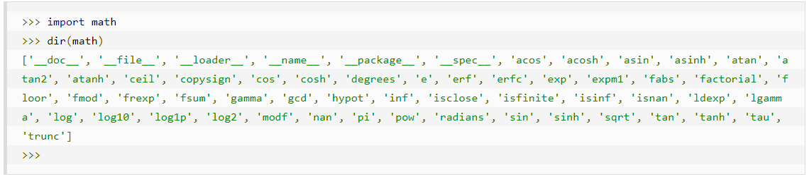

| 函数                   | 说明                                 |
| ---------------------- | ------------------------------------ |
| ceil()/floor()/round() | 返回数字的上入整数/下入整数/四舍五入 |
| abs()/sqrt()/log(x,n)  | 绝对值/平方根/以n为基数的x对数       |
| pow()                  | 幂函数，如2的10次方为pow(2,10)       |

#### 2）random模块

* import random

| 函数                              | 说明                                                         |
| --------------------------------- | ------------------------------------------------------------ |
| seed(x)                           | 设置随机数生成器的种子seed，以保持序列不变                   |
| shuffle(seq)                      | 将序列的全部元素随机排列                                     |
| choice(seq)                       | 从序列的元素中随机挑选一个元素，比如random.choice(range(10))，从0到9中随机挑选一个整数。 |
| randrange ([start,] stop [,step]) | 从指定范围内，按指定基数递增的集合中获取一个随机数，基数默认值为 1。 |

#### 3)三角函数

* import math
  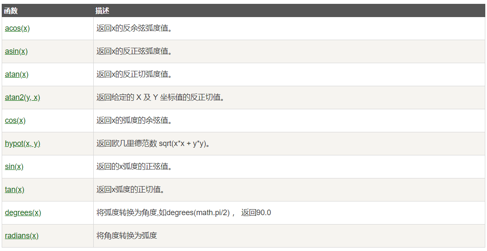

### 3.自定义函数

```
def 函数名（参数列表）:
    函数体
    return output
 # 参数类型：固定参数（name）、默认参数（name = 'Bob'）、收集参数（*names，不限定长度）
 # 变量类型：本地变量（local variable）、全局变量（global variable）
```

* return 语句用于退出函数，选择性地向调用方返回一个表达式。
* 参数类型：

| 参数类型   | 说明                                                         | 举例                                                         |
| ---------- | ------------------------------------------------------------ | ------------------------------------------------------------ |
| 必需参数   | 须以正确的顺序传入函数。调用时的数量必须和声明时的一样。     | def printme( str ): print (str)                              |
| 关键词参数 | 使用关键字参数允许函数调用时参数的顺序与声明时不一致         | def printinfo( name, age ): print ("名字: ", name) print ("年龄: ", age) |
| 默认参数   | 调用函数时，如果没有传递参数，则会使用默认参数。             | def printinfo( name, age = 35 ): print ("名字: ", name) print ("年龄: ", age) |
| 不定长参数 | 参数长度不定，加了星号 * 的会以元组(tuple)的形式导入，加了两个星号 ** 的参数会以字典的形式导入。 | def printinfo( arg1, *vartuple ): print ("输出: ") print (arg1) print (vartuple) |

### 4.高级函数

* 匿名函数：lambda par1,par2,...parn: expression

```
g=lambda x,y: x+2y
g(5,6)
```

* Map函数：将函数映射到序列里的每一个值。
  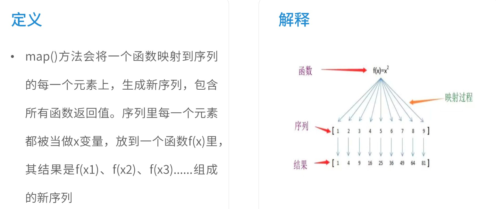

```
# map(function,list)
items=[1,2,3,4,5]
def f(x):
    return x**2
list(map(f,items))
```

* reduce函数：两个元素相加之后依次迭代，最终得到一个结果
  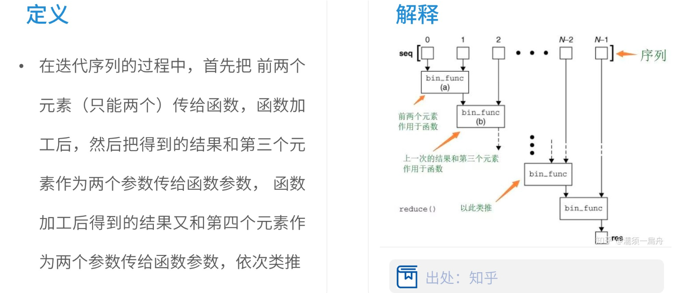

```
# reduce(function,seq)
from functools import reduce
def f(x,y):
    return x+y
items=range(1,11)
reduce(f,items) # 结果为55
```

* filter函数：过滤掉不符合函数的元素，形成新的序列。
  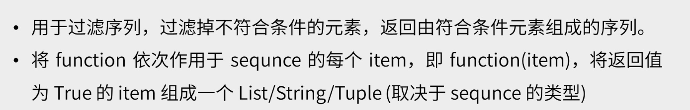

```
# filter(function,sequnce)
list(filter(lambda x: x%2==0,range(21)))
```

## 2.2.json文件解析

* Json是Javascript对象表示法，json格式是一种轻量级的文本数据交换格式，拥有存储空间小、处理速度快的优势。
* Json本质上是一种嵌套字典格式，但键对应的值，往往更加复杂，不仅是数字，还可以是字符串，数组，列表。
* 读取json文件

```
import json
with open(file.json,encoding='utf-8') as f:
    str=f.read()
data=json.loads(str)
```

* 保存json文件

```
with open('C:|data|第一章\file.json','w',encoding='utf-8') as f:
    json.dump(data,f,indent=0) #indent表示空格
```

## 2.3. 定义类

* python内嵌的数据类型和结构有字符串、整数、列表等。但如果我们需要自定义一个数据类型，则需要用到class函数。

```
class 类名称(object):

# 定义属性attributes
    def __init__(self, att1,att2):
        self.att1 = att1
        self.att2 = att2
        
# 定义方法methods
    def method_name(self, paras)
        self.method = ...

# 查看object的属性和方法
dir(name of object)
​```
* 类定义举例：
​```
class Circle(object):
    def __init__(self, radius, color):
        self.radius = radius;
        self.color = color;
    def add_radius(self, r):
        self.radius = self.radius + r 

C1 = Circle(2, 'red')
print(C1.color)
print(C1.radius)
C1.add_radius(8)
​```
```