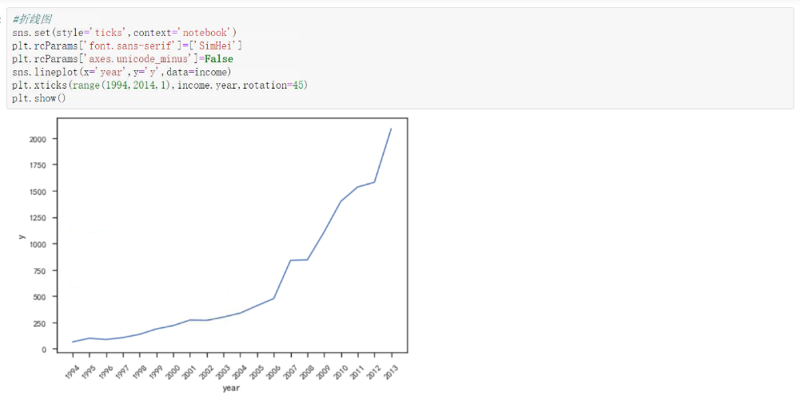

> * seaborn是在matplotlib基础上发展的，使作图更加容易，更容易绘制精致的图形。

# 1、Seaborn基础

**导入数据库：import seaborn as sns**

## 1.1、使用方式1：plt.style.use('seaborn')

* seaborn会自动帮忙调整图形，使图形更加美观，比如美化图形背景等。
* plt.style.use('seaborn') 会重置plt函数，因此，防止中文乱码的两行代码需要放在该函数之后。

## 1.2、使用方法2：sns.set()

* sns.set的常用参数有style（绘图风格）、context（绘图元素的规模）、Palette（调色板）、

## 1.3、使用方法3：sns.barplot()

* seaborn会自动配置x轴和y轴名称，无需设置plt.xlabel和plt.ylabel。
  
  
* 如何进行数据标注？
  for x,y in enumerate(GDP.GDP):
  plt.text(x,y+0.1,'%s(万亿)'%round(y,1),ha='center',fontsize=12)

# 2、绘制常用统计图形

## 2.1、柱状图：sns.barplot

* 常用调色板参数有：muted，RdBu，Set1，Blues，husl等，一般不需要设置。

## 2.2、散点图：sns.scatterplot

## 2.3、箱线图：sns.boxplot

* seaborn绘制的箱线图默认会绘制异常点、平均值和中位数线，因此这些参数可以不用设置。
  
* 若需绘制分类箱线图，则添加x轴。
  

## 2.4、直方图：sns.distplot

* sns.distplot既可以绘制直方图，也可以绘制kds（核密度图），fit（概率密度图）。
* 要绘制正态分布图需要先导入norm函数包：from scipy.stats import norm

## 2.5、折线图：sns.lineplot

* plt.xticks(ticks=, labels= )中的ticks是位置列表，用于x轴上的显示限制，如range(0,20,3)；label是指定显示在x轴上的标签，两者均需填写。
  

## 2.6、回归图：sns.lmplot

# 3、其他参数

## 3.1、计数图：sns.countplot

* 使用matplotlib函数还需要先进行value_counts才能绘制，而sns.countplot可直接绘制。

## 3.2、风格调整：sns.set

* 设置style：darkgrid , whitegrid , dark , white 和 ticks，默认drakgrid。
* 设置palette：deep, muted, pastel, bright, dark, colorblind
* 设置font_scale：整体放大或缩小字体
  

